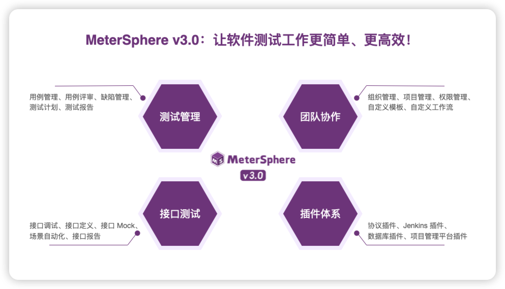

# 更新日志

## 版本说明

!!! ms-abstract ""

    MeterSphere 按年发布 LTS（Long Term Support）版本。

    - v1.10-lts：发布时间为 2021 年 5 月 27 日，目前已经停止维护；
    - v1.20-lts：发布时间为 2022 年 4 月 27 日，目前已经停止维护；
    - v2.10-lts：发布时间为 2023 年 5 月 25 日，仅进行必要的安全类 Bug 修复和严重 Bug 修复。

    与 MeterSphere v1.x 和 v2.x 相比，MeterSphere v3.x 产品定位发生变化，聚焦做好测试管理和接口测试，不再提供性能测试和 UI 测试相关的功能和能力，也不支持从 v1.x 和 v2.x 版本升级到 v3.x。

    MeterSphere v3.x 的版本发布计划

    - 2024 年 5 月 30 日：发布 v3.0 beta 版本；
    - 2024 年 6 月 27 日：发布 v3.0 正式版本；
    - 2024 年 12 月 26 日：发布 v3.6-lts LTS 版本。

## v3.2.0

------

2024年8月22日

!!! ms-abstract "💥💥 重要提醒 💥💥"
MeterSphere v3.0 产品定位发生变化，不再提供性能测试和 UI 测试相关的功能和能力，也不支持从 v1.x 和 v2.x 版本升级到 v3.0。

!!! ms-abstract "新增功能 :star2:"

    - feat: MeterSphere IDEA插件（MeterSphere API Debugger）支持API调试
    - feat: 接口用例支持一键同步API变更
    - feat: 思维导图编写用例支持多种快捷键操作
    - feat: 测试计划支持思维导图模式执行测试用例

!!! ms-abstract "功能优化 :sunflower:"

    - refactor（缺陷管理）：支持一键获取禅道和TAPD模板；
    - refactor（测试用例）：测试用例支持一键导出Excel或XMind格式数据；
    - refactor（接口测试）：接口场景的“脚本操作”步骤增加断言操作；
    - refactor（接口测试）：接口变量支持快捷复制为格式化变量；
    - refactor（消息通知）：“创建缺陷”事件支持配置处理人为消息接收人；
    - refactor（通用功能）：支持用户配置默认国际化语言。

!!! ms-abstract "缺陷修复 :palm_tree:"

    - fix（测试计划）：修复消息模板没有测试报告链接配置的问题（#32335）；
    - fix（测试计划）：修复接口测试用例取值不正确的问题（#32100）；
    - fix（测试用例）：修复编辑模式为空时导入失败的问题（#32338）；
    - fix（测试用例）：修复评审人为空的问题（#32332）；
    - fix（接口测试）：修复swagger文件导入失败的问题（#32739）；
    - fix（系统设置）：修复插件解析失败导致无法重新上传的问题（#31768）；

## v3.1.0

------

2024年7月25日

!!! ms-abstract "💥💥 重要提醒 💥💥"
    MeterSphere v3.0 产品定位发生变化，不再提供性能测试和 UI 测试相关的功能和能力，也不支持从 v1.x 和 v2.x 版本升级到 v3.0。

!!! ms-abstract "新增功能 :star2:"

    - feat: 单点登录支持OAuth、SAML、OIDC协议（X-Pack增强包）
    - feat(接口测试): 接口测试支持通过IDEA插件一键同步API到MeterSphere
    - feat(用例评审): 新增思维导图快速评审测试用例
    - feat(缺陷管理): 缺陷管理支持与第三方平台双向同步缺陷

!!! ms-abstract "功能优化 :sunflower:"

    - refactor(测试计划): 支持自定义测试计划报告
    - refactor(测试计划): 支持查看测试计划的执行历史
    - refactor(接口测试): 接口定义支持导出Swagger文档
    - refactor(接口测试): 新增JSON Schema组件
    - refactor(通用功能): 支持在组织和项目层级通过邮箱邀请用户

!!! ms-abstract "缺陷修复 :palm_tree:"

    - fix(测试计划): 修复测试规划中修改运行模式不生效的问题（#31839）
    - fix(测试用例): 修复脑图模式下复制模块时用例提示异常的问题（#31827）
    - fix(接口测试): 修复后置操作提取参数展示错误的问题（#32243）
    - fix(接口测试): 修复JSONPath断言失败的问题（#31230）
    

## v3.0.1

------

2024年6月27日

!!! ms-abstract ""

    ✨ MeterSphere v3.0 全新启航 ✨

    MeterSphere v3.0 是新一代的开源持续测试工具，致力于让软件测试工作更简单、更高效，不再成为软件产品持续交付的瓶颈。

    - 在团队协作方面，针对目前企业软件测试团队所面临的测试工具不统一、测试用例管理分散、测试执行效率不高等问题，MeterSphere v3.0 在测试协同和测试执行方面进行了针对性的设计和优化；
    - 在插件体系方面，MeterSphere v3.0 提供各种类别的插件，用户可以根据按需取用，实现 MeterSphere 测试能力的扩展以及与 DevOps 流水线的集成。
    
    { width="900px" }

    **注意：** MeterSphere v3.0 产品定位发生变化，不再提供性能测试和 UI 测试相关的功能和能力，也不支持从 v1.x 和 v2.x 版本升级到 v3.0。

## v3.0.0-beta

------

2024年5月30日

!!! ms-abstract ""
    
    MeterSphere v3.0 终于和大家见面了。

    MeterSphere 3.0 是新一代的开源持续测试工具，让测试工作更简单、更高效，不再成为持续交付的瓶颈。

    - 测试管理: 从测试用例管理，到测试计划执行、缺陷管理、测试报告生成，具有远超禅道和 TestLink 的使用体验；
    - 接口测试: 集 Postman 的易用与 JMeter 的灵活于一体，接口定义、接口调试、接口 Mock、场景自动化、接口报告，你想要的都有；
    - 团队协作: 摆脱单机测试工具的束缚，支持团队协作并对接 DevOps 工具链，将测试融入持续交付体系。

    MeterSphere v3.0.0-beta 是首个公开预览版本，欢迎大家体验。
    
    **注意：** MeterSphere v3.0 产品定位发生变化，不再提供性能测试和 UI 测试相关的功能和能力，也不支持从 v1.x 和 v2.x 版本升级到 v3.0。

