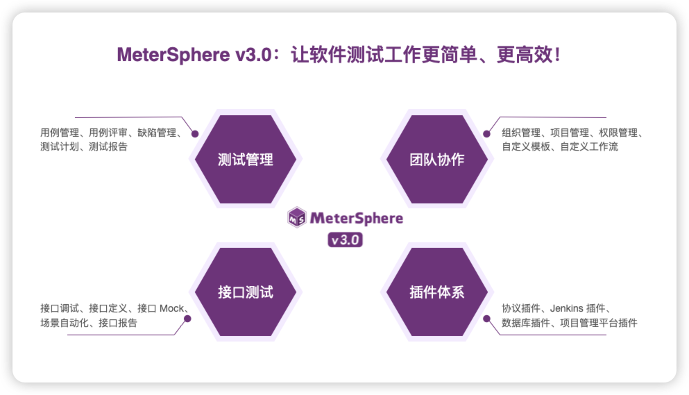

# 更新日志

## 版本说明

!!! ms-abstract ""

    MeterSphere 已发布的产品版本如下。

    - v1.10-lts：发布时间为 2021 年 5 月 27 日，社区版目前已经停止维护；
    - v1.20-lts：发布时间为 2022 年 4 月 27 日，社区版目前已经停止维护；
    - v2.10-lts：发布时间为 2023 年 5 月 25 日，社区版目前已经停止维护；
    - v3.6-lts： 发布时间为 2024 年 12 月 26 日，社区版正常维护中。

!!! ms-abstract "💥💥重要提醒💥💥"
    MeterSphere V3 产品定位发生变化，不支持从 v1.x 和 v2.x 版本升级到 v3.0。

## v3.6.7-lts

------

2025年11月10日

!!! ms-abstract "功能优化 :sunflower:"

    - feat(测试用例): 思维导图模式下编写用例支持添加图片
    - feat(接口测试): 接口场景中自定义请求步骤支持一键转换为用例引用步骤

!!! ms-abstract "缺陷修复 :palm_tree:"

    - fix(测试用例)：修复AI生成的测试用例步骤ID错误的问题（#35557）
    - fix(测试用例)：修复测试用例思维导图模式下快捷键偶尔失效的问题（#35442）
    - fix(测试用例)：修复切换英文环境后，在脑图中对用例的步骤进行添加修改等会导致整个用例信息丢失的问题（#35483）
    - fix(接口测试)：修复post请求form-data，类型为file上传完图片后执行报错的问题（#35485）
    - fix(接口测试)：修复 idea 2025.2 无法使用 MeterSphere API Debugger的问题（#35458）
    - fix(接口测试)：修复导出metersphere的接口，已删除的用例也一起导出了的问题（#35455）
    - fix(接口测试)：修复导入swagger管理的接口，请求参数的必填丢失的问题（#35423）
    - fix(接口测试)：修复MS 本地执行下载执行文件失败的问题（#35424）  
    - fix(接口测试)：修复环境管理HTTP设置的请求头设置了Cookies，在场景中执行测试，实际请求no cookies的问题（#35239）
    - fix(项目管理）：修复编辑环境变量前置或者后置脚本均无法展示全所有的脚本内容的问题（#35506）
    - fix(系统设置)：修复修改Slogan值未生效的问题（#35479）

## v3.6.6-lts

------

2025年10月21日

!!! ms-abstract "💥💥重要提醒💥💥"
    MeterSphere v3.0 产品定位发生变化，不再提供性能测试和 UI 测试相关的功能和能力，也不支持从 v1.x 和 v2.x 版本升级到 v3.0。

!!! ms-abstract "功能优化 :sunflower:"

    - feat: 升级Spring boot 版本到 3.5.6    
    - feat: 升级内置 Redis 版本到 8.2.2

!!! ms-abstract "缺陷修复 :palm_tree:"

    - fix(接口测试): 修复执行附件解析问题 (#35485)

## v3.6.5-lts

------

2025年7月1日

!!! ms-abstract "💥💥 重要提醒 💥💥"
    MeterSphere v3.0 产品定位发生变化，不再提供性能测试和 UI 测试相关的功能和能力，也不支持从 v1.x 和 v2.x 版本升级到 v3.0。

!!! ms-abstract "缺陷修复 :palm_tree:"

    - fix: 修复排序字段存在SQL注入风险

## v3.6.4-lts

------

2025年6月19日

!!! ms-abstract "💥💥 重要提醒 💥💥"
    MeterSphere v3.0 产品定位发生变化，不再提供性能测试和 UI 测试相关的功能和能力，也不支持从 v1.x 和 v2.x 版本升级到 v3.0。

!!! ms-abstract "功能优化 :sunflower:"

    - feat: 接入 AI 能力，支持生成功能测试与接口测试用例

!!! ms-abstract "缺陷修复 :palm_tree:"

    - fix(接口测试): 修复删除 Mock 问题
    - fix(测试用例): 修复用例默认步骤类型问题
    - fix(测试用例): 修复批量编辑用例等级未展示问题

## v3.6.3-lts

------

2025年5月22日

!!! ms-abstract "💥💥 重要提醒 💥💥"
    MeterSphere v3.0 产品定位发生变化，不再提供性能测试和 UI 测试相关的功能和能力，也不支持从 v1.x 和 v2.x 版本升级到 v3.0。

!!! ms-abstract "功能优化 :sunflower:"

    - refactor(接口测试): 用例执行响应内容自动展开

!!! ms-abstract "缺陷修复 :palm_tree:"

    - fix(接口测试): 控制器判断指标非空
    - fix(接口测试): 接口定义创建 Mock 报错
    - fix(接口测试): 复制场景时，步骤复制不准确
    - fix(接口测试): 修复 Swagger 文件解析问题
    - fix(接口测试): 场景没有配置定时任务，批量开启报错
    - fix(接口测试): 场景批量执行，集合报告步骤重复生成问题
    - fix(接口测试): 导入场景，步骤的项目ID没有重置，查看步骤详情报权限问题
    - fix(缺陷管理): 示例详情缺陷测试计划表提示多气泡
    - fix(缺陷管理): 批量删除缺陷后台日志报错
    - fix(系统设置): 修复元素设置为 null 时空指针异常
    - fix(系统设置): 修复切换组织状态和组织名称展示错误
    - fix(测试用例): 修复脑图多节点框选复制问题和节点文本换行输入问题
    - fix(测试用例): 修复测试用例关联问题
    - build: Spring boot 版本升级

## v3.6.2-lts

------

2025年2月25日

!!! ms-abstract "💥💥 重要提醒 💥💥"
    MeterSphere v3.0 产品定位发生变化，不再提供性能测试和 UI 测试相关的功能和能力，也不支持从 v1.x 和 v2.x 版本升级到 v3.0。

!!! ms-abstract "功能优化 :sunflower:"

    - feat(接口测试): 后置操作添加等待时间
    - feat(项目管理): 脚本代码片段添加打印脚本

!!! ms-abstract "缺陷修复 :palm_tree:"

    - fix(接口测试): 提取参数 JSONPath 结果修复
    - fix(接口测试): 参数提取表格空行过滤
    - fix(接口测试): 批量执行场景用例，超过500条，会出现重复执行#34992
    - fix(接口测试): 参数提取表格过滤条件修复
    - fix(接口测试): 修复接口场景表头筛选问题
    - fix(接口测试): 后置条件公共脚本参数修改不生效修复
    - fix(任务中心): 测试计划报告页打开任务中心空白修复
    - fix(测试用例): 修复测试用例前后置依赖无数据创建页面未关闭抽屉bug

## v3.6.1-lts

------

2025年1月23日

!!! ms-abstract "💥💥 重要提醒 💥💥"
    MeterSphere v3.0 产品定位发生变化，不再提供性能测试和 UI 测试相关的功能和能力，也不支持从 v1.x 和 v2.x 版本升级到 v3.0。

!!! ms-abstract "功能优化 :sunflower:"

    - refactor(接口测试): 补充接口执行完成回调参数
    - refactor(测试计划): 计划执行功能用例页面查询
    - style(测试计划): 测试计划用例详情文本markDownStyle

!!! ms-abstract "缺陷修复 :palm_tree:"

    - fix(工作台): 修复工作台测试计划概览项目下测试计划选择上一次未清空bug
    - fix(测试用例&测试计划): 脑图-修复评审&执行成功后用例等级显示异常的缺陷
    - fix(测试用例&缺陷管理): 修复附件预览当前图片bug
    - fix(测试计划): 报告pdf 耗时字段
    - fix(测试计划): 关联按钮交互控制
    - fix(测试计划): 执行历史列表执行方式 hover
    - fix(测试计划): 弹窗关闭未清空模板数据
    - fix(测试计划): 计划详情缺陷列表三方接口超时报错问题
    - fix(测试计划): 修复测试计划报告非预览模式可跳转缺陷
    - fix(测试计划): 测试计划功能用例脑图，模块添加缺陷失败
    - fix(用例评审): 评审列表 ID 多余气泡
    - fix(测试用例): 脑图评审-修复评审成功后用例等级显示异常的缺陷
    - fix(项目管理): 修复项目管理环境bug
    - fix(缺陷管理): 回收站日志跳转错误
    - fix(缺陷管理): 禅道默认模板同步图片问题
    - fix(缺陷管理): 修复缺陷管理评论组件展开折叠bug
    - fix(任务中心): 支持消息通知跳转任务执行详情
    - fix(任务中心): 后台任务测试计划组任务删除按钮
    - fix(任务中心): 批量执行计划用例执行结果查询有误
    - fix(接口测试): 报告错误数据兜底
    - fix(接口测试): 接口swagger导入问题
    - fix(接口测试): 定义内 mock 列表切换定义后创建 mock 未更新定义信息修复
    - fix(接口测试): 环境下拉-处理选项不存在的情况
    - fix(接口测试): 新建用例报错
    - fix(接口测试): 第三方插件类型接口创建用例修复
    - fix(接口测试): 导入的请求带文件请求体，执行报错
    - fix(接口测试): 场景定时任务执行，报告显示的环境有误
    - fix(系统管理): 修复测试计划执行发送接口用例报告链接问题

## v3.6.0-lts

------

2024年12月24日

!!! ms-abstract "💥💥 重要提醒 💥💥"
    MeterSphere v3.0 产品定位发生变化，不再提供性能测试和 UI 测试相关的功能和能力，也不支持从 v1.x 和 v2.x 版本升级到 v3.0。

!!! ms-abstract "新增功能 :star2:"

    - feat: 工作台-首页新增测试计划概览
    - feat: 工作台-首页统计指标支持一键跳转到相应模块

!!! ms-abstract "功能优化 :sunflower:"

    - refactor(测试用例)：功能用例交互优化；
    - refactor(测试用例)：功能用例基本信息支持快捷编辑；
    - refactor(测试计划)：测试计划关联用例支持从指定测试计划中添加用例；
    - refactor(测试计划)：测试计划关联用例支持通过创建人字段筛选；
    - refactor(测试计划)：通过“测试点”模式查看测试计划报告交互优化；
    - refactor(接口测试)：场景列表查看最近一次执行结果交互优化；
    - refactor(通用功能)：支持记住用户手动调整的表格列宽；

!!! ms-abstract "缺陷修复 :palm_tree:"

    - fix(测试计划)：修复测试计划执行过程中部分脚本步骤重复执行的问题（#34649）；
    - fix(接口测试)：修复接口测试解析jmx格式文件时参数名处理不正确的问题（#34511）；
    - fix(接口测试)：修复接口场景批量移动未生效的问题（#34521）；
    - fix(缺陷管理)：修复缺陷详情中图片显示模糊的问题（#34620）；
    - fix(项目管理)：修复搜索参数名导致参数值被覆盖的问题（#34721）

## v3.5.0

------

2024年11月28日

!!! ms-abstract "💥💥 重要提醒 💥💥"
    MeterSphere v3.0 产品定位发生变化，不再提供性能测试和 UI 测试相关的功能和能力，也不支持从 v1.x 和 v2.x 版本升级到 v3.0。

!!! ms-abstract "新增功能 :star2:"

    - feat: 新增工作台模块
    - feat: 任务中心支持一键失败重跑

!!! ms-abstract "功能优化 :sunflower:"

    - refactor(测试用例): 思维导图编辑测试用例新增“空格”快捷键直接进入节点编辑模式
    - refactor(测试用例): 用例评审新增高级搜索功能
    - refactor(测试用例): 优化思维导图进行用例评审时的排序逻辑
    - refactor(测试计划): 测试计划的缺陷统计逻辑优化
    - refactor(测试计划): 测试计划的报告列表增加记住用户选择的类型
    - refactor(测试计划): 测试计划的新增高级搜索功能
    - refactor(接口测试): 接口测试的文档分享功能增加了项目信息展示
    - refactor(接口测试): 接口场景新增批量设置定时任务功能
    - refactor(接口测试): 接口场景的导入系统请求页面新增高级搜索功能
    - refactor(接口测试): 接口测试的报告列表新增高级搜索功能
    - refactor(接口测试): 接口响应内容中断言列表的“状态”字段支持排序和筛选
    - refactor(接口测试): 接口测试的提取参数列表增加“描述”列
    - refactor(接口测试): 接口测试的脚本操作支持通过脚本获取场景的唯一ID
    - refactor(接口测试): 接口场景支持导入HAR格式的文件
    - refactor(项目设置): 增加测试用例相关操作的日志
    - refactor(通用功能): 所属模块下拉选择器提供“选择当前”和“选择全部”功能。

!!! ms-abstract "缺陷修复 :palm_tree:"

    - fix(测试用例): 修复脑图模式下编辑用例导致顺序错乱的问题（#34139）
    - fix(测试计划): 修复多资源池节点执行接口场景导致步骤重复执行的问题（#34183）
    - fix(接口测试): 修复数字类型字段的JSONPath断言值不正确的问题（#34294）
    - fix(接口测试): 修复接口场景上传CSV提示重复的问题（#34144）
    - fix(缺陷管理): 修复修改缺陷状态未生效的问题（#34078）
    - fix(任务中心): 修复任务中心ID重复的问题（#34056）

## v3.4.0

------

2024年10月31日

!!! ms-abstract "💥💥 重要提醒 💥💥"
    MeterSphere v3.0 产品定位发生变化，不再提供性能测试和 UI 测试相关的功能和能力，也不支持从 v1.x 和 v2.x 版本升级到 v3.0。

!!! ms-abstract "新增功能 :star2:"

    - feat: 任务中心支持实时查看系统即时任务与系统后台任务
    - feat: 新增分享接口文档功能
    - feat: 支持在思维导图模式下通过“测试点”维度执行用例

!!! ms-abstract "功能优化 :sunflower:"

    - refactor(测试计划): 测试计划的用例列表支持高级搜索与自定义视图功能
    - refactor(测试计划): 测试计划的接口用例列表支持高级搜索与自定义视图功能
    - refactor(测试计划): 测试计划的场景用例列表支持高级搜索与自定义视图功能
    - refactor(测试计划): 测试计划执行功能用例交互优化
    - refactor(测试计划): 测试计划一键创建缺陷功能优化
    - refactor(测试用例): 测试用例导出功能优化
    - refactor(接口测试): 接口场景新增导入导出功能
    - refactor(接口测试): 接口场景的CSV文件参数增加变更提醒
    - refactor(接口测试): 接口场景列表支持高级搜索与自定义视图功能
    - refactor(接口测试): 接口用例列表支持高级搜索与自定义视图功能
    - refactor(接口测试): 接口报告交互优化
    - refactor(系统设置): 创建项目支持指定全部资源池
    - refactor(系统设置): 环境管理模块支持一键复制环境
    - refactor(系统设置): 支持新增k8s类型的测试资源池
    - refactor(系统设置): 用户组功能优化
    - refactor(通用功能): 用例编辑页新增Ctrl+s/Command+s快捷保存操作
    - refactor(通用功能): 列表批量编辑支持清空已有标签
    - refactor(通用功能): 查看测试报告详情支持高亮选中的数据行
    - refactor(通用功能): 回收站功能优化
    - refactor(通用功能): 关联用例弹窗支持模块全选功能
    - refactor(安装部署): 支持通过k8s方式部署

!!! ms-abstract "缺陷修复 :palm_tree:"

    - fix(测试计划): 修复测试计划设置了场景用例”失败停止“不生效的问题（#32993）
    - fix(测试计划): 修复测试计划关联用例时查询结果不一致的问题（#33397）
    - fix(缺陷管理): 修复缺陷同步到禅道后图片无法显示的问题（#33488）
    - fix(测试用例): 修复通过评审状态查询用例结果不正确的问题（#33384）
    - fix(测试用例): 修复提交缺陷到JIRA部分文字显示异常的问题（#33381）
    - fix(接口测试): 修复接口报告中”报告总耗时“统计不正确的问题（#32918）
    - fix(接口测试): 修复form-data接口上传文件时，设置文件content-type 后未生效的问题（#33025）
    - fix(项目管理): 修复环境前置脚本引用公共脚本不更新的问题（#32810）
    - fix(项目管理): 修复切换项目后基本信息显示不正确的问题（#33333）

## v3.3.0

------

2024年9月22日

!!! ms-abstract "💥💥 重要提醒 💥💥"
    MeterSphere v3.0 产品定位发生变化，不再提供性能测试和 UI 测试相关的功能和能力，也不支持从 v1.x 和 v2.x 版本升级到 v3.0。

!!! ms-abstract "新增功能 :star2:"

    - feat: 接口导入支持Postman、JMX、HAR、MeterSphere格式文件
    - feat: 测试管理新增视图与高级搜索功能
    - feat: 测试计划支持一键生成缺陷详情

!!! ms-abstract "功能优化 :sunflower:"

    - refactor(测试计划): 测试计划的用例列表支持批量新建或关联缺陷；
    - refactor(测试计划): 测试计划报告新增按“测试点”维度展示列表数据；
    - refactor(测试计划): 测试计划报告新增搜索功能；
    - refactor(测试计划): 思维导图模式下执行测试用例增加常用快捷键；
    - refactor(测试计划): 测试报告支持导出为PDF格式文件；
    - refactor(测试计划): 测试计划的测试规划功能支持快捷修改运行环境和资源池；
    - refactor(测试用例): 测试用例关联需求交互优化；
    - refactor(测试用例): 测试用例导入功能交互优化；
    - refactor(测试用例): 测试用例思维导图模式增加常用快捷键；
    - refactor(测试用例): 测试评审的用例列表新增视图与高级搜索功能；
    - refactor(接口测试): 通过Swagger URL导入接口新增Token认证方式；
    - refactor(接口测试): 导入cURL功能新增支持解析Charles和Fiddler工具的抓包请求；
    - refactor(接口测试): 接口场景的自定义请求步骤支持导入cURL请求；
    - refactor(接口测试): 接口定义列表新增视图与高级搜索功能；
    - refactor(接口测试): 接口测试报告支持导出为PDF格式文件；
    - refactor(系统设置): 给指定组织或项目添加成员时支持选择所属的用户组；
    - refactor(系统设置): 系统参数新增“自定义上传文件大小限制”功能。

!!! ms-abstract "缺陷修复 :palm_tree:"

    - fix(测试计划): 修复消息模板没有测试报告链接配置的问题（#32335）；
    - fix(测试计划): 修复接口测试用例取值不正确的问题（#32100）；
    - fix(测试用例): 修复编辑模式为空时导入失败的问题（#32338）；
    - fix(测试用例): 修复评审人为空的问题（#32332）；
    - fix(接口测试): 修复swagger文件导入失败的问题（#32739）；
    - fix(系统设置): 修复插件解析失败导致无法重新上传的问题（#31768）；

## v3.2.0

------

2024年8月22日

!!! ms-abstract "💥💥 重要提醒 💥💥"
    MeterSphere v3.0 产品定位发生变化，不再提供性能测试和 UI 测试相关的功能和能力，也不支持从 v1.x 和 v2.x 版本升级到 v3.0。

!!! ms-abstract "新增功能 :star2:"

    - feat: MeterSphere IDEA插件（MeterSphere API Debugger）支持API调试
    - feat: 接口用例支持一键同步API变更
    - feat: 思维导图编写用例支持多种快捷键操作
    - feat: 测试计划支持思维导图模式执行测试用例

!!! ms-abstract "功能优化 :sunflower:"

    - refactor（缺陷管理）：支持一键获取禅道和TAPD模板；
    - refactor（测试用例）：测试用例支持一键导出Excel或XMind格式数据；
    - refactor（接口测试）：接口场景的“脚本操作”步骤增加断言操作；
    - refactor（接口测试）：接口变量支持快捷复制为格式化变量；
    - refactor（消息通知）：“创建缺陷”事件支持配置处理人为消息接收人；
    - refactor（通用功能）：支持用户配置默认国际化语言。

!!! ms-abstract "缺陷修复 :palm_tree:"

    - fix（测试计划）：修复消息模板没有测试报告链接配置的问题（#32335）；
    - fix（测试计划）：修复接口测试用例取值不正确的问题（#32100）；
    - fix（测试用例）：修复编辑模式为空时导入失败的问题（#32338）；
    - fix（测试用例）：修复评审人为空的问题（#32332）；
    - fix（接口测试）：修复swagger文件导入失败的问题（#32739）；
    - fix（系统设置）：修复插件解析失败导致无法重新上传的问题（#31768）；

## v3.1.0

------

2024年7月25日

!!! ms-abstract "💥💥 重要提醒 💥💥"
    MeterSphere v3.0 产品定位发生变化，不再提供性能测试和 UI 测试相关的功能和能力，也不支持从 v1.x 和 v2.x 版本升级到 v3.0。

!!! ms-abstract "新增功能 :star2:"

    - feat: 单点登录支持OAuth、SAML、OIDC协议（X-Pack增强包）
    - feat(接口测试): 接口测试支持通过IDEA插件一键同步API到MeterSphere
    - feat(用例评审): 新增思维导图快速评审测试用例
    - feat(缺陷管理): 缺陷管理支持与第三方平台双向同步缺陷

!!! ms-abstract "功能优化 :sunflower:"

    - refactor(测试计划): 支持自定义测试计划报告
    - refactor(测试计划): 支持查看测试计划的执行历史
    - refactor(接口测试): 接口定义支持导出Swagger文档
    - refactor(接口测试): 新增JSON Schema组件
    - refactor(通用功能): 支持在组织和项目层级通过邮箱邀请用户

!!! ms-abstract "缺陷修复 :palm_tree:"

    - fix(测试计划): 修复测试规划中修改运行模式不生效的问题（#31839）
    - fix(测试用例): 修复脑图模式下复制模块时用例提示异常的问题（#31827）
    - fix(接口测试): 修复后置操作提取参数展示错误的问题（#32243）
    - fix(接口测试): 修复JSONPath断言失败的问题（#31230）
    

## v3.0.1

------

2024年6月27日

!!! ms-abstract ""

    ✨ MeterSphere v3.0 全新启航 ✨

    MeterSphere v3.0 是新一代的开源持续测试工具，致力于让软件测试工作更简单、更高效，不再成为软件产品持续交付的瓶颈。

    - 在团队协作方面，针对目前企业软件测试团队所面临的测试工具不统一、测试用例管理分散、测试执行效率不高等问题，MeterSphere v3.0 在测试协同和测试执行方面进行了针对性的设计和优化；
    - 在插件体系方面，MeterSphere v3.0 提供各种类别的插件，用户可以根据按需取用，实现 MeterSphere 测试能力的扩展以及与 DevOps 流水线的集成。
    
    { width="900px" }

    **注意：** MeterSphere v3.0 产品定位发生变化，不再提供性能测试和 UI 测试相关的功能和能力，也不支持从 v1.x 和 v2.x 版本升级到 v3.0。

## v3.0.0-beta

------

2024年5月30日

!!! ms-abstract ""
    
    MeterSphere v3.0 终于和大家见面了。

    MeterSphere 3.0 是新一代的开源持续测试工具，让测试工作更简单、更高效，不再成为持续交付的瓶颈。

    - 测试管理: 从测试用例管理，到测试计划执行、缺陷管理、测试报告生成，具有远超禅道和 TestLink 的使用体验；
    - 接口测试: 集 Postman 的易用与 JMeter 的灵活于一体，接口定义、接口调试、接口 Mock、场景自动化、接口报告，你想要的都有；
    - 团队协作: 摆脱单机测试工具的束缚，支持团队协作并对接 DevOps 工具链，将测试融入持续交付体系。

    MeterSphere v3.0.0-beta 是首个公开预览版本，欢迎大家体验。
    
    **注意：** MeterSphere v3.0 产品定位发生变化，不再提供性能测试和 UI 测试相关的功能和能力，也不支持从 v1.x 和 v2.x 版本升级到 v3.0。

