## 1 借助AI生成测试用例
!!! ms-abstract ""
    MeterSphere开源持续测试工具支持接入外部AI服务，从而实现基于需求描述或接口定义的自动化测试用例生成。

## 2 AI服务接入配置
!!! ms-abstract ""
    AI配置入口有“系统设置”→“系统参数”→ “模型设置”和登录用户的“个人中心”-“模型设置”两种方式，任选其一即可。
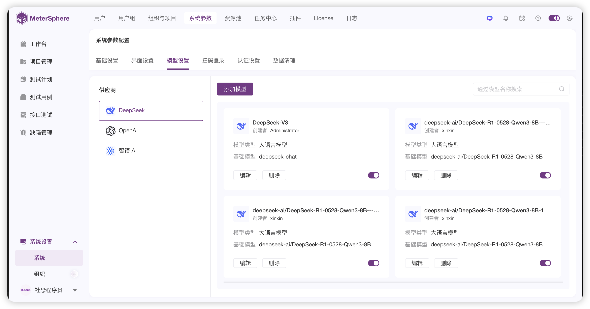{ width="900px" }
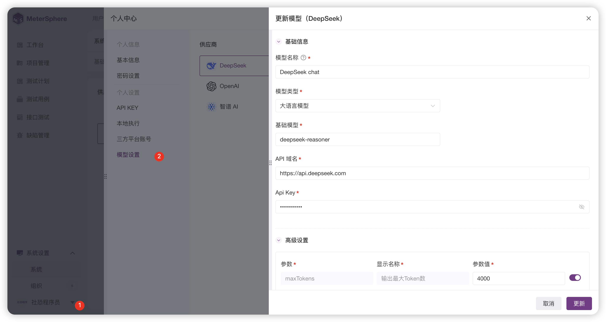{ width="900px" }

## 3 使用说明
!!! ms-abstract ""
    在MeterSphere顶部导航栏中点击“AI智能助手”图标，即可打开助手机器人，辅助解决软件测试工作过程中遇到的各类问题（包括但不限于测试用例生成、故障排查、文档解读等）。
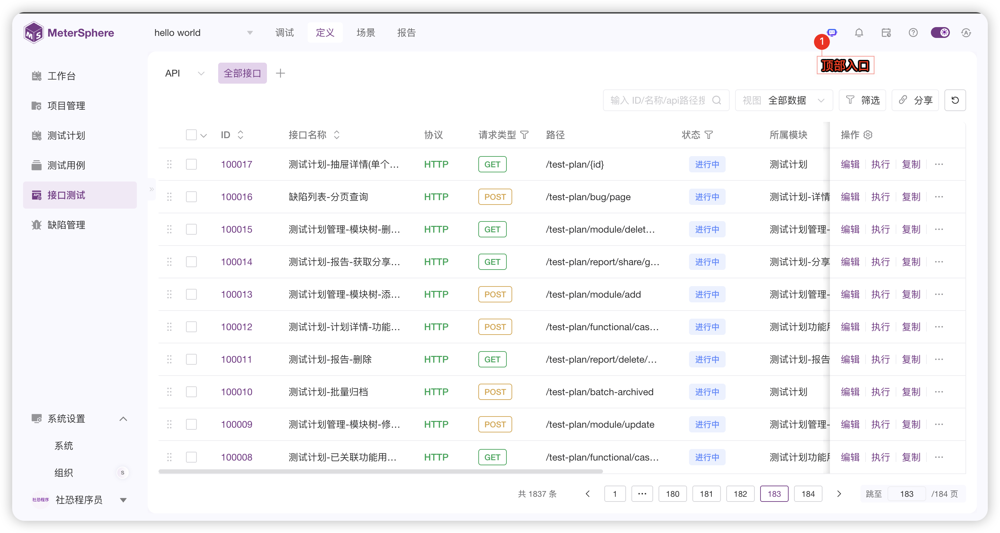{ width="900px" }
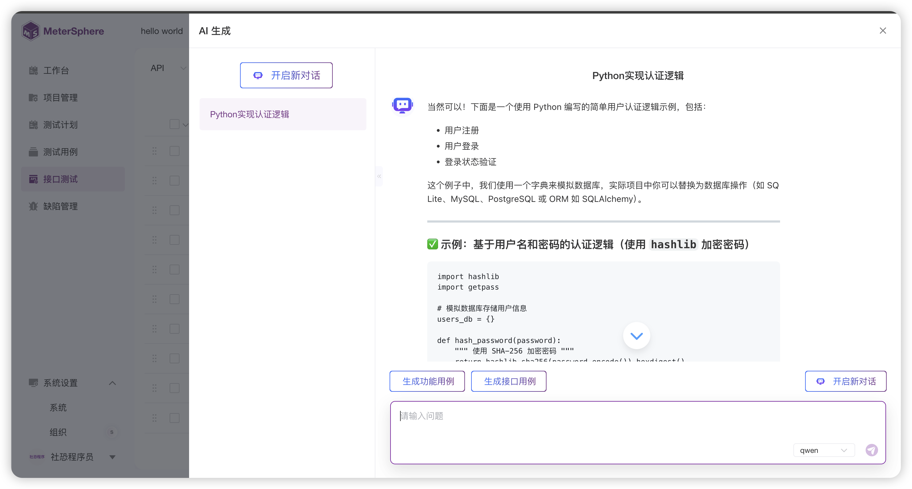{ width="900px" }

### 3.1 接口测试用例生成
!!! ms-abstract ""
    接口用例支持单条用例和批量用例生成两种方式。
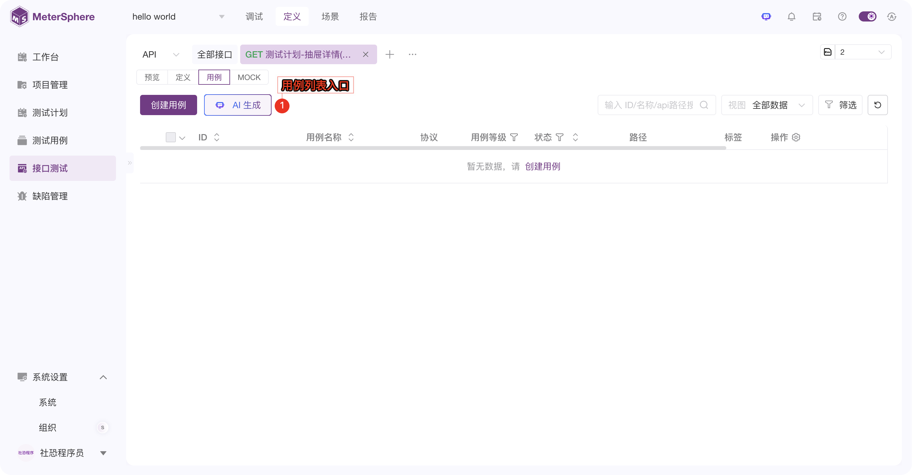{ width="900px" }

!!! ms-abstract ""
    生成单条用例： 输入API信息（例如URL、Method、Headers、Body结构等）和用户提示词，AI将生成一条对应的测试用例。
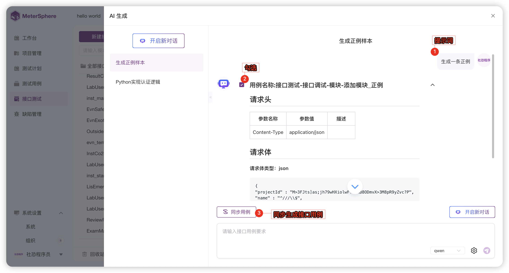{ width="900px" }

!!! ms-abstract ""
    批量生成用例： 输入API信息（例如Swagger/OpenAPI文档URL或内容）和用户提示词，AI将自动分析并生成多条相关的测试用例。
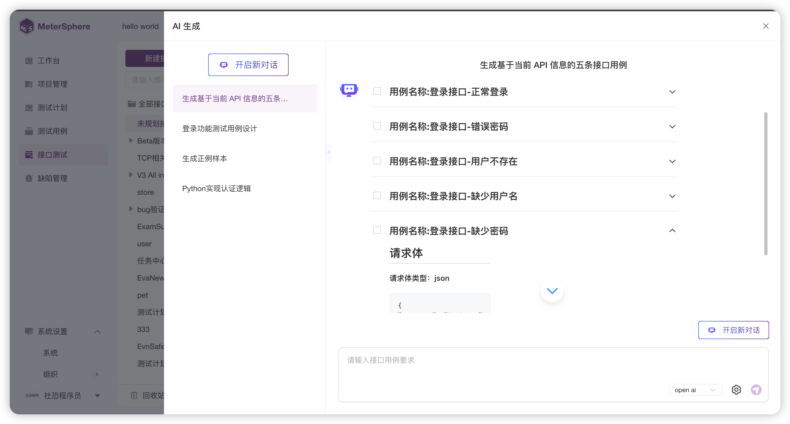{ width="900px" }
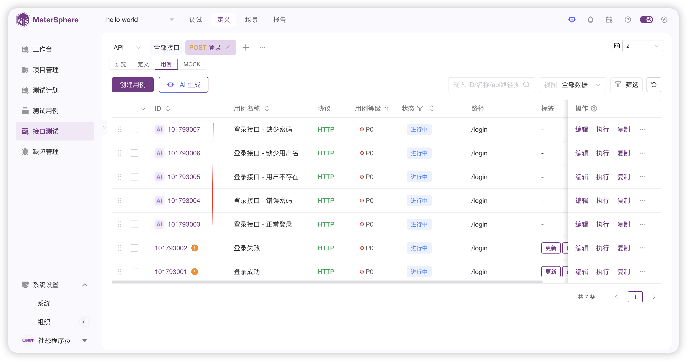{ width="900px" }

### 3.2 功能测试用例生成
!!! ms-abstract ""
    功能用例同样支持单条用例和批量用例生成。
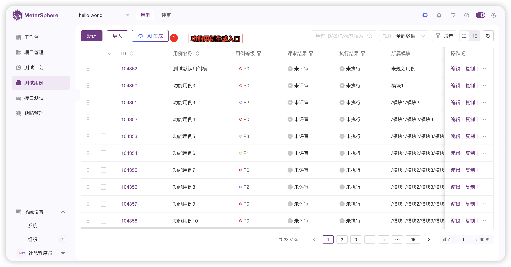{ width="900px" }
!!! ms-abstract ""
    生成单条用例：直接输入对测试场景的自然语言描述（例如：“测试用户登录成功场景，使用正确的用户名和密码”），AI将自动生成一条对应的测试用例。 
    批量生成用例：输入包含多个测试需求描述的文档或列表，AI将批量生成对应的多条测试用例。 
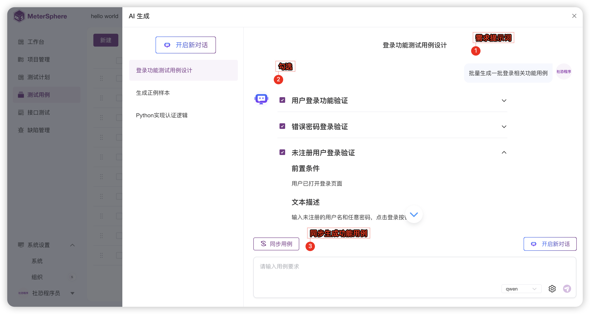{ width="900px" }
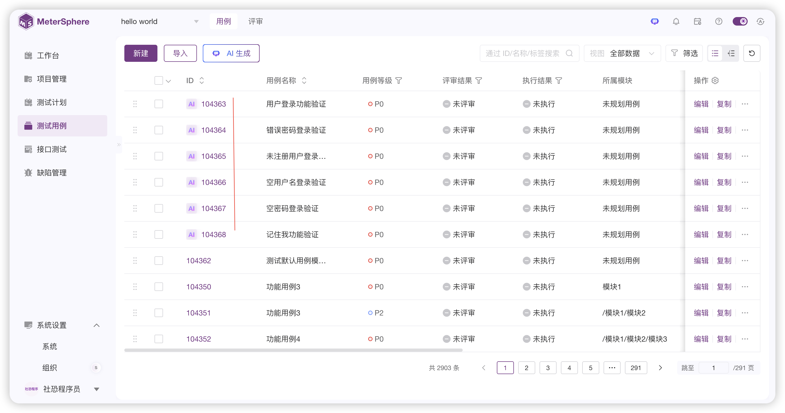{ width="900px" }

### 3.3 查看与编辑用例
!!! ms-abstract ""
    单条测试用例生成完毕后，页面自动跳转到“草稿”编辑页面，用户可以预览AI生成的用例步骤，并按需调整参数。批量生成的测试用例，用户可以在测试用例列表中查看。
