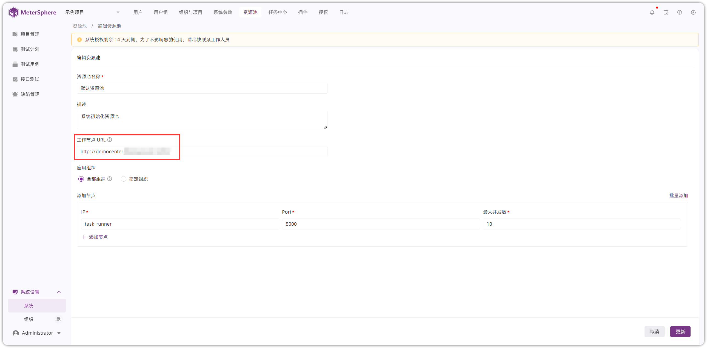

## 1 离线包安装，如何引用 Python3 第三方依赖包？
!!! ms-abstract "注意"
    Python3 引用第三方依赖包有【挂载本地目录】 和【容器共享目录】两种方式，任选其中一种方式即可。

!!! ms-abstract "挂载本地目录"
    MeterSphere 里内嵌的 Python3 是 Python3.10，因此需要先在部署的环境里，先安装 Python3.10
    
    ```
    # 安装python3.10
    apt update && sudo apt upgrade -y
    apt install software-properties-common -y
    add-apt-repository ppa:deadsnakes/ppa
    apt install python3.10
    
    # 安装虚拟环境
    apt install -y python3.10-venv
    
    # 创建一个目录用于python虚拟环境
    mkdir /root/.venv
    cd /root/.venv
    python3 -m venv .
    source bin/activate
    
    # 安装三方包
    pip install requests
    pip install pinyin
    ```
    
    配置 task-runner 的目录挂载 /root/.venv/lib/python3.10/site-packages:/usr/local/lib/python3.10/site-packages

    { width="900px" }
    
    配置完成后执行 msctl reload，服务启动后就可以在 Python3 脚本中直接使用三方包了

    { width="900px" }
    ```

!!! ms-abstract "容器共享目录"
    使用 Dockerfile 制作一个 python 容器

    ```
    FROM python:3.10-alpine
    
    RUN pip install requests pinyin
    
    VOLUME ["/usr/local/lib/python3.10/site-packages"]
    ```

    修改 docker-compose-task-runner.yml 文件
    ```
    version: "3"
    services:
      python:
        container_name: python
        image: python:3.10
        command: sh -c "tail -f /dev/null"  # 保持容器运行
    
      task-runner:
        image: ${MS_IMAGE_PREFIX}/metersphere-ce:${MS_IMAGE_TAG}
        container_name: task-runner
        deploy:
          resources:
            limits:
              memory: ${MS_RUNNER_MEM_LIMIT}
        entrypoint:
          - sh
          - -c
          - |
            sh /shells/task-runner.sh
        environment:
          TOTP_ENABLED: ${MS_TOTP_ENABLED}
          TOTP_SECRET: ${MS_TOTP_SECRET}
        ports:
          - ${MS_TASK_RUNNER_PORT}:8000
        healthcheck:
          test: [ "CMD", "nc", "-zv", "localhost", "8000" ]
          interval: 6s
          timeout: 5s
          retries: 50
        volumes:
          - ${MS_BASE}/metersphere/logs/task-runner:/opt/metersphere/logs/task-runner
        volumes_from:
          - python
        restart: always
        networks:
          - ms-network
    ```

## 2 在线一键安装，如何引用 Python3 第三方依赖包？
!!! ms-abstract ""
    宿主机的 Python3 环境已安装 requests 模块，执行 pip show requests 找到 Python3 环境的路径
{ width="900px" }

!!! ms-abstract ""

    - 通过 docker run 命令一键安装 MeterSphere，需要添加 -v 参数，将宿主机 Python3 环境映射到容器内部
    - 执行命令【docker run -d -p 8081:8081 --name=metersphere -v ~/.metersphere/data:/opt/metersphere/data -v /usr/local/python3/lib/python3.10/site-packages:/usr/local/python3/lib/python3.10/site-packages cr2.fit2cloud.com/metersphere/metersphere-ce-allinone】
{ width="900px" }

!!! ms-abstract ""
    在【项目管理-公共脚本】处添加如下代码，进行测试，在执行结果页面，正常输出请求成功响应体。
{ width="900px" }

{ width="900px" }

## 3 本地执行检测，出现 “网络异常，请检查您的网络连接是否正常”
!!! ms-abstract "配置 localhost 异常"
    【个人执行-本地执行】配置 http://localhost:8000，页面报“网络异常，请检查您的网络连接是否正常”
{ width="900px" }

!!! ms-abstract ""
    在 Chrome 浏览器上访问【chrome://flags/#block-insecure-private-network-requests】将该项设置为【disabled】，重启浏览器即可
{ width="900px" }

!!! ms-abstract ""
    若是 Edge 浏览器，则输入【edge://flags】后，搜索【block-insecure-private-network-requests】将其设置【disabled】
{ width="900px" }

!!! ms-abstract ""
    点击【检测并保存】即可检测通过
{ width="900px" }

!!! ms-abstract "配置本地IP异常"
    【本地执行】配置 http://本地IP:8000 则会出现如下的跨域问题。
{ width="900px" }

!!! ms-abstract ""
    在 Chrome 浏览器上访问【chrome://settings/】后，点击【隐私和安全-网站设置-更多内容设置-不安全内容-允许显示不安全内容-添加】
{ width="900px" }
    
{ width="900px" }

!!! ms-abstract ""
    添加 MeterSphere 平台域名后，点击小三角后，在"不安全内容"处设置"允许"
{ width="900px" }

{ width="900px" }

!!! ms-abstract ""
    若是 Edge 浏览器，则输入【edge://settings】后，搜索【不安全内容】后，点击不安全内容，添加 MeterSphere 平台域名即可
{ width="900px" }

{ width="900px" }

!!! ms-abstract ""
    点击【检测并保存】即可检测通过
{ width="900px" }

## 4 资源池无法访问当前站点
!!! ms-abstract "问题现象"
    【接口测试】执行请求时，页面提示"资源池无法访问当前站点"
{ width="900px" }

!!! ms-abstract "解决方法"
    【系统设置-系统-资源池】编辑页面，工作节点 URL 填写为 MeterSphere 服务地址，该地址与 task-runner 容器服务之间网络要通。
{ width="900px" }
