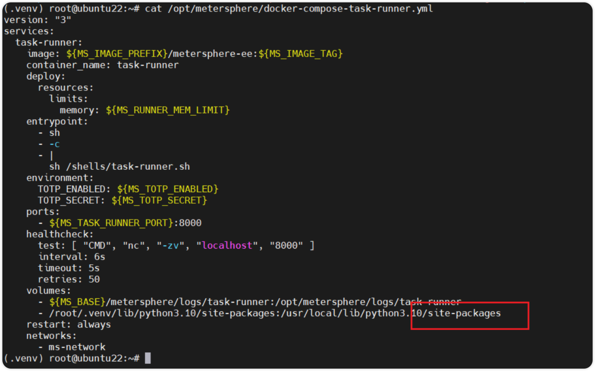

## 1 Python3 如何引用第三方依赖包？

!!! ms-abstract ""
    MeterSphere 里内嵌的 Python3 是 Python3.10，因此需要先在部署的环境里，先安装 Python3.10
    
    ```
    # 安装python3.10
    apt update && sudo apt upgrade -y
    apt install software-properties-common -y
    add-apt-repository ppa:deadsnakes/ppa
    apt install python3.10
    
    # 安装虚拟环境
    apt install -y python3.10-venv
    
    # 创建一个目录用于python虚拟环境
    mkdir /root/.venv
    cd /root/.venv
    python3 -m venv .
    source bin/activate
    
    # 安装三方包
    pip install requests
    pip install pinyin
    ```
    
    配置 task-runner 的目录挂载 /root/.venv/lib/python3.10/site-packages:/usr/local/lib/python3.10/dist-packages
    { width="900px" }
    
    配置完成后执行 msctl reload，服务启动后就可以在 Python3 脚本中直接使用三方包了
    { width="900px" }
    ```