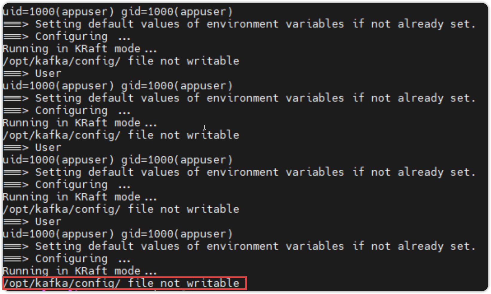
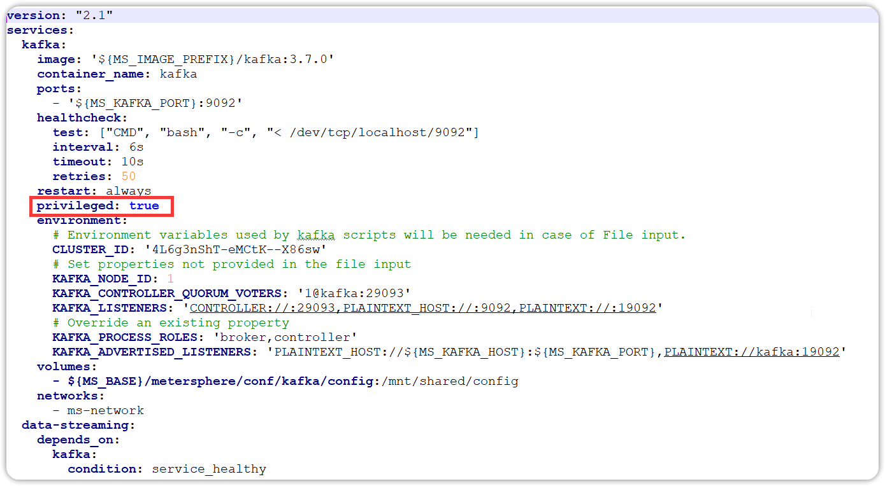
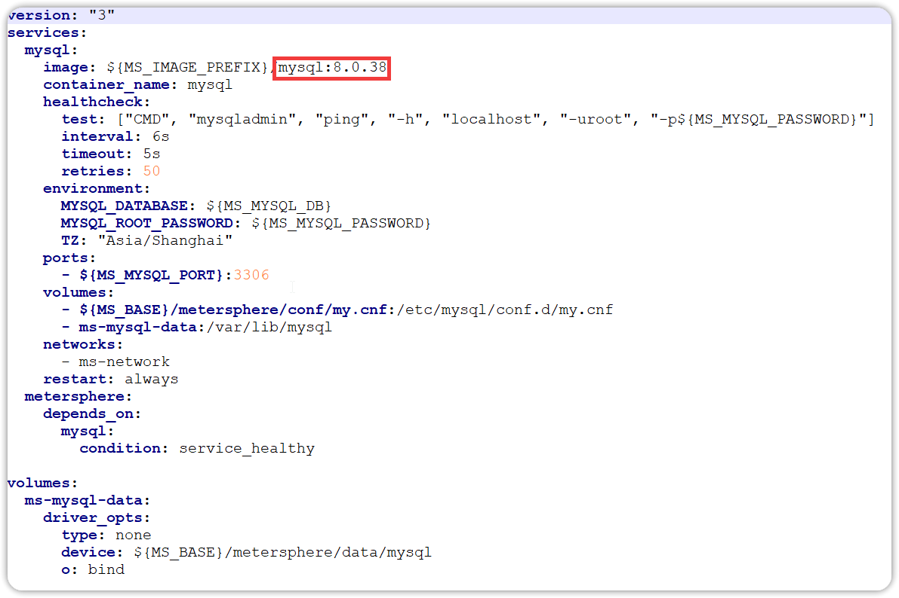

## 1 kafka 服务无法启动
!!! ms-abstract "问题现象"
    kafka 服务起不来，docker logs kafka 看到日志里出现 "/opt/kafka/config/file not writable"
{ width="900px" }

!!! ms-abstract "解决方法1"
    升级 docker 版本即可。若服务器有网环境，执行

    ```
    yum update
    yum install docker-ce docker-ce-cli containerd.io
    ``` 
    
    若服务器没网，MeterSpher 离线安装包里有离线 docker，执行
    ```
    chmod +x docker/bin/*
    cp docker/bin/* /usr/bin/
    cp docker/service/docker.service /etc/systemd/system/
    chmod 754 /etc/systemd/system/docker.service
    service docker start
    ```

!!! ms-abstract "解决方法2"
    若使用的是离线包自带的 docker 也出现该错误，可以在 `/opt/metersphere/docker-compose-kafka.yml` 里添加 privileged: true 参数后，执行 msctl reload 即可。
{ width="900px" }

## 2 mysql 服务无法启动
!!! ms-abstract "问题现象"
    mysql 服务起不来，docker logs mysql 日志里出现 "Fatal glibc error: CPU does not support x86-64-v2"

!!! ms-abstract "解决方法"
    降低 mysql 的镜像版本。修改安装目录 `/opt/metersphere/docker-compose-mysql.yml` 里 mysql 的镜像版本号后，执行 msctl reload 即可。
{ width="900px" }

