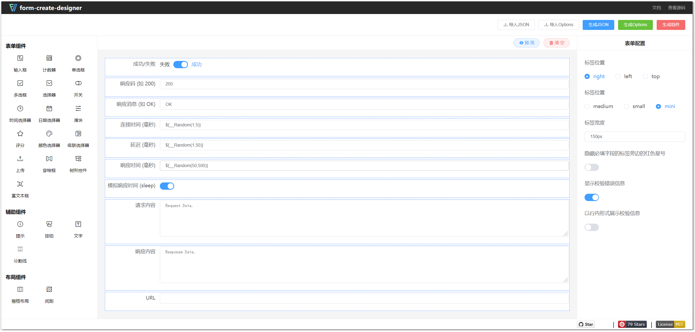
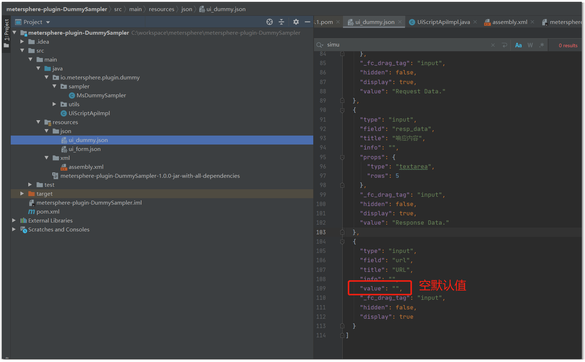
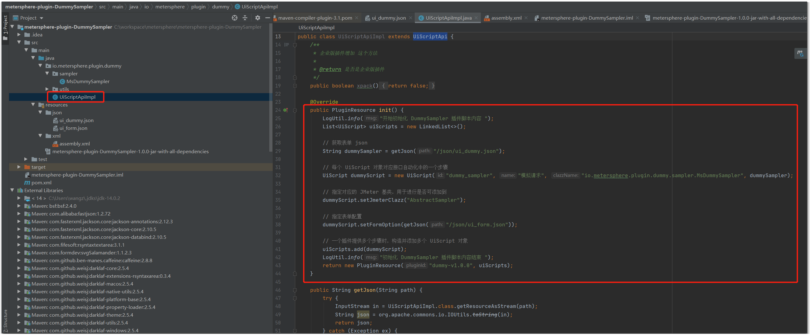
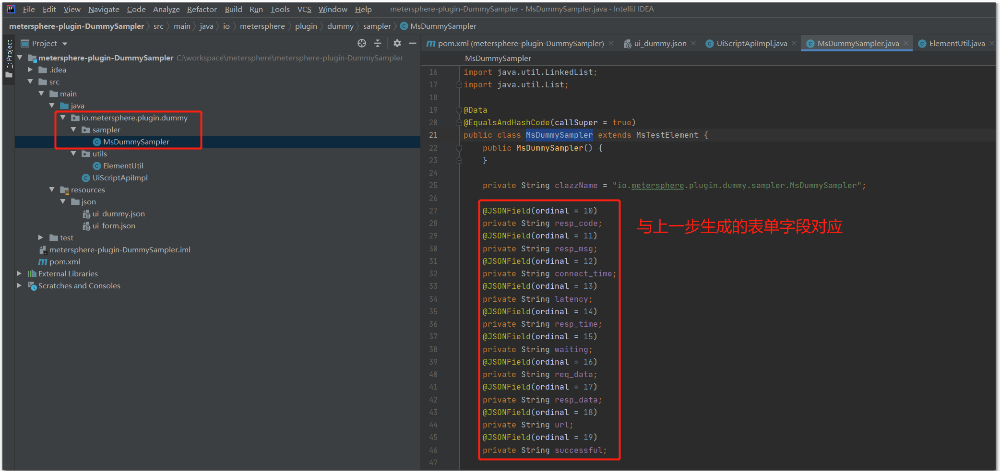
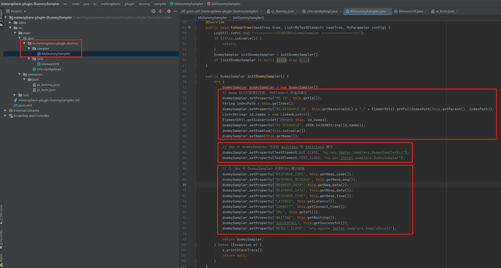
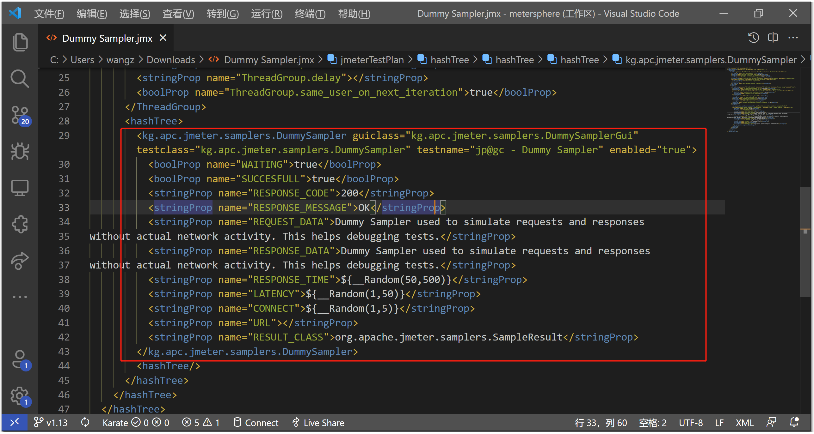
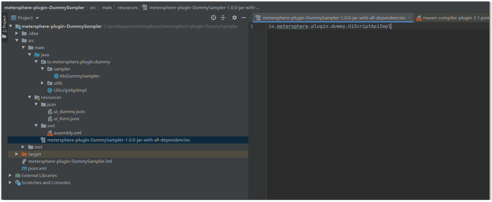
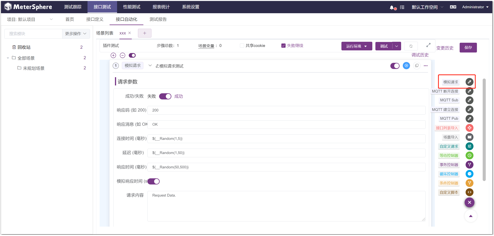
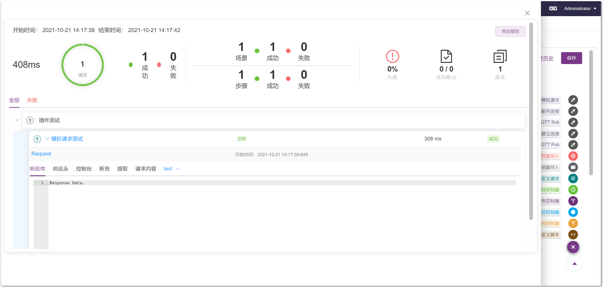

## 1 背景介绍
!!! ms-abstract ""
    在 JMeter 中使用 [Dummy Sampler](https://jmeter-plugins.org/wiki/DummySampler/?utm_source=jmeter&utm_medium=helplink&utm_campaign=DummySampler) 可以构造出一个请求和响应完全自定义的请求取样器，并且这种方式可以方便地对断言、参数提取等各种后置处理器进行调试。针对 JMeter 已有的功能或插件，只需要进行很少量的开发工作，就可以将其封装成 MeterSphere 的接口自动化插件，对应的插件 Demo 示例见: [metersphere-plugin-DummySampler](https://github.com/metersphere/metersphere-plugin-DummySampler)。 <br>

## 2 开发流程
### 2.1 项目初始化
!!! ms-abstract ""
    初始化一个 maven 项目，并添加如下依赖。公共插件包依赖对应的代码仓库见：[metersphere-plugin-core](https://github.com/metersphere/metersphere-plugin-core) 。
    ```pom.xml
    <!-- 省略开头 -->
        <dependencies>
            <!-- 公共插件包，定义了执行数据的基类和公共接口 -->
            <dependency>
                <groupId>io.metersphere</groupId>
                <artifactId>metersphere-plugin-core</artifactId>
                <version>2.0</version>
                <scope>provided</scope>
            </dependency>
            <!-- 原始的 JMeter DummySampler 插件 -->
            <dependency>
                <groupId>kg.apc</groupId>
                <artifactId>jmeter-plugins-dummy</artifactId>
                <version>0.4</version>
            </dependency>
        </dependencies>
    <!-- 省略结尾 -->
    ```

### 2.2 生成前端表单
!!! ms-abstract ""
    在 JMeter 中创建一个包含 DummySampler 步骤的脚本，对照 JMeter 中该步骤的配置页面，使用 [表单生成器](http://www.form-create.com/designer/?fr=home) 生成前端表单的 json 文件。<br>

{ width="900px" }

!!! ms-abstract ""
    点击表单生成器右上角的【生成JSON】按钮，将内容保存到`src\main\resources\json\ui_dummy.json`文件中；点击右上角的【生成Options】按钮，将内容保存到`src\main\resources\json\ui_form.json`文件中。对于没有默认值的字段，手动编辑 json 文件，增加空默认值，避免出现空指针异常。<br>

{ width="900px" }

### 2.3 初始化插件资源
!!! ms-abstract ""
    在`src\main\java\io\metersphere\plugin\dummy\UiScriptApiImpl.java`中使用上面生成的表单 json，对插件内容进行初始化。<br>

{ width="900px" }

### 2.4 转换生成 JMeter HashTree
!!! ms-abstract ""
    创建与上一步对应的初始化 UiScript 对象时指定类名一致的`io.metersphere.plugin.dummy.sampler.MsDummySampler`类，在该类中完成前端表单数据到 JMeter HashTree 的转换。<br>

{ width="900px" }

{ width="900px" }

!!! ms-abstract ""
    生成 DummySampler 对象时，guiclass、testclass 及各个属性对应的字段，可以通过创建一个包含 DummySampler 步骤的 jmx 脚本，以文本模式打开脚本快速获取。<br>

{ width="900px" }

### 2.5 打包
!!! ms-abstract ""
    增加一个与打包后的 jar 包同名的文件 src\main\resources\metersphere-plugin-DummySampler-1.0.0-jar-with-all-dependencies 指定插件入口。再补充一些其他的必要内容后就可以打包了。<br>
{ width="900px" }

### 2.6 上传测试
!!! ms-abstract ""
    打包后将生成的 metersphere-plugin-DummySampler-1.0.0-jar-with-all-dependencies.jar 在 MeterSphere 的插件管理页面进行上传，上传成功后就可以在接口自动化场景编辑时查看、使用和调试插件提供的请求。<br>

{ width="900px" }

{ width="900px" }