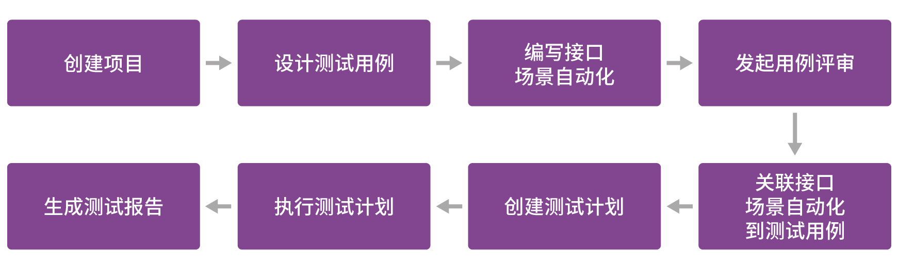
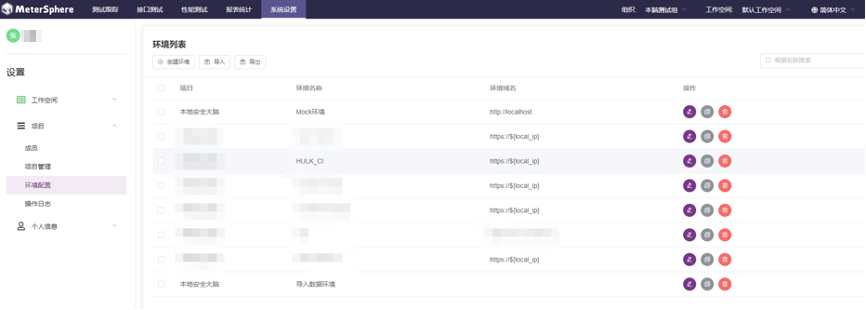
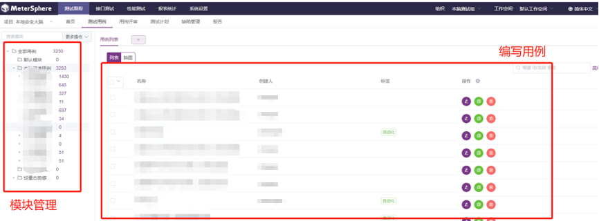
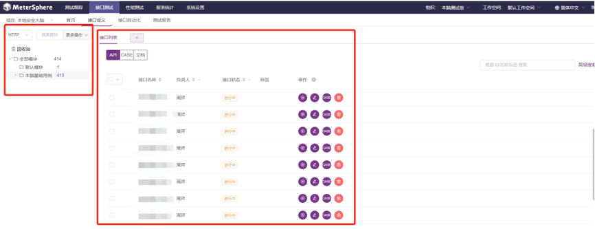
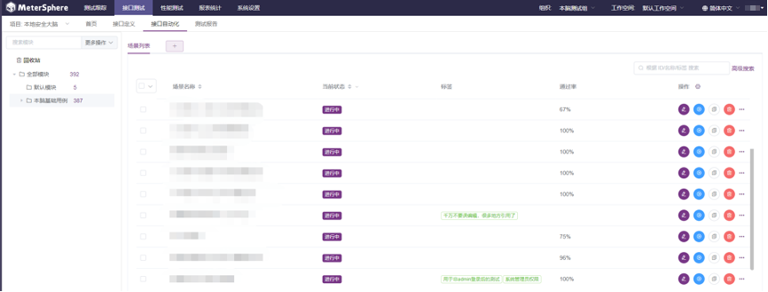
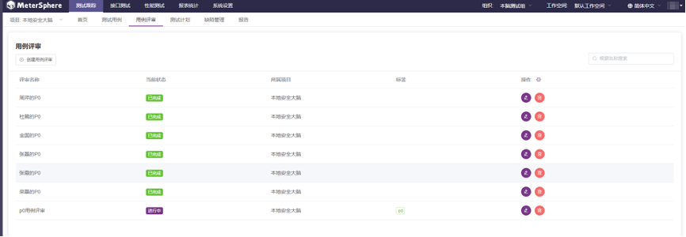
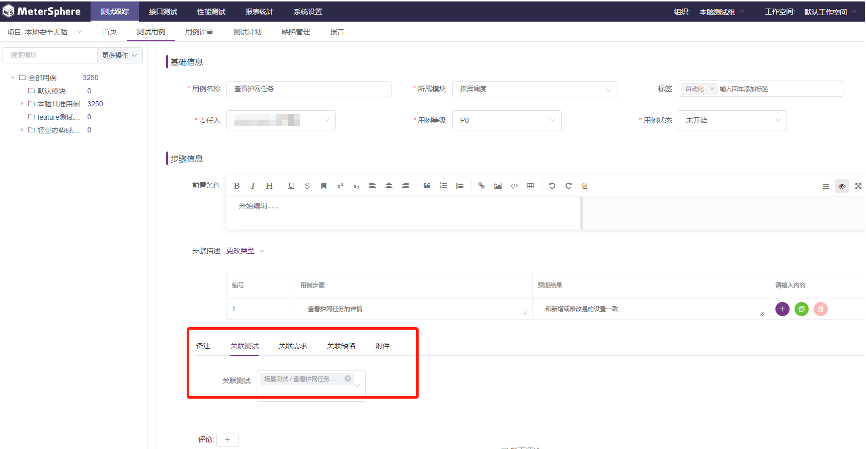
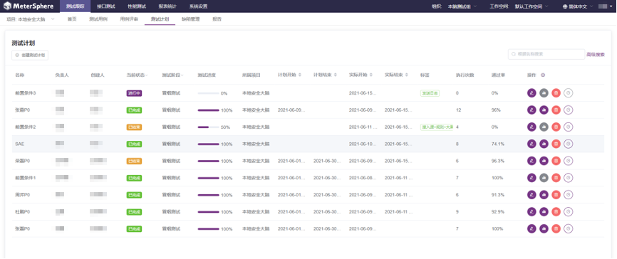
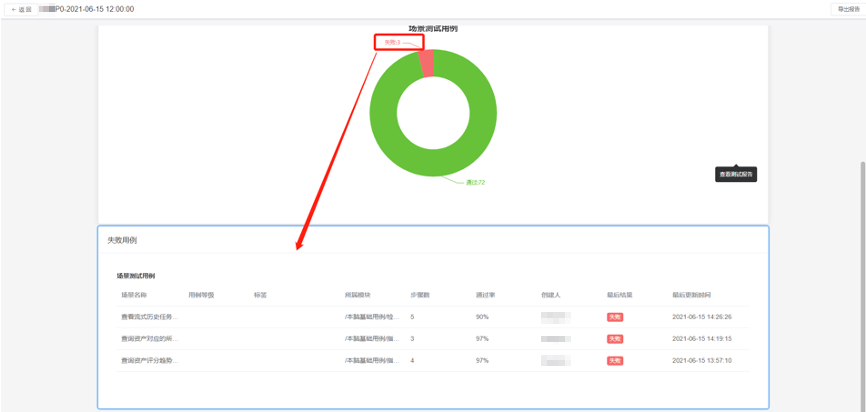

> 注：本文作者为360政企安全集团测试部经理赵荣磊。

360 政企安全集团，是数字经济的守护者。过去 15 年专注为国家、政府、军队、企业、教育、金融等机构和组织提供网络安全技术、产品和服务，是国内最早涉足 To G 和 To B 领域的安全企业之一，目前已与 90% 部委、72% 央企、95% 大型金融机构以及上百万中小企业开展了网络安全合作。

目前，360 政企安全集团本地安全大脑有超过 100 人的专业IT研发团队，测试中心人员7人，团队规模还在持续扩大中。

## 使用MeterSphere前面临的问题

- **自动化测试用例编写难**

  测试人员根据需求规格说明书的要求，在 Robot Framework 上编写自动化测试用例。用例编写的门槛高，维护麻烦。编写大量自动化脚本增加了项目的人力成本和沟通成本，导致低效率以及高差错率；

- **测试进度跟踪缺失**

  整体项目测试缺乏控制，测试用例执行情况等都需要人工统计。无法精确统计自动化覆盖率、接口覆盖率，缺失实时反馈机制；

- **测试工具种类多，整合度差**

  目前我司测试用例的管理模式和接口测试的工具都是相互独立的。种类不一，不同工具的整合较差，都是独立使用，接口用例和自动化没有关联；

- **自动化测试报告不直观**

  目前我司的人工测试、接口测试、性能测试等测试数据需要花费大量的时间进行整理，无法根据测试结果自动出具测试报告。同时，测试报告也没有统一的平台进行展示。

## 对自动化测试的需求

- 系统业务复杂、模块多，需要通过自动化加快测试进度，保障产品质量；

- 需要对每个测试人员的自动化用例进行集中管理、维护和执行；

- 需要版本出包后直接触发自动化用例执行，并提供可靠报告，直观地了解版本提测质量。

## 为什么是MeterSphere?

在使用 MeterSphere 之前，我们是通过TAPD和禅道管理测试用例，然后用 Robot Framework 做自动化测试。但是测试用例的管理工具和进行自动化测试的工具之间没有直接的关联，无法很好地实现接口自动化和统计接口的覆盖率。

为了满足以上需求和解决上述痛点，我们调研了市面上主流的接口自动化软件，发现 MeterSphere 可以兼顾测试用例管理、接口自动化测试、性能测试等功能。经过一段时间试用，最终选择把本地安全大脑项目整体搬迁到 MeterSphere 持续测试平台，实现安全大脑项目的自动化测试。

##利用MeterSphere实现自动化测试

具体实现步骤：

**1.创建项目及测试环境**

进入“系统设置” → “项目管理”创建项目，再进入“环境配置”设置自动化测试环境及性能测试环境。在自动化调试及测试计划执行时，根据需要选择合适的环境测试。

**2.设计测试用例**

进入“测试跟踪” → “测试用例”，创建系统模块，并在对应模块下编写设计测试用例，对所有用例（功能/性能等）进行集中管理。

**3.编写接口/场景自动化**

进入“接口测试” → “接口定义”创建接口，供接口自动化场景使用，然后进入“接口自动化”模块编写自动化场景用例，实现功能及业务自动化。场景调试成功后，将在测试计划中进行关联执行。

**4.发起用例评审**

无需线下组织会议，进入“测试跟踪”→“用例评审”，创建用例评审任务实现内部评审，更加便捷和高效。

**5.关联接口自动化场景到测试用例**

进入测试用例编辑页面，将测试用例关联接口自动化场景，能够更方便地查看用例的自动化覆盖率，进行测试用例的进一步管理。

**6.创建/执行测试计划**

进入“测试跟踪” → “测试计划”，创建测试计划并在测试计划下关联需要执行的自动化场景。操作完成后，在与 MeterSphere 打通的 Jenkins 环境下创建自动化执行任务，实现提测版本安装后，直接执行测试计划。

**7.生成测试报告**

测试计划执行完成后，进入“测试跟踪” → “报告”，查看测试报告，进而了解到该版本的版本质量。开发和项目经理都可以直观地查看版本的质量情况。

##感受及收益

- **用例编写简单高效**

MeterSphere 提供了接口用例编写和调试的能力，可以立刻看到当前接口的执行情况。同时借助接口场景编排能力，方便快捷地把一个业务涵盖的多个接口进行联动。这样一来加速了高质量的软件交付，推动我司软件测试整体效率的提升；

- **规范测试流程**

MeterSphere 很好地定义了从项目维度出发的测试管理模型，即项目管理→编制项目测试计划→设计测试用例（包含功能测试用例、接口测试用例、性能测试用例）→组织测试用例评审→执行测试→输出测试报告。借此模型，我司能够在测试规范上更近一步；

- **自动化报告简洁明了**

提供标准化的测试报告，每一个测试计划完成后，即生成相应的测试报告。测试质量反馈高效，真正做到了有理有据，并且高度一致；

- **自动化覆盖率可度量**

通过 MeterSphere 自带的 DashBoard 面板，可以直观地展示接口覆盖率和接口自动化覆盖情况，提高了整体测试能效；

- **与 Jenkins 关联方便**

通过 MeterSphere 的 Jenkins 插件，能够与持续集成工具无缝集成，通过 Jenkins 直接调用测试计划执行，实现测试左移。