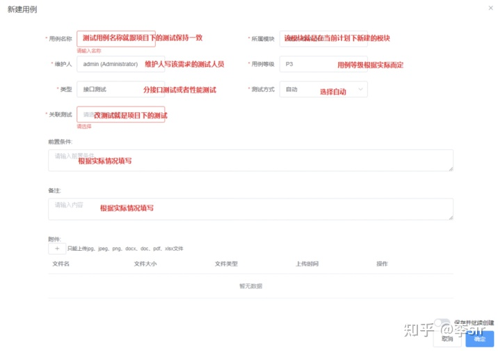

> 注：本文作者为九里云（深圳）科技有限公司质量团队李sir，文章转载自知乎。

九里云（深圳）科技有限公司是一家近百人的创业型公司，主营业务是为融资提供担保服务。因为金融业务本身的特性，对业务敏感功能要求进行充分测试，并针对业务敏感场景进行防重复测试、接口并发测试以及每个版本正式发布之前的回归测试，以确保系统数据的准确性以及服务的稳定性。

目前九里云测试团队规模在10人左右，测试内容以Web服务端为主。测试完成后还需要经过UAT、联调、部署上线等流程。

##使用JMeter作为自动化接口工具的缺陷

为了提升测试质量和效率，接口的自动化测试成了必然选项。我司曾引入 JMeter 来作为自动化接口实现工具，并采用主流的 “Jenkins+Ant+Git+JMeter” 搭建自动化测试框架。在一定程度上，这样做确实提升了测试的效率，但是随着后续深入地使用，一些天然的缺陷也逐渐暴露出来，主要表现为以下几点：

**1.多人协作难**

测试团队中不同岗位角色可能由多人负责，这就涉及到多人协作，例如：JMeter 测试脚本是由整个测试团队共同编辑和维护，这就涉及到JMeter脚本的版本管理和协同的问题。为了解决这个问题，引入了版本管理工具 Git，但由于工作习惯的问题，实际落地效果并不好，团队成员还是习惯在本地去编辑维护自己的个人脚本，并带来版本覆盖、流程过重等其他问题。

**2.测试执行关联难**

JMeter 作为测试执行工具，在测试协议支持、编辑、调试等方面的能力是完整的，但它无法同需求、用例等进行关联绑定。因为 JMeter 本身就是一个测试执行工具，缺少用例、测试跟踪、用户管理等统一能力。从质量团队的角度来说，我们肯定希望将 JMeter 的每个脚本同对应的需求，以及用例绑定起来进行管理，自动在测试报告中进行展现，而实际却难以做到。

**3.使用规范难**

JMeter 已经有各种丰富的开源插件，导致工具本身比较灵活，还另外需要配套的规范让整个团队统一风格。

由于上述原因，虽然我们团队已经初步实现了接口的自动化测试，在测试效率方面有所提升，但是存在的一些原有框架内无法解决的问题，导致落地后的整体与我们的期望还有一定差距。

2020年12月，在同事的介绍下开始了解 MeterSphere 这款软件，看完整个官方文档后，对它产生了极大的兴趣，它几乎涵盖了我们测试团队对测试工具软件的绝大部分要求。下面我分享MeterSphere 在我们团队中落地的实践经验。

##持续测试思想的引入

如果让我对测试工具来进行分类，可能会有两类；一类是 Easy-Mock、Postman、JMeter；另外一类是 Jenkins、Git。它们的最大区别就是有些工具会引入一些思想和方法。比如 Jenkins 所提倡的持续集成、持续交付、持续部署思想，Git 带来的版本管理和多人协同的方法；而作为对比，Postman、JMeter 等就是单纯执行工具了。通过工具引入的一些思想和方法，不仅会指导我们如何正确使用工具，还有利于优化整个工作模式。

而对于 MeterSphere 这款工具来说，它更偏向于 Jenkins、Gitlab 那种类型，它不仅带来了一整套测试执行工具，还引入了持续测试的理念，并且给出了非常具体的持续测试成熟度模型维度标准，这对我们团队后续工作开展带来了指导性方向。

##一站式的测试平台

对于质量团队来说，测试工具的建设很大程度上决定了整个项目的测试效率和整体质量。对于测试平台来说，常见的有两种建设方式，一种是引入一些常见的测试工具，比如JMeter、Postman、禅道等；另一种是组建专门测试开发团队，针对公司当前的研发模式，设计和编写适配的研发平台及测试工具。两种方式各有优劣，在这里就不细说对应的优缺点了。

而对于MeterSphere来说，这个平台集成了从测试计划到测试执行、测试报告的不同阶段功能，并且其产品规划中，会将该平台打造成一个一站式的测试平台，并支持自己编写工具集成到平台中，真正实现一站式，并且还是开源免费的。这对于一个创业型公司的质量团队来说真的太棒了。目前我们团队通过MeterSphere平台使用到的功能有：

- 系统设置
- 测试跟踪
- 接口测试
- 性能测试
- 接口自动化
- 集成Jenkins、钉钉等

###MeterSphere使用流程和规范

我们基于此平台，编写了一套适配我们公司实际情况的使用规范和流程。首先是用户、组织和工作空间的使用，在MeterSphere平台中，组织和工作空间是个逻辑上的架构划分，可以灵活适配不同的组织架构。我们根据团队的组成以及实际测试的习惯对用户、组织、工作空间指定了如下命名规范：

【测试人员】ID和姓名均设置为自己的名字全拼，角色分配为管理员；

【非测试人员】ID和姓名均设置为自己的名字全拼，角色分配为只读用户；

【组织】只新建一个组织，并以公司名为组织名称，组织添加测试组人员；

【工作空间】工作空间命名为“质量支撑组”，工作空间添加测试组人员；

【项目】根据需求创建项目，命名方式为“需求名称项目”；另外增加一个项目名称为“自动化接口项目”；

【自动化接口项目】所有通过的测试即接口需要放置于该项目下，用于自动化接口测试。

对于接口和性能自动化测试规范，我们质量团队也指定了对应的流程和执行策略：

1.将已经测试通过的接口测试或者性能测试，根据需求的测试维度创建一级模块。

2.在对应的模块下，添加测试用例：

3.创建测试计划。

4.给测试计划关联测试用例。

5.Jenkins配置自动化执行Job。

6.Jenkins配置执行策略。

【执行时间】：每天凌晨3:50左右执行；Master分支如有更新，接口和性能测试都执行；
【执行环境】：默认为测试环境；
【执行结果通知】：如Job构建失败，以邮件的方式通知并附带测试报告，测试报告将直接展示在邮件内容中；以钉钉的形式通知测试组成员并附带测试报告链接；
【执行结果通知对象】：测试组成员及对应开发负责人。

下图是我们公司质量团队内部整理并执行的MeterSphere使用流程和规范的内容概要。如果您感兴趣，可以到以下地址详细查看：

> 网盘地址：
> https://pan.baidu.com/s/1kGuX7E2z9F9iQxqH6nU9Aw
>
> 密码: 1ltb

##小结

最后总结一下整个 MeterSphere 使用体验。在使用的过程中，切身感受到 MeterSphere 项目团队对于版本更新速度还是很快的，缺陷修复也很及时，希望继续保持~

作为创业型公司的质量团队，MeterSphere 一站式开源持续测试平台给我们团队带来了自研工具的感觉，希望能够和 MeterSphere 一起成长，持续不断地提高测试质量和效率。