> 注：本文作者为民生科技有限公司个人生态研发部董小平和智能云技术团队刘简。

民生科技有限公司成立于2018年，公司秉承民生银行改革创新精神，致力于通过大数据、云计算、人工智 能、区块链等科技创新，为民生银行集团、金融联盟成员、中小银行、民营企业、互联网用户提供数字化、智能化的科技金融综合服务，共同打造科技金融生态圈。

##测试阶段面临的问题

民生科技有限公司在各位领导和同事的不懈努力以及行内的大力支持下，各个部门和产品线得到了飞速发展。期间，某15人规模的小型团队从0到1并行研发三个项目。项目期内的迭代优化数量就有上百次。

在此敏捷过程中的测试任务繁重，我们团队急需一款高效易用的测试用例管理工具来对测试用例进行管理、执行、优化复用，以及自动化测试。这可以在帮助提高产品测试效率的同时，配合多个项目提高产品交付质量。

- 无测试用例库时流程如下图所示：存在测试用例分散、不利于追踪以前版本测试用例情况等问题。

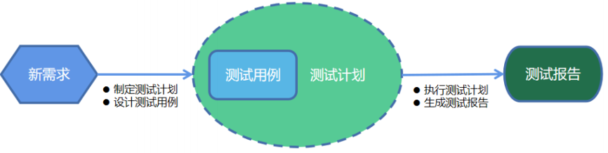

- 搭建测试用例库后流程如下图：通过升级用例和复用用例，可以解决上述无用例库的问题，同时还能提高测试人员的效率。

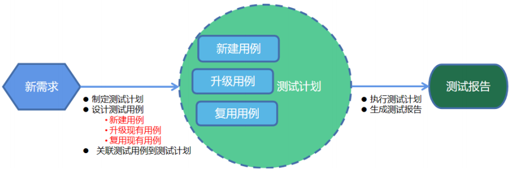

##选用MeterSphere开源持续测试平台

在众多的开源测试用例平台中，我们选择了MeterSphere开源持续测试平台。MeterSphere能快速搭建一目了然的测试用例库，还可以打通项目、需求、Bug平台、测试用例、测试计划、测试报告全流程。同时该平台还支持接口自动化测试，是一款理想的测试管理平台。下面我们来分享基于MeterSphere平台实现的项目-需求-测试用例-测试计划-测试报告全流程功能：

###项目管理

以测试角度来维护和管理项目及测试环境。

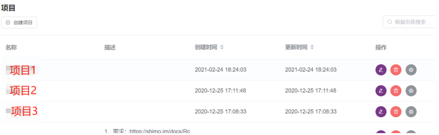

同时可以为每个项目设置多个测试环境，以及同一环境多域名。

###测试用例库

在项目下面以模块或新需求维度创建测试和维护用例库，同时可以维护回归用例集。

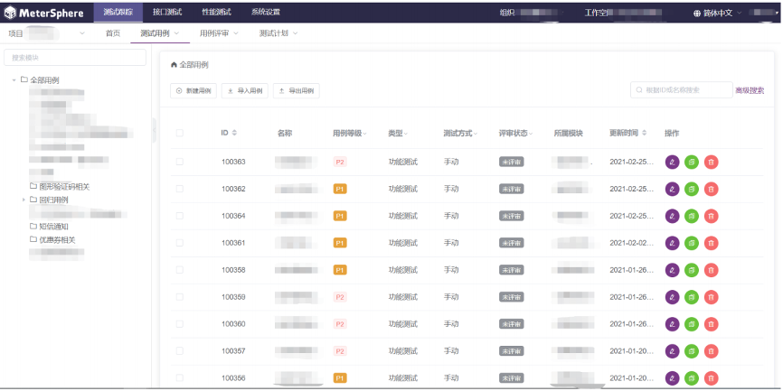

用例创建系统支持EXCEL和脑图的导入。

并且在线管理维护也支持多种形式，比如脑图、表单形式和富文本形式。

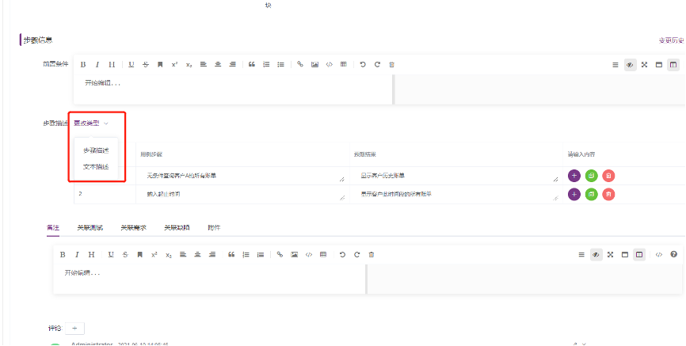

用例除了支持超文本信息输入，还支持文件、图片等附件的输入。

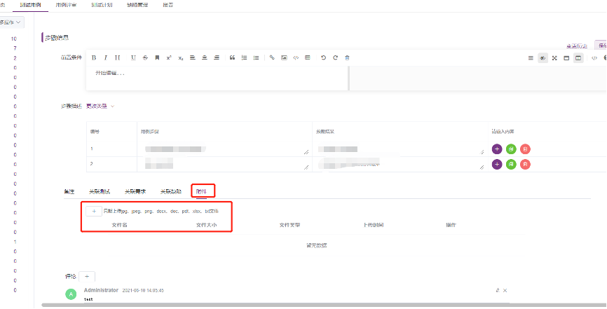

在创建测试用例时，可以指定此测试用例相互关联的项目需求，这样可以很好地管理测试用例和需求的关联性。

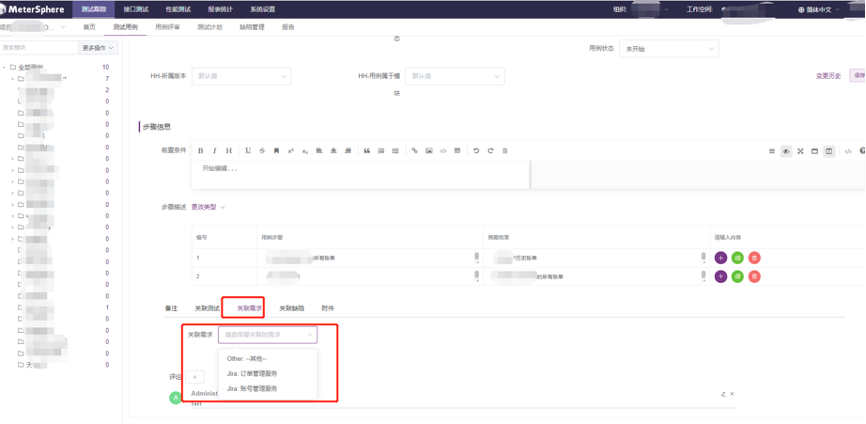

###测试用例评审

小需求的测试用例可在线评审，同时也可减少人员聚集。

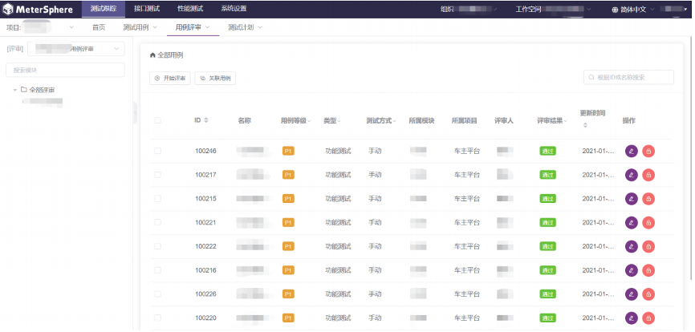

在线评审时，系统支持指定多人同时在线评审。

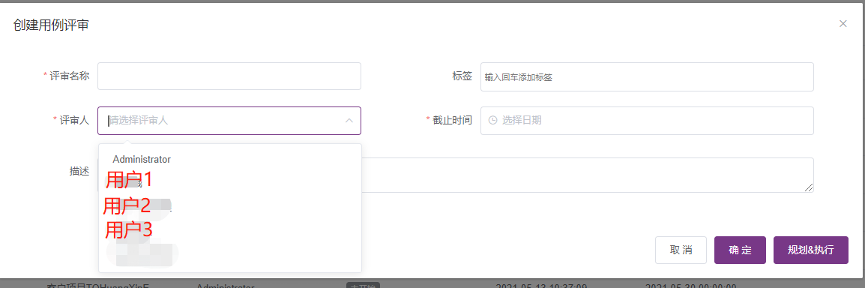

支持多评审人员实时发布意见或建议，且信息实时同步及永久保存。

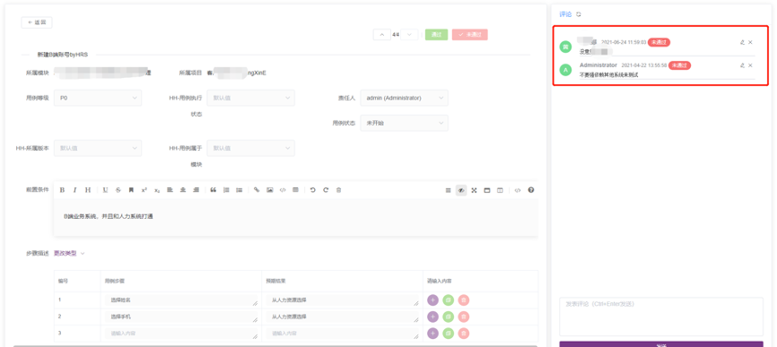

###测试计划

创建测试计划，关联测试用例到测试计划时，实现测试用例复用。系统会实时统计测试计划执行进度，使各计划的测试进度一目了然。

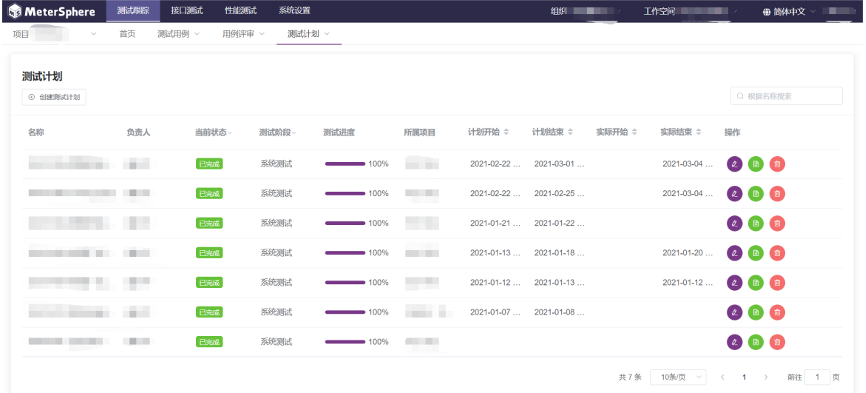

同时系统支持跨项目引用测试用例。

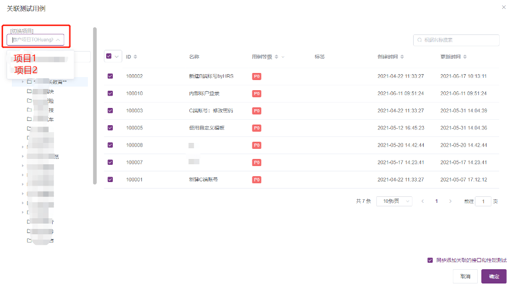

###测试报告

系统会根据测试计划执行情况动态实时出测试报告，同时对不同的计划可以自定义测试报告模板。

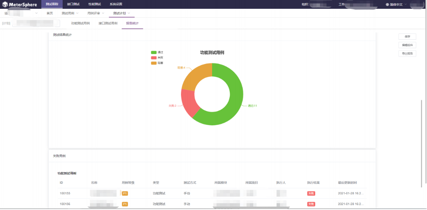

MeterSphere开源持续测试平台其他相关功能。比如缺陷管理，在执行中发现的缺陷，系统会根据每个项目的不同配置，自动把缺陷推送到相应的平台或在MeterSphere平台进行管理。

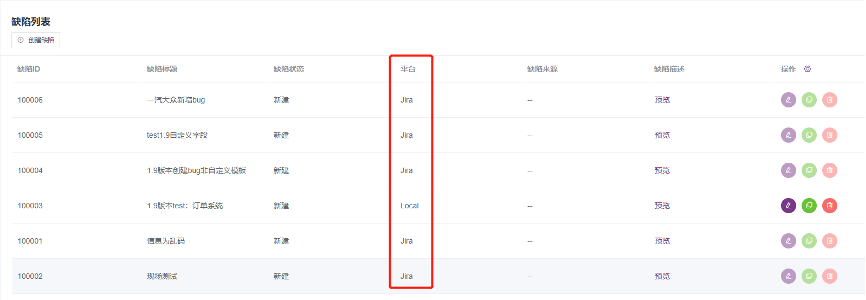

##使用体会及期望

使用MeterSphere开源持续测试平台后，很好地解决了我们的问题，并且大幅度地提高了测试人员设计测试用例的效率。我们后续计划在该平台执行接口自动化测试用例，后续有机会再跟大家分享。

最后，总结一下MeterSphere持续测试平台的亮点：

- 平台简单易操作；
- 支持XMind脑图测试用例的导入（此处给平台一个大大的赞）；
- 创建测试计划时可以同时关联多个项目的测试用例；
- 测试计划状态（完成状态、通过率等）的展示很友好。

MeterSphere开源项目还在持续不断优化和改进，期望还能增加以下功能：

- 增加全方位的报表统计，从项目、模块（需求）等维度进行测试用例库的统计，并增加测试用例、测试步骤、测试用例被执行测试次数的统计；
- 建议增加测试用例版本。