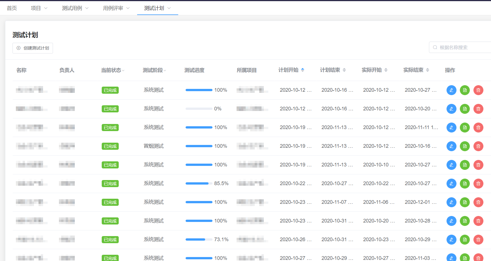
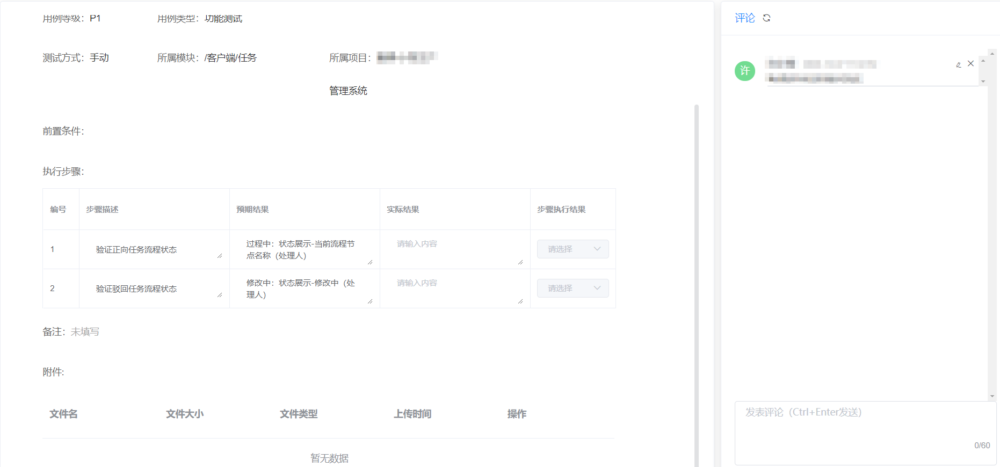
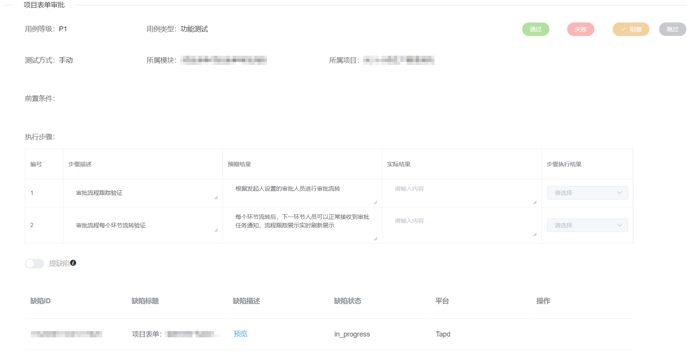
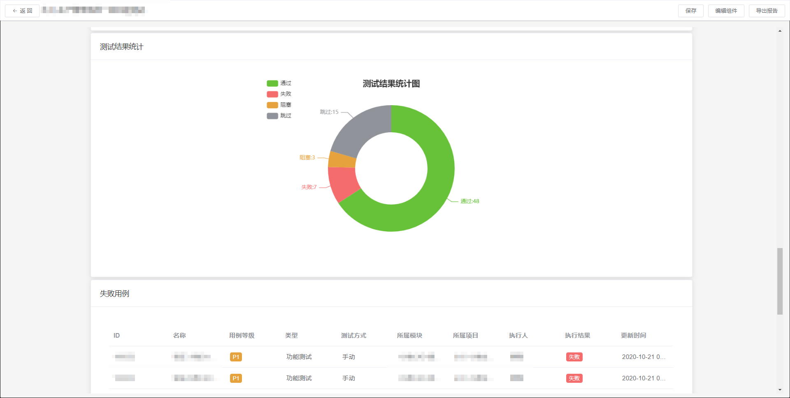
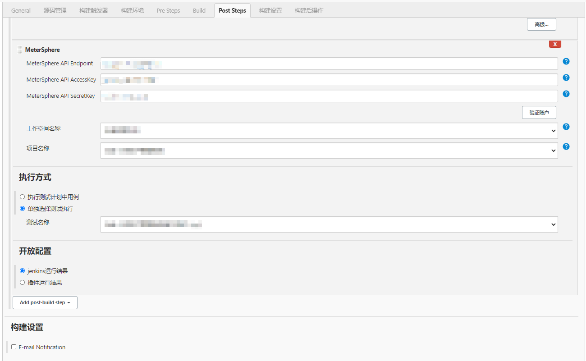
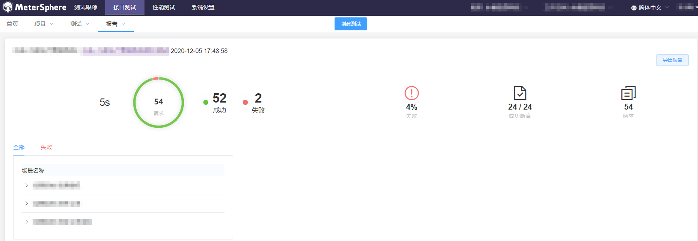

> 注：本文作者为福建永福信息科技有限公司测试经理许小梅。

福建永福信息科技有限公司（以下简称为永福信息）是国内首家民营电力行业上市公司福建永福电力设计股份有限公司旗下的高新技术企业，致力于为工程设计企业提供全面、系统的企业信息化解决方案。

永福信息长期专注于工程设计领域的软件开发，已形成涵盖企业综合办公、经营管理、项目管理、协同设计、数字档案管理等模块的企业信息化解决方案，业务涉及电力、水利、建筑等众多行业。目前，永福信息拥有近200人的专业IT研发团队，测试中心人员15人，团队规模还在持续扩大中。

##我们面临的问题

对于永福信息的测试团队而言，面临的挑战包括：

- 组织结构不断扩大，无法有效地合理安排测试资源；
- 产品数量增加，无法有效地跟踪管理测试项目；
- 测试案例繁多，无法准确量化度量并合理协同利用。

在测试团队和开发团队人员比例差距较大的情况下，测试团队需要覆盖的测试项目众多。每个项目定制化需求很高，测试人力不足，测试任务繁重，测试逃逸频率高，这些都是面临的现实问题。如何才能提升测试管理、测试效率，保证每个产品的测试质量呢？

在使用MeterSphere之前，我们是这样做的：

###测试计划管理：
测试团队内部维护一份大致计划，协同部门针对每个项目还有独立的一份需求计划，版本持续迭代。这样做的缺点在于，在任务多的情况下很难合理地安排测试资源，并且也难以及时地跟踪了解每个任务的进展；

###功能测试案例 & 系统功能测试报告管理：
每个产品独立一个文件夹，包含产品系统功能测试案例、性能测试案例和系统整体测试报告。这样做的问题是测试资料归档混乱，案例查找困难、维护困难，案例更新滞后。每个案例的实际执行情况并不能很好地掌握。

###接口 & 性能测试案例脚本管理：
通过SVN进行协同管理，并持续维护更新。这样做的缺点在于，案例协同设计不及时，而且最新脚本时不时会出现被哪个粗心小伙伴覆盖的情况。功能测试、接口测试、性能测试整体测试报告人工整合也十分费时耗力。

##选用MeterSphere开源持续测试平台

基于以上的种种困扰，我们决定改变，系统性地解决当前测试工作所存在的问题。在几经波折调研试用了几款同类开源产品后，我们选择了MeterSphere开源持续测试平台。

**MeterSphere吸引我们的地方是因为它“接地气”的产品设计，合理有效集成了最通用的测试管理功能和最常用的测试工具，能够实现测试团队的高效协同，满足了我们现阶段的工作需要。** 并且预计在未来很长一段时间也可以支撑我们更加丰富的测试工作拓展。

我们围绕MeterSphere平台重整出发，以项目维度展开测试工作，按照项目制定测试计划、测试范围、测试跟踪，并生成相应测试报告。在此过程中结合测试团队人员的能力成熟度、人员工作量、任务进度、结果输出等情况合理分配工作，并且评估团队人员绩效。

- **整体流程**：项目管理→编制项目测试计划→设计测试用例（功能测试用例、接口测试用例、性能测试用例）→组织测试用例评审→执行测试→输出测试报告。

- **测试项目管理**：维护测试团队覆盖测试的产品/项目，项目关联TAPD项目ID。这样做的目的是为了在该项目测试计划关联的案例执行过程中，对执行案例提缺陷时，可以将缺陷同步致TAPD，最终生成测试报告时候可以准确地统计项目缺陷数据。

*图1  MeterSphere 测试跟踪项目列表*

- **测试计划管理**：测试计划基于项目创建，不同版本可能存在多个测试计划。按照项目版本迭代计划进行匹配，测试计划与钉钉群机器人打通，实现实时计划执行进度变更通知，提升测试进度管理以及测试效率的跟踪。

*图2 MeterSphere 测试计划列表*

- **测试案例管理**：功能测试用例、接口测试用例、性能测试用例协同设计，丰富测试策略和测试方法，并有效增加测试覆盖度。

*图3  MeterSphere 测试用例管理界面*

- **测试用例评审**：测试用例内部评审更加高效，用例评审是否通过支持实时通知，测试用例内部评审完一轮后再导出给协同部门进行评审。同时，还可以对测试用例进行评论，用例补缺补漏。用例评论可通过钉钉机器人进行消息通知，督促及时调整完善测试用例。

*图4 MeterSphere 用例评审任务列表*

*图5 MeterSphere 用例评审详情*

- **测试执行**：测试计划关联测试用例，测试用例关联TAPD缺陷，协同开展测试，有效缩短测试周期。

*图6 记录测试用例执行结果*

- **测试报告**：每一个测试计划完成后，即生成相应的测试报告，测试质量反馈高效，真正做到了有理有据。

*图7 生成测试报告*

项目组成员每一次接收到测试报告后的反应如下：

 > 开发小陈：Oh，No！我负责的模块这么多缺陷，心态崩了啊！
 
 > 开发小林：不可能，我的模块怎么这么多问题，我做过自测了啊！
 
 > 开发主管：怎么回事？这一轮提测还有这么多缺陷，这提测质量不行呀。
 
 > 项目经理：这测试结果不服不行。

- **持续测试**：MeterSphere 插件与 Jenkins 相互集成。在构建步骤中添加 MeterSphere 插件，每一次系统升级调用MeterSphere 测试平台中的 API 接口测试案例，实现接口自动化回归测试。回归测试完成后，钉钉机器人实时通知升级回归测试结果。

图8 通过 Jenkins 进行持续测试*

*图9 通过钉钉通知测试执行结果*

*图10 执行结束后的接口测试报告*

总的来说，通过 MeterSphere 持续测试平台，我们获得的收益包括：

- 把测试工作的关键活动有序地串联在一起，实现了测试全生命周期的管理；
- 测试活动中的测试用例和测试结果持续丰满，测试成果逐步积累沉淀；
- 积累量化的测试数据对测试人员进行管理，可以以此建立一套可量化的评测体系来衡量测试人员的工作情况。

未来我们还将基于 MeterSphere 平台持续展开测试过程改进，充分暴露测试过程中各项问题，持续优化测试过程。

*图11 测试过程改进方向*

##感受与评价
我觉得 MeterSphere 持续测试平台最实在的是集成测试工具这一点。将测试工具系统化的完美设计思路，同时添加核心、关键测试管理模块，没有冗余不切实际的功能，设计精简且合理。平台支持测试团队的高效协同，整体流程使用符合测试人员的工作习惯，十分“接地气”。

“开源”也是 MeterSphere 的关键亮点，这样 MeterSphere 拥有一群有激情、有热情的研发团队，加上一群热爱测试的粉丝群。大家在使用中互相学习、共同提升、交流思想、碰撞智慧。相信在这种开源的模式之下，MeterSphere 持续测试平台会越做越好。

##期待与建议

从使用者的角度，对 MeterSphere 持续测试平台提出以下几点建议：

1. 更全面地打通与缺陷管理工具的对接。目前 MeterSphere 上提的缺陷因为非原缺陷管理系统上的缺陷模板，必须在缺陷管理系统上做缺陷的二次编辑，使用上相对比较麻烦。我们的测试团队组员也普遍反馈这一问题；

2. 建议增加基础数据自定义配置的功能；

3. 丰富自定义测试报告功能；

4. 实现用户注册功能，或者增加钉钉、企业微信扫描供协同团队查看的功能；

5. 希望接口测试实现对 JavaScript 的支持；

6. 接口测试在同一场景下实现对多环境的支持。比方说实际的使用场景为，业务子系统在接口测试前需要先登录，而登录也是独立的子系统。环境不一样，同一个业务场景中需要使用到登录环境的配置和业务子系统环境的配置；

7. 性能优化建议，数据量逐渐多了，系统会慢慢变卡。