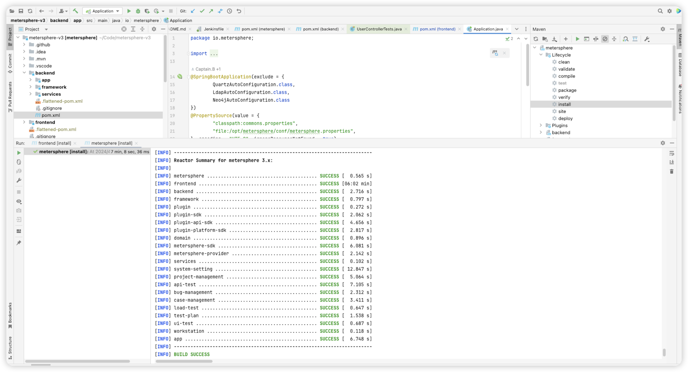
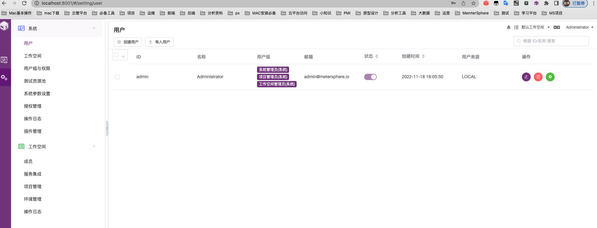

## 1 项目结构
```
.
├── Jenkinsfile                                     # 构建JAR包使用的 jenkinsfile
├── LICENSE
├── OWNERS
├── README.md                                       # 项目中文介绍
├── README-EN.md                                    # 项目英文介绍
├── SECURITY.md                                     # 安全说明
├── CODE_OF_CONDUCT.md                        
├── CONTRIBUTING.md 
├── build.md                                        # 构建过程
├──framework                                          
│   ├── eureka                                       # 服务注册中心
│   ├── gateway                                      # API 网关
│   ├── sdk-parent                                   # SDK
│   ├── .gitignore                                    
│   └── pom                                          # 主框架的 pom 文件           
├──test-track                                        # 测试跟踪模块
│   ├── backend                                      # 后端代码目录
│   ├── frontend                                     # 前端代码目录
│   ├── Dockerfile                                   # 构建容器镜像使用的 dockerfile
│   └── pom                                          # 测试跟踪模块使用的 pom 文件   
├── api-test                                         # 接口测试模块
│   ├── backend                                      # 后端代码目录
│   ├── frontend                                     # 前端代码目录
│   ├── Dockerfile                                   # 构建容器镜像使用的 dockerfile
│   └── pom                                          # 接口测试模块使用的 pom 文件
├── performance-test                                 # 性能测试模块
│   ├── backend                                      # 后端代码目录
│   ├── frontend                                     # 前端代码目录
│   ├── Dockerfile                                   # 构建容器镜像使用的 dockerfile
│   └── pom                                          # 性能测试模块使用的 pom 文件
├── report-stat                                      # 报表统计模块
│   ├── backend                                      # 后端代码目录
│   ├── frontend                                     # 前端代码目录
│   ├── Dockerfile                                   # 构建容器镜像使用的 dockerfile
│   └── pom                                          # 报表统计模块使用的 pom 文件  
├── project-management                               # 项目管理模块
│   ├── backend                                      # 后端代码目录
│   ├── frontend                                     # 前端代码目录
│   ├── Dockerfile                                   # 构建容器镜像使用的 dockerfile
│   └── pom                                          # 项目管理模块使用的 pom 文件 
├── system-setting                                   # 系统设置模块
│   ├── backend                                      # 后端代码目录
│   ├── frontend                                     # 前端代码目录
│   ├── Dockerfile                                   # 构建容器镜像使用的 dockerfile
│   └── pom                                          # 系统设置模块使用的 pom 文件
├── .gitignore
├── .gitmodules
└── pom.xml                                         # 整体 maven 项目使用的 pom 文件
```

## 2 配置开发环境
### 2.1 拉取代码
!!! ms-abstract ""
    需要拉取 [metersphere](https://github.com/metersphere/metersphere) 服务代码，并切换到 v2.10 分支。 <br>

### 2.2 后端
!!! ms-abstract ""
    在启动 MeterSphere 服务之前要先启动 Mysql、Redis、Kafka、Minio 等服务。<br>
    MeterSphere 后端使用了 Java 语言的 Spring Cloud 框架，并使用 Maven 作为项目管理工具。开发者需要先在开发环境中安装 JDK 17 及 Maven。<br>

    - **初始化配置**<br>
    （1）数据库初始化<br>
    MeterSphere 使用 MySQL 数据库 v8 版本。同时 MeterSphere 对数据库部分配置项有要求，请参考下附的数据库配置，修改开发环境中的数据库配置文件。<br>
    
    ```
    [mysqld]
    datadir=/var/lib/mysql
    
    default-storage-engine=INNODB
    character_set_server=utf8mb4
    lower_case_table_names=1
    performance_schema=off
    table_open_cache=128
    transaction_isolation=READ-COMMITTED
    max_connections=1000
    max_connect_errors=6000
    max_allowed_packet=64M
    innodb_file_per_table=1
    innodb_buffer_pool_size=512M
    innodb_flush_method=O_DIRECT
    innodb_lock_wait_timeout=1800
    
    server-id=1
    log-bin=mysql-bin
    expire_logs_days = 2
    binlog_format=mixed
    
    character-set-client-handshake = FALSE
    character-set-server=utf8mb4
    collation-server=utf8mb4_general_ci
    init_connect='SET default_collation_for_utf8mb4=utf8mb4_general_ci'
    
    sql_mode=STRICT_TRANS_TABLES,NO_ZERO_IN_DATE,NO_ZERO_DATE,ERROR_FOR_DIVISION_BY_ZERO,NO_ENGINE_SUBSTITUTION
    
    skip-name-resolve
    
    [mysql]
    default-character-set=utf8mb4
    
    [mysql.server]
    default-character-set=utf8mb4
    ```
    
    请参考文档中的建库语句创建 MeterSphere 使用的数据库，MeterSphere 服务启动时会自动在配置的库中创建所需的表结构及初始化数据。
    ```mysql
    CREATE DATABASE metersphere_dev /*!40100 DEFAULT CHARACTER SET utf8mb4 COLLATE utf8mb4_general_ci *//*!80016 DEFAULT ENCRYPTION='N'*/;
    ```

!!! ms-abstract ""

    （2）MeterSphere 配置文件<br>
    MeterSphere 会默认加载该路径下的配置文件 /opt/metersphere/conf/metersphere.properties，请参考下列配置创建对应目录及配置文件。

    ```
    # eureka 配置
    eureka.client.service-url.defaultZone=http://localhost:8761/eureka/
    
    
    # 数据库配置
    spring.datasource.url=jdbc:mysql://localhost:3306/metersphere_dev?autoReconnect=false&useUnicode=true&characterEncoding=UTF-8&characterSetResults=UTF-8&zeroDateTimeBehavior=convertToNull&useSSL=false
    spring.datasource.username=root
    spring.datasource.password=Password123@mysql
    
    
    # kafka 配置，node-controller 以及 data-streaming 服务需要使用 kafka 进行测试结果的收集和处理
    kafka.partitions=1
    kafka.replicas=1
    kafka.topic=JMETER_METRICS
    kafka.test.topic=JMETER_TESTS
    kafka.bootstrap-servers=127.0.0.1:9092
    kafka.log.topic=JMETER_LOGS
    kafka.report.topic=JMETER_REPORT
    
    # node-controller 所使用的 jmeter 镜像版本
    jmeter.image=registry.cn-qingdao.aliyuncs.com/metersphere/jmeter-master:5.5-ms7-jdk17
    
    # TCP Mock 端口范围
    tcp.mock.port=10000-10010
    
    # Redis 配置
    spring.redis.host=localhost
    spring.session.store-type=redis
    spring.redis.port=6379
    spring.redis.password=Password123@redis
    
    
    # 启动模式，lcoal 表示以本地开发模式启动
    run.mode=local
    
    # minio 配置
    minio.endpoint=http://localhost:9000
    minio.accessKey=admin
    minio.secretKey=Password123@minio
    
    ## CAS
    #cas.client.name=MS_SERVER
    ## CAS SERVER URL
    #cas.server.url=http://xxx/cas
    ## METERSPHERE SERVER URL
    #cas.client.url=http://IP:8081                          
    ```

!!! ms-abstract ""

    （3）项目打包<br>

    在项目根目录下执行以下命令 <br>
    ```
    1. 依赖打包
    # parent pom 安装到本地仓库, sdk 也进行安装
    ./mvnw install -N
    ./mvnw clean install -pl framework,framework/sdk-parent,framework/sdk-parent/domain,framework/sdk-parent/sdk,framework/sdk-parent/xpack-interface,framework/sdk-parent/jmeter
    
    #  如果是企业版本 需要加上  framework/sdk-parent/xpack-interface
    
    2. 整体打包
    ./mvnw clean package
    ```
{ width="900px" } 

!!! ms-abstract ""

    - **启动顺序**<br>
    先启动 eureka 服务，再启动 system-setting，到这一步可以启动成功，可以访问页面了。

{ width="900px" }<br>
{ width="900px" } 

!!! ms-abstract ""
    如果要进行多模块联调的话需要启动 gateway 和其他服务，可以通过 eureka 查看服务信息，注册成功，就可以多模块联调了。
{ width="900px" } 

!!! ms-abstract ""

    - **启动**<br>
    运行某一模块，比如 测试跟踪模块（test-track）,选择 test-track 的 Spring Boot 启动项，直接启动即可。

### 2.3 前端
!!! ms-abstract ""
    MeterSphere 前端使用了 Vue.js 作为前端框架，ElementUI 作为 UI 框架，并使用 npm 作为包管理工具。开发者请先下载 Node.js 作为运行环境，IDEA 用户建议安装 Vue.js 插件，便于开发。

    - **初始化配置**<br>
    进入 metersphere-server/test-track/frontend/ 目录，执行命令`npm install`安装相关前端组件。<br>
    - **运行前端服务**<br>
    进入到 metersphere-server/test-track/frontend/ 目录，执行命令`npm run track`（其他微服务参考微服务目录下对应的 package.json）启动前端服务。