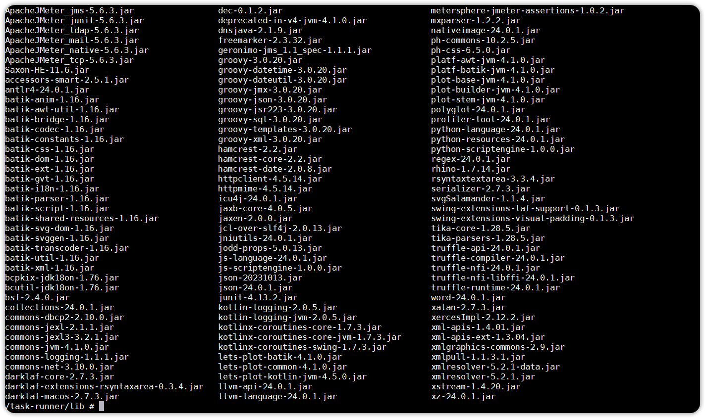
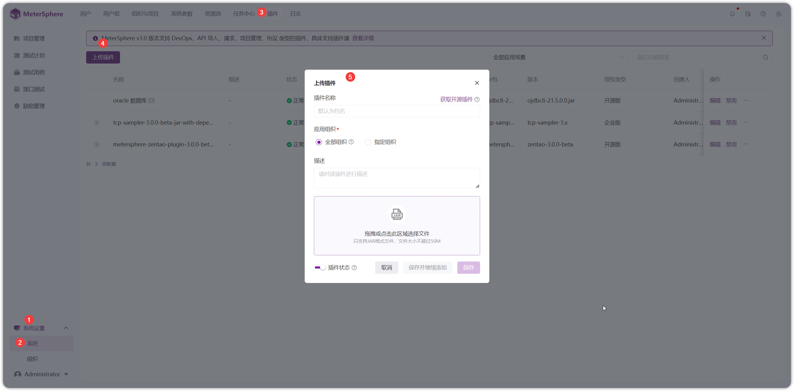

## 1 概述
!!! ms-abstract ""
    v3 插件进行全面升级改造，包括对基础JMeter组件的最低版本兼容性、平台 SDK 的升级以及 UI 渲染的全面改进。

## 2 开发流程
### 2.1 JMeter 插件准备
!!! ms-abstract ""
    要求插件能够兼容 JMeter 5.6.3 及以上版本，并确保插件在安全性和合规性方面达到标准，同时保持性能的稳定性。[插件下载及开发标准](https://jmeter-plugins.org/)

### 2.2 基础环境准备
!!! ms-abstract ""
    - 最低要求 JDK 21 及以上版本。
    - 添加 SDK 依赖到 pom.xml

!!! ms-abstract ""
    在项目的 pom.xml 文件中添加SDK（dependencies）的依赖项。[SDK源码](https://github.com/metersphere/metersphere/tree/v3.x/backend/framework/plugin/plugin-api-sdk)

    ```
    <dependency>
    <groupId>io.metersphere</groupId>
    <artifactId>metersphere-plugin-api-sdk</artifactId>
    <version>3.x</version>
    <scope>provided</scope>
    </dependency>
    
    <!-- 打包时将这些参数写入 MANIFEST.MF供‘pf4j’识别,关键属性设置 -->
    <properties>
        <plugin.id>sampler-name </plugin.id> // 自身组件名称
        <plugin.class>io.metersphere.plugin.xxx</plugin.class> // AbstractApiPlugin 子类名称
    </properties>
    ```

### 2.3 插件代码编写
!!! ms-abstract ""
    继承抽象类 AbstractProtocolPlugin，重写相关方法。
{ width="900px" }

!!! ms-abstract ""
    编写数据转换类，继承基类 AbstractMsProtocolTestElement ，添加注解 “@PluginSubType ” 并添加自身相关属性，添加用于pf4j识别的注解“ @Extension ”。
{ width="900px" }

!!! ms-abstract ""
    编写核心解析器，添加用于pf4j识别的注解“ @Extension ” 继承基础解析器 AbstractJmeterElementConverter，并重写 toHashTree() 方法。
{ width="900px" }

!!! ms-abstract "注意:"
    一定要设置

    - ElementProperty.MS_RESOURCE_ID, // 资源id
    - ElementProperty.MS_STEP_ID, // 步骤唯一标识id
    - ElementProperty.MS_REPORT_ID,  // 报告id
    - ElementProperty.PROJECT_ID // 项目id

!!! ms-abstract ""
    支持通过在线编辑器 [在线编辑器](https://form-create.com/v3/designer) 进行UI界面设计，[具体属性标准1](https://form-create.com/v3/arco-design/)， [具体属性标准2]( https://arco.design/vue/component/form)
{ width="900px" }

!!! ms-abstract "API 脚本 Props"
    在完成页面绘制后，将脚本内容复制到 resources/script 目录下，并创建一个 JSON 文件。在该文件中，按照示例中的脚本格式写入脚本内容。[脚本示例](https://github.com/metersphere/api-test-plugins/blob/main/samplers/tcp-sampler/src/main/resources/script/api-script.json)
{ width="900px" }

<table>
    <tbody>
        <tr>
            <th width="2px">参数名</th>
            <th width="450px">描述</th>
            <th width="10px">类型</th>
            <th width="300px">可选值</th>
        </tr>
        <tr>
            <td>id</td>
            <td>脚本资源唯一标识符，api | environment 分别代表接口各类协议脚本和环境扩展脚本</td>
            <td>字符常量</td>
            <td>api ｜environment</td>
        </tr>
        <tr>
            <td>script</td>
            <td>整体页面脚本，可以参考 <a href="https://form-create.com/v3/designer"> FormCreate生成方式 </a></td>
            <td>对象数组</td>
            <td></td>
        </tr>
        <tr>
            <td>name</td>
            <td>插件协议名称（这个名称会在协议下拉列表出现）</td>
            <td>字符常量</td>
            <td></td>
        </tr>
        <tr>
            <td>apiDebugFields</td>
            <td>接口调试页面需要渲染的属性名称集</td>
            <td>字符数组</td>
            <td></td>
        </tr>
        <tr>
            <td>apiDefinitionFields</td>
            <td>接口定义页面需要渲染的属性名称集</td>
            <td>字符数组</td>
            <td></td>
        </tr>
        <tr>
            <td>options</td>
            <td>定义表单渲染样式<a href="https://arco.design/vue/component/form"> 文档参照 </a></td>
            <td>对象</td>
            <td></td>
        </tr>
        <tr>
            <td>scriptType</td>
            <td>使用什么插件来做动态页面渲染，分别是三方组件FormCreate 和 内建渲染</td>
            <td>字符常量</td>
            <td>FormCreate ｜ Embedded</td>
        </tr>
    </tbody>
</table>

!!! ms-abstract ""
    环境脚本 Props，可参考 [脚本示例](https://github.com/metersphere/api-test-plugins/blob/main/samplers/tcp-sampler/src/main/resources/script/env-script.json)
{ width="900px" }

<table>
    <tbody>
        <tr>
            <th width="2px">参数名</th>
            <th width="450px">描述</th>
            <th width="10px">类型</th>
            <th width="300px">可选值</th>
        </tr>
        <tr>
            <td>id</td>
            <td>脚本资源唯一标识符，api | environment 分别代表接口各类协议脚本和环境扩展脚本</td>
            <td>字符常量</td>
            <td>environment | environment</td>
        </tr>
        <tr>
            <td>name</td>
            <td>插件脚本名称</td>
            <td>字符常量</td>
            <td></td>
        </tr>
        <tr>
            <td>scriptType</td>
            <td>使用什么插件来做动态页面渲染，分别是三方组件FormCreate 和 内建渲染</td>
            <td>字符常量</td>
            <td>FormCreate ｜ Embedded</td>
        </tr>
        <tr>
            <td>options</td>
            <td>定义表单渲染样式<a href="https://arco.design/vue/component/form"> 文档参照 </a></td>
            <td>对象</td>
            <td></td>
        </tr>
        <tr>
            <td>fields</td>
            <td>环境页面需要渲染的属性名称集</td>
            <td>字符数组</td>
            <td></td>
        </tr>
        <tr>
            <td>tabName</td>
            <td>环境页面Tab反显的名称</td>
            <td>字符</td>
            <td></td>
        </tr>
        <tr>
            <td>script</td>
            <td>整体页面脚本<a href="https://form-create.com/v3/designer"> FormCreate的生成方式 </a></td>
            <td>对象数组</td>
            <td></td>
        </tr>
    </tbody>
</table>

### 2.4 打包
!!! ms-abstract "注意"
    SDK JAR 文件已经作为主应用的依赖项存在，因此在打包过程中无需再将其包含在当前包中，以避免导致 JAR 文件过大。

!!! ms-abstract ""
    以下提到的内置 JAR 包同样适用相同的逻辑。如果已经在当前项目中使用，那在打包阶段无需再次将其包含在当前项目中。这样可以避免导致项目打包文件过大。
{ width="900px" }

!!! ms-abstract ""
    上传插件到平台使用。
{ width="900px" }