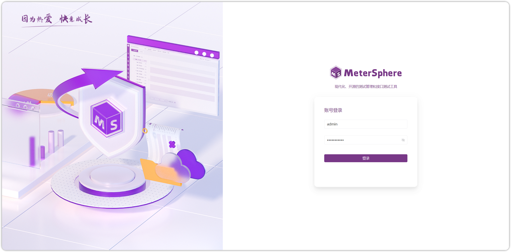

## 1 项目结构
!!! ms-abstract ""
    ```
    .
    ├── Jenkinsfile                                     # 构建镜像使用的 jenkinsfile
    ├── Dockerfile                                      # 构建镜像使用的 Dockerfile
    ├── LICENSE
    ├── OWNERS
    ├── README.md                                       # 项目中文介绍
    ├── README-EN.md                                    # 项目英文介绍
    ├── SECURITY.md                                     # 安全说明
    ├── CODE_OF_CONDUCT.md                              # 
    ├── CONTRIBUTING.md 
    ├── build.md                                        # 构建过程
    ├── backend                                         # 后端项目主目录
    │   ├── app                                   
    │   ├── framework
    │   ├── app
    │   ├── pom.xml                               # 后端 maven 项目使用的 pom 文件
    │   └── .gitignore                                  
    ├── frontend                                        # 前端项目主目录
    │   ├── .husky
    │   ├── config                                # 项目构建配置
    │   ├── public
    │   ├── src                                   # 前端代码目录
    │   ├── types
    │   ├── .env.development                      # 开发环境变量声明
    │   ├── .env.production                       # 生产环境变量声明
    │   ├── .eslintignore
    │   ├── .eslintrc.js
    │   ├── .eslintrc-auto-import.json
    │   ├── .gitignore
    │   ├── .prettierignore
    │   ├── .prettierrc.js
    │   ├── .stylelintrc.js
    │   ├── babel.config.js
    │   ├── commitlint.config.js                   # commitlint 配置，校验 commit 信息
    │   ├── components.d.ts                        # 组件注册 TS 声明
    │   ├── Dockerfile                             # 构建前端应用使用的 Dockerfile
    │   ├── index.html                             # 单页面html模板
    │   ├── nginx.conf                             # Nginx 配置文件
    │   ├── package.json                           # 前端项目中的元数据文件
    │   ├── pom.xml                                # 前端 maven 项目使用的 pom 文件
    │   ├── postcss.config.js
    │   ├── README.md
    │   ├── tailwind.config.js
    │   ├── tsconfig.json
    │   ├── vitest.config.ts
    │   ├── .editorconfig
    │   ├── .gitignore
    │   ├── babel.config.js                        # babel配置，支持JSX
    │   ├── package.json
    │   ├── vue.config.js                               
    │   └── 代码规范.MD                                   
    ├── .gitignore
    ├── mvnw
    ├── mvnw.cmd
    └── pom.xml                                           # 整体 maven 项目使用的 pom 文件
    ```

## 2 配置开发环境
### 2.1 拉取代码
!!! ms-abstract ""
    需要拉取 [metersphere](https://github.com/metersphere/metersphere) 服务代码，并切换到 v3.x 分支。 <br>

### 2.2 启动
!!! ms-abstract ""
    在启动 MeterSphere 服务之前要先启动 MySql、Redis、Kafka、Minio 等服务。<br>
    MeterSphere 后端使用了 Java 语言的 Spring Boot 框架，并使用 Maven 作为项目管理工具。<br>
    开发者需要先在开发环境中安装：
        
        JDK 21 
        Maven 3.8.6 +

    - **数据库初始化**<br>
    MeterSphere 使用 MySQL 数据库 v8 版本。同时 MeterSphere 对数据库部分配置项有要求，请参考下附的数据库配置，修改开发环境中的数据库配置文件。<br>
    
    ```
    [mysqld]
    datadir=/var/lib/mysql
    
    default-storage-engine=INNODB
    character_set_server=utf8mb4
    lower_case_table_names=1
    performance_schema=off
    table_open_cache=128
    transaction_isolation=READ-COMMITTED
    max_connections=1000
    max_connect_errors=6000
    max_allowed_packet=64M
    innodb_file_per_table=1
    innodb_buffer_pool_size=512M
    innodb_flush_method=O_DIRECT
    innodb_lock_wait_timeout=1800
    
    server-id=1
    log-bin=mysql-bin
    expire_logs_days = 2
    binlog_format=mixed
    
    character-set-client-handshake = FALSE
    character-set-server=utf8mb4
    collation-server=utf8mb4_general_ci
    init_connect='SET default_collation_for_utf8mb4=utf8mb4_general_ci'
    
    sql_mode=STRICT_TRANS_TABLES,NO_ZERO_IN_DATE,NO_ZERO_DATE,ERROR_FOR_DIVISION_BY_ZERO,NO_ENGINE_SUBSTITUTION
    
    skip-name-resolve
    
    [mysql]
    default-character-set=utf8mb4
    
    [mysql.server]
    default-character-set=utf8mb4
    ```
    
    请参考文档中的建库语句创建 MeterSphere 使用的数据库，MeterSphere 服务启动时会自动在配置的库中创建所需的表结构及初始化数据。
    ```mysql
    CREATE DATABASE metersphere_dev /*!40100 DEFAULT CHARACTER SET utf8mb4 COLLATE utf8mb4_general_ci *//*!80016 DEFAULT ENCRYPTION='N'*/;
    ```

!!! ms-abstract ""

    - **MeterSphere 配置文件**<br>
    MeterSphere 会默认加载该路径下的配置文件 /opt/metersphere/conf/metersphere.properties，请参考下列配置创建对应目录及配置文件。

    ```
    # 数据库配置
    spring.datasource.url=jdbc:mysql://172.16.200.18:3307/metersphere?autoReconnect=false&useUnicode=true&characterEncoding=UTF-8&characterSetResults=UTF-8&zeroDateTimeBehavior=convertToNull&useSSL=false
    spring.datasource.password=Password123@mysql
    spring.datasource.username=root

    # kafka 配置，result-hub 服务需要使用 kafka 进行测试结果的收集和处理
    kafka.bootstrap-servers=172.16.10.155:9092
    
    # minio 配置
    minio.endpoint=http://172.16.200.18:9000
    minio.access-key=admin
    minio.secret-key=Password123@minio
    ```

!!! ms-abstract ""

    - **Redis 配置文件**<br>
    MeterSphere 会默认加载该路径下的配置文件 /opt/metersphere/conf/redisson.yml，请参考下列配置创建对应目录及配置文件。

    ```
    # Redis 配置
    singleServerConfig:
      password: Password123@redis
      address: "redis://localhost:6379"
      database: 1 
    ```

!!! ms-abstract ""

    - **项目打包**<br>
    在项目根目录下执行以下命令

    ```
    1 依赖打包 
    # 此命令会将parent pom 安装到本地仓库，其他外部子工程可以获得最新的 <properties></properties>
    ./mvnw install -N

    # 此命令会将 domain sdk ，其他外部子工程可以获得最新的 jar
    ./mvnw clean install -DskipTests -DskipAntRunForJenkins --file backend/pom.xml
    
    2 整体打包
    ./mvnw clean package
    ```
{ width="900px" } 

!!! ms-abstract ""
    
    - **启动服务**<br>

{ width="900px" }

{ width="900px" } 


