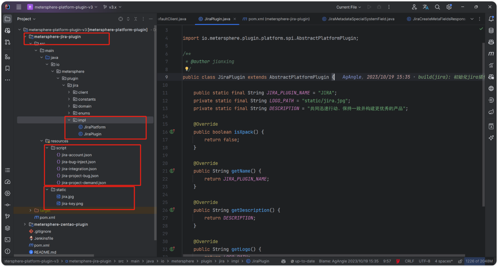
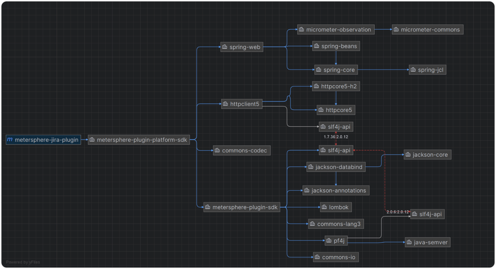

## 1 项目结构
!!! ms-abstract ""
    父工程 metersphere-platform-plugin 下, 创建插件子工程, 主要包括基本的实现类 impl 目录, 前端配置文件 script 目录, 静态文件 static 目录, POM 文件。

{ width="900px" }

!!! ms-abstract "POM文件"

    ```
    <?xml version="1.0" encoding="UTF-8"?>
    <project xmlns="http://maven.apache.org/POM/4.0.0"
    xmlns:xsi="http://www.w3.org/2001/XMLSchema-instance"
    xsi:schemaLocation="http://maven.apache.org/POM/4.0.0 http://maven.apache.org/xsd/maven-4.0.0.xsd">
    <modelVersion>4.0.0</modelVersion>
    
        <parent>
            <groupId>io.metersphere</groupId>
            <artifactId>metersphere-platform-plugin</artifactId>
            <version>3.x</version>
        </parent>
    
        <artifactId>metersphere-jira-plugin</artifactId>
    
        <properties>
            <!-- 打包时将这些参数写入 MANIFEST.MF， 供 pf4j 识别 -->
            <plugin.id>jira</plugin.id>   <!-- 插件ID -->
            <plugin.class>io.metersphere.plugin.jira.impl.JiraPlugin</plugin.class>     <!-- 插件基础信息实现类 -->
            <plugin.provider>fit2cloud</plugin.provider>     <!-- 插件提供者 -->
            <plugin.dependencies/>
        </properties>
    </project>
    ```

!!! ms-abstract "依赖关系"

    - metersphere-plugin-platform-sdk：定义了 MS 对接第三方项目平台的一些公共domain, 枚举, 以及开发中需要实现对应的接口。
    - metersphere-plugin-sdk：封装 MS 插件的抽象接口规范, 及公共的工具类, 包含插件的日志类实现, 实现插件的热更新，同时支持将插件的静态资源上传到不同存储的机制，MS 平台插件将会上传到对象存储。
    - spring-web：restTemplate 来作为第三方REST接口的调用模板工具类。
    - httpclient：作为 restTemplate 底层的 HTTP 框架。
    - commons-codec：编解码工具类, 例如: base64作为一些HTTP请求头参数的编码。

!!! ms-abstract "注意"
    插件子工程项目直接依赖该项目父工程 `metersphere-platform-plugin` 即可，具体参考上面的POM文件，父工程有打包依赖上述所有的依赖。

{ width="900px" }    

## 2 前端配置文件

!!! ms-abstract ""

    - account.json：个人信息相关的配置文件。
    - bug-inject.json：缺陷内置的平台字段相关配置文件（目前用来内置并替换MS的一些特殊字段，例如：处理人）。
    - integration.json：服务集成的配置文件。
    - project-bug.json：项目同步缺陷相关的配置文件。
    - project-demand.json：项目需求关联相关的配置文件。

!!! ms-abstract "说明"
    具体配置参考 Form-create 官网，或者其他子工程静态资源 script 目录；可以配置文件不同名，但注意每个脚本文件内容中的脚本 ID 需与 AbstractPlatformPlugin 
    里面的方法返回的 getXXXScriptId 一致，当然也可以重写 getXXXScriptId 方法。

### 2.1 平台插件基础信息抽象类 AbstractPlatformPlugin（需实现）
!!! ms-abstract ""
    
    ```
        @Override
    public String getName() {
        return PLUGIN_NAME;
    }

    @Override
    public String getDescription() {
        return DESCRIPTION;
    }

    @Override
    public String getLogo() {
        return LOGO_PATH;
    }
    ```

### 2.2 平台接口抽象类AbstractPlatform（需实现）

    ```
        /**
     * 校验服务集成配置
     * 服务集成点击校验时调用
     */
    void validateIntegrationConfig();

    /**
     * 校验用户配置
     * 个人中心-第三方平台点击时调用
     * @param userConfig 用户配置
     */
    void validateUserConfig(String userConfig);

    /**
     * 校验项目配置
     * 项目设置成点击校验项目 key 时调用
     * @param projectConfig 项目配置
     */
    void validateProjectConfig(String projectConfig);

    /**
     * 平台是否支持第三方默认模板
     *
     * @return True时会在MS平台展示第三方的默认模板
     */
    boolean isSupportDefaultTemplate();

    /**
     * 获取第三方平台模板的自定义字段(isSupportDefaultTemplate为true时才会调用)
     *
     * @param projectConfig  项目配置信息
     * @return 平台自定义字段集合
     */
    List<PlatformCustomFieldItemDTO> getDefaultTemplateCustomField(String projectConfig);

    /**
     * 获取第三方联级下拉options
     * @param optionsRequest 插件请求参数
     * @return 选项集合
     */
    List<SelectOption> getPluginOptions(PluginOptionsRequest optionsRequest);

    /**
     * 获取第三方平台表单下拉选项
     * @param optionsRequest 选项请求参数
     * @return 选项集合
     */
    List<SelectOption> getFormOptions(GetOptionRequest optionsRequest);

    /**
     * 获取第三方平台缺陷状态选项
     * @param projectConfig 项目配置信息
     * @param issueKey 缺陷ID
     * @return 缺陷平台状态
     * @throws Exception 获取平台状态异常
     */
    List<SelectOption> getStatusTransitions(String projectConfig, String issueKey) throws Exception;

    /**
     * 获取第三方平台关联需求列表
     * @param request 需求分页查询参数
     * @return 需求分页数据
     */
    PluginPager<PlatformDemandDTO> pageDemand(DemandPageRequest request);

    /**
     * 根据关联的需求ID查询平台需求信息
     * @param request 需求关联查询参数
     * @return 平台需求信息
     */
    PlatformDemandDTO getDemands(DemandRelateQueryRequest request);

    /**
     * 新增平台缺陷
     *
     * @param request 平台缺陷参数
     * @return 平台缺陷
     */
    PlatformBugUpdateDTO addBug(PlatformBugUpdateRequest request);

    /**
     * 修改平台缺陷
     *
     * @param request 平台缺陷参数
     * @return 平台缺陷
     */
    PlatformBugUpdateDTO updateBug(PlatformBugUpdateRequest request);

    /**
     * 删除平台缺陷
     *
     * @param platformBugId 平台缺陷ID
     */
    void deleteBug(String platformBugId);

    /**
     * 平台是否支持附件API
     *
     * @return 是否支持附件同步
     */
    boolean isSupportAttachment();

    /**
     * 同步MS附件至第三方平台(isSupportAttachment为true时执行同步附件的逻辑)
     *
     * @param request 同步附件参数
     */
    void syncAttachmentToPlatform(SyncAttachmentToPlatformRequest request);

    /**
     * 同步存量缺陷
     *
     * @param request 同步缺陷参数
     * @return 同步缺陷结果
     */
    SyncBugResult syncBugs(SyncBugRequest request);

    /**
     * 同步全量缺陷
     *
     * @param request 同步缺陷参数
     */
    void syncAllBugs(SyncAllBugRequest request);

    /**
     * 获取附件输入流，并做相应处理
     * 同步缺陷中，同步附件时会调用
     * @param fileKey 文件关键字
     * @param inputStreamHandler 获取响应的输入流后，做对应处理
     */
    void getAttachmentContent(String fileKey, Consumer<InputStream> inputStreamHandler);
    ```