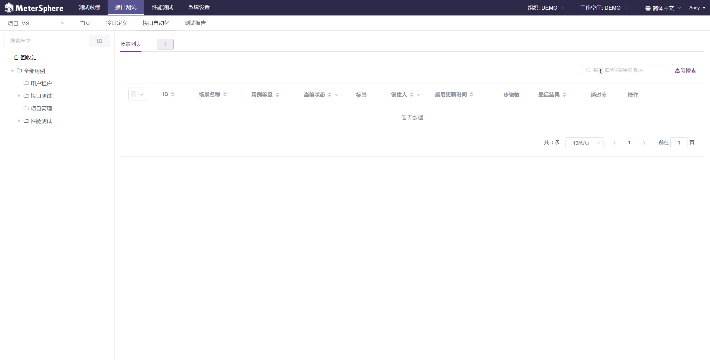
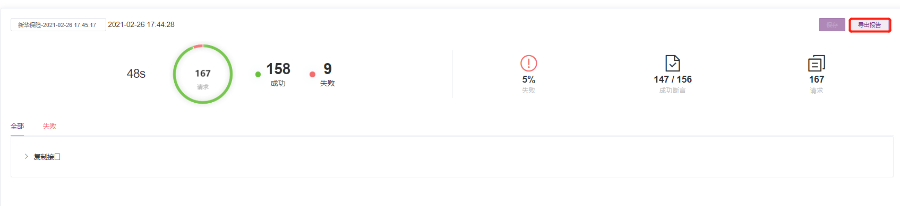

## v1.6.0 之前创建的接口测试，如何转换为新版接口测试？

在 v1.7.0 版本，MeterSphere 提供了数据转换功能。首先点击右上角下拉 `切回旧版` 进入旧版接口测试页面。

在接口测试列表中，选择要转换的接口测试，点击列表上方的 `转场景测试`，即可将其装换成新版本接口自动化中的场景用例。

## 在接口自动化测试，一个场景里面，个别接口需要使用不同的环境去运行，该怎么实现？

可以使用自定义请求

## 传参使用随机数，有内置的方法吗？

在接口自动化，场景里面运行，可以选择JMeter的内置函数，或者Mock.js的函数

## 响应结果出现中文乱码

设置在JMeter.properties中，sampleresult.default.encoding=UTF-8

## 接口自动化多场景，是否支持批量运行？

在场景列表选中场景，点击...弹出下拉框，选择“批量运行”

## 接口测试导入到场景，之前设置的变量是否一起带过来了?

目前在前端没有显示，但在执行的时候会引用

## 接口自动化如何生成报告？

首先把接口或场景保存，执行后在结果页面右上角点击“导出报告”

