## 在接口自动化的一个场景里面，个别接口需要使用不同的环境去运行，该怎么实现？

可以通过添加自定义请求的方式实现。

## 传参使用随机数，有内置的方法吗？

参数值可以使用 JMeter 的内置函数或者 Mock.js 的函数生成随机值。

## 接口自动化多场景，是否支持批量运行？

在场景列表选中场景，点击 `···` 弹出下拉框，选择 `批量运行`。

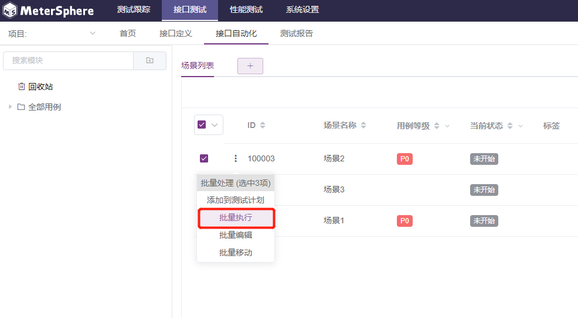

## 接口自动化如何生成报告？

手动执行的接口自动化场景不会自动生成测试报告，用户需要点击该场景的最后执行结果手动保存测试报告。请参考[执行指定场景](/user_manual/api_test/api_automation/#_12)

## 接口自动化支持上传文件的接口吗？

支持。根据接口要求的请求体类型，选择 `form-data`、`x-www-form-urlencoded` 格式的请求体，参数类型选择 file，选择要添加的文件。也可以使用 `binary` 格式的请求体，直接选择要添加的文件。

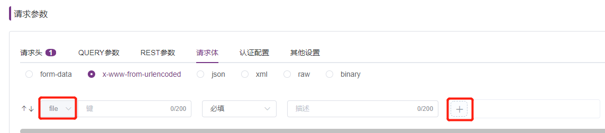

## 接口自动化中模块之间是否支持共享cookie?

不支持模块之间共享cookie，支持在同一模块下多个场景间共享，在不同场景之间开启共享cookie。

## 接口测试中，断言期望结果不为空，该如何判断？

可以在期望值中使用匹配任意非空字符的正则表达式 `\S+` 进行判断。

##  SQL协议如何断言？比如SQL请求返回2列数据，该如何取到这些值进行断言？

SQL请求可通过如下方法进行断言：

1. 配置“存储结果”和“按列存储”，存储数据； 
2. 配置SQL脚本，取出需要断言的参数； 
3. 添加脚本断言，判断存储 SQL 结果数据的变量的变量值；

## 全局变量和场景变量里，设置为同一变量，优先级如何判断？

设置同一变量时，后配置的优先。

## 场景中导入接口，参数需要重写才能跑通，引用的接口无法修改参数吗？

接口导入场景有两种方式，第一种方式是复制，复制的接口可以在场景中修改参数；第二种方式是引用，引用的接口只能在接口定义那里进行修改，修改完成后会自动同步到场景里。

## 场景中添加了条件控制器，且匹配失败了，为什么后续的接口还会执行？

后续的接口需要拖入到条件控制器中。

## 接口测试中，有没有可以获取当前的时间来做为变量？

可以使用 ${__time()} 内置函数。

## 调试接口时，只有执行完成后才能看到结果，能否在调试过程中实时查看日志？

将会在后续版本增加接口测试日志的实时输出。

## 如何创建SQL协议的接口测试？

具体操作请参考：https://brucelong.blog.csdn.net/article/details/110133647 。

## 接口自动化测试，一个项目下的不同接口场景，是否可以引用同一个脚本？

还不支持，可以在“系统设置” - “项目管理”，给指定的项目上传jar包，然后在此项目下的不同场景就可以引用。

## 场景变量的类型为随机数，但执行过程中为什么没有实际生成？

请检查配置的随机数长度，随机数长度需要在MeterSphere限定范围内。

## 如何引用csv？

在场景编辑页面，点击场景变量添加csv类型的场景变量。
具体操作可参考 https://metersphere.io/docs/user_manual/api_test/api_automation/#_6 。

## 接口自动化里，同一场景下是否支持配置多个接口域名？

在环境配置里面，可以分别按接口所属模块，或者接口路径这两种方式，来配置不同接口的不同域名。

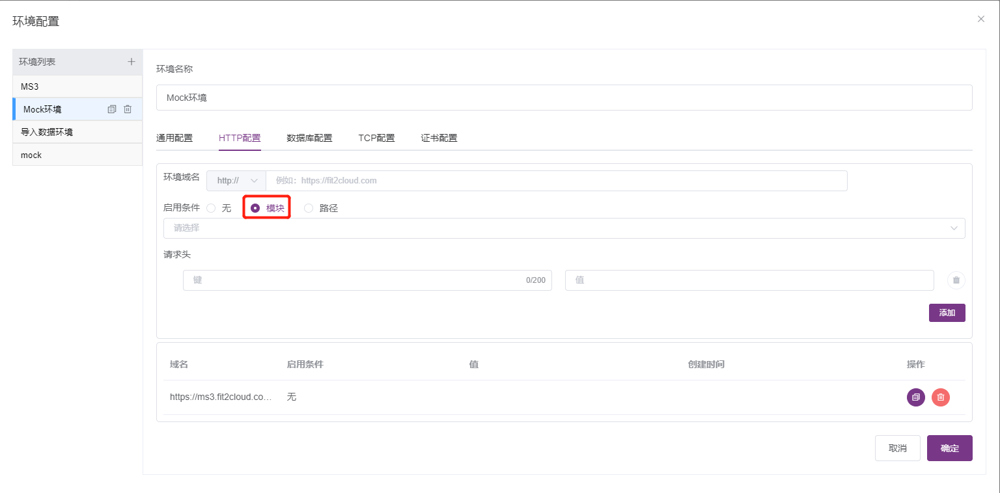

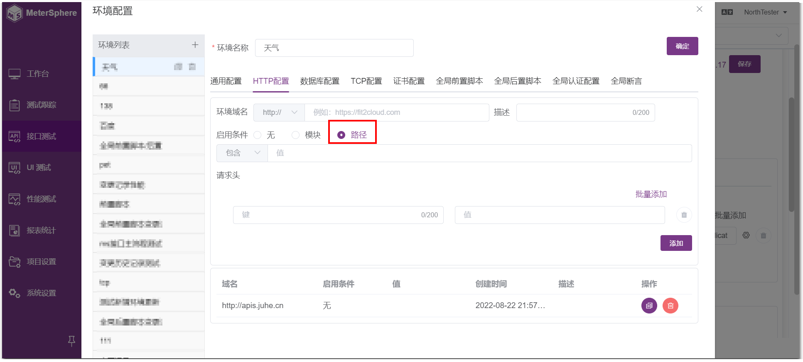

##  请求里面涉及到了转发重定向，如何获取接口返回的code？

在接口的 `请求参数` 区域的 `其他设置` 页面中，取消勾选 `跟随重定向` 选项。

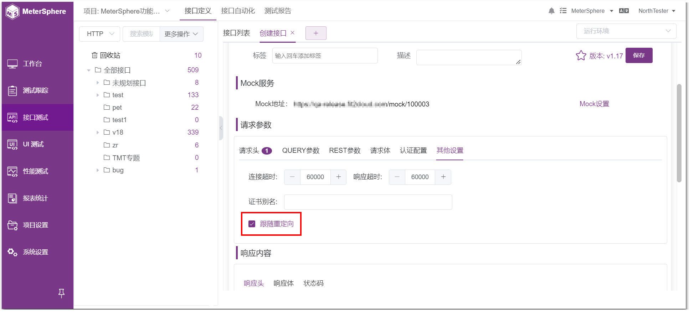

## 接口自动化批量执行，是并行还是串行？

MeterSphere的批量执行操作，同时支持串行和并行两种方式，可以在选择运行场景后，在 `运行配置` 弹窗进行选择。

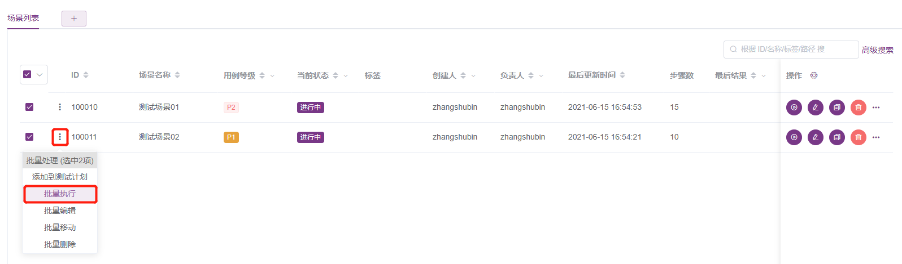

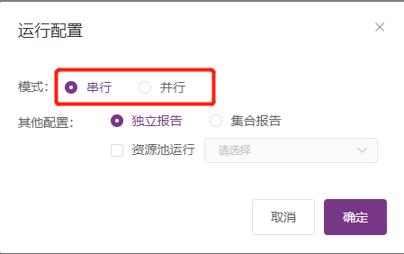

##　批量执行接口自动化，是否可以按场景单独显示测试报告？

可以在 `运行配置` 弹窗的其他配置选项中选择生成独立报告或者集合报告。

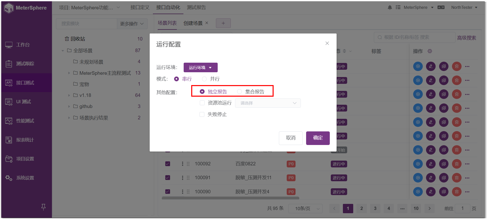

## 接口定义模块，编辑接口的页面，如何保存？

在编辑接口页面“基础信息”区域，点击测试按钮后面的向下按钮，点击“更新接口”选项即可。

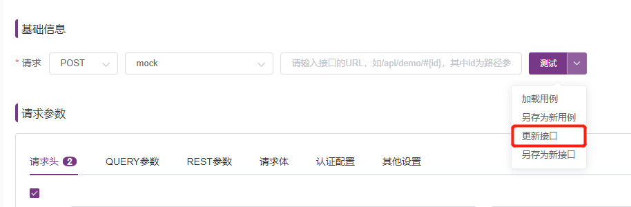

## 执行接口报错“Non HTTP response code: java.net.SocketTimeoutException”

修改其他设置里接口的连接超时时间。

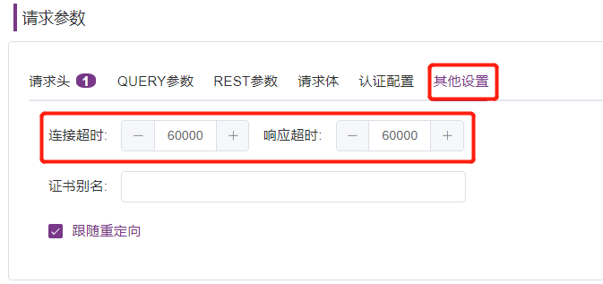

## 接口自动化选择多场景同时运行时，可以把执行结果整合成一个测试报告吗？

可以在接口自动化列表，勾选多场景批量执行，选择“集合报告”。

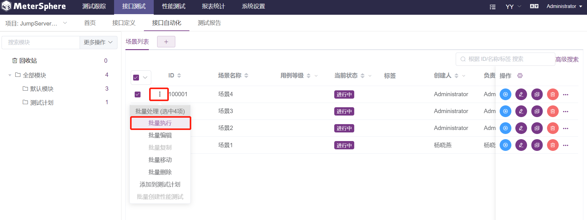

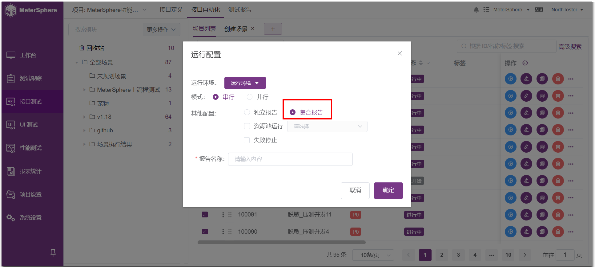

## 接口定义里的单接口，可以批量执行吗？

目前可以通过接口定义模块的CASE列表来批量执行用例。

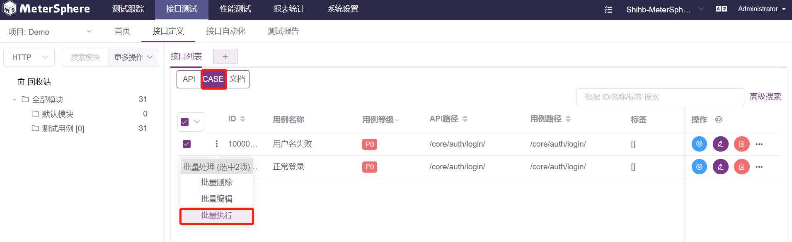

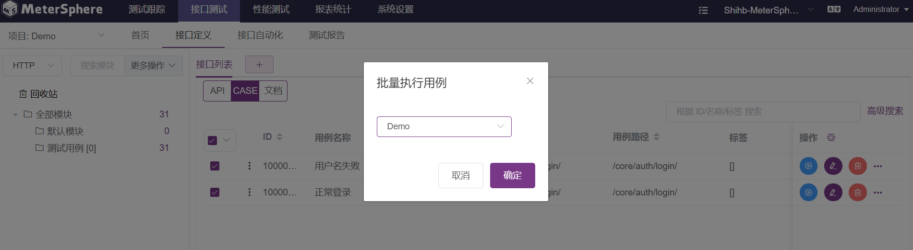

## 接口测试模块里，目前除了现有的HTTP、TCP、SQL、DUBBO，还支持其他协议吗？

1.13版本已经通过插件的方式实现了对MQTT协议的支持，可以到github上下载该插件，然后在MeterSphere系统设置-系统-插件管理中上传。

## MeterSphere可以直接连接开发工具传输API吗？

MeterSphere在1.15版本实现了与IDEA对接。通过在IDEA安装组件，完成API信息传送。可以到GitHub下载此组件。

## 接口自动化场景里可以跨项目引用接口/用例吗？
支持跨项目引用接口、用例、场景。
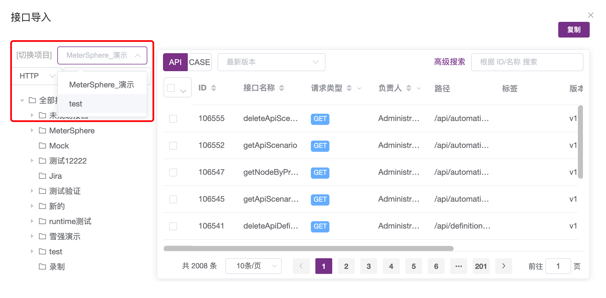

## 快捷调试的时候，一直转圈等待是什么原因
安装ms的服务器到请求的地址网络不通,在ms上telnet 被测服务端口检查

## 进行接口case调试时，调用不同控制台信息显示连接某地址超时；
这种情况大概率是网络不通造成的，可以使用curl命令在ms-node-controller容器和服务器上进行测试；

## 在接口调试时使用新的域名，在Linux的host文件中添加了域名解析，但依然调试不通
因为node-controller容器中无法解析出域名，因此需要进入到node-controller容器中host文件中进行配置，重启该容器；

## 如何循环取出列表变量的每一个值
结合循环控制器和计数器取值

## 接口响应内容为 Unicode 字符
在后置脚本中选择BeanShell，然后写入prev.setDataEncoding("UTF-8");

## 控制台输出乱码
log.info(u"看看乱码了吗");

## 接口测试是否可以导出到jmeter
可以勾选对应的场景或接口，导出为JMX格式，然后再用jmeter打开JMX文件

## 场景中如何使用csv文件参数；
在场景变量中添加CSV文件；在请求中通过${CSV的文件列名}引用

## MeterSphere怎么使用CSV文件
1.接口自动化中可以将CSV文件作为场景变量使用，配合循环控制器使用；
2.可以在性能测试中作为参数被引用；

## 前置/后置脚本可以引用外部jar吗？
可以在项目设置-文件管理中上传jar包，并在前置/后置脚本中使用import即可

## 后置脚本中如何引用.js文件
上传到服务器/opt/ms/data/xx.js，load(“/opt/ms/data/xx.js”)，脚本类型选择nashornScript

## HTTP 协议接口支持哪些文件格式导入
支持五种：MeterSphere格式、Postman格式、Swagger格式、HAR格式、JMeter格式

- MeterSphere 格式：通过 MeterSphere 接口测试页面或者浏览器插件导出的 json 格式文件  
- Postman 格式：支持 Postman Collection v2.1 格式的 json 文件，通过 Postman 导出测试集合  
- Swagger 格式：支持 Swagger 2.0 与 3.0 版本的 json 文件，通过 Swagger 页面导出或者URL直接导入  
- HAR 格式：通过浏览器的开发者工具导出 HAR 格式文件  
- JMeter 格式：支持 JMeter5.2-5.4 版本的 JMX 文件，通过 JMeter 生成 JMX 文件  

## TCP 协议接口支持哪些文件格式导入
支持三种： MeterSphere格式、JMeter格式、ESB格式

- MeterSphere 格式：通过 MeterSphere 接口测试页面或者浏览器插件导出的 json 格式文件  
- Jmeter 格式：支持 JMeter5.2-5.4版本的 JMX 文件，通过 JMeter 生成 JMX 文件  
- ESB 格式：支持 ESB 模版的 xlsx 文件（支持模版下载/上传） 

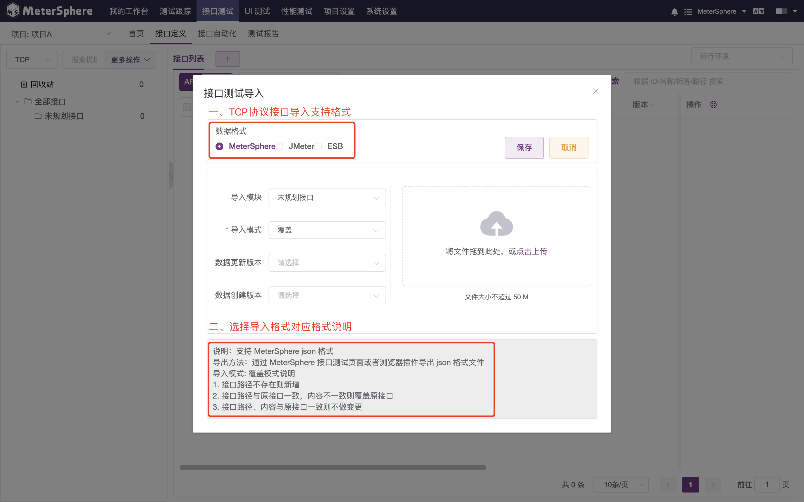

## SQL 协议接口支持哪些文件格式导入
支持两种：MeterSphere格式、JMeter格式

- MeterSphere 格式：通过 MeterSphere 接口测试页面或者浏览器插件导出的 json 格式文件  
- JMeter 格式：支持 JMeter5.2-5.4 版本的 JMX 文件，通过 JMeter 生成 JMX 文件  

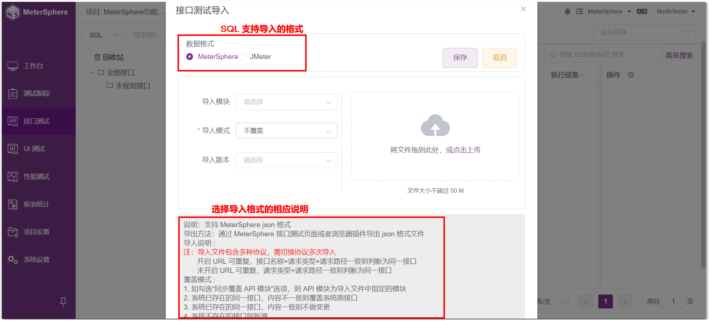

## DUBBO 协议接口支持哪些文件格式导入
支持两种：MeterSphere格式、JMeter格式

- MeterSphere 格式：通过 MeterSphere 接口测试页面或者浏览器插件导出的 json 格式文件  
- JMeter 格式：支持 JMeter5.2-5.4 版本的 JMX 文件，通过 JMeter 生成 JMX 文件  

## 如何判断是否为同一接口

- TCP、SQL、DUBBO 请求，同项目同模块同版本下，接口名称相同就是同一接口
- 针对HTTP请求，同项目同模块同版本下，分为接口定义未开启 url 可重复和已开启 url 可重复两种情况

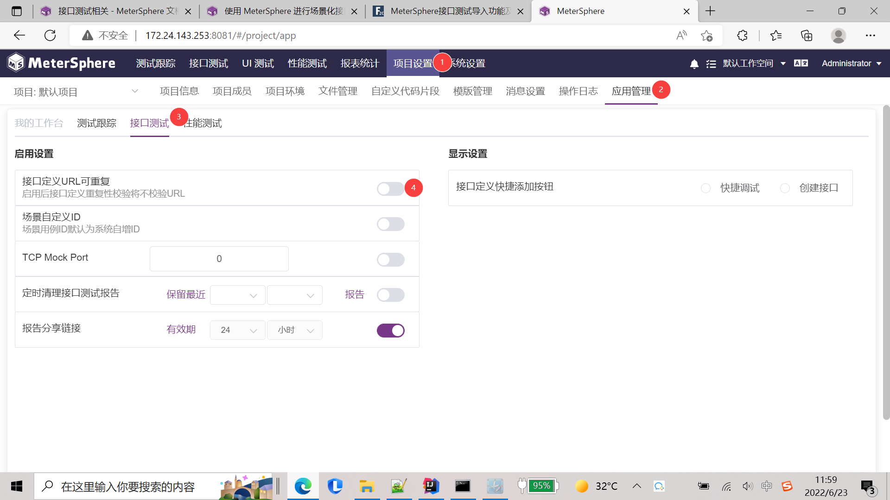

■ 未开启 URL 重复：请求类型+路径相同则为同一接口，如：

■ 开启 URL 重复：接口名称+请求类型+路径相同则为同一接口，如：

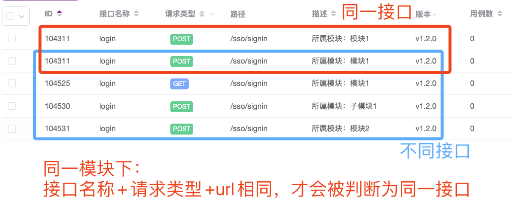

## 导入模块&导入模式逻辑
■ 注意：v2.0导入模式会增加选项：同步覆盖API模块（即上图中的开启模块覆盖），用户可自己选择是否将数据导入到指定的最新模块下。

## 接口依赖是有什么用，是在这个接口执行前后执行的接口吗？
可以生成依赖图，社区版看不到，只有企业版才能看到

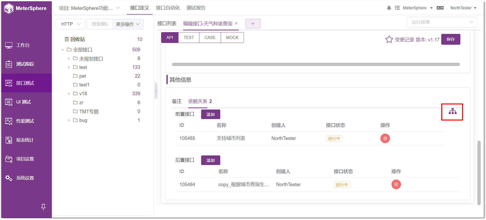

## 配置了定时任务,为什么不在钉钉群发消息呢？
1.确认消息通知是否正确填写
2.开了定时任务，是不是手动执行的，如果手动执行的话不会发送消息，到了时间，任务配置里面配置会生效

## 选择环境名称后，请求内容里只有http:/接口，没有使用到在环境配置的ip和端口
在环境配置处，不选择“模块”或者“路径”，选择“无”即可

## 接口测试断言成功，但是用例显示未通过
因为响应码不是200，只需要勾选"忽略状态"就行
