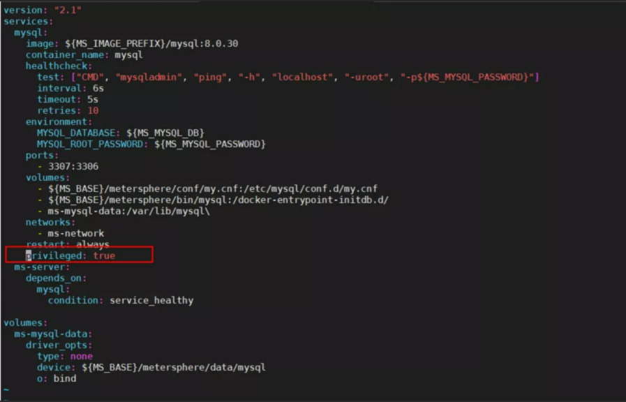

## 1 如何设置 MeterSphere 开机自启动？
!!! ms-abstract "" 
    MeterSphere 在安装脚本中没有配置 docker 服务及以及 MeterSphere 服务自启动，可参考[MeterSphere之设置服务开机自启动](https://kb.fit2cloud.com/?p=bbe432ee-6b1c-4d9f-aa6f-16f4547840ee) 进行配置。

## 2 如何修改应用的默认端口？
!!! ms-abstract ""
    MeterSphere 默认的 HTTP 服务监听端口为8081，安装之前可以在配置文件 install.conf 中修改 MS_SERVER_PORT 字段，然后再进行安装。<br>
    安装完成后如果需要修改默认的应用端口，则需要修改 /opt/metersphere/.env 文件中的 MS_SERVER_PORT 字段，然后执行 `msctl reload` 命令重新加载应用。<br>

## 3 如何在 Kubernetes 中搭建 MeterSphere？
!!! ms-abstract ""
    MeterSphere Kubernetes 部署操作见 [MeterSphere Kubernetes 部署](https://metersphere.io/docs/v2.x/installation/kubernetes_installation/)

## 4 docker-compose 版本与配置文件不兼容或配置文件存在问题，请重新安装最新版本的 docker-compose 或检查配置文件?
!!! ms-abstract ""
    如果服务器已经安装了docker, MeterSphere 安装脚本检测到 docker 已安装，就跳过了自动原本的安装步骤，而已安装的版本与 MeterSphere要求的版本不匹配就会导致这个导致。需要手动把安装包里的 docker 目录下的所有文件拷贝到系统目录即可：

    ```
    cp docker/bin/* /usr/bin/
    cp docker/service/docker.service /etc/systemd/system/
    chmod +x /usr/bin/docker*
    chmod 754 /etc/systemd/system/docker.service
    ```

## 5 如何升级到指定版本？
!!! ms-abstract ""
    msctl upgrade 后边跟版本号，例如：`msctl upgrade v1.10.6-lts` 。

## 6 如何卸载？
!!! ms-abstract ""
    执行命令：`msctl uninstall -v`

## 7 卸载会导致数据清空么？
!!! ms-abstract ""
    MerterSphere 应用数据进行了本地的持久化存储，所以 `msctl uninstall` 卸载不会影响数据。

## 9 升级过程中报错：`/usr/local/bin/msctl: line 115 ....`
!!! ms-abstract ""
    主要原因是 msctl 的 shell 兼容性导致，cat /usr/local/bin/msctl 查看这个文件对应行数的代码，并进行相关兼容性处理。

## 10 升级报错：`Schema  metersphere contains a faied migration to version 86 !`
!!! ms-abstract ""
    sql 初始化失败导致，需要连接 metersphere 数据库手动执行sql。

    * 到 github 源码上 https://github.com/metersphere/metersphere/tree/v2.3.1/system-setting/backend/src/main/resources/db/migration 下载对应文件名带 86 的 flyway sql
    *  使用navicat 数据库连接工具，默认账号 root/Password123@mysql 选择数据库名为 metersphere手动一条条执行下sql
    * 全部执行成功后修改 metersphere_version 表对应版本的 success 值为1，然后 msctl reload 重启服务即可

## 11 如何备份数据库?
!!! ms-abstract ""
    具体操作详细见 [MeterSphere 数据备份](https://kb.fit2cloud.com/?p=98)。

## 12 mysqldump 导出数据库时报错: `Error 2020: Got packet bigger than 'max_allowed_packet' bytes when dumping table `api_scenario_report_detail` at row: 94`
!!! ms-abstract ""
    mysqldump 执行时添加 max_allowed_packet 参数：<br>
    ```
    docker exec -i mysql mysqldump -uroot -pPassword123@mysql metersphere --max_allowed_packet=2G > metersphere.sql
    ```

## 13 性能测试时并发量加大的时候报错：`Non HTTP response code: java.net.SocketTimeoutException`
!!! ms-abstract ""
    多是因为服务端有较多请求正在处理（且处理时间较长），导致 MeterSphere 在有效时间内无法连接上服务器而出现，可通过修改单个接口的连接超时时间解决。


## 14 MySQL 数据库设置了忽略大小但未生效，lower_case_table_names=1
!!! ms-abstract ""
     可能是因为 my.cnf 文件权限不对导致，修改权限后重启数据库。
    ```
    # chmod 655 /opt/metersphere/conf/my.cnf 
    # docker restart mysql
    ```

## 15 如何删除kafka中的临时数据，减低磁盘使用率？
!!! ms-abstract ""
     v1.20.x-lts，需要同时删除 Kafka 和 Zookeeper 的临时文件

    ```
    msctl uninstall
    rm -rf /opt/metersphere/data/kafka/kafka   
    rm -rf  /opt/metersphere/data/zookeeper/zookeeper
    msctl reload   #重新创建目录和基础文件  
    ```

    v2.x 微服务架构， Kafka 使用版本升级，只需删除 Kafka 的临时文件

    ```
    msctl uninstall
    rm -rf /opt/metersphere/data/kafka/kafka   
    msctl reload   #重新创建目录和基础文件 
    ``` 

## 16 执行机经常报内存溢出：`Terminating due to java.lang.OutOfMemoryError: GC overhead limit exceeded`
!!! ms-abstract ""
    增大堆内存:
    ```
    set JAVA_OPTS=-server -Xms512m -Xmx1024m -XX:MaxNewSize=1024m -XX:MaxPermSize=1024m;
    ```

## 17 MeterSphere jenkins 插件验证通过后找不到工作空间
!!! ms-abstract ""
    检查地址，如果地址里多了/login路径会出现这个现象

## 18 升级或安装时后台报错:`image not found : xxxxxx`
!!! ms-abstract ""
    需要在 MeterSphere 主机上docker pull该镜像，或下载完整离线安装包；

## 19 前端执行性能测试或接口场景报错：请检查当前站点url配置；
!!! ms-abstract ""
    本地搭建的需要要把 localhost 改为具体 IP。

## 20 如何监控被压测的机器？
!!! ms-abstract ""
    在被测服安装 node-exporter，然后在性能测试-高级配置里添加监控，填写被测服务器上node-exporter服务的ip和端口以及监控项。详细操作见[性能测试-监控](../user_manual/load_test/load_test.md)

## 21 忘记 admin 密码如何处理？
!!! ms-abstract ""
    MeterSphere 普通用户忘记密码，管理员可以在系统设置-用户页面中进行重置。如果 admin 忘记密码，则需要通过数据库操作进行重置。
    ```
     进入数据库容器（如果使用外部数据库，则使用外部数据库的密码进行连接）
    # docker exec -it mysql bash，再登录mysql -uroot -pPassword123@mysql
     使用数据库
    # use metersphere;
     更新密码为metersphere: 
    # update user set password='3259a9d7f208ef9690025d1432558c5b' where id='admin';
    ```

## 22 系统运行一段时间后磁盘可以清理哪些无用的文件来释放磁盘
!!! ms-abstract ""
    - 删除之前版本多余的镜像。<br/>
      docker rmi 'docker images -q' <br/>
      docker images # 检查剩余镜像  <br/>
    - 删除之前的MeterSphere 安装包和解压包。
    - 减少系统日志保留天数：<br/>
    vi /opt/metersphere/conf/metersphere.properties 增加配置项设置日志保存天数，如： logger.max.history=3。<br/>
    - 停止定时任务，并停止 MeterSphere 服务，删除/opt/metersphere/data/kafka/kafka和/opt/metersphere/data/zookeeper/zookeeper（v2.3之前）目录，然后再重启 MeterSphere 服务。

## 23 MeterSphere 部署中遇到 Prometheus 启动不起来，一直处于 Restarting 的问题
!!! ms-abstract ""
    可能是因为文件权限不对导致，修改权限后删除之前的 prometheus 容器并 reload。
    ```
    chmod -R 755 /opt/metersphere/conf/prometheus
    docker stop ms-prometheus
    docker rm ms-prometheus
    msctl reload
    ```

## 24 遇到 redis 启动不起来，一直处于 Restarting 的问题
!!! ms-abstract ""
    可能是因为 redis.conf 文件权限不对导致，修改权限后删除之前的 redis 容器并 reload。
    ```
    chmod -R 755 /opt/metersphere/conf/redis.conf
    docker stop redis
    docker rm redis
    msctl reload
    ```

## 25 Redis 无法连接
!!! ms-abstract ""

    - 检查防火墙是否开启。
    - 检查 6379端口是否开放。
    - 检查 .env 文件中配置的 Redis 地址是否是对于的服务器的IP地址。

## 26 docker 运行错误：`docker: Error response from daemon: OCI runtime create failed: systemd cgroup flag passed, but systemd support for managing cgroups is not available:……`
!!! ms-abstract ""

    - 打开 daemon.json文件, 将 "exec-opts": ["native.cgroupdriver=systemd"] 删除。
    - 重启 docker：service docker restart。
    - 重启服务: msctl reload。


## 27 后台日志提示数据库连接数异常：`java.sql.SQLNonTransientConnectionException: Data source rejected establishment of connection, message from server, too many connection`
!!! ms-abstract ""
    可能是因为 my.cnf 文件权限不对导致配置文件没有生效，修改权限后删除之前的 mysql 容器并 reload。
    ```
    chmod -R 655 /opt/metersphere/conf/my.cnf
    docker stop mysql
    docker rm mysql
    msctl reload
    ```

## 28 后台日志提示数据库语法异常：`SQLSyntaxErrorException：Expression #3 of SELECT list is not in GROUP BY clause and contains nonaggregated column “metersphere” _dev.api_definition_exec_result.start_time’`
!!! ms-abstract ""
    修改数据库配置文件 my.cnf，增加配置语法校验规则：sql_mode=STRICT_TRANS_TABLES,NO_ZERO_IN_DATE

## 29 前后置SQL脚本执行报错：`javax.net.ssl.SSLHandshakeException: No appropriate protocol……`
!!! ms-abstract ""
    在环境管理-数据库配置中的"数据库连接URL"后面添加 '?createDatabaseIfNotExist=true&useSSL=false'。

## 30 msctl status显示服务正常，但是实际服务却访问不了怎么办？
!!! ms-abstract ""
    如果 MeterSphere 主机网络配置（IP、firewalld、iptables等）发生了变化，会导致之前的容器网络失效，出现浏览器无法访但使用 msctl status 命令查看如MeterSphere 各服务组件运行都正常得现象。需要先重启 docker，再重启 MeterSphere 服务。

## 31 如何修改 session 过期时间？
!!! ms-abstract ""
    在 /opt/metersphere/conf/metersphere.properties 中添加字段 session.timeout，单位秒。

## 32 K8S 部署 metersphere 在上传文件时提示：`413 request entity too large`
!!! ms-abstract ""
    配置 ngnix 请求解除默认的 1M 限制：
    ```
    kubectl edit ingress metersphere
    apiVersion: extensions/v1beta1
    kind: Ingress
    metadata:
    annotations:
    meta.helm.sh/release-name: metersphere
    meta.helm.sh/release-namespace: default
    nginx.ingress.kubernetes.io/proxy-body-size: 50m
    ```

## 33 主机部署 metersphere 在上传文件时提示：`413 request entity too large`
!!! ms-abstract ""
    在 nginx 服务的配置文件 nginx.conf 的 http 段中加入 client_max_body_size xxm, xx根据需求改动，保存后重启 nginx。

## 34 使用Nginx配置反向代理后，在进行接口测试时，页面卡在加载状态，按 F12 可以看到 websocket 连接失败
!!! ms-abstract ""
    需要加上 Nginx websocket 配置:

    ```
    server{
      ...
      location / {
        proxy_pass http://jumpserver_nginx;
        proxy_set_header X-Real-IP $remote_addr;
        proxy_set_header Host $host;
        proxy_set_header X-Forwarded-For $proxy_add_x_forwarded_for;
        
        #加上这段
        proxy_http_version 1.1;
        proxy_set_header Upgrade $http_upgrade;
        proxy_set_header Connection "upgrade";
      }
    }
    ```

## 35 接口运行时，页面报错:`The connection is abnormal, please check the environment configuration`
!!! ms-abstract ""

    - 如果使用了Nginx, 请参考 [配置反向代理](https://metersphere.io/docs/v2.x/installation/offline_installation/)。
    - 如果使用了fidder、charles等代理代工具，先关闭。 
    - 如果 https://ip:8081 被拦截了，请使用 http://ip:8081 。

## 36 升级后服务正常，但是访问页面提示：`HTTP ERROR 500 javax.servlet.ServletException: Filtered request failed.`
!!! ms-abstract ""
    1.清浏览器缓存，重新打开浏览器进行访问。 <br>
    2.清除下 redis 数据。<br>

    ```
    docker exec -it redis sh
    redis-cli   
    auth Password123@redis
    flushall
    ```

## 37 日志中提示：`java.io.FileNotFoundException：/opt/metersphere/logs/metersphere/ms-jmeter-run-log.log(no such file or directory)`
{ width="900px" }
!!! ms-abstract ""
    检查下 selinux 状态，如果是开启状态，尝试关闭后再重启 docker，重新加载 MeterSphere。

## 38 MeterSphere k8s部署后如何控制数据库的连接数
!!! ms-abstract ""
    
    - 在 metersphere-config 的 ConfigMap 文件里，DATABASE 处新增如下两行参数。 <br>
    - 在 values.yml 文件里，DATABASE 处新增如下两行参数。
    ```
    spring.datasource.hikari.maximum-pool-size=你想要的数值
    spring.datasource.quartz.hikari.maximum-pool-size=你想要的数值
    ```

## 39 安装时出现：`Encountered error while bringing up the project`, msctl status 时看到 mysql容器一直 Restarting
!!! ms-abstract ""
    在 /opt/metersphere/docker-compose-mysql.yml 文件 restart: always 后面一行加 privileged: true 这个参数，msctl reload 即可 <br>
{ width="900px" }

## 40 安装部署时报错：`Creating network "metersphere_ms-network" with driver "brige" Pool overlaps with other one on this address space`
!!! ms-abstract ""
    主要原因是 MeterSphere 默认的容器网络地址空间其它地址冲突，需要重新手动修改并重新创建。

    - 清除子网网段：docker network prune
    - 将 opt/metersphere/.env 里MS_DOCKER_SUBNET改成其它网络 <br>
    - 手动创建容器网络：docker network create metersphere_ms-network 
    - 重启服务器：msctl reload

