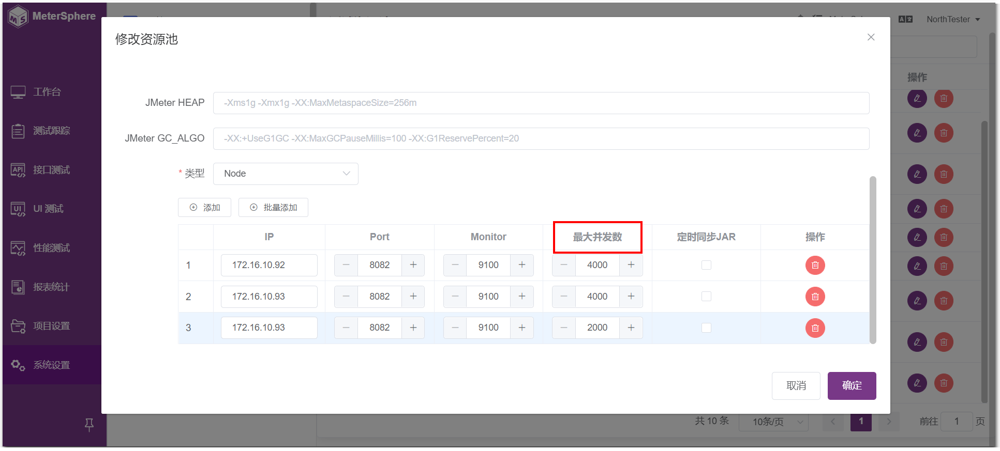
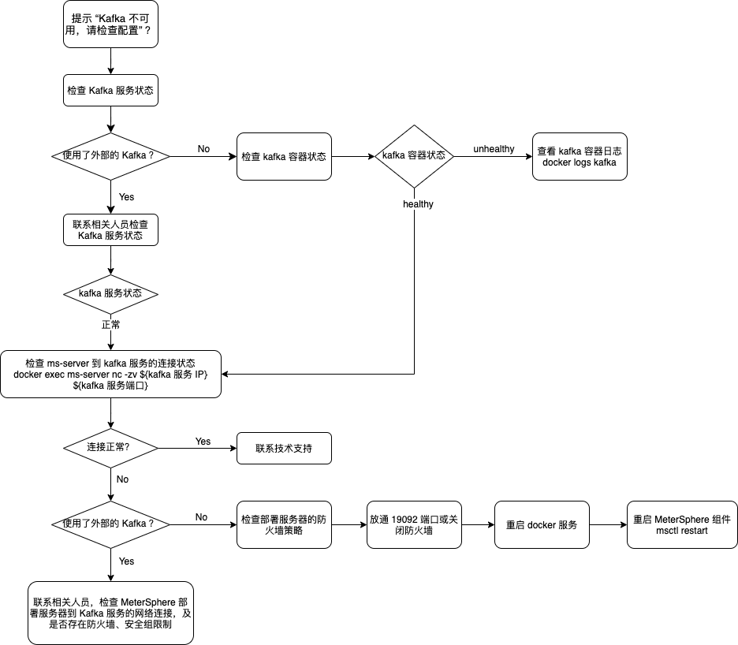
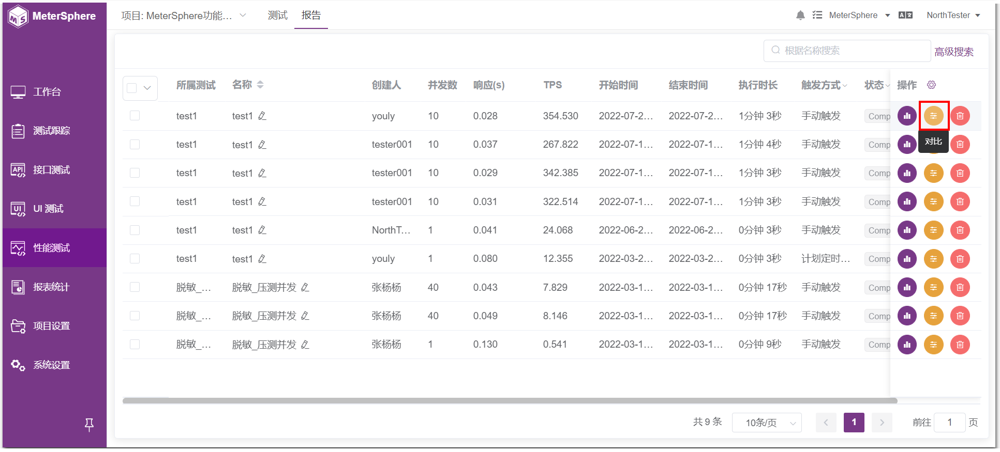
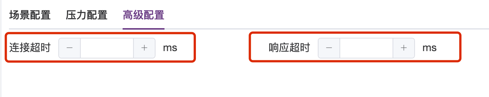
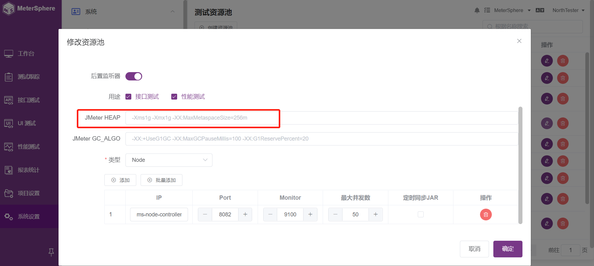
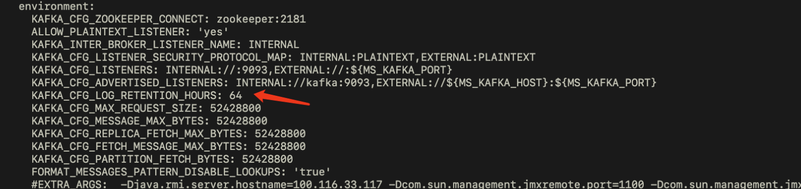
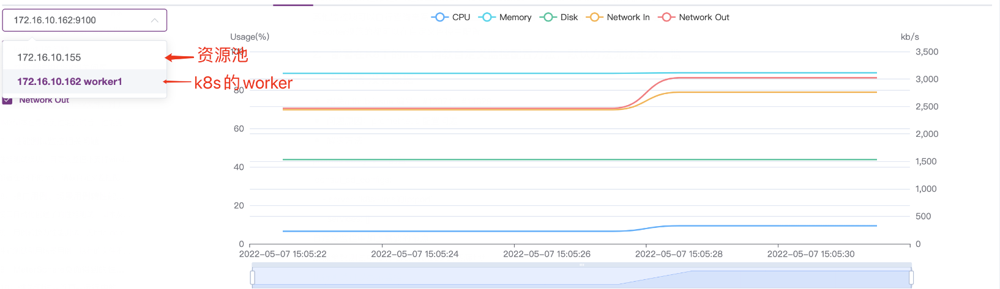

## 1 MeterSphere 和 JMeter 的主要区别是什么？

根据 51Testing软件测试网的调查报告，2009 年时仅 6% 的受访者采纳 JMeter 工具。但是到 2019年，62% 的受访者采纳 JMeter 作为性能测试工具，已经成为目前最主流的性能测试工具。 除了性能测试以外，也有很大部分用户在使用 JMeter 进行接口测试。既然有了 JMeter，为什么还需要 MeterSphere？我们将从规模扩展性、测试报告、测试管理和多人协作这四个方面详细分析 JMeter 存在的问题，及 MeterSphere 带来的变化。

1. 规模扩展性
    - JMeter 存在的问题
        - 并发数超过单节点承载能力时，多节点环境配置、维护复杂
        - 默认配置下无法并行运行多个测试，需要更改配置启动额外进程
        - 难以支持云环境下测试资源的弹性伸缩需求
    - MeterSphere 带来的改变
        - 压测执行节点支持一键安装
        - 多个项目、多个测试可并行使用同一个测试资源池（最大并发数允许情况下），提高资源利用率
        - 对接云平台 API 根据并发数自动启动、释放压测执行节点
2. 测试报告
    - JMeter 存在的问题
        - 测试报告需要在测试执行完成后单独生成，实时报告需要通过第三方方案实现
        - 测试报告不能很方便地进行共享
        - 没有多次测试结果之间进行比较的功能支持
    - MeterSphere 带来的改变
        - 近乎实时的性能测试报告展示
        - 团队共享的测试报告，方便团队成员进行协作分析
        - 历史测试报告随时查看，多次测试结果可以快速比较
3. 测试管理
    - JMeter 存在的问题
        - 如何存放这些脚本可以让整个团队很方便地使用和修改
        - 针对不同产品、项目的脚本如何进行区分
        - 如何控制不同成员对不同测试脚本的访问权限
        - 同一个测试脚本的更新修改如何进行追踪回溯
    - MeterSphere 带来的改变
        - B/S 架构的测试平台，测试脚本统一存放在数据库，团队成员可以很方便的进行共享和协作
        - 多租户、多项目的管理模型可以很好的将测试资源进行分隔
        - 灵活的角色配置，根据需求为团队成员分配不同权限
        - 针对测试脚本的修改、执行可以提供完善的记录跟踪
        - 天然支持测试脚本与测试用例的关联， 用户在进行手工测试及接口/性能测试时体验更加一致，测试报告更加完整
4. 多用户协作
    - JMeter 存在的问题
        - C/S 架构的测试工具，所有需要使用的人都需要在本地进行安装
        - 没有内置的租户、用户管理能力，测试脚本、测试报告不能很方便地进行共享
    - MeterSphere 带来的改变
        - B/S 架构的测试平台，只需一个现代浏览器加可以使用到平台提供的所有功能
        - 灵活的多租户、多项目管理模型，租户间测试用例、测试脚本和报告可以有效隔离，租户内方便共享协作

## 2 是否支持/如何支持分布式的性能测试？

MeterSphere 通过在测试资源池中添加多个测试执行节点的方式来支持分布式的性能测试。在我们向一个测试资源池中添加节点时，除了节点的 IP、端口信息外，还需要根据该节点的机器规格，配置该节点可以支持的最大并发数。当我们在执行性能测试的过程中选择了某个测试资源池时，MeterSphere 会将本次性能测试定义的并发用户数，按照所选测试资源池的节点支持的最大并发数进行按比例拆分，在测试开始执行后，每个测试执行节点会将测试结果、测试日志等信息输送到执行的 Kafka 队列中，MeterSphere 中的 data-streaming 组件会从 Kafka 中收集这些信息并进行汇总处理。

例如当我们在系统中存在一个如下配置的测试资源池，并选择该测试资源池执行一个 10000 并发用户的性能测试时，node1 及 node2 将各分配 4000 个并发用户，node3 将分配 2000 个并发用户。



## 3 如何向测试资源池中添加节点？

首先需要在要添加的节点上部署 MeterSphere 的 node-controller 组件，安装方式参考本文档[「在线安装」](../installation/online_installation.md)或[「离线安装」](../installation/offline_installation.md)章节内容，在执行安装脚本前，修改 install.conf 文件中的 MS_INSTALL_MODE 字段的值为 node-controller 后执行安装脚本。

安装完成通过查看组件状态是否正常。

```bash
msctl status
```

当组件状态正常后，使用管理员账号登录 MeterSphere，在「系统设置」-「系统」-「测试资源池」页面添加或编辑已有测试资源池，在弹出的页面中增加一个节点，IP 地址为要添加的测试执行节点的 IP，端口默认为 8082，最大并发数根据测试执行节点的机器规格进行配置。

节点添加完成点击确定后系统将对节点状态进行检查，若测试资源池为可用状态则说明该测试资源池及其中的节点可以正常使用。若提示校验不通过，请登录测试执行节点通过如下命令查看组件日志。

```bash
docker logs ms-node-controller
```

## 4 采用MeterSphere压测和手动使用JMeter命令行压测得到性能测试结果差距很大该如何优化？

1.社区版

社区版默认采用后置监听的方式实时处理报告，即在 JMX 脚本文件中增加 Kafka BackendListener 配置，各个 NodeController 节点在本地启动 JMeter 容器执行该 JMX 脚本，过程中通过 Kafka BackendListener 将原始的 JTL 结果数据上传到指定的 Kafka Topic 中，DataStreaming 作为该 Kafka Topic 的消费者对各个节点的数据进行汇总，并计算性能测试报告中的各项指标。<br>
因此在高并发时 Kafka 和 DataStreaming 很容易成为瓶颈，可以部署 Kafka 和 DataStreaming 集群以及增加 Partition 的数量来增加 Kafka 的吞吐量和处理能力。优化后正常可以达到2/3左右的差距。<br>

2.企业版

针对社区版 Kafka BackendListener 方式，需要上传和处理原始的 JTL 结果，过程中需要处理大量的数据，企业版中做了相关优化，即在执行测试过程中不再使用 BackendListener，各个 NodeController 启动 JMeter 容器时附带启动一个 Java 程序，该 Java 程序负责实时处理本地 JMeter 产生的 JTL 结果数据，生成性能测试报告中的各项指标后上传到指定的 Kafka Topic 中，DataStreaming 作为该 Kafka Topic 的消费者对各个节点的数据进行汇总。<br>
与优化前方案相比，Kafka 和 DataStreaming 需要处理的数据大大降低，整体上对于并发量较大情况下的结果处理能力大大提升。<br>
如果依然差距很大的话，仍然可以采用 部署 Kafka 和 DataStreaming 集群以及增加 Partition 数量的来增加 Kafka 的吞吐量和处理能力，可更加接近 JMeter 的真实值。

## 5 执行性能测试时提示“Kafka 不可用，请检查配置“如何解决？

系统在执行性能测试之前，会先检查安装系统时配置的 Kafka 地址是否可用。当提示该信息时，表明 MeterSphere 无法正常连接到 Kafka，可以通过以下方式进行排查定位。

1. 排查思路



2. 检查 Kafka 是否正常运行
如果在安装时使用的外部的 Kafka，请联系相关人员进行排查，检查 Kafka 服务是否正常；如果安装时使用 MeterSphere 默认配置进行安装，使用了自带的 Kafka 服务，请通过如下命令进行排查。
```bash
# 检查各组件的运行状态
msctl status
# 若 Kafka 容器不处于 `healthy` 状态，查看 Kafka 日志进行进一步排查
docker logs kafka
```
3. 检查 MeterSphere 到 Kafka 服务的网络连接
若 Kafka 服务状态正常，请通过如下命令检查 ms-server 容器是否能正常连接到 Kafka 服务。
```bash
# 检查 ms-server 是否能正常访问 Kafka 服务
[root@meter-prototype ~]# docker exec ms-server nc -zv ${kafka 服务 IP} ${kafka 服务端口}
kafka (172.23.0.5:19092) open
```
若 ms-server 不能正常访问 Kafka 服务，报错为 host is unreachable
```
执行 ifconfig 将 br-XXX 和 docker-XX 的网段，加入到防火墙策略中

firewall-cmd --zone=trusted --add-source=172.18.0.1/16 --permanent；
firewall-cmd --zone=trusted --add-source=172.19.0.1/16 --permanent；
firewall-cmd --reload
```

如果在安装时使用的外部的 Kafka，请联系相关人员进行排查，检查 MeterSphere 部署服务器到 Kafka 服务之间的网络连接是否正常，是否有防火墙、安全组等安全策略的影响；如果安装时使用 MeterSphere 默认配置进行安装，使用了自带的 Kafka 服务，请检查 MeterSphere 部署服务器上的防火墙配置，是否放通了 Kafka 的服务端口（默认 19092），也可以选择直接禁用防火墙后，重启 docker 服务和 MeterSphere 组件进行重试。
```bash
# 以 CentOS 7 操作系统为例，禁用防火墙及重启服务命令
systemctl stop firewalld
systemctl restart docker
msctl start
```
若检查发现网络连接状态正常，在执行性能测试时仍旧提示该错误，请联系我们的团队进行进一步定位。

## 6 执行性能测试时提示 `无法运行测试，请检查当前站点配置` 如何解决？

执行性能测试过程中，node-controller 节点需要通过 `系统`-`系统设置`-`系统参数设置` 中配置的 `当前站点 URL` 下载相关文件。出现该问题时用户需要检查该配置参数，确保 node-controller 节点可以正常访问到该 URL。

URL 地址一般为通过浏览器访问 MeterSphere 的地址，例如 `https://demo.metersphere.com`。

## 7 站点配置的URL是什么？

站点配置为部署MeterSphere Sever的地址，可以是域名或者是IP地址。

## 8 执行性能测试时 JMeter 容器内存溢出如何解决?

可以修改系统设置中所使用的测试资源池配置中的 HEAP 配置来调整 JMeter 容器的内存参数。

!!! info "配置示例"
    -Xms2g -Xmx2g -XX:MaxMetaspaceSize=256m

## 9 如果性能测试jmx有依赖的jar包，需要怎么处理？

在创建性能测试时，可以将依赖的 jar 包与 jmx 文件一起上传。

## 10 在压测过程中，可以手动调整TPS吗？

目前还不支持。

## 11 执行性能测试时，提示“并发数超额”，该怎么解决？

修改系统设置-测试资源池中的最大并发数后再次执行测试。

## 12 MeterSphere可以做全链路压测吗？

目前我们可以做为其中的发压端。

## 13 执行性能测试时，显示image not found如何处理？

执行性能测试所需的 JMeter 容器需要事先存在于所选的测试资源池的节点上，请检查确保容器镜像存在后，更新测试资源池的镜像配置为正确的镜像标签。

## 14 压测报告折现图形可以配置吗?

在创建性能测试时的高级设置中可以修改报告数据的聚合时间。

## 15 压测执行的时候报如下错如何解决？
```
Error: Check node-controller /etc/hosts, `127.0.0.1 ${hostname}` must be contained. Please delete the report and rerun.
```

在部署 node-controller 的机器上，使用hostname命令获取主机名。

```
[root@nginx metersphere-release-v1.8.0]# hostname
nginx.novalocal
```

将获取到的主机名 `nginx.novalocal` 配置到 /etc/hosts 文件中，配置完成效果如下。

配置前

```
127.0.0.1       localhost
::1         localhost localhost.localdomain localhost6 localhost6.localdomain6
10.110.149.133 nginx111
```

配置后

```
127.0.0.1       localhost
127.0.0.1       nginx.novalocal
::1         localhost localhost.localdomain localhost6 localhost6.localdomain6
10.110.149.133 nginx111
```

## 16 同一脚本执行多次，可以将多次的报告结果进行对比吗？

在报告列表，同个任务下，已完成状态的报告可以进行对比。



## 17 执行压测时，多台发压机的情况下，可以设置变量不重复执行吗？

可以在性能测试的高级配置页面，使用CSV分割功能，系统会把变量平均分配给压力机，保证数值的唯一性。

## 18 MeterSphere可以监控被测系统服务器指标吗？
MeterSphere 使用 Prometheus 进行发压机以及被测系统服务器的监控，可以在性能测试-高级配置里面，添加被测系统服务器的 node_exporter 的地址。主服务会在安装 MeterSphere 系统时默认安装，而其他服务器，则需要单独安装 node_exporter，即可在执行性能测试的时候完成相关指标的监控。

## 19 如何安装 node_exporter 插件
1.可使用 docker pull prom/node-exporter 拉取 node_export 镜像，之后运行容器
```
docker pull prom/node-exporter # 拉取镜像
docker run -d -p 9100:9100 -v "/proc:/host/proc:ro" -v "/sys:/host/sys:ro" -v "/:/rootfs:ro" --net="host" prom/node-exporter # 启动容器

http://服务器IP:9100/metrics # 访问查看 node_export 是否正常启动
```
2.可下载 node_exporter 离线包，解压之后可执行命令进行启动
```
wget https://github.com/prometheus/node_exporter/releases/download/v1.3.1/node_exporter-1.3.1.linux-amd64.tar.gz
tar -zxvf node_exporter-1.3.1.linux-amd64.tar.gz
cd node_exporter-1.3.1-amd64
./node_exporter  # 启动 (nohup ./node_exporter & 后台启动)

http://服务器IP:9100/metrics # 访问查看 node_export 是否正常启动
```

## 20 压力配置中，每个线程组是否能分别选择压力机？

在压力配置里，提供了3种分配策略，分别为“自动分配、固定节点、自定义”，可以为每个线程组指定一个节点，或者按比例分配多个节点。

## 21 性能测试并发量加大的时候报错 `Non HTTP response code: java.net.SocketTimeoutException`

高级配置增加超时时间。



## 22 进行压测时，最大用户加到 50/100 就不能继续加吗？
可在 系统设置-测试资源池-修改资源池里“最大并发数”中配置

## 23 性能测试相关文件在 JMeter 容器中的哪个目录？
在容器里的/test目录下

## 24 执行性能测试报 JMeter 镜像不存在
1.先查看一下镜像文件，看是否存在这个镜像，docker images <br>
2.下载离线安装包解压后，将 JMeter 镜像导入到docker中 <br>
3.可查看 /opt/metersphere/.env 中 MS_JMETER_IMAGE 地址，直接 docker pull 地址即可

## 25 性能测试状态一直是starting且无数据
1.检查【系统设置-系统-系统参数设置】，当前站点配置是不是正确的 <br>
2.到服务器或者压力机的查看 /opt/metersphere/logs/node-controler/ 下的 ms-jmeter-run-log.log
和 info.log，看日志中是否有报错信息。<br>
如果出现 org.apache.kafka.common.errors.TimeoutException: Topic JMETER_LOGS not present in metadata after 60000 ms<br>
```
2022-07-29 14:51:59,755 [docker-java-stream-584750660] INFO  ms-jmeter-run-log ? - Method[onNext][at org.apache.kafka.clients.producer.KafkaProducer$FutureFailure.<init>(KafkaProducer.java:1314)]
2022-07-29 14:51:59,755 [docker-java-stream-584750660] INFO  ms-jmeter-run-log ? - Method[onNext][at org.apache.kafka.clients.producer.KafkaProducer.doSend(KafkaProducer.java:970)]
2022-07-29 14:51:59,755 [docker-java-stream-584750660] INFO  ms-jmeter-run-log ? - Method[onNext][at org.apache.kafka.clients.producer.KafkaProducer.send(KafkaProducer.java:870)]
2022-07-29 14:51:59,755 [docker-java-stream-584750660] INFO  ms-jmeter-run-log ? - Method[onNext][at org.apache.kafka.clients.producer.KafkaProducer.send(KafkaProducer.java:758)]
2022-07-29 14:51:59,755 [docker-java-stream-584750660] INFO  ms-jmeter-run-log ? - Method[onNext][at org.apache.logging.log4j.core.appender.mom.kafka.KafkaManager.send(KafkaManager.java:122)]
2022-07-29 14:51:59,755 [docker-java-stream-584750660] INFO  ms-jmeter-run-log ? - Method[onNext][at org.apache.logging.log4j.core.appender.mom.kafka.KafkaAppender.tryAppend(KafkaAppender.java:224)]
2022-07-29 14:51:59,756 [docker-java-stream-584750660] INFO  ms-jmeter-run-log ? - Method[onNext][at org.apache.logging.log4j.core.appender.mom.kafka.KafkaAppender.append(KafkaAppender.java:172)]
2022-07-29 14:51:59,756 [docker-java-stream-584750660] INFO  ms-jmeter-run-log ? - Method[onNext][at org.apache.logging.log4j.core.config.AppenderControl.tryCallAppender(AppenderControl.java:161)]
2022-07-29 14:51:59,756 [docker-java-stream-584750660] INFO  ms-jmeter-run-log ? - Method[onNext][at org.apache.logging.log4j.core.config.AppenderControl.callAppender0(AppenderControl.java:134)]
2022-07-29 14:51:59,756 [docker-java-stream-584750660] INFO  ms-jmeter-run-log ? - Method[onNext][at org.apache.logging.log4j.core.config.AppenderControl.callAppenderPreventRecursion(AppenderControl.java:125)]
2022-07-29 14:51:59,756 [docker-java-stream-584750660] INFO  ms-jmeter-run-log ? - Method[onNext][at org.apache.logging.log4j.core.config.AppenderControl.callAppender(AppenderControl.java:89)]
2022-07-29 14:51:59,756 [docker-java-stream-584750660] INFO  ms-jmeter-run-log ? - Method[onNext][at org.apache.logging.log4j.core.config.LoggerConfig.callAppenders(LoggerConfig.java:675)]
2022-07-29 14:51:59,756 [docker-java-stream-584750660] INFO  ms-jmeter-run-log ? - Method[onNext][at org.apache.logging.log4j.core.config.LoggerConfig.processLogEvent(LoggerConfig.java:633)]
2022-07-29 14:51:59,756 [docker-java-stream-584750660] INFO  ms-jmeter-run-log ? - Method[onNext][at org.apache.logging.log4j.core.config.LoggerConfig.log(LoggerConfig.java:616)]
2022-07-29 14:51:59,756 [docker-java-stream-584750660] INFO  ms-jmeter-run-log ? - Method[onNext][at org.apache.logging.log4j.core.config.LoggerConfig.log(LoggerConfig.java:552)]
2022-07-29 14:51:59,756 [docker-java-stream-584750660] INFO  ms-jmeter-run-log ? - Method[onNext][at org.apache.logging.log4j.core.config.AwaitCompletionReliabilityStrategy.log(AwaitCompletionReliabilityStrategy.java:82)]
2022-07-29 14:51:59,756 [docker-java-stream-584750660] INFO  ms-jmeter-run-log ? - Method[onNext][at org.apache.logging.log4j.core.Logger.log(Logger.java:161)]
2022-07-29 14:51:59,756 [docker-java-stream-584750660] INFO  ms-jmeter-run-log ? - Method[onNext][at org.apache.logging.log4j.spi.AbstractLogger.tryLogMessage(AbstractLogger.java:2205)]
2022-07-29 14:51:59,756 [docker-java-stream-584750660] INFO  ms-jmeter-run-log ? - Method[onNext][at org.apache.logging.log4j.spi.AbstractLogger.logMessageTrackRecursion(AbstractLogger.java:2159)]
2022-07-29 14:51:59,756 [docker-java-stream-584750660] INFO  ms-jmeter-run-log ? - Method[onNext][at org.apache.logging.log4j.spi.AbstractLogger.logMessageSafely(AbstractLogger.java:2142)]
2022-07-29 14:51:59,756 [docker-java-stream-584750660] INFO  ms-jmeter-run-log ? - Method[onNext][at org.apache.logging.log4j.spi.AbstractLogger.logMessage(AbstractLogger.java:2034)]
2022-07-29 14:51:59,756 [docker-java-stream-584750660] INFO  ms-jmeter-run-log ? - Method[onNext][at org.apache.logging.log4j.spi.AbstractLogger.logIfEnabled(AbstractLogger.java:1899)]
2022-07-29 14:51:59,756 [docker-java-stream-584750660] INFO  ms-jmeter-run-log ? - Method[onNext][at org.apache.logging.slf4j.Log4jLogger.info(Log4jLogger.java:184)]
2022-07-29 14:51:59,757 [docker-java-stream-584750660] INFO  ms-jmeter-run-log ? - Method[onNext][at org.apache.jmeter.JMeter.initializeProperties(JMeter.java:737)]
2022-07-29 14:51:59,757 [docker-java-stream-584750660] INFO  ms-jmeter-run-log ? - Method[onNext][at org.apache.jmeter.JMeter.start(JMeter.java:379)]
2022-07-29 14:51:59,757 [docker-java-stream-584750660] INFO  ms-jmeter-run-log ? - Method[onNext][at java.base/jdk.internal.reflect.NativeMethodAccessorImpl.invoke0(Native Method)]
2022-07-29 14:51:59,757 [docker-java-stream-584750660] INFO  ms-jmeter-run-log ? - Method[onNext][at java.base/jdk.internal.reflect.NativeMethodAccessorImpl.invoke(NativeMethodAccessorImpl.java:62)]
2022-07-29 14:51:59,757 [docker-java-stream-584750660] INFO  ms-jmeter-run-log ? - Method[onNext][at java.base/jdk.internal.reflect.DelegatingMethodAccessorImpl.invoke(DelegatingMethodAccessorImpl.java:43)]
2022-07-29 14:51:59,757 [docker-java-stream-584750660] INFO  ms-jmeter-run-log ? - Method[onNext][at java.base/java.lang.reflect.Method.invoke(Method.java:566)]
2022-07-29 14:51:59,757 [docker-java-stream-584750660] INFO  ms-jmeter-run-log ? - Method[onNext][at org.apache.jmeter.NewDriver.main(NewDriver.java:259)]
2022-07-29 14:51:59,757 [docker-java-stream-584750660] INFO  ms-jmeter-run-log ? - Method[onNext][Caused by: org.apache.kafka.common.errors.TimeoutException: Topic JMETER_LOGS not present in metadata after 60000 ms.]
2022-07-29 14:51:59,757 [docker-java-stream-584750660] INFO  ms-jmeter-run-log ? - Method[onNext][]
```
证明 Kafka 里缺少 Topic 信息，可以手动到 Kafka 里创建对应的 Topic<br>
```
docker exec -it kafka /bin/bash
cd /opt/bitnami/kafka/bin
./kafka-topics.sh --create --bootstrap-server 127.0.0.1:9092 --replication-factor 1 --partitions 4 --topic JMETER_LOGS
```

## 26 k8s资源池是否需要安装node-controller
1.执行性能测试不需要<br>
性能测试只需要在仓库中配置好 JMeter 镜像的地址，执行性能测试的时候会自动创建 JMeter POD 进行压测，执行完之后自动销毁。<br>

2.执行接口测试需要<br>
执行接口测试需要部署 DaemonSet 或 Deployment，可下载示例 yaml 文件进行部署，部署好之后可以设置弹性伸缩参数，从而实现资源池的弹性伸缩。<br>


## 27 check node-controller status
1.检查【系统设置-系统参数设置-当前站点URL】是否正确，是不是多了"/" <br>
2.docker exec ms-server nc -zv ms-node-controller 8082 或者去ms-server容器里 curl localhost:8082/status 试试，实在不行就重启docker、重启服务器试试 <br>
3.检查 JMeter 的镜像版本是不是对的，检查 JMeter 镜像有没有加载到 docker 中，执行docker load -i jmeter-master.tar，看能否加载到docker中，若不能则重新上传JMeter镜像，执行docker load -i jmeter-master.tar，修改.env环境里的JMeter镜像，重新加载项目msctl reload。<br>

## 28 Error:没有足够的资源启动测试
将【系统设置-测试资源池-JMeter HEAP】调大点


## 29 性能测试中怎么跨线程传递变量
性能测试里动态设置变量可以用属性的方式，${__setProperty(var,value,)} 设置属性，${__property(var)} 引用属性。用属性方法在性能测试中可以动态传递并且可以跨线程传递

## 30 性能测试报告刷新频率和右上角设置的不一样
性能测试计算报告是后台自动计算的，页面上配置的这个值只是页面查询数据库的频率。也就是说如果后台计算比较慢，这里的时间间隔较小的话是不能看到图表的改动的

## 31 性能测试无法正常执行，提示资源不够
原因: 1.性能测试里有添加前后置脚本，尤其是python，消耗性能比较大 <br>
2.测试资源池主机资源（尤其是内存）不足 <br>
解决方法: 1.尽量不要使用前后置脚本，或者换用资源消耗小的脚本，如 groovy <br>
2.换用单独的测试资源池，使用 node-controller 模式安装 <br>

## 32 性能测试报告中，并发用户数显示和设置不一致
原因: 1.并发用户数太少，ramp-up设置的时间长，导致加压后第一个用户已经执行完测试了，第二个用户才创建出来，看起来并发用户数就一直是1 <br>
2.报告左上角的并发用户数在报告里显示的是平均值，不是实时变化的 <br>
解决方法：减少ramp-up时间，可以看到并发用户数与设置一致 <br>

## 33 kafka 的日志保留时间配置
修改 /opt/metersphere/docker-compose-kafka.yml 配置文档里的 KAFKA_CFG_LOG_RETENTION_HOURS 参数<br>


## 34 性能测试时接口读取 csv 不能按顺序读取
所选的测试资源池有多个节点，多个节点共用一套 csv 导致取值重复，在性能测试的高级配置里，开启 csv 分割，多准备点测试数据。csv 分割是: 假设有2个节点，csv 里有100条数据，就会把 csv 里的数据均分成2份，然后节点1 使用 1-50 条数据，节点2 使用 51-100 条数据。

## 35 性能测试配置里面上传 csv 文件，在高级配置里面看不到
csv 文件没有被性能 jmx 脚本引用，jmx 引用了才能看见。修改 jmx 文件，引用上传的 csv 文件。或者在场景里添加 csv 文件后转性能测试。

## 36 JMX 脚本在导入到性能测试后，性能测试执行完毕没有任何数据  
jmx 脚本里有 csv 文件，上传 jmx 文件后有没有上传 csv 文件，同步上传 jmx 使用到的 csv 文件

## 37 性能测试模块，自定义监控不支持windows服务器
默认提供的 promQL 是 linux 的，windows 的需要自行查询来写。查询windows的cpu使用率语句: 100 - (avg by (instance) (irate(windows_cpu_time_total{mode="idle", instance="%1$s"}[1m])) * 100)
其中 %1$s 是被监控节点的ip和端口，上面这条语句在执行时会变成 100 - (avg by (instance) (irate(windows_cpu_time_total{mode="idle", instance="172.16.10.54:9182"}[1m])) * 100)
其他监控项可以自行查询来写，内存、磁盘等，还可以自行监控不同的exporter，只要是符合 exporter规范的都可以在自定义监控中配置

## 38 部署在K8下的ms，请教自定义监控配置方法，默认方法无法生效。监控详情 没有数据 
在 prometheus.yml 中配置
```
consul_sd_configs:
- server: 'k8s中ms的ip:port'
services: []
```
自定义监控中加上需要的节点，系统参数测试中设置 prometheus 的实际地址，执行测试可以显示监控


## 39 接口自动化创建了的性能测试，脚本及文件内容更新后，性能测试的没有跟着更新 
转性能测试的时候生成的 jmx 文件就是当前的配置，之后再修改接口对性能测试无效，点击性能测试右上角“同步场景测试最新变更”按钮手动同步即可。

## 40 接口用例转换为性能测试，无http-domain，执行性能测试失败
选择的环境中没有配置url信息，接口用例调试成功后再转性能测试

## 41 性能测试引用场景用例，执行的文件不是加载的文件 
请求统计的显示的是接口的名称，不是场景的名称

## 42 MeterSphere 页面得到的性能测试数据，只有 jmeter 命令行得到的测试数据的 70%~75% 
ms 服务是用 docker 部署的，docker 容器只能达到虚拟机的 70% 左右的性能

## 43 性能测试-首页-运行中的任务，展示为空 
只显示性能测试定时任务列表

## 44 运行性能测试的时候报错了 Image Not Found: registry.cn-qingdao.aliyuncs.com/metersphere/jmeter-master:5.4.3-ms5-jdk11
没有 jmeter-master 镜像，执行命令手动拉取镜像 docker pull registry.cn-qingdao.aliyuncs.com/metersphere/jmeter-master:5.4.3-ms5-jdk11
