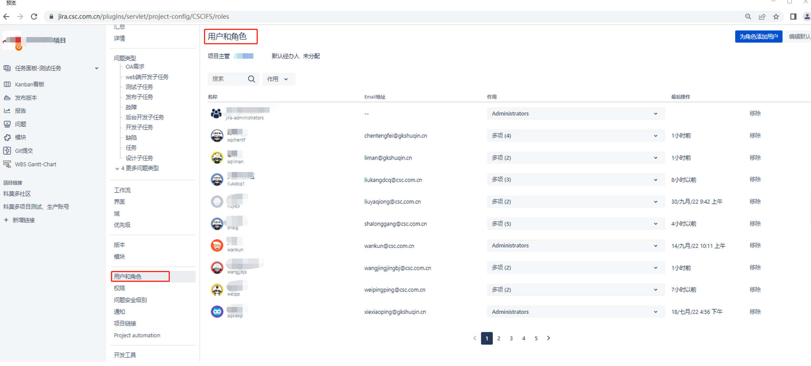

## 1 MeterSphere 如何对接第三方平台？
!!! ms-abstract ""
    TAPD： 请参考[MeterSphere 服务集成之 TAPD 对接](https://kb.fit2cloud.com/?p=259) 
    JIRA： 请参考 [MeterSphere 服务集成之 JIRA 对接](https://kb.fit2cloud.com/?p=258) 
    禅道：  请参考[MeterSphere 服务集成之 禅道 对接](https://kb.fit2cloud.com/?p=257) 
    Azure Devops： 请参考[MeterSphere 服务集成之 Azure Devops 对接](https://kb.fit2cloud.com/?p=260) 

## 2 在禅道上已创建的缺陷，MS 上点击【同步缺陷】，为什么未成功同步？
!!! ms-abstract ""
    禅道缺陷同步到 MS 是企业版功能，开源版只支持单向同步，只能将 MS 缺陷同步到禅道上。

## 3 禅道在 PATH_INFO 下，项目集成提示失败怎么处理?
!!! ms-abstract ""
    修改禅道配置或 MS 平台设置，确保两个系统中的请求方式保持一致： 
    （1）【修改禅道配置】配置文件路径：/opt/zbox/app/zentao/config/my.php，修改 $config->requestType = 'PATH_INFO' 或 'GET'，然后重启禅道`/opt/zbox/zbox restart`。 
    （2）【修改MS配置】在“系统设置-工作空间-服务集成-禅道”配置页面，选择请求方式为`PATH_INFO`或 `GET`。

## 4 MS 集成 TAPD，在 MS 平台上提交缺陷时上传图片，但在 TAPD 中无法正确显示图片，如何处理？
!!! ms-abstract ""
    浏览器的默认安全策略导致，需要在MS平台【系统设置-系统-系统参数设置-基本配置-当前站点URL】中配置为 https 的地址。

## 5 MS 集成禅道，在 MeterSphere 平台上项目 ID 填写正确，检查时提示`ID不存在或者其他错误`如何处理？
!!! ms-abstract ""
    可能原因包括：

    - v2.4 版本之后，服务集成修改为插件方式，禅道插件版本和当前 MeterSphere 版本不一致。
    - 没有对应产品或者项目的权限，或者有权限但是需要填产品 ID，实际填了项目 ID。
    - 禅道服务没有启用api调用权限：缺少配置 $config->features->apiGetModel。
    - 服务集成处对接的禅道用户，没有勾选赋予"超级model调用接口"权限。

    解决方法： 

    - 在 github上下载和 MeterSphere 版本一致的插件[metersphere-platform-plugin](https://github.com/metersphere/metersphere-platform-plugin) 并上传到【系统设置-插件管理】，用法参考[服务集成插件](../user_manual/plugin_use/service_integration_plugin.md)。
    - 在 MeterSphere 项目编辑框-项目ID 处有“i”提示说明，按照配置说明填写对应 产品ID 或者 项目ID。 
    - 在禅道安装路径中：${安装路径}/zentao/config/ 目录下 my.php (如果没有，新建 my.php 文件)中添加如下内容：`$config->features->apiGetModel = true;`然后重启禅道服务器：`/opt/zbox/zbox restart`。 
    - 用于对接的禅道用户，确认在禅道 web 端【组织-权限-权限维护-API 接口】勾选了“超级model调用接口”。

## 6 MS 集成 JIRA 平台，填写【JIRA项目key】后进行保存时，页面提示 "ID不存在或其他错误"如何处理？
!!! ms-abstract ""

    一般为用户没有权限访问此项目，检查 JIRA 对应项目的管理员用户是否和 MS 系统【系统设置-服务集成-JIRA】处配置的账号一致，可配合后台日志/opt/metersphere/logs/system-setting/info.log查看报错原因。
{ width="900px" }

## 7 同步缺陷到JIRA，如何实现自定义字段？
!!! ms-abstract ""
    可以在【项目设置-更多选项-模板管理】，创建模板字段；然后打开缺陷模板-JIRA默认模板，添加创建好的自定义字段，在 MeterSphere 上提交缺陷时就会出现该字段。

{ width="900px" }

{ width="900px" }

## 8 集成JIRA时，如何实现绑定指定账号？
!!! ms-abstract ""
    可以在【个人账号-个人信息-第三方平台账号】弹窗，配置 JIRA 账号和密码，就可以绑定账号关联需求以及同步缺陷了。