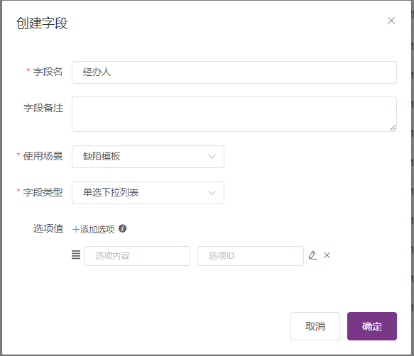
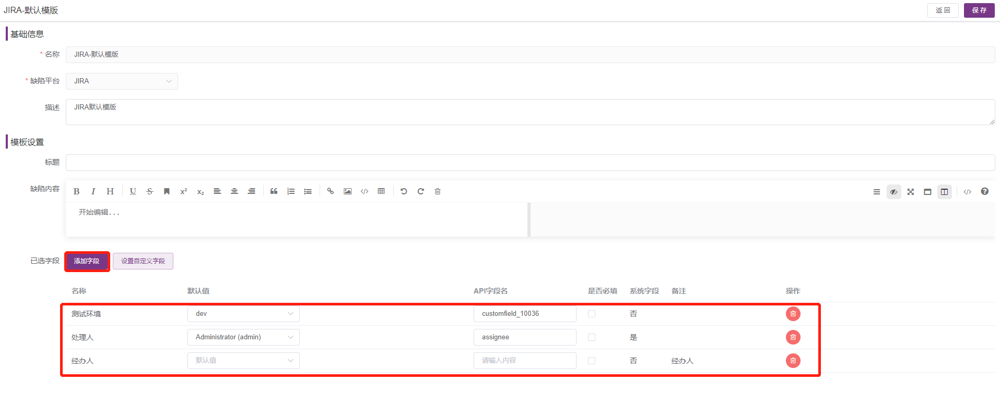

## 1 忘记了登录密码如何处理？

当普通用户忘记密码时可使用管理员账号在页面上的用户管理页面为其重置密码，当系统管理员忘记密码且没有其他系统管理员账号时，需要通过数据库操作重置密码。

MeterSphere 的用户信息存放在数据库中的 `user` 表中，其中 password 字段为用户密码的 `md5` 值。

```sql
update user set password='3259a9d7f208ef9690025d1432558c5b' where id='admin';
```

连接到数据库后，执行上面的 SQL 语句可以将用户 `admin` 的密码重置为 `metersphere`。

## 2 测试资源池的概念是什么？

测试资源池相当于MeterSphere中的执行机集合，可以用于执行指定的接口或性能测试。

## 3 LDAP测试连接，提示 “用户不存在或者不唯一”。

更改用户过滤器为 (cn={0})；LDAP属性映射为｛"username": "cn"｝

## 4 同步缺陷到JIRA，可以自定义字段吗？

可以在【项目设置-更多选项-模版管理】，创建模板字段；然后打开缺陷模板-JIRA默认模版，添加创建好的自定义字段，在 MeterSphere 上提交缺陷时就会出现该字段。





## 5 项目可以配置通用的域名吗?

在【系统设置-工作空间-环境配置】页面，【通用设置】启用 Hosts，可以为项目配置通用的域名。

## 6 集成JIRA时，可以绑定指定账号吗？

可以在系统设置-个人信息-个人设置弹窗里，配置 JIRA 账号和密码，就可以绑定账号关联需求以及同步缺陷了。

## 7 系统设置里面的“组织”为什么找不到了？

为了给用户带来更好的使用体验，和更清晰的租户层级关系，在1.14版本中，“组织”模块以及相关菜单已被移除。

## 8 邮件服务器连接不成功
将邮件设置中的465端口改成25端口并去掉ssl选项，导致邮箱链接不成功的原因可能是465端口未开放；

## 9 数据库连接不通
数据库默认开启了SSL验证相应的配置，可在数据库的URL增加？useSSL=false来解决

## 10 在一个SQL请求下如何执行多条SQL
数据源配置的url后面加上allowMultiQueries=true

## 11 SQL链接时出现no database selected
数据源连接url没有拼接库名

## 12 admin的系统管理员角色默认被误删的话怎么办？
```
进数据库执行：
INSERT INTO user_group (id, user_id, group_id, source_id, create_time, update_time)
VALUES (UUID(), 'admin', 'admin', 'system', 1622183788364, 1622183788364);
```

## 13 MeterSphere 如何对接第三方平台
```
对接TAPD: 参考 https://metersphere.io/docs/v2.x/tutorial/对接 TAPD/
对接JIRA: 参考 https://metersphere.io/docs/v2.x/tutorial/对接 JIRA/
对接禅道:  参考 https://metersphere.io/docs/v2.x/tutorial/对接禅道/
```

