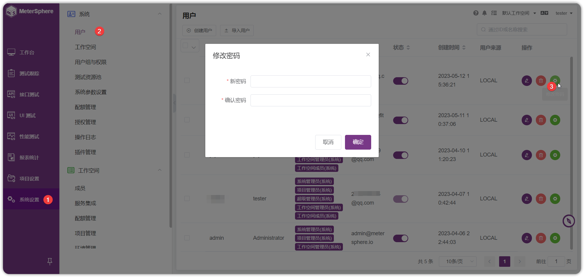
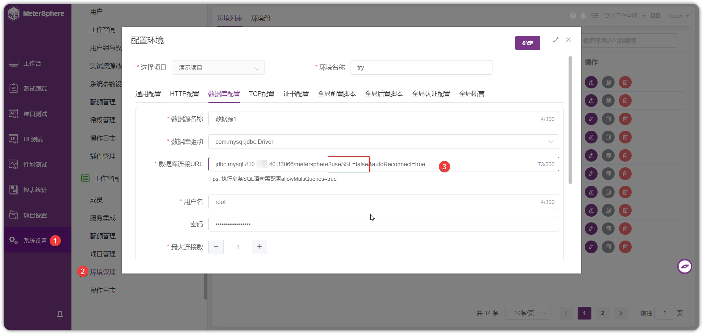

 <!-- 
## 1 忘记了登录密码如何处理？
!!! ms-abstract ""
    当普通用户忘记密码，admin 管理员可在【系统设置-用户】为其重置密码。

{ width="900px" }

!!! ms-abstract ""
    当系统管理员忘记密码且没有其他系统管理员账号时，需要通过数据库操作重置为默认的密码。
    MeterSphere 的用户信息存放在数据库中的 `user` 表中，其中 password 字段为用户密码的 `md5` 值。

    ```sql
    docker exec -it mysql bash  #进入mysql容器
    mysql -uroot -pPassword123@mysql
    use metersphere   #切换到meterspheres数据库
    update user set password='3259a9d7f208ef9690025d1432558c5b' where id='admin';
    ```--> 
## 1 如何理解 MeterSphere 测试资源池？
!!! ms-abstract ""
    测试资源池是 MeterSphere 中的执行机集合，用于执行指定的接口或性能测试。目前支持添加 Node 资源池和 K8S 资源池，详细说明请参考[资源池配置](../installation/build_node_controller.md)。

## 2 LDAP测试连接，提示`用户不存在或者不唯一`如何处理？
!!! ms-abstract ""
    在【系统设置-系统参数设置-LDAP 设置】更改用户过滤器为`(cn={0})`；LDAP属性映射为`｛"username": "cn"｝`。

## 3 项目如何配置通用的域名？
!!! ms-abstract ""
    在【系统设置-工作空间-环境配置】页面，【通用设置】启用 Hosts，可以为项目配置通用的域名。

## 4 邮件服务器连接不成功如何处理？
!!! ms-abstract ""
     导致邮箱链接不成功的原因可能是 465 端口未开放， 可在【系统设置-系统参数设置-邮件设置设置】将邮件设置中的 465 端口改成 25 端口并去掉 ssl 选项.

## 5 环境配置数据库连接不通， 提示：`WARN: Establishing SSL connection without server's identity verification is not recommended.`
!!! ms-abstract ""
    数据库默认开启了 SSL 验证相应的配置导致，可在【系统设置-环境管理】数据库的 URL 增加`？useSSL=false` 来解决。

{ width="900px" }

## 6 在一个SQL请求下如何执行多条SQL？
!!! ms-abstract ""
    在【系统设置-环境管理】编辑环境数据源配置的 URL 后面加上 `allowMultiQueries=true`。

## 7 环境配置数据库配置提示：`no database selected`，如何解决？
!!! ms-abstract ""
    需要在【系统设置-环境管理】编辑环境数据源连接 URL 中增加数据库库名信息。例如：`jdbc:mysql://127.0.0.1:3306/database`。


