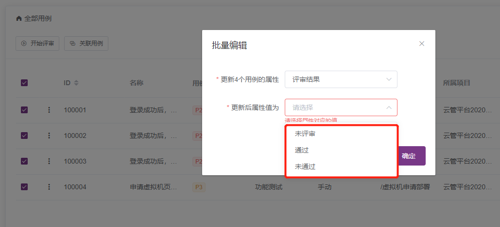
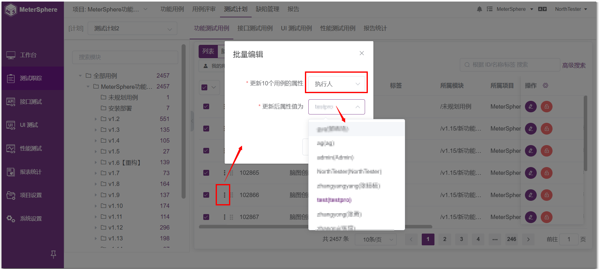
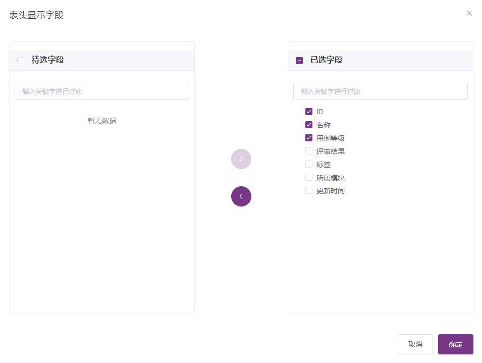
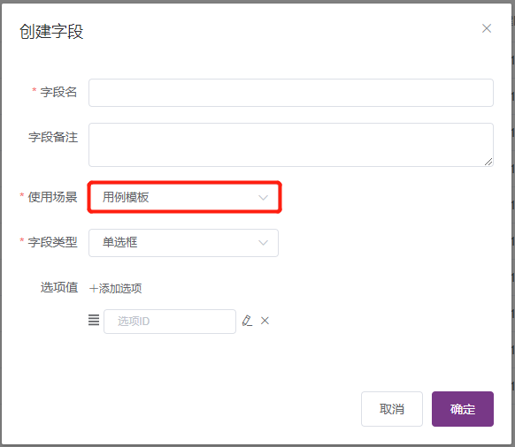
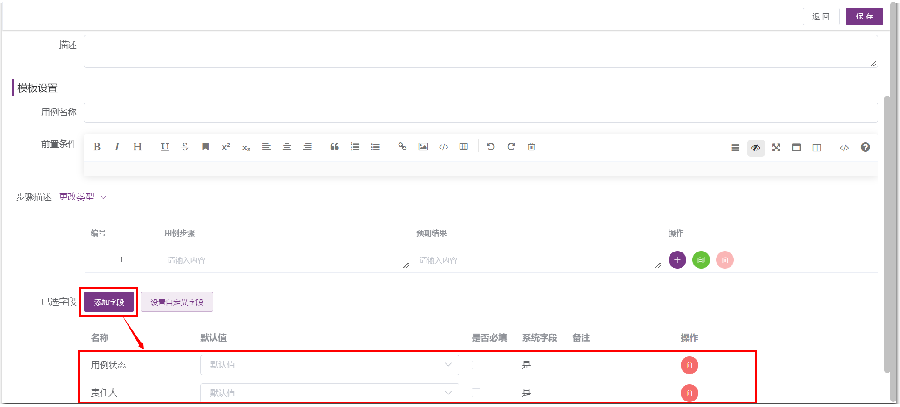
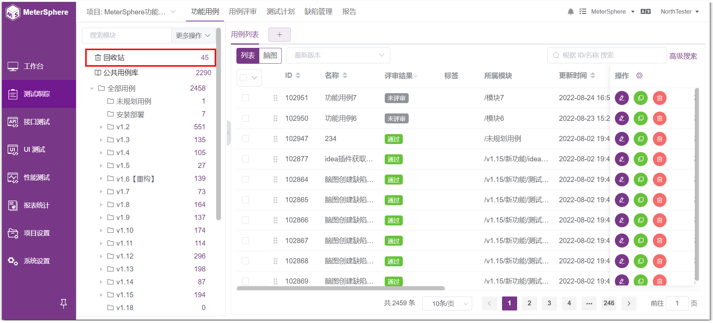

## 测试跟踪模块，用例评审是否支持批量处理？

支持。选中测试评审用例列表中需要批量处理的用例，点击 `···` 弹出下拉框，选择批量编辑，可以批量设置评审结果。

## 测试计划里，是否支持批量分配执行人？

支持。选中测试计划用例列表中需要批量处理的用例，点击 `···` 弹出下拉框，选择批量编辑，可以分配执行人。

## 测试计划执行定时任务，是否会自动触发接口测试和性能测试？定时任务添加后如何删除？

测试计划的定时任务支持关联管理接口测试、性能测试并定时触发；配置定时任务后，关闭SCHEDULER开关取消定时任务。

## 测试用例可以自定义显示字段吗？

可以，在测试用例列表 - 点击 `操作` 列中的齿轮按钮进行配置。

## 如果集成了JIRA，缺陷状态可以同步更新MeterSphere吗？

暂时只支持从MeterSphere同步到JIRA。

## 测试用例可以自定义显示字段吗

测试用例列表 - 点击【操作】按钮

## 缺陷管理自定义字段，如何跟JIRA端的字段关联？

在jira里查看network，找到对应的自定义字段的字段名称，然后到MeterSpherer缺陷模版里设置上对应的api字段名。

## 测试用例可以自定义添加字段吗？

在系统设置-工作空间-模版管理-自定义字段，可以创建自定义字段，创建时选择用例模版，保存成功后打开用例模版，添加创建的自定义字段。然后在编写用例的页面就会出现自定义字段。

## 如果测试用例误删除了，还能找回来吗？

可以在 测试跟踪-测试用例 模块，点击“回收站”找回。

## 编写测试用例页面的字段可以增加吗？

可以在系统设置-工作空间-模版管理-用例模版里增加字段，并且可以设置字段是否为必填项。

## 功能用例，用脑图在线编写用例，怎么直接在脑图里创建模块？
目前只能通过页面左侧的模块列表区域，创建新的模块。

## 提交缺陷页面的字段可以自己配置吗？
可以在系统设置-工作空间-模版管理-缺陷模版里增加字段。

## 在JIRA、TAPD、禅道上提交的缺陷可以同步到MeterSphere里面吗？
项目与这些工具设置了集成后，缺陷是可以双向同步的。

