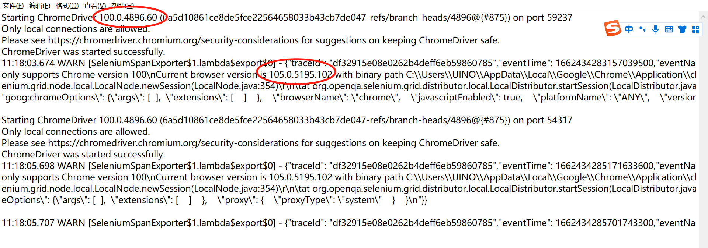
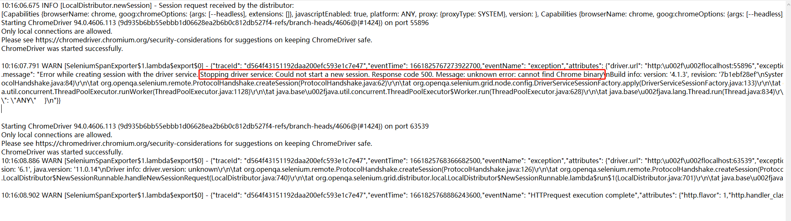

## 1.本地调试时，启动日志中出现两个版本号
{ width="900px" }

!!! ms-abstract ""
    本地浏览器的版本号与下载的驱动版本不匹配，可查看浏览器版本后，重新下载对应版本的驱动。

## 2.本地调试，启动日志中报错：cannot find Chrome binary
{ width="900px" }

!!! ms-abstract ""
    将 chrome.exe 的路径配置到环境变量 PATH 里。

## 3.本地调试，日志没有任何报错情况，但是页面浏览器没有被调用起来
{ width="900px" }

!!! ms-abstract ""
    在UI场景中，不勾选【性能模式】，即可看到浏览器被调用的过程。