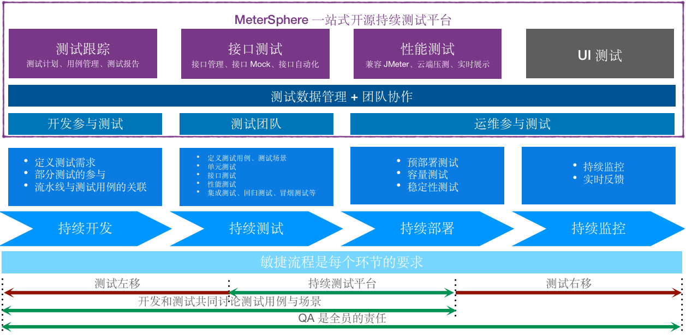
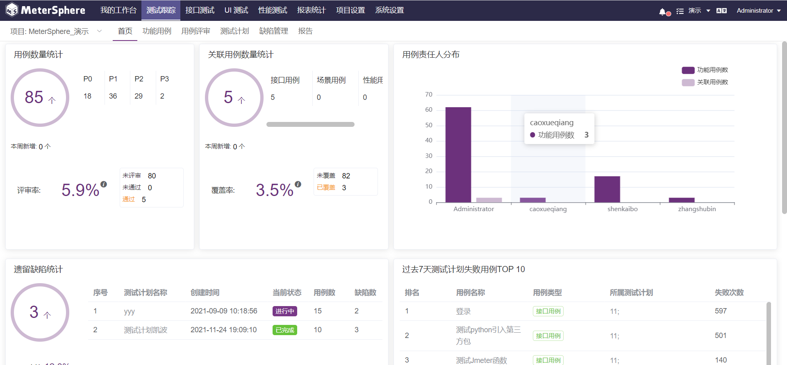

# 项目介绍

欢迎使用 MeterSphere。

MeterSphere 是一站式开源持续测试平台, 涵盖测试跟踪、接口测试、UI 测试和性能测试等功能，全面兼容 JMeter、Selenium 等主流开源标准，有效助力开发和测试团队充分利用云弹性进行高度可扩展的自动化测试，加速高质量的软件交付，推动中国测试行业整体效率的提升。

## 界面展示

## 产品优势

-   **开源**：基于开源、兼容开源；按月发布新版本、日均下载安装超过100次、被大量客户验证；
-   **一站式**：一个产品全面涵盖测试跟踪、接口测试、UI测试、性能测试等功能并形成联动；
-   **全生命周期**：一个产品全满足从测试计划、测试执行到测试报告分析的全生命周期需求；
-   **持续测试**：无缝对接 Bug 管理工具和持续集成工具等，能将测试融入持续交付和 DevOps 体系；
-   **团队协作**：支持团队协作和资产沉淀，无论团队规模如何，总有适合的落地方式。

## 主要功能

-   **测试跟踪**: 对接主流项目管理平台，测试过程全链路跟踪管理； 列表脑图模式自由切换，用例编写更简单、测试报告更清晰；
-   **接口测试**: 比 JMeter 易用，比 PostMan 强大； API 管理、Mock 服务、场景编排、多协议支持，你想要的全都有；
-   **UI 测试**: 基于 Selenium 浏览器自动化，高度可复用的测试脚本； 无需复杂的代码编写，人人都可开展的低代码自动化测试；
-   **性能测试**: 兼容 JMeter 的同时补足其分布式、监控与报告以及管理短板; 轻松帮助团队实现高并发、分布式的性能压测，完成压测任务的统一调度与管理。

## 功能列表

<table>
  <td bgcolor="#783887" align="middle" style="font-weight:bold;color: white">
   功能模块
  </td>
  <td bgcolor="#783887" align="middle" style="font-weight:bold;color: white">
   一级功能
  </td>
  <td bgcolor="#783887" align="middle" style="font-weight:bold;color: white">
   一级功能描述
  </td>
  <tbody>
    <tr>
        <td rowspan="36">测试跟踪</td>
        <td rowspan="14">测试用例管理</td>
        <td>表单方式编辑用例</td>
    </tr>
    <tr>
        <td>脑图方式编辑用例、管理缺陷</td>
    </tr>
    <tr>
        <td>以树状形式展示项目的模块及用例</td>
    </tr>
    <tr>
        <td>支持配置用例自定义模版、自定义字段</td>
    </tr>
    <tr>
        <td>功能用例关联接口、性能用例</td>
    </tr>
    <tr>
        <td>与Jira、TAPD、禅道等平台上的需求进行关联</td>
    </tr>
    <tr>
        <td>与Jira、TAPD、禅道等平台上的缺陷进行关联</td>
    </tr>
    <tr>
        <td>支持查看用例变更历史</td>
    </tr>
    <tr>
        <td>通过Excel、Xmind格式快速导入、导出用例</td>
    </tr>
    <tr>
        <td>用例批量处理：编辑、移动、删除</td>
    </tr>
    <tr>
        <td>搜索功能可使用高级组合查询</td>
    </tr>
    <tr>
        <td style="background-color: #7838874d;">功能用例依赖关系设置（X-Pack）</td>
    </tr>
    <tr>
        <td style="background-color: #7838874d;">公共用例库（X-Pack）</td>
    </tr>
    <tr>
        <td style="background-color: #7838874d;">功能用例版本管理（X-Pack）</td>
    </tr>
    <tr>
        <td rowspan="7">测试用例评审</td>
        <td>快速选择已有用例发起评审</td>
    </tr>
    <tr>
        <td>同时支持列表及脑图两种评审方式</td>
    </tr>
    <tr>
        <td>支持自定义评审人</td>
    </tr>
    <tr>
        <td>多人在线添加评审评论及更新评审结果</td>
    </tr>
    <tr>
        <td>批量关联用例、批量取关用例</td>
    </tr>
    <tr>
        <td>跨项目添加评审用例</td>
    </tr>
    <tr>
        <td>批量评审</td>
    </tr>
    <tr>
        <td rowspan="9">测试计划跟踪</td>
        <td>快速选择已有用例发起测试计划</td>
    </tr>
    <tr>
        <td>支持在线更新用例执行结果</td>
    </tr>
    <tr>
        <td>支持列表及脑图两种交互方式</td>
    </tr>
    <tr>
        <td>同时添加功能用例、接口用例、性能用例等多种用例类型</td>
    </tr>
    <tr>
        <td>支持手动执行、定时任务、Jenkins插件触发等多种执行方式</td>
    </tr>
    <tr>
        <td>在线生成多种多种用例类型汇总的测试报告，支持自定义测试报告模板</td>
    </tr>
    <tr>
        <td>测试报告导出</td>
    </tr>
    <tr>
        <td>添加性能脚本可重新调整压力配置、高级配置  </td>
    </tr>
    <tr>
        <td>测试计划状态、进度、通过率等重要指标，列表形式展现一目了然</td>
    </tr>
    <tr>
        <td rowspan="6">缺陷管理</td>
        <td>在线创建缺陷</td>
    </tr>
    <tr>
        <td>支持缺陷与用例关联</td>
    </tr>
    <tr>
        <td>对接并同步Jira、TAPD、禅道等平台上的缺陷</td>
    </tr>
    <tr>
        <td>支持配置缺陷自定义模版、自定义字段</td>
    </tr>
    <tr>
        <td style="background-color: #7838874d;">自动生成JIRA缺陷模版（X-Pack）</td>
    </tr>
    <tr>
        <td style="background-color: #7838874d;">缺陷平台双向同步（X-Pack）</td>
    </tr>
    <tr>
        <td rowspan="50">接口测试</td>
        <td rowspan="23">接口定义</td>
        <td>在线添加并编辑接口定义</td>
    </tr>
    <tr>
        <td>以树状形式展示项目的模块及对应接口</td>
    </tr>
    <tr>
        <td>支持HTTP、Dubbo、SQL、TCP类型接口请求</td>
    </tr>
    <tr>
        <td>支持通过MeterSphere Json、Postman、Swagger 等多种格式文件快速导入接口，Swagger可通过URL定时同步</td>
    </tr>
    <tr>
        <td>支持接口快捷调试</td>
    </tr>
    <tr>
        <td>根据接口定义快速配置HTTP、TCP协议Mock服务</td>
    </tr>
    <tr>
        <td>API列表、CASE列表、文档模式多种模式灵活切换</td>
    </tr>
    <tr>
        <td>接口参数提供Mock函数、JMeter变量表达式和高级配置功能</td>
    </tr>
    <tr>
        <td>单接口用例支持引用环境</td>
    </tr>
    <tr>
        <td>支持正则匹配、jsonpath、xpath等多种类型的断言规则</td>
    </tr>
    <tr>
        <td>支持正则匹配、jsonpath、xpath等多种类型的参数提取</td>
    </tr>
    <tr>
        <td>支持BeanShell、Python、Groovy、JavaScript等多种语言的前后置脚本</td>
    </tr>
    <tr>
        <td>支持上传并引用自定义Jar包</td>
    </tr>
    <tr>
        <td>支持查看接口及用例变更历史</td>
    </tr>
    <tr>
        <td>手动执行、定时任务、Jenkins插件触发等多种执行方式</td>
    </tr>
    <tr>
        <td>API、CASE一键复制</td>
    </tr>
    <tr>
        <td>CASE一键创建性能测试</td>
    </tr>
    <tr>
        <td>接口定义依赖关系设置</td>
    </tr>
    <tr>
        <td>IDEA插件同步接口定义</td>
    </tr>
    <tr>
        <td style="background-color: #7838874d;">自动生成测试用例数据（X-Pack）</td>
    </tr>
    <tr>
        <td style="background-color: #7838874d;">依赖关系拓扑图展示（X-Pack）</td>
    </tr>
    <tr>
        <td style="background-color: #7838874d;">接口误报标识相关功能（X-Pack）</td>
    </tr>
    <tr>
        <td style="background-color: #7838874d;">接口版本管理（X-Pack）</td>
    </tr>
    <tr>
        <td rowspan="24">接口自动化</td>
        <td>创建多接口串联的场景化测试</td>
    </tr>
    <tr>
        <td>从接口列表中快速导入接口或接口用例</td>
    </tr>
    <tr>
        <td>跨项目的场景引用功能</td>
    </tr>
    <tr>
        <td>客户端SSL证书认证配置</td>
    </tr>
    <tr>
        <td>场景用例支持引用环境</td>
    </tr>
    <tr>
        <td>支持条件、循环、事务等多种类型的控制器</td>
    </tr>
    <tr>
        <td>支持正则匹配、jsonpath、xpath等多种类型的断言规则</td>
    </tr>
    <tr>
        <td>支持正则匹配、jsonpath、xpath等多种类型的参数提取</td>
    </tr>
    <tr>
        <td>支持BeanShell、Python、Groovy、JavaScript等多种语言的前后置脚本</td>
    </tr>
    <tr>
        <td>场景变量提供多种类型</td>
    </tr>
    <tr>
        <td>基于插件机制实现其他协议</td>
    </tr>
    <tr>
        <td>支持查看场景用例变更历史</td>
    </tr>
    <tr>
        <td>手动执行、定时任务、Jenkins插件触发等多种执行方式</td>
    </tr>
    <tr>
        <td>串行、并行两种批量执行方式自由选择</td>
    </tr>
    <tr>
        <td>支持指定测试资源池远程执行</td>
    </tr>
    <tr>
        <td>场景一键创建性能测试</td>
    </tr>
    <tr>
        <td>场景一键复制</td>
    </tr>
    <tr>
        <td>场景批量执行可自由选择独立报告或集合报告</td>
    </tr>
    <tr>
        <td>场景一键添加到测试计划</td>
    </tr>
    <tr>
        <td style="background-color: #7838874d;">批量执行接口支持使用K8s资源池（X-Pack）</td>
    </tr>
     <tr>
        <td style="background-color: #7838874d;">接口自动化版本管理（X-Pack）</td>
    </tr>
    <tr>
        <td style="background-color: #7838874d;">MQTT协议插件支持（X-Pack）</td>
    </tr>
    <tr>
        <td style="background-color: #7838874d;">Thrift协议插件支持（X-Pack）</td>
    </tr>
    <tr>
        <td style="background-color: #7838874d;">Websocket协议插件支持（X-Pack）</td>
    </tr>
    <tr>
        <td rowspan="3">测试报告</td>
        <td>测试执行后自动生成测试报告</td>
    </tr>
    <tr>
        <td>批量执行时支持生成整合报告</td>
    </tr>
    <tr>
        <td>测试报告导出</td>
    </tr>
	<tr style="background-color: #7838874d;">
        <td rowspan="5">UI 测试（X-Pack）</td>
        <td >元素库</td>
		<td >元素库模块方便管理元素</td>
    </tr>
    <tr style="background-color: #7838874d;">
        <td rowspan="3">UI自动化</td>
        <td>支持导入SeleniumIDE录制的side脚本文件</td>
    </tr>
    <tr style="background-color: #7838874d;">
        <td>支持在线添加并编辑UI自动化场景</td>
    </tr>
	<tr style="background-color: #7838874d;">
        <td>支持浏览器，弹窗，元素，鼠标，输入框等多种操作模式</td>
    </tr>
    <tr style="background-color: #7838874d;">
        <td >测试报告</td>
		<td >支持查看UI自动化报告详情</td>
    </tr>
    <tr>
        <td rowspan="18">性能测试</td>
        <td rowspan="9">测试管理</td>
        <td>支持上传JMX、CSV、JAR格式文件创建性能测试</td>
    </tr>
    <tr>
        <td>支持按线程组分别配置压力参数</td>
    </tr>
    <tr>
        <td>通过浏览器插件快速录制测试脚本</td>
    </tr>
    <tr>
        <td>自定义域名解析</td>
    </tr>
    <tr>
        <td>多节点执行时支持分割CSV数据文件</td>
    </tr>
    <tr>
        <td>支持添加监控对象，自定义添加监控指标</td>
    </tr>
    <tr>
        <td>通过接口用例、接口自动化场景用例快速创建性能测试</td>
    </tr>
    <tr>
        <td>支持查看测试任务变更历史</td>
    </tr>
    <tr>
        <td style="background-color: #7838874d;">性能测试版本管理（X-Pack）</td>
    </tr>  
    <tr>
        <td rowspan="5">测试执行</td>
        <td>指定测试资源池分布式执行</td>
    </tr>
    <tr>
        <td>手动执行、定时任务、Jenkins插件触发等多种执行方式</td>
    </tr>
    <tr>
        <td>支持按线程组配置压力分配策略</td>
    </tr>
    <tr>
        <td style="background-color: #7838874d;">
支持配置 JTL 文件留档策略，支持归档至指定的文件服务器（X-Pack）
</td>
    </tr>  
    <tr>
        <td style="background-color: #7838874d;">
性能测试支持两种配置，默认配置可以支持10万级别的TPS，百万级的性能测试 需要 X-Pack（X-Pack）
</td>
    </tr>
    <tr>
        <td rowspan="4">测试报告</td>
        <td>测试报告数据实时刷新</td>
    </tr>
    <tr>
        <td>集成监控系统汇总监控数据</td>
    </tr>
    <tr>
        <td>多次测试报告对比功能</td>
    </tr>
    <tr>
        <td>测试报告导出</td>
    </tr>
    <tr>
        <td rowspan="2">报表统计</td>
        <td>项目报表</td>
        <td>支持测试用例趋势、测试用例统计等报表统计功能</td>
    </tr>
    <tr>
        <td style="background-color: #7838874d;">项目报告（X-Pack）</td>
        <td style="background-color: #7838874d;">增加项目报告，支持自定义设置报告内容，支持手动及定时发送</td>
    </tr>
    <tr>
        <td rowspan="6">项目设置</td>
        <td rowspan="2">项目管理</td>
        <td>管理项目成员、用户权限</td>
    </tr>
    <tr>
        <td>管理项目环境信息、上传JAR包、上传文件、自定义代码片段、操作日志等</td>
    </tr>
    <tr>
        <td rowspan="2">应用管理</td>
        <td>设置测试跟踪、接口测试、性能测试报告的保留时长</td>
    </tr>
    <tr>
        <td>测试用例公共用例库、测试用例自定义ID、TCP Mock 端口范围等一些基础配置参数的启用、关闭配置</td>
    </tr>
    <tr style="background-color: #7838874d;">
        <td>误报库（X-Pack）</td>
        <td>误报库规则配置、启用配置</td>
    </tr>
     <tr style="background-color: #7838874d;">
        <td>版本管理（X-Pack）</td>
        <td>创建版本及启用配置</td>
    </tr>
    <tr>
        <td rowspan="30">系统设置</td>
        <td rowspan="3">用户管理</td>
    </tr>
    <tr>
        <td>用户创建、修改、删除、授权角色</td>
    </tr>
    <tr>
        <td>自定义配置用户角色及权限</td>
    </tr>
    <tr>
        <td rowspan="2">工作空间管理</td>
        <td>使用工作空间在部门级进行分权分域，实现多部门、多项目团队协作</td>
    </tr>
    <tr>
        <td>管理工作空间内部成员、项目管理、环境、服务集成、消息通知等通用配置</td>
    </tr>                  
    <tr>
        <td rowspan="6">测试资源池管理</td>
        <td>测试资源池管理</td>
    </tr>
    <tr>
        <td>独立节点资源池</td>
    </tr>   
    <tr>
        <td>测试资源池支持接口测试、性能测试执行</td>
    </tr>
    <tr>
        <td>可设置节点JMeter内存参数</td>
    </tr>  
    <tr>
        <td>可设置最大并发数、定时同步JAR</td>
    </tr>                                                              
    <tr>
        <td style="background-color: #7838874d;">Kubernetes资源池（X-Pack）</td>
    </tr>                                                                 
    <tr>
        <td rowspan="6">系统参数设置</td>
        <td>当前站点、并发数、Prometheus地址等</td>
    </tr> 
    <tr>
        <td>邮件配置</td>
    </tr>    
    <tr>
        <td>LDAP配置</td>
    </tr> 
    <tr>
        <td style="background-color: #7838874d;">自定义LOGO与主题配色（X-Pack）</td>
    </tr> 
    <tr>
        <td style="background-color: #7838874d;">支持CAS、OIDC单点登录协议（X-Pack）</td>
    </tr>  
    <tr>
        <td style="background-color: #7838874d;">功能模块启用禁用控制（X-Pack）</td>
    </tr> 
    <tr style="background-color: #7838874d;">
        <td>配额管理</td>
        <td>设置工作空间接口测试数、性能测试数、最大并发数、压测时长、可用资源池等配额</td>
    </tr>  
    <tr style="background-color: #7838874d;">
        <td>授权管理</td>
        <td>上传企业版License</td>
    </tr>
    <tr>
        <td>操作日志</td>
        <td>查看系统操作日志</td>
    </tr>  
    <tr>
        <td>插件管理</td>
        <td>上传管理接口自动化插件，可自定义开发扩展插件</td>
    </tr>                                                                  
    <tr>
        <td rowspan="3">消息通知配置</td>
        <td>支持邮件、站内信以及企业微信、钉钉、飞书等多种IM工具</td>
    </tr>
    <tr>
        <td>自定义通知事件及通知人</td>
    </tr>
    <tr>
        <td style="background-color: #7838874d;">自定义消息通知模板（X-Pack）</td>
    </tr>
    <tr>
        <td rowspan="2">服务集成</td>
        <td>支持对接Jira、TAPD、禅道平台</td>
    </tr>
    <tr>
        <td style="background-color: #7838874d;">支持对接Azure DevOps平台</td>
    </tr>
    <tr>
        <td rowspan="2">项目管理</td>
        <td>以项目纬度管理各种类型测试数据，各个项目间数据隔离</td>
    </tr>
    <tr>
        <td>管理JAR包</td>
    </tr>
    <tr>
        <td>环境管理</td>
        <td>测试环境信息管理功能，包括HTTP、TCP、SQL连接信息，域名解析、变量、证书配置、全局前后置脚本、全局断言等</td>
    </tr>
    <tr>
        <td>模版管理</td>
        <td>管理功能用例、缺陷的自定义字段和模版</td>
    </tr>
    <tr style="background-color: #7838874d;">
        <td rowspan="4">我的工作台（X-Pack）</td>
        <td>我的仪表盘</td>
        <td>聚焦与自己相关的内容，包括待办的任务、自己关注和创建的各种用例、缺陷等，点击某个资源可快速跳转到对应功能菜单中</td>
    </tr>    
    <tr rowspan="2" style="background-color: #7838874d;">    
        <td>我的待办</td>
        <td>当前所在工作空间中，与登录用户有关的所有项目下的待办工作内容</td>
    </tr>
    <tr rowspan="2" style="background-color: #7838874d;">    
        <td>我关注的</td>
        <td>当前所在工作空间中，与登录用户有关的所有项目下的“我的关注”内容</td>
    </tr>
    <tr rowspan="2" style="background-color: #7838874d;">    
        <td>我创建的</td>
        <td>当前所在工作空间中，与登录用户有关的所有项目下的“我创建的”内容</td>
    </tr> 
    <tr>
        <td rowspan="3">扩展插件</td>
        <td>Jenkins插件</td>
        <td>Jenkins构建任务中可选择指定项目下的接口/场景/性能测试进行触发执行</td>
    </tr>
    <tr>
        <td>IDEA插件</td>
        <td>同步接口定义</td>
    </tr>    
    <tr>
        <td>Chrome浏览器录制插件</td>
        <td>基于Chrome浏览器录制请求，并导入到MeterSphere平台完成接口测试、性能测试</td>
    </tr>  
    <tr>
        <td rowspan="13">系统特点</td>
        <td rowspan="2">查询管理</td>
        <td>单一查询</td>
    </tr>
    <tr>
        <td>高级组合查询</td>
    </tr>  
    <tr>
        <td rowspan="6">表头功能</td>
        <td>复选框功能</td>
    </tr>    
    <tr>
        <td>列表表头字段支持快捷筛选</td>
    </tr>  
    <tr>
        <td>列表表头字段支持排序</td>
    </tr> 
    <tr>
        <td>列表表头支持自定义字段显示</td>
    </tr> 
    <tr>
        <td>列表支持上下拖动调整顺序</td>
    </tr>
    <tr>
        <td>列表表头支持自定义调整宽度</td>
    </tr>   
    <tr>
        <td rowspan="5">系统工具栏</td>
        <td>系统基本信息，包括系统版本、个人信息、帮助文档、API文档等</td>
    </tr> 
    <tr>
        <td>切换系统语言</td>
    </tr> 
    <tr>
        <td>切换工作空间</td>
    </tr>   
    <tr>
        <td>任务中心，查看当前运行中的测试任务</td>
    </tr> 
    <tr>
        <td>消息中心，查看站内消息及系统通知</td>
    </tr>                        
  </tbody>
</table>

## 精品课程

-   [玩转 MeterSphere 开源持续测试平台系列教程之测试跟踪](https://live.vhall.com/v3/lives/subscribe/107566953)
-   [玩转 MeterSphere 开源持续测试平台系列教程之接口测试](https://live.vhall.com/v3/lives/subscribe/657846498)
-   [玩转 MeterSphere 开源持续测试平台系列教程之性能测试](https://live.vhall.com/v3/lives/subscribe/703013378)
-   [玩转 MeterSphere 开源持续测试平台系列教程之企业版 X-Pack 增强功能](https://live.vhall.com/v3/lives/subscribe/419824723)

## 了解更多

-   [下载《持续测试白皮书 v1.0》](https://jinshuju.net/f/KqFUhq)
-   [如何向团队介绍 MeterSphere？](https://metersphere.io/download/introduce-metersphere_202205.pdf)
-   [MeterSphere 的初心和使命](https://mp.weixin.qq.com/s/DpCt3BNgBTlV3sJ5qtPmZw)
-   [MeterSphere 知识库](https://kb.fit2cloud.com/categories/metersphere)
-   [飞致云学堂](https://edu.fit2cloud.com/index)
-   [JMeter 资源合集](./awesome-jmeter.md)
