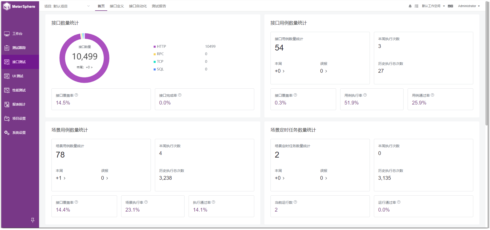

# 项目介绍

!!! ms-abstract ""
	MeterSphere 是一站式开源持续测试平台，涵盖测试跟踪、接口测试、UI 测试和性能测试等，全面兼容 JMeter、Selenium 等主流开源标准，有效助力开发和测试团队在线共享协作，实现端到端的测试管理跟踪可视化、自动化测试、性能测试及融入持续交付 DevOps 体系，并充分利用云弹性进行高度可扩展的自动化测试，从而加速高质量的软件交付，推动中国测试行业整体效率的提升。

{ width="900px" }

## 1 产品优势

!!! ms-abstract ""

    - **开源**：基于开源、兼容开源，按月发布新版本、日均下载安装超过100次、被大量用户验证。
    - **一站式**：全面涵盖测试跟踪、接口测试、UI测试、性能测试并打通联动。
    - **全生命周期**：满足从测试计划、测试执行到测试报告分析的全生命周期需求。
    - **持续测试**：无缝对接 Bug 管理工具和持续集成工具等，将测试融入持续交付和 DevOps 体系。
    - **团队协作**：支持团队协作和资产沉淀，无论团队规模如何，总有适合的落地方式。

## 2 主要功能

!!! ms-abstract ""

    - **测试跟踪**：对接主流项目管理平台，测试过程全链路跟踪管理；列表脑图模式自由切换，用例编写更简单、测试报告更清晰。
    - **接口测试**：集 JMeter、PostMan 易用性和功能性于一体； 支持API 管理、Mock 服务、场景编排、扩展协议等。
    - **UI 测试**：基于 Selenium 浏览器自动化，高度可复用的测试脚本；无需复杂的代码编写，人人都可开展的低代码自动化测试。
    - **性能测试**：兼容 JMeter 的同时补足其分布式、监控与报告以及管理短板；帮助团队实现高并发、分布式的性能压测，完成压测任务的统一调度与管理。

## 3 界面展示

{ width="900px" }

## 4 了解更多
!!! ms-abstract ""

    - [获取《持续测试白皮书》](https://fit2cloud.com/whitepaper/metersphere-whitepaper_202309.pdf)
    - [如何向团队介绍 MeterSphere？](https://fit2cloud.com/metersphere/download/introduce-metersphere_202306.pdf)
    - [MeterSphere 知识库](https://kb.fit2cloud.com/categories/metersphere)
    - [MeterSphere 社区论坛](https://bbs.fit2cloud.com/c/ms/8)
    - [MeterSphere 培训和认证](https://edu.fit2cloud.com/index)
