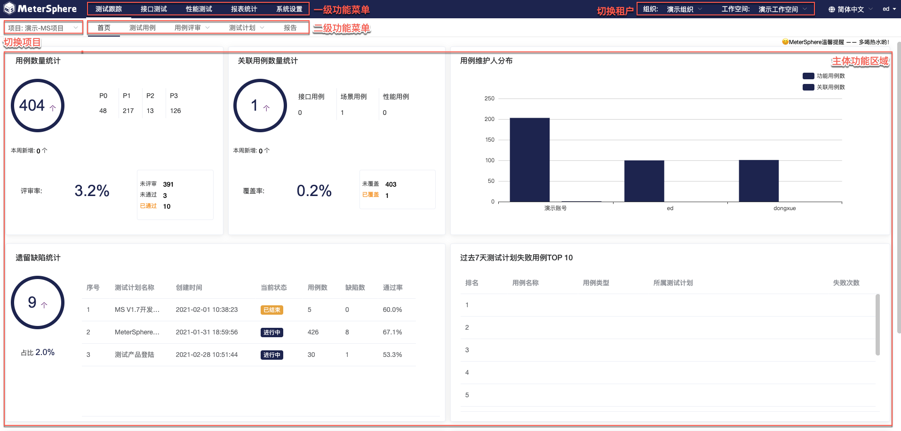

# 项目介绍

欢迎使用 MeterSphere。

MeterSphere 是一站式开源持续测试平台，涵盖测试跟踪、接口测试、性能测试、团队协作等功能，兼容JMeter 等开源标准，有效助力开发和测试团队充分利用云弹性进行高度可扩展的自动化测试，加速高质量软件的交付。

## 界面展示

!!! info "快速体验 MeterSphere"

-   [演示视频](https://www.bilibili.com/video/BV1yp4y1p72C/)
-   [在线体验](https://jinshuju.net/f/WuI6IO)

## 产品优势

-   **开源**：基于开源、兼容开源；按月发布新版本、日均下载安装超过100次、被大量客户验证；
-   **一站式**：一个产品全面涵盖测试跟踪、接口测试、性能测试等功能并形成联动：其中用例管理是底座需求、接口自动化测试是高频需求、性能测试是专家服务为主工具为辅；一个产品全满足从测试计划、测试执行到测试报告分析的全生命周期需求；
-   **持续测试**：能将测试融入持续交付和 DevOps 体系；无缝对接 Bug 管理工具和持续集成工具等；支持团队协作和资产沉淀。

## 主要功能

<!-- 添加截图 -->

-   **测试跟踪**: 远超 TestLink 的使用体验，覆盖从编写用例到生成测试报告的完整流程；
-   **接口测试**: 集 Postman 的易用与 JMeter 的灵活于一体，接口管理、多协议支持、场景自动化，你想要的全都有；
-   **性能测试**: 兼容 JMeter，支持 Kubernetes 和云环境，轻松支持高并发、分布式的性能测试；
-   **团队协作**: 用户管理、租户管理、权限管理、资源管理，无论团队规模如何，总有适合的落地方式。

## 功能列表

<table>
  <td bgcolor="#783887" align="middle" style="font-weight:bold;color: white">
   功能模块
  </td>
  <td bgcolor="#783887" align="middle" style="font-weight:bold;color: white">
   一级功能
  </td>
  <td bgcolor="#783887" align="middle" style="font-weight:bold;color: white">
   一级功能描述
  </td>
  <tbody>
    <tr>
        <td rowspan="24">测试跟踪</td>
        <td rowspan="9">测试用例管理</td>
        <td>表单方式编辑用例</td>
    </tr>
    <tr>
        <td>脑图方式编辑用例</td>
    </tr>
    <tr>
        <td>以树状形式展示项目的模块及用例</td>
    </tr>
    <tr>
        <td>支持配置用例自定义字段</td>
    </tr>
    <tr>
        <td>功能用例关联接口、性能用例</td>
    </tr>
    <tr>
        <td>与Jira、TAPD、禅道等平台上的需求进行关联</td>
    </tr>
    <tr>
        <td>与Jira、TAPD、禅道等平台上的缺陷进行关联</td>
    </tr>
    <tr>
        <td>支持查看用例变更历史</td>
    </tr>
    <tr>
        <td>通过Excel、Xmind格式快速导入、导出用例</td>
    </tr>
    <tr>
        <td rowspan="4">测试用例评审</td>
        <td>快速选择已有用例发起评审</td>
    </tr>
    <tr>
        <td>同时支持列表及脑图两种评审方式</td>
    </tr>
    <tr>
        <td>支持自定义评审人</td>
    </tr>
    <tr>
        <td>在线添加评审评论及更新评审结果</td>
    </tr>
    <tr>
        <td rowspan="7">测试计划跟踪</td>
        <td>快速选择已有用例发起测试计划</td>
    </tr>
    <tr>
        <td>支持在线更新用例执行结果</td>
    </tr>
    <tr>
        <td>支持列表及脑图两种交互方式</td>
    </tr>
    <tr>
        <td>同时添加功能用例、接口用例、性能用例等多种用例类型</td>
    </tr>
    <tr>
        <td>支持手动执行、定时任务、Jenkins插件触发等多种执行方式</td>
    </tr>
    <tr>
        <td>在线生成多种多种用例类型汇总的测试报告，支持自定义测试报告模板</td>
    </tr>
    <tr>
        <td>测试报告导出</td>
    </tr>
    <tr>
        <td rowspan="4">缺陷管理</td>
        <td>在线创建缺陷</td>
    </tr>
    <tr>
        <td>支持缺陷与用例关联</td>
    </tr>
    <tr>
        <td>对接并同步Jira、TAPD、禅道等平台上的缺陷</td>
    </tr>
    <tr>
        <td>支持配置缺陷自定义字段</td>
    </tr>
    <tr>
        <td rowspan="32">接口测试</td>
        <td rowspan="15">接口定义</td>
        <td>在线添加并编辑接口定义</td>
    </tr>
    <tr>
        <td>以树状形式展示项目的模块及对应接口</td>
    </tr>
    <tr>
        <td>支持HTTP、Dubbo、SQL、TCP类型接口请求</td>
    </tr>
    <tr>
        <td>支持通过MeterSphere Json、Postman、Swagger 等多种格式文件快速导入接口</td>
    </tr>
    <tr>
        <td>支持接口快捷调试</td>
    </tr>
    <tr>
        <td>根据接口定义快速配置Mock服务</td>
    </tr>
    <tr>
        <td>接口列表、用例列表、文档模式多种模式灵活切换</td>
    </tr>
    <tr>
        <td>测试环境信息管理功能</td>
    </tr>
    <tr>
        <td>单接口用例支持引用环境</td>
    </tr>
    <tr>
        <td>支持正则匹配、jsonpath、xpath等多种类型的断言规则</td>
    </tr>
    <tr>
        <td>支持正则匹配、jsonpath、xpath等多种类型的参数提取</td>
    </tr>
    <tr>
        <td>支持BeanShell、Python、Groovy、JavaScript等多种语言的前后置脚本</td>
    </tr>
    <tr>
        <td>支持上传并引用自定义Jar包</td>
    </tr>
    <tr>
        <td>支持查看接口及用例变更历史</td>
    </tr>
    <tr>
        <td>手动执行、定时任务、Jenkins插件触发等多种执行方式</td>
    </tr>
    <tr>
        <td rowspan="14">接口自动化</td>
        <td>创建多接口串联的场景化测试</td>
    </tr>
    <tr>
        <td>从接口列表中快速导入接口或接口用例</td>
    </tr>
    <tr>
        <td>跨项目的场景引用功能</td>
    </tr>
    <tr>
        <td>客户端SSL证书认证配置</td>
    </tr>
    <tr>
        <td>场景用例支持引用环境</td>
    </tr>
    <tr>
        <td>支持条件、循环、事务等多种类型的控制器</td>
    </tr>
    <tr>
        <td>支持正则匹配、jsonpath、xpath等多种类型的断言规则</td>
    </tr>
    <tr>
        <td>支持正则匹配、jsonpath、xpath等多种类型的参数提取</td>
    </tr>
    <tr>
        <td>支持BeanShell、Python、Groovy、JavaScript等多种语言的前后置脚本</td>
    </tr>
    <tr>
        <td>支持上传并引用自定义Jar包</td>
    </tr>
    <tr>
        <td>支持查看场景用例变更历史</td>
    </tr>
    <tr>
        <td>手动执行、定时任务、Jenkins插件触发等多种执行方式</td>
    </tr>
    <tr>
        <td>串行、并行两种批量执行方式自由选择</td>
    </tr>
    <tr>
        <td>支持指定测试资源池远程执行</td>
    </tr>
    <tr>
        <td rowspan="3">测试报告</td>
        <td>测试执行后自动生成测试报告</td>
    </tr>
    <tr>
        <td>批量执行时支持生成整合报告</td>
    </tr>
    <tr>
        <td>测试报告导出</td>
    </tr>
    <tr>
        <td rowspan="13">性能测试</td>
        <td rowspan="7">测试管理</td>
        <td>支持上传JMX、CSV、JAR格式文件创建性能测试</td>
    </tr>
    <tr>
        <td>支持按线程组分别配置压力参数</td>
    </tr>
    <tr>
        <td>通过浏览器插件快速录制测试脚本</td>
    </tr>
    <tr>
        <td>自定义域名解析</td>
    </tr>
    <tr>
        <td>多节点执行时支持分割CSV数据文件</td>
    </tr>
    <tr>
        <td>支持添加监控对象</td>
    </tr>
    <tr>
        <td>通过接口用例、接口自动化场景用例快速创建性能测试</td>
    </tr>
    <tr>
        <td rowspan="2">测试执行</td>
        <td>指定测试资源池分布式执行</td>
    </tr>
    <tr>
        <td>手动执行、定时任务、Jenkins插件触发等多种执行方式</td>
    </tr>
    <tr>
        <td rowspan="4">测试报告</td>
        <td>测试报告数据实时刷新</td>
    </tr>
    <tr>
        <td>集成监控系统汇总监控数据</td>
    </tr>
    <tr>
        <td>多次测试报告对比功能</td>
    </tr>
    <tr>
        <td>测试报告导出</td>
    </tr>
    <tr>
        <td rowspan="20">系统管理</td>
        <td rowspan="5">用户租户管理</td>
        <td>支持多级租户体系</td>
    </tr>
    <tr>
        <td>自定义配置用户角色及权限</td>
    </tr>
    <tr>
        <td>支持LDAP认证对接</td>
    </tr>
    <tr>
        <td style="background-color: #7838874d;">单点登录系统对接（X-Pack）</td>
    </tr>                    
    <tr>
        <td style="background-color: #7838874d;">租户配额管理（X-Pack）</td>
    </tr>                    
    <tr>
        <td rowspan="2">项目管理</td>
        <td>以项目为单位管理各种测试资源</td>
    </tr>
    <tr>
        <td>跨项目的测试用例共享</td>
    </tr>
    <tr>
        <td rowspan="4">测试资源管理</td>
        <td>测试资源池管理</td>
    </tr>
    <tr>
        <td>独立节点资源池</td>
    </tr>                                                                 
    <tr>
        <td style="background-color: #7838874d;">Kubernetes资源池（X-Pack）</td>
    </tr>                                                                 
    <tr>
        <td>测试资源池支持接口测试、性能测试执行</td>
    </tr>                                                                 
    <tr>
        <td rowspan="4">消息通知配置</td>
        <td>支持企业微信、钉钉、飞书等多种IM工具</td>
    </tr>
    <tr>
        <td>支持邮件通知配置</td>
    </tr>
    <tr>
        <td>自定义通知事件及通知人</td>
    </tr>
    <tr>
        <td style="background-color: #7838874d;">自定义消息通知模板（X-Pack）</td>
    </tr>
    <tr>
        <td rowspan="3">集成与扩展</td>
        <td>提供完善的API</td>
    </tr>
    <tr>
        <td>支持对接Jenkins等持续集成工具</td>
    </tr>
    <tr>
        <td>支持对接Jira、TAPD、禅道等平台</td>
    </tr>
    <tr>
        <td rowspan="2">系统设置</td>
        <td style="background-color: #7838874d;">自定义LOGO与主题配色（X-Pack）</td>
    </tr>
    <tr>
        <td style="background-color: #7838874d;">功能模块启用禁用控制（X-Pack）</td>
    </tr>                          
  </tbody>
</table>

## 企业版试用

-   [申请企业版试用](https://jinshuju.net/f/CzzAOe)

## 参考资料

-   [持续测试白皮书 v1.0](https://jinshuju.net/f/KqFUhq)
-   [如何构建持续测试平台？](https://metersphere.io/download/how_to_build_a_continous_platform-202101.pdf)
-   [揭秘MeterSphere一站式开源持续测试平台](https://live.vhall.com/725359622)
-   [MeterSphere 的初心和使命](https://mp.weixin.qq.com/s/DpCt3BNgBTlV3sJ5qtPmZw)
