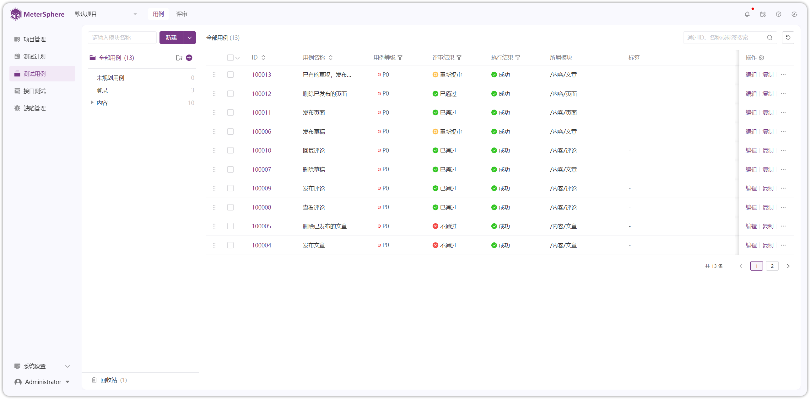
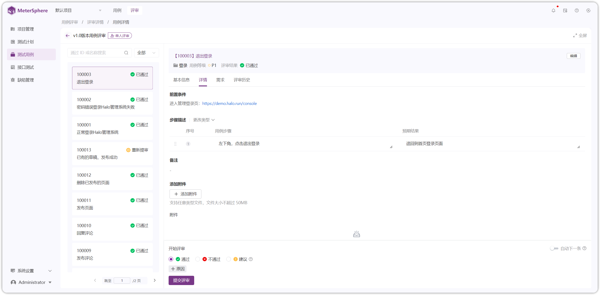
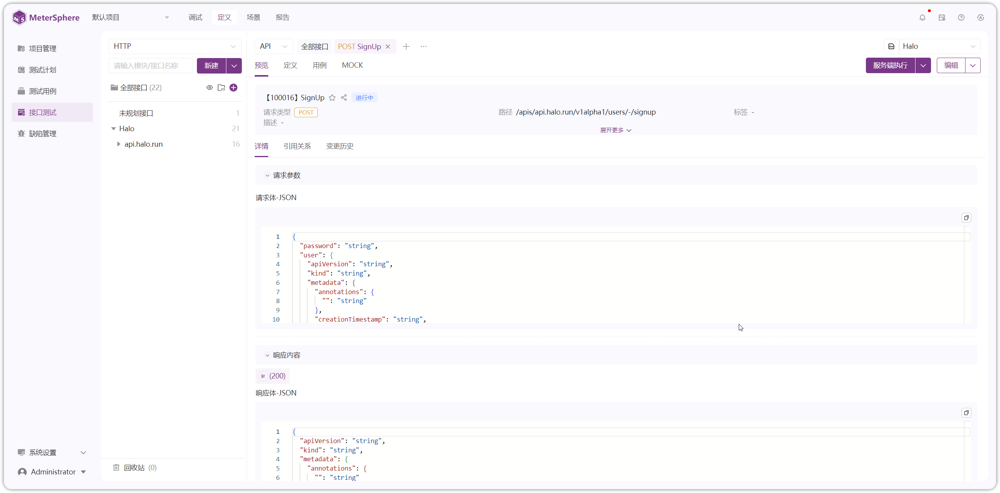
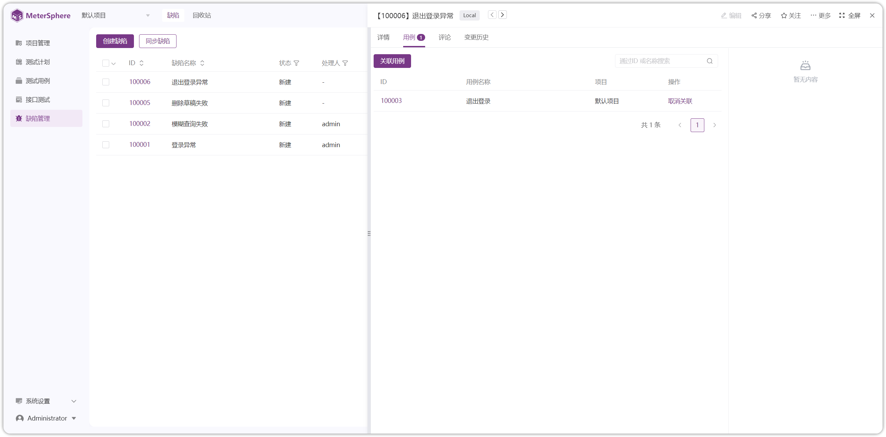

# 项目介绍

!!! ms-abstract ""
	MeterSphere 是新一代的测试管理和接口测试工具，让软件测试工作更简单、更高效，不再成为持续交付的瓶颈。

	- **测试管理**: 从测试用例管理，到测试计划执行、缺陷管理、测试报告生成，具有远超 TestLink 等传统测试管理工具的使用体验。
	- **接口测试**: 集 Postman 的易用与 JMeter 的灵活于一体，接口调试、接口定义、接口 Mock、场景自动化、接口报告，你想要的都有。
	- **团队协作**: 采用“系统-组织-项目”分层设计理念，帮助用户摆脱单机测试工具的束缚，方便快捷地开展团队协作。
    - **插件体系**: 提供各种类别的插件，用户可以按需取用，快速实现 MeterSphere 测试能力的扩展以及与 DevOps 流水线的集成。

## 1 界面展示

{ width="900px" }
{ width="900px" }
{ width="900px" }
{ width="900px" }
{ width="900px" }
{ width="900px" }
{ width="900px" }
{ width="900px" }

## 2 了解更多
!!! ms-abstract ""

    - [获取《持续测试白皮书》](https://fit2cloud.com/whitepaper/metersphere-whitepaper_202309.pdf)

[//]: # (    - [如何向团队介绍 MeterSphere？]&#40;https://fit2cloud.com/metersphere/download/introduce-metersphere_202306.pdf&#41;)
    - [MeterSphere 知识库](https://kb.fit2cloud.com/categories/metersphere)
    - [MeterSphere 社区论坛](https://bbs.fit2cloud.com/c/ms/8)
    - [MeterSphere 培训和认证](https://edu.fit2cloud.com/index)
