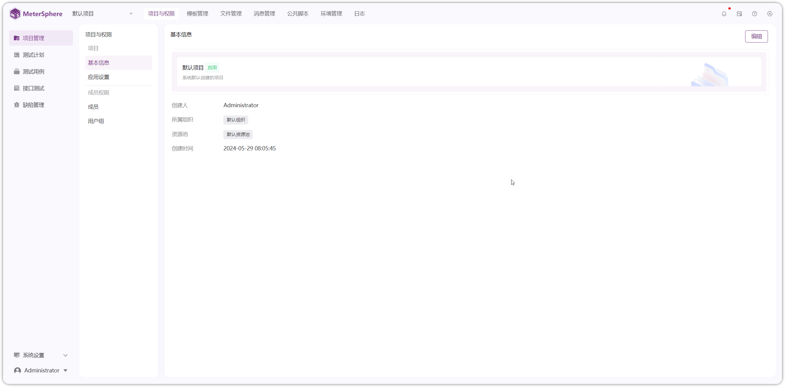

# 项目介绍

!!! ms-abstract ""
	MeterSphere 是新一代的测试管理和接口测试工具，让测试工作更简单、更高效，不再成为持续交付的瓶颈。

	- **测试管理**: 从测试用例管理，到测试计划执行、缺陷管理、测试报告生成，具有远超禅道和 TestLink 的使用体验。
	- **接口测试**: 集 Postman 的易用与 JMeter 的灵活于一体，接口定义、接口调试、接口 Mock、场景自动化、接口报告，你想要的都有。
	- **团队协作**: 摆脱单机测试工具的束缚，支持团队协作并对接 DevOps 工具链，将测试融入持续交付体系。

## 1 界面展示

{ width="900px" }
{ width="900px" }
{ width="900px" }
{ width="900px" }
{ width="900px" }
{ width="900px" }
{ width="900px" }
{ width="900px" }

## 2 了解更多
!!! ms-abstract ""

    - [获取《持续测试白皮书》](https://fit2cloud.com/whitepaper/metersphere-whitepaper_202309.pdf)
    - [如何向团队介绍 MeterSphere？](https://fit2cloud.com/metersphere/download/introduce-metersphere_202306.pdf)
    - [MeterSphere 知识库](https://kb.fit2cloud.com/categories/metersphere)
    - [MeterSphere 社区论坛](https://bbs.fit2cloud.com/c/ms/8)
    - [MeterSphere 培训和认证](https://edu.fit2cloud.com/index)
