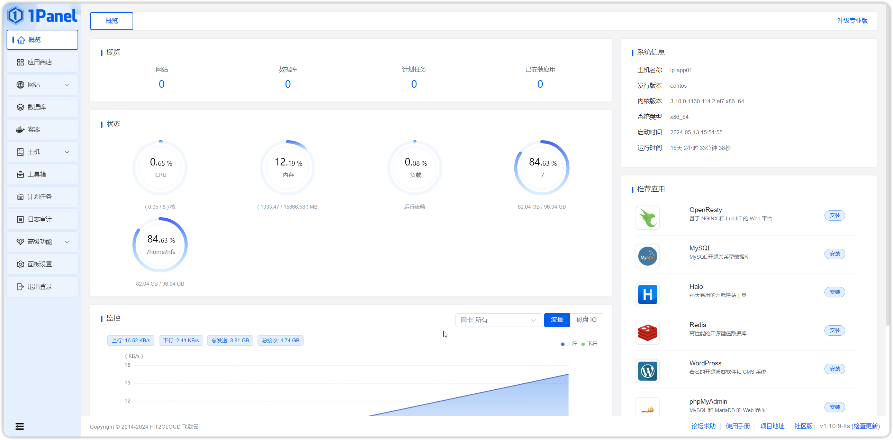

## 1 安装 1Panel
!!! ms-abstract ""
    关于 1Panel 的安装部署与基础功能介绍，请参考[1Panel 官方文档](https://1panel.cn/docs/installation/online_installation/)。在完成了 1Panel 的安装部署后，根据提示网址打开浏览器进入 1Panel，如下界面。
{ width="900px" }
