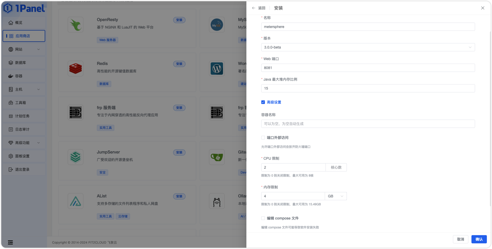

## 1 安装 1Panel

!!! ms-abstract ""
    关于 1Panel 的安装部署与基础功能介绍，请参考 [1Panel 官方文档](https://1panel.cn/docs/installation/online_installation/)。在完成了 1Panel 的安装部署后，根据提示网址打开浏览器进入 1Panel，如下界面。

{ width="900px" }

## 2 安装 MeterSphere

!!! ms-abstract ""
    安装好 1Panel 后，进入应用商店应用列表，找到 MeterSphere 应用进行安装。在应用详情页选择 v3.x 最新的 MeterSphere 版本进行安装。
{ width="900px" }

{ width="900px" }


!!! ms-abstract ""

    * 名称：要创建的 MeterSphere 应用的名称。
    * 版本：要安装的 MeterSphere 应用版本。
    * Web 端口：MeterSphere 应用的服务端口。
    * JAVA 最大堆内存比例：JAVA 最大堆内存比例，默认 15%。
    * 容器名称：MeterSphere 应用容器名称。
    * 端口外部访问：MeterSphere 应用可以使用 IP:PORT 进行访问（MeterSphere 应用必须打开外部端口访问）。
    * CPU 限制：MeterSphere 应用可以使用的 CPU 核心数。
    * 内存限制：MeterSphere 应用可以使用的内存大小。

{ width="900px" }

!!! ms-abstract ""
    点击开始安装后，页面自动跳转到已安装应用列表，等待安装的 MeterSphere 应用状态变为已启动。

## 3 访问 MeterSphere

!!! ms-abstract ""
    安装成功后，通过浏览器访问如下页面登录 MeterSphere：

    ```
    地址: http://目标服务器IP地址:服务运行端口（默认 8081）
    用户名: admin
    密码: metersphere
    ```

{ width="900px" }


