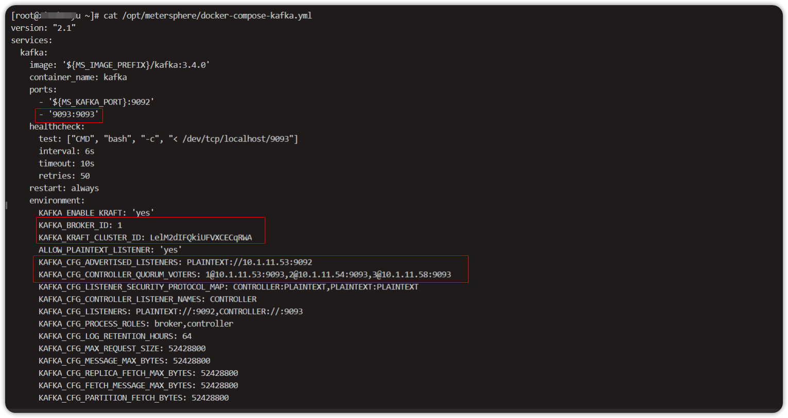
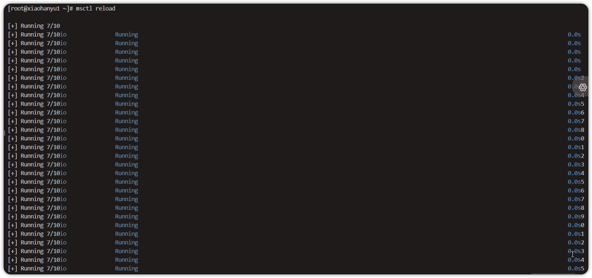
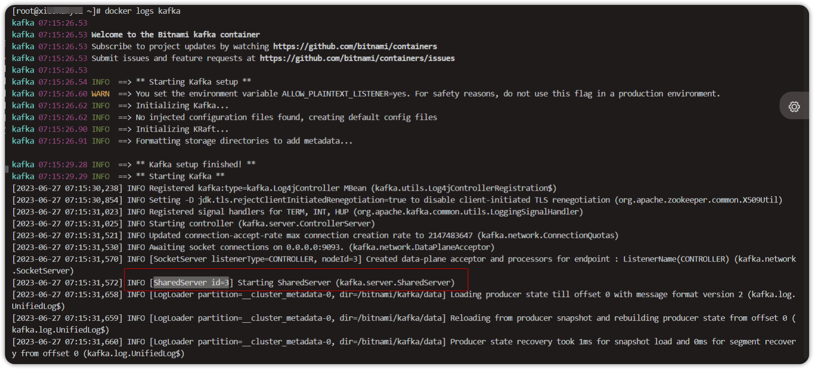

!!! ms-abstract ""
    MeterSphere 配置 kafka 集群方案采用安装包自带的 kafka3.4 配置集群。本方案分别部署了三个独立的 MeterSphere 服务，然后把这三个独立的 MeterSphere 的 kafka 关联成集群。如需做流量转发可以将三个服务配置到 NGINX 做流量转发。<br/>
    Kafka 3.0 之前的架构: 元数据在 zookeeper 中，运行时动态选举 controller，由 controller 进行 Kafka 集群管理。kraft 模式架构: 不再依赖 zookeeper 集群，而是用三台 controller 节点代替 zookeeper，元数据保存在 controller 中，由 controller 直接进行 Kafka 集群管理。<br />
    Kafka 集群提供了高可靠性、高吞吐量、水平扩展性、容错性、实时处理和持久性存储等优势，使其成为卓越的分布式消息队列和数据流平台，在大规模数据处理、实时数据管道和流式处理等方面发挥着关键作用。

## 1 kraft 架构的好处
!!! ms-abstract ""
    - Kafka 不再依赖外部框架，而是能够独立运行。 <br>
    - controller 管理集群时，不再需要从 zookeeper 中先读取数据，集群性能上升。 <br>
    - 由于不依赖 zookeeper，集群扩展时不再受到 zookeeper 读写能力限制 controller 不再动态选举，而是由配置文件规定，这样我们可以有针对性的加强 controller 节点的配置。 <br>
    - 后续版本升级方便，不用和 zookeeper 一起维护。
  
## 2 部署 MeterSphere 服务
!!! ms-abstract ""
    申请三台服务器分别部署 MeterSphere 服务，部署步骤请参考 [Linux单机部署离线安装](../installation/offline_installation.md)。

## 3 服务安装完成后，三台服务分别修改docker-compose-kafka.yml 配置文件为集群模式。
!!! ms-abstract ""
    vi /opt/metersphere/docker-compose-kafka.yml 配置
    ```
        version: "2.1"
      services:
        kafka:
          image: '${MS_IMAGE_PREFIX}/kafka:3.4.0'
          container_name: kafka
          ports:
            - '${MS_KAFKA_PORT}:9092'
            - '9093:9093'     #开放9093端口
          healthcheck:
            test: ["CMD", "bash", "-c", "< /dev/tcp/localhost/9093"]
            interval: 6s
            timeout: 10s
            retries: 50
          restart: always
          environment:
            KAFKA_ENABLE_KRAFT: 'yes'
            KAFKA_BROKER_ID: 3        #标识 Kafka 集群中的每个 Broker（代理）的唯一ID三个服务器上配置分别为 1 2 3 
            KAFKA_KRAFT_CLUSTER_ID: LelM2dIFQkiUFVXCECqRWA  #集群配置一个集群ID
            ALLOW_PLAINTEXT_LISTENER: 'yes'
            KAFKA_CFG_ADVERTISED_LISTENERS: PLAINTEXT://10.1.11.58:9092  #roker 对外暴露的地址，需要填写每个节点真实的 ip 和端口
            KAFKA_CFG_CONTROLLER_QUORUM_VOTERS: 1@10.1.11.53:9093,2@10.1.11.54:9093,3@10.1.11.58:9093  #所有的 controller 列表，三个配置文件都填一样。格式：1@ip1:9093，2@ip2:9093，3@ip3:9093
            KAFKA_CFG_LISTENER_SECURITY_PROTOCOL_MAP: CONTROLLER:PLAINTEXT,PLAINTEXT:PLAINTEXT
            KAFKA_CFG_CONTROLLER_LISTENER_NAMES: CONTROLLER
            KAFKA_CFG_LISTENERS: PLAINTEXT://:9092,CONTROLLER://:9093
            KAFKA_CFG_PROCESS_ROLES: broker,controller
            KAFKA_CFG_LOG_RETENTION_HOURS: 64
            KAFKA_CFG_MAX_REQUEST_SIZE: 52428800
            KAFKA_CFG_MESSAGE_MAX_BYTES: 52428800
            KAFKA_CFG_REPLICA_FETCH_MAX_BYTES: 52428800
            KAFKA_CFG_FETCH_MESSAGE_MAX_BYTES: 52428800
            KAFKA_CFG_PARTITION_FETCH_BYTES: 52428800
            KAFKA_HEAP_OPTS: '-Xmx512m -Xms256m'
            FORMAT_MESSAGES_PATTERN_DISABLE_LOOKUPS: 'true'
          networks:
            - ms-network
        data-streaming:
          depends_on:
            kafka:
              condition: service_healthy
    ```
    以 v2.10.0 版本为例，KAFKA_ENABLE_KRAFT: 'yes'，默认允许 kraft 集群模式，我们只需要把其他节点加入到集群中即可。需要修改的配置项包括 KAFKA_CFG_ADVERTISED_LISTENERS、KAFKA_CFG_CONTROLLER_QUORUM_VOTERS、KAFKA_BROKER_ID需要添加的配置项包括 KAFKA_KRAFT_CLUSTER_ID、ports 9093端口；具体内容见上述配置文件注释说明。

{ width="900px" }
{ width="900px" }
{ width="900px" }

## 4 分别修改三台 MeterSphere 服务docker配置文件，将使用到 kafka 集群的配置项改为 KAFKA_BOOTSTRAP-SERVERS：ip1:9092,ip2:9092,ip3:9092。
!!! ms-abstract ""
    cd /opt/metersphere 需修改文件:
    
    - vi docker-compose-project-management.yml 
    -  vi docker-compose-ui-test.yml
    -  vi docker-compose-gateway.yml
    -  vi docker-compose-workstation.yml
    -  vi docker-compose-report-stat.yml
    -  vi docker-compose-api-test.yml
    -  vi docker-compose-seleniarm.yml 
    -  vi docker-compose-system-setting.yml
    -  vi docker-compose-data-streaming.yml
    -  vi docker-compose-performance-test.yml
    -  vi docker-compose-test-track.yml

{ width="900px" }


## 5 所有配置修改完成，msctl reload 生效即可创建 kraft 集群。

!!! ms-abstract ""
    以上内容配置好之后，使用 msctl reload 命令重新加载配置文件，即可创建 kraft 集群。
 { width="900px" }
{ width="900px" }

{ width="900px" }

{ width="900px" }