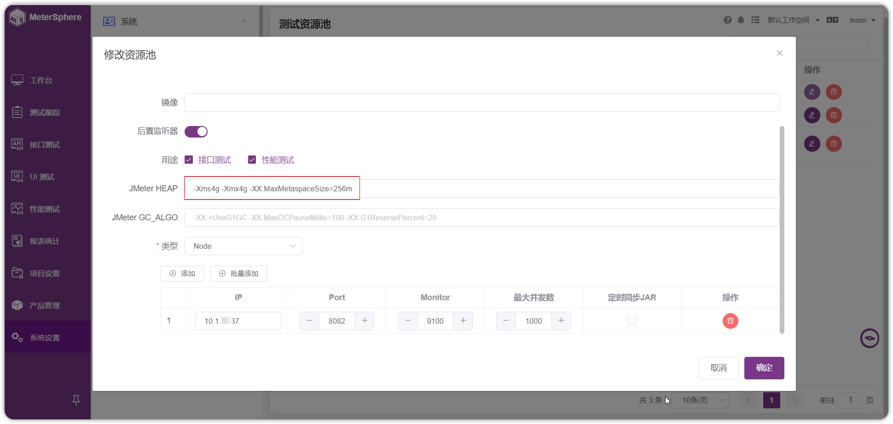
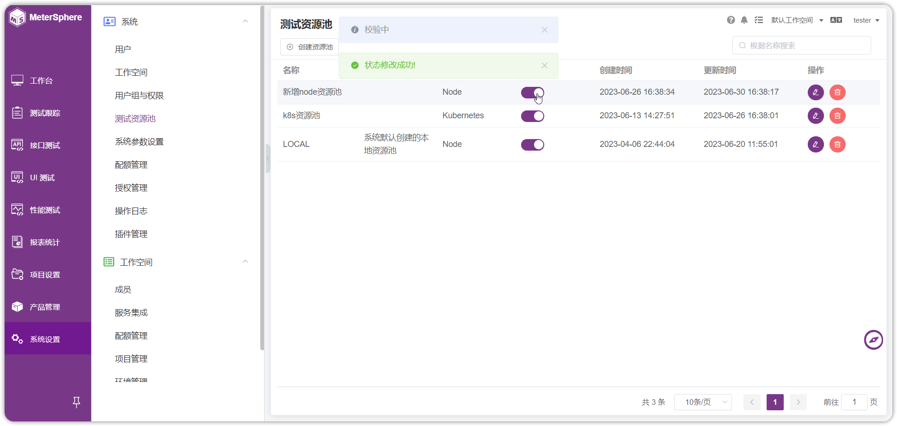

!!! ms-abstract ""
    如采用独立主机压测，需要部署 Node-Controller，部署过程可以参考 https://metersphere.io/docs/v2.x/installation/online_installation/ 。 
    进入安装包所在目录，将 install.conf 中修改安装模式 MS_INSTALL_MODE 的值(由原先的 allinone 改为 node-controller)，安装包路径下执行 /bin/bash install.sh 即可。

    
    - 安装完成后，在【系统设置-测试资源池】添加资源池，填写完整资源池 ip、端口信息即可。
    - 如果测试资源并发要求较大，可以将资源池中 JMeter 的内存配置，建议调整到 4G 以上。-Xms4g -Xmx4g -XX:MaxMetaspaceSize=256m
    - 最后，资源池配置完成后，需要在资源池列表启用资源池，校验通过即可使用。
  
    { width="900px" }
    { width="900px" }