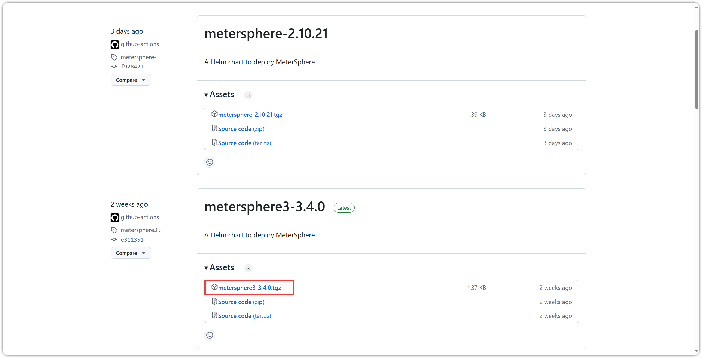
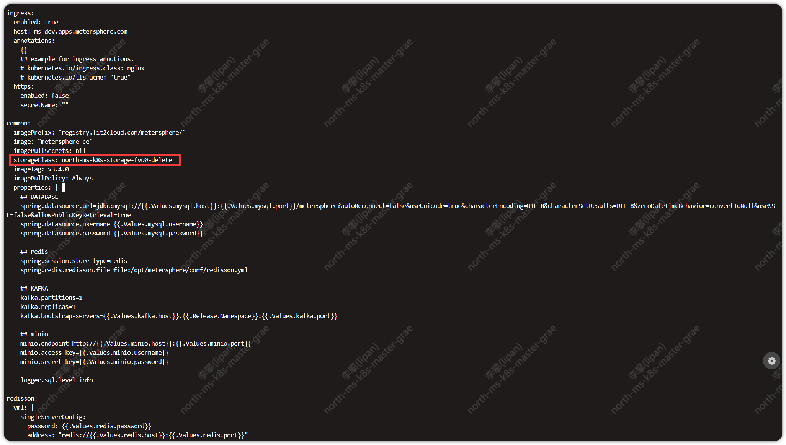
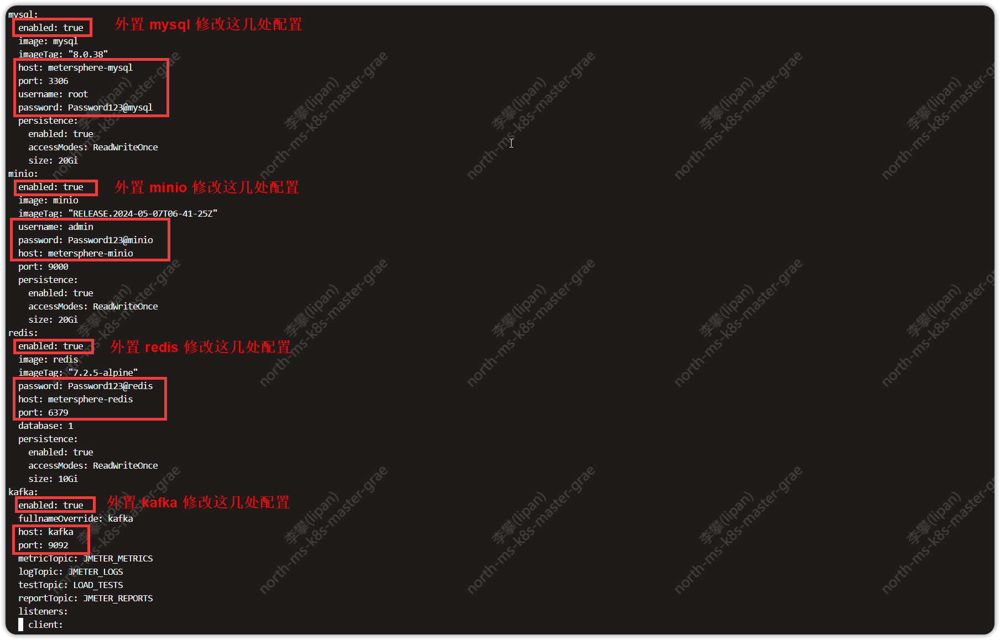
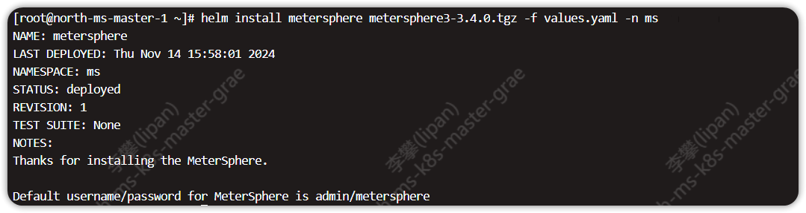
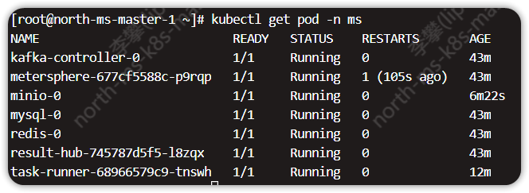
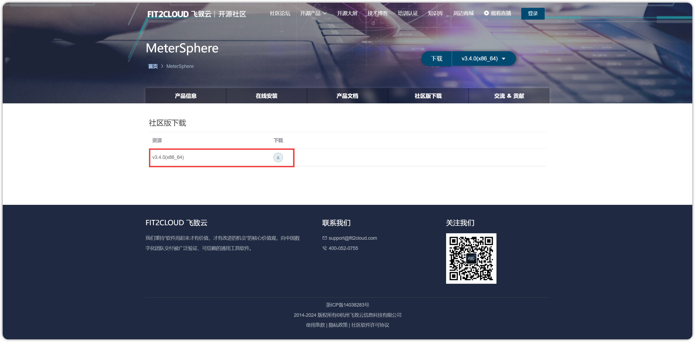
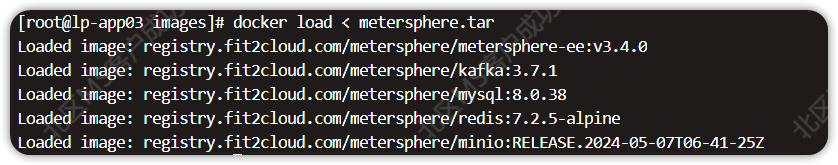

## 1 helm-chart 部署
!!! ms-abstract "下载 helm-chart 包"
    下载地址：https://github.com/metersphere/helm-chart/releases
{ width="900px" }

!!! ms-abstract "修改配置文件"
    ```
    tar -zxvf metersphere3-3.4.0.tgz
    cd metersphere3
    vi values.yaml
    ```
{ width="900px" }

{ width="900px" }

!!! ms-abstract "配置说明"
    - 【StorageClass】默认是 defalut，根据需要修改为已有的 StorageClass 即可。
    - 【enabled】默认内置为 true，外置则改为 false。
    - 【host】具体的 IP 地址。
    - 【port】具体端口地址。
    - 【username】用户名。
    - 【password】密码。

!!! ms-abstract "执行安装命令"
    ```
    helm install metersphere metersphere3-3.4.0.tgz -f values.yaml -n ms
    ```
{ width="900px" }

!!! ms-abstract "查询服务状态"
    ```
     kubectl get pod -n ms
    ```
{ width="900px" }

!!! ms-abstract "注意："
    若是无网环境，先下载离线包导入镜像后，再执行安装命令，下载地址：https://community.fit2cloud.com/#/products/metersphere/downloads
{ width="900px" }

!!! ms-abstract ""
    ```
    tar -zxvf metersphere-ce-offline-installer-v3.4.0.tar.gz
    cd metersphere-ce-offline-installer-v3.4.0/images
    docker load < metersphere.tar
    ```
{ width="900px" }


## 2 helm-chart 升级
!!! ms-abstract "升级步骤"
    下载新版本镜像导入环境、下载最新的离线 helm-chart 包，修改 values.yaml 配置文件，均可参考 [离线安装](./#1)，执行更新命令即可。
    ```
    helm upgrade metersphere metersphere3-3.4.0.tgz -f values.yml -n ms
    ```

## 3 创建Node Port访问方式
!!! ms-abstract "操作步骤"
    使用命令 kubectl get svc -n ms 可查看 metersphere 所占用的端口号。如果不使用 ingress 的访问方式，可以创建一个 nodeport。
    ```
    vi ms-nodeport.yaml

    apiVersion: v1
    kind: Service
    metadata:
      name: metersphere-nodeport
      namespace: ms
    spec:
      ports:
        - name: metersphere
          protocol: TCP
          port: 8081
          targetPort: 8081
          nodePort: 30801
      type: NodePort
      selector:
        app: metersphere

    kubectl create -f ms-nodeport.yaml
    ```
    访问 MeterSphere 页面: http://nodeIP:30801
