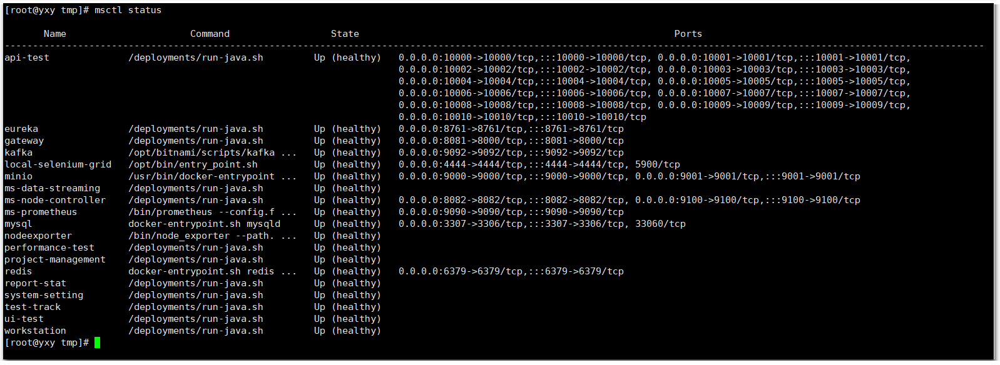

## 1 环境要求

!!! info "部署服务器要求"
    * 操作系统: CentOS 7.x / Redhat 7.x
    * CPU/内存: 最低要求 4C8G，推荐 8C16G
    * 磁盘空间: 50G

## 2 下载安装包

请自行下载 MeterSphere 最新版本的离线安装包，并复制到目标机器的 /tmp 目录下。

!!! tip ""
    安装包下载链接: https://community.fit2cloud.com/#/products/metersphere/downloads

## 3 解压安装包

以 root 用户 ssh 登录到目标机器, 并执行如下命令。

```sh
cd /tmp
# 解压安装包
tar zxvf metersphere-release-v2.3.0-offline.tar.gz
```

## 4 修改安装配置(可选)
### 4.1 解压

在安装包解压后的目录，编辑修改安装参数。

```sh
cd metersphere-release-v2.3.0-offline
vim install.conf
```
### 4.2 安装配置文件说明

!!! info "安装配置文件说明, 如果无特殊需求可以不进行修改采用默认参数安装（修改配置 install.conf 文件中相关配置，修改完后执行 /bin/bash install.sh 命令进行安装）"
    ```vim
    # 基础配置
    ## 安装路径, MeterSphere 配置及数据文件默认将安装在 ${MS_BASE}/metersphere 目录下
    MS_BASE=/opt
    ## MeterSphere 使用的 docker 网络网段信息
    MS_DOCKER_SUBNET=172.30.10.0/24
    ## 镜像前缀, MeterSphere 相关组件使用的 Docker 镜像前缀, 例如 registry.cn-qingdao.aliyuncs.com/metersphere
    MS_IMAGE_PREFIX=registry.cn-qingdao.aliyuncs.com/metersphere
    ## 镜像标签, MeterSphere 相关组件使用的 Docker 镜像标签
    MS_IMAGE_TAG=v2.3.0
    ## 性能测试使用的 JMeter 镜像
    MS_JMETER_IMAGE=${MS_IMAGE_PREFIX}/jmeter-master:5.5-ms2-jdk11
    ## 安装模式
    MS_INSTALL_MODE=allinone
    ## MeterSphere 主程序的 HTTP 服务监听端口
    MS_SERVER_PORT=8081
    ## MeterSphere Node-Controller 组件的 HTTP 服务监听端口
    MS_NODE_CONTROLLER_PORT=8082
    MS_NODEEXPORTER_PORT=9100

    # 数据库配置
    ## 是否使用外部数据库
    MS_EXTERNAL_MYSQL=false
    ## 数据库地址
    MS_MYSQL_HOST=mysql
    ## 数据库端口
    MS_MYSQL_PORT=3306
    ## 数据库库名
    MS_MYSQL_DB=metersphere
    ## 数据库用户名
    MS_MYSQL_USER=root
    ## 数据库密码
    MS_MYSQL_PASSWORD=Password123@mysql

    # Prometheus 配置
    ## 是否使用外部Prometheus
    MS_EXTERNAL_PROM=false
    MS_PROMETHEUS_PORT=9090

    # Redis 配置
    ## 是否使用外部Redis
    MS_EXTERNAL_REDIS=false
    ## Redis 端口
    MS_REDIS_PORT=6379
    ## Redis 密码
    MS_REDIS_PASSWORD=Password123@redis
    ## Redis地址
    MS_REDIS_HOST=$(hostname -I|cut -d" " -f 1)

    # Kafka 配置
    ## 是否使用外部 Kafka
    MS_EXTERNAL_KAFKA=false
    ## Kafka 地址
    MS_KAFKA_HOST=10.1.*.*
    ## Kafka 端口
    MS_KAFKA_PORT=9092
    ## 性能测试结果数据使用的 Kafka Topic
    MS_KAFKA_TOPIC=JMETER_METRICS
    ## 性能测试日志数据使用的 Kafka Topic
    MS_KAFKA_LOG_TOPIC=JMETER_LOGS
    ## 性能测试定时任务通知使用的 Kafka Topic
    MS_KAFKA_TEST_TOPIC=LOAD_TESTS
    ## 重构后性能测试结果数据使用的 Kafka Topic
    MS_KAFKA_REPORT_TOPIC=JMETER_REPORTS

    # UI容器配置
    ## 是否启动UI模块
    MS_UI_ENABLED=false
    ## 是否启动工作台容器
    MS_WORKSTATION_ENABLED=false

    # minio 配置
    ## 是否使用外部minio
    MS_EXTERNAL_MINIO=false
    ## minio 地址
    MS_MINIO_ENDPOINT=http://minio:9000
    ## minio access
    MS_MINIO_ACCESS_KEY=admin
    ## minio 密码
    MS_MINIO_SECRET_KEY=Password123@minio
    ```

### 4.3 数据库配置文件说明

!!! info "注意"
    如果使用外部数据库进行安装，推荐使用 MySQL 5.7 版本。同时 MeterSphere 对数据库部分配置项有要求，请参考下附的数据库配置，修改环境中的数据库配置文件。

    ```
    [mysqld]
    datadir=/var/lib/mysql
    
    default-storage-engine=INNODB
    character_set_server=utf8mb4
    lower_case_table_names=1
    performance_schema=off
    table_open_cache=128
    transaction_isolation=READ-COMMITTED
    max_connections=1000
    max_connect_errors=6000
    max_allowed_packet=64M
    innodb_file_per_table=1
    innodb_buffer_pool_size=512M
    innodb_flush_method=O_DIRECT
    innodb_lock_wait_timeout=1800
    
    server-id=1
    log-bin=mysql-bin
    expire_logs_days = 2
    binlog_format=mixed
    
    character-set-client-handshake = FALSE
    character-set-server=utf8mb4
    collation-server=utf8mb4_general_ci
    init_connect='SET default_collation_for_utf8mb4=utf8mb4_general_ci'
    
    sql_mode=STRICT_TRANS_TABLES,NO_ZERO_IN_DATE,NO_ZERO_DATE,ERROR_FOR_DIVISION_BY_ZERO,NO_ENGINE_SUBSTITUTION
    
    skip-name-resolve
    
    [mysql]
    default-character-set=utf8mb4
    
    [mysql.server]
    default-character-set=utf8mb4
    ```
    
    请参考文档中的建库语句创建 MeterSphere 使用的数据库，metersphere-server 服务启动时会自动在配置的库中创建所需的表结构及初始化数据。
    ```mysql
    CREATE DATABASE `metersphere` /*!40100 DEFAULT CHARACTER SET utf8mb4 */
    ```

安装脚本默认使用 /opt/metersphere 目录作为安装目录，MeterSphere 的配置文件、数据及日志等均存放在该安装目录。

### 4.4 安装目录结构说明

!!! info "安装目录结构说明"
    ```
    /opt/metersphere/
    ├── bin                                         #-- 安装过程中需要加载到容器中的脚本
    ├── compose_files                               #-- 根据不同的安装模式，保存需要使用到的 compose 文件信息
    ├── conf                                        #-- MeterSphere 各组件及数据库等中间件的配置文件
    ├── data                                        #-- MeterSphere 各组件及数据库等中间件的数据持久化目录
    ├── docker-compose-gateway.yml                  #-- MeterSphere 的 API 网关
    ├── docker-compose-eureka.yml                   #-- MeterSphere 的服务注册中心
    ├── docker-compose-base.yml                     #-- MeterSphere 基础 Docker Compose 文件，定义了网络等基础信息 
    ├── docker-compose-workstation.yml              #-- MeterSphere 工作台模块的 Docker Compose 文件 
    ├── docker-compose-test-track.yml               #-- MeterSphere 测试跟踪模块的 Docker Compose 文件 
    ├── docker-compose-api-test.yml                 #-- MeterSphere 接口测试模块的 Docker Compose 文件 
    ├── docker-compose-ui-test.yml                  #-- MeterSphere UI 测试模块的 Docker Compose 文件 
    ├── docker-compose-performance-test.yml         #-- MeterSphere 性能测试模块的 Docker Compose 文件  
    ├── docker-compose-report-stat.yml              #-- MeterSphere 报表统计模块的 Docker Compose 文件  
    ├── docker-compose-project-management.yml       #-- MeterSphere 项目管理模块的 Docker Compose 文件  
    ├── docker-compose-system-setting.yml           #-- MeterSphere 系统设置模块的 Docker Compose 文件  
    ├── docker-compose-kafka.yml                    #-- MeterSphere 自带的 Kafka 所需的 Docker Compose 文件
    ├── docker-compose-mysql.yml                    #-- MeterSphere 自带的 MySQL 所需的 Docker Compose 文件
    ├── docker-compose-node-controller.yml          #-- MeterSphere Node-Controller 组件所需的 Docker Compose文件
    ├── docker-compose-redis.yml                    #-- MeterSphere Redis 组件所需的 Docker Compose文件
    ├── docker-compose-minio.yml                    #-- MeterSphere 自带的分布式对象存储服务
    ├── docker-compose-prometheus.yml               #-- MeterSphere Prometheus 组件所需的Docker Compose 文件
    ├── install.conf -> /opt/metersphere/.env       #-- MeterSphere 的配置文件 /opt/metersphere/.env 的软链接
    ├── logs                                        #-- MeterSphere 各组件的日志文件持久化目录
    └── version                                     #-- 安装包对应的 MeterSphere 版本信息
    ```

## 5 执行安装脚本

```sh
# 进入安装包目录
cd metersphere-release-v2.3.0-offline
# 运行安装脚本
/bin/bash install.sh
```

执行完安装脚本后，会在线拉取镜像，等提示安装完成后，可以用 msctl status 查看服务各个组件状态


等待2分钟至各个组件都是 healthy 状态后，可通过浏览器访问如下页面登录 MeterSphere。

```
请通过以下方式访问:
 URL: http://$LOCAL_IP:8081
 用户名: admin
 初始密码: metersphere
企业用户升级后需手动设置 install.conf 中的 MS_UI_ENABLED=true 和 MS_WORKSTATION_ENABLED=true 并执行 'msctl reload' 来开启UI和工作台功能
您可以使用命令 'msctl status' 检查服务运行情况.
```

## 6 配置反向代理
!!! warning "注意"
    如果需要使用 Nginx、Haproxy 等反向代理，需要配置反向代理对 websocket 的支持。以 Nginx 为例，参考的配置内容如下。
    ```
    server {
        listen 80;
        server_name demo.metersphere.com;
        server_tokens off;
        return 301 https://$host$request_uri;
    }
    server {
        listen 443 ssl;
        # RSA certificate
        ssl_certificate /etc/nginx/ssl/metersphere.com/fullchain.cer; # managed by Certbot
        ssl_certificate_key /etc/nginx/ssl/metersphere.com/metersphere.com.key; # managed by Certbot
        server_name  demo.metersphere.com;
        proxy_connect_timeout       300;
        proxy_send_timeout          300;
        proxy_read_timeout          300;
        send_timeout                300;
        proxy_set_header Host $host;
        proxy_set_header X-Forwarded-For $remote_addr;
        proxy_set_header X-Forwarded-Host $server_name;
        proxy_set_header X-Real-IP $remote_addr;
        proxy_set_header X-Forwarded-Proto $scheme;
        proxy_redirect http:// $scheme://;
        
        location / {
            proxy_pass http://ip:8081;
            client_max_body_size 1000m;
            #access_log off;
            
            # 配置 websocket 支持
            proxy_http_version 1.1;
            proxy_set_header Upgrade $http_upgrade;
            proxy_set_header Connection "upgrade";
        }
    }
    ```
