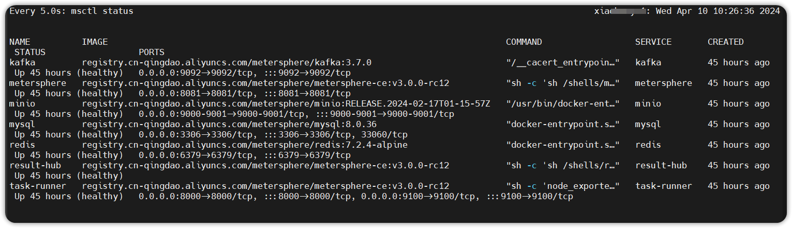

## 1 环境要求
!!! ms-abstract "部署服务器要求"
    * 操作系统: Ubuntu 22 / CentOS 7 64 位系统
    * CPU/内存: 4C8G
    * 磁盘空间: 200 G

## 2 下载安装包
!!! ms-abstract ""
    请自行下载 MeterSphere 最新版本的离线安装包，并复制到目标机器的 /tmp 目录下。<br>
    安装包下载链接: https://community.fit2cloud.com/#/products/metersphere/downloads

## 3 解压安装包 
!!! ms-abstract ""
    以 root 用户 ssh 登录到目标机器， 并执行如下命令。

    ```
    cd /tmp
    # 解压安装包
    tar zxvf metersphere-offline-installer-v3.x.y.tar.gz 
    ```


## 4 修改安装配置

### 4.1 安装配置文件说明
!!! ms-abstract "安装配置文件说明"
    如果无特殊需求可以不修改，采用默认参数安装。如需修改配置参数，则修改配置文件 install.conf 相关配置，修改完后执行 `/bin/bash install.sh` 命令进行安装。已安装成功如需再修改配置参数，需要到 ${MS_BASE}/metersphere/.env 修改，修改完后执行 `msctl reload` 重新加载配置参数生效。

    ```
    # 基础配置
    ## 安装路径, MeterSphere 配置及数据文件默认将安装在 ${MS_BASE}/metersphere 目录下
    MS_BASE=/opt
    ## MeterSphere 使用的 docker 网络网段信息
    MS_DOCKER_SUBNET=172.30.10.0/24
    ## 镜像前缀, MeterSphere 相关组件使用的 Docker 镜像前缀, 例如 registry.fit2cloud.com/metersphere
    MS_IMAGE_PREFIX=registry.fit2cloud.com/metersphere
    ## 镜像标签, MeterSphere 相关组件使用的 Docker 镜像标签
    MS_IMAGE_TAG=v3.0.0-beta

    ## 安装模式 allinone | server | task-runner
    MS_INSTALL_MODE=allinone
    ## MeterSphere 主程序的 HTTP 服务监听端口
    MS_SERVER_PORT=8081
    ## MeterSphere Task-Runner 组件的 HTTP 服务监听端口
    MS_TASK_RUNNER_PORT=8000

    # 数据库配置
    ## 是否使用外部数据库
    MS_EXTERNAL_MYSQL=false
    ## 数据库地址
    MS_MYSQL_HOST=$(hostname -I|cut -d" " -f 1)
    ## 数据库端口
    MS_MYSQL_PORT=3306
    ## 数据库库名
    MS_MYSQL_DB=metersphere
    ## 数据库用户名
    MS_MYSQL_USER=root
    ## 数据库密码
    MS_MYSQL_PASSWORD=Password123@mysql

    # Redis 配置
    ## 是否使用外部Redis
    MS_EXTERNAL_REDIS=false
    ## Redis 端口
    MS_REDIS_PORT=6379
    ## Redis 密码
    MS_REDIS_PASSWORD=Password123@redis
    ## Redis地址
    MS_REDIS_HOST=$(hostname -I|cut -d" " -f 1)

    # Kafka 配置
    ## 是否使用外部 Kafka
    MS_EXTERNAL_KAFKA=false
    ## Kafka 地址
    MS_KAFKA_HOST=10.1.11.29
    MS_KAFKA_PORT=9092

    # minio 配置
    ## 是否使用外部minio
    MS_EXTERNAL_MINIO=false
    ## minio 地址
    MS_MINIO_ENDPOINT=http://minio:9000
    ## minio access
    MS_MINIO_ACCESS_KEY=admin
    ## minio 密码
    MS_MINIO_SECRET_KEY=Password123@minio

    ## docker gid
    MS_DOCKER_GID=$(getent group docker | cut -f3 -d:)

    ## memory limit 修改组件最大内存限制
    MS_MEM_LIMIT=1g
    MS_RUNNER_MEM_LIMIT=1g
    MS_RESULT_MEM_LIMIT=1g
    MS_KAFKA_MEM_LIMIT=1g

    ## TOTP 执行机接口开启认证
    MS_TOTP_ENABLED=false
    MS_TOTP_SECRET=Password123@totp
    ```

### 4.2  数据库配置文件说明
!!! ms-abstract "注意"
    MeterSphere 采用 MySQL 8.0 存储系统数据，并对数据库部分配置项有指定要求，如果采用外置数据库请参考如下数据库配置进行修改。
    ```
  
    [mysqld]
    datadir=/var/lib/mysql

    default-storage-engine=INNODB
    character_set_server=utf8mb4
    lower_case_table_names=1
    performance_schema=off
    table_open_cache=128
    transaction_isolation=READ-COMMITTED
    max_connections=1000
    max_connect_errors=6000
    max_allowed_packet=64M
    innodb_file_per_table=1
    innodb_buffer_pool_size=512M
    innodb_flush_method=O_DIRECT
    innodb_lock_wait_timeout=1800

    server-id=1
    log-bin=mysql-bin
    expire_logs_days = 2
    binlog_format=mixed

    character-set-client-handshake = FALSE
    character-set-server=utf8mb4
    collation-server=utf8mb4_general_ci
    init_connect='SET default_collation_for_utf8mb4=utf8mb4_general_ci'

    sql_mode=STRICT_TRANS_TABLES,NO_ZERO_IN_DATE,NO_ZERO_DATE,ERROR_FOR_DIVISION_BY_ZERO,NO_ENGINE_SUBSTITUTION

    skip-name-resolve

    [mysql]
    default-character-set=utf8mb4

    [mysql.server]
    default-character-set=utf8mb4

    ```
    
    参考建库语句创建 MeterSphere 使用的数据库，MeterSphere 服务启动时会初始化表结构和数据。
    ```
    CREATE DATABASE `metersphere` /*!40100 DEFAULT CHARACTER SET utf8mb4 COLLATE utf8mb4_general_ci */ /*!80016 DEFAULT ENCRYPTION='N' */
    ```

    安装完成后， /opt/metersphere 为 MeterSphere 应用目录， 配置文件、数据及日志等均存放在该目录下。

### 4.3 修改配置
!!! ms-abstract ""
    在安装包解压后的目录，编辑修改安装参数。
    ```
    cd metersphere-offline-installer-v3.x.y
    vi install.conf
    ```


### 4.4 执行安装脚本
!!! ms-abstract ""
    ```
    # 进入安装包目录
    cd metersphere-offline-installer-v3.x.y
    # 运行安装脚本
    /bin/bash install.sh
    ```

    执行完安装脚本后，会自动加载镜像并运行容器，等提示安装完成后，可使用 watch -n 5 msctl status 查看各个组件运行状态。
{ width="900px" }

!!! ms-abstract ""
     待所有组件都是 healthy 状态，通过浏览器登录 MeterSphere 平台。
     ```
     URL: http://服务器IP:8081
     用户名: admin
     初始密码: metersphere
     ```


### 4.5 安装目录结构说明

!!! ms-abstract "安装目录结构说明"
    ```
    /opt/metersphere/
    ├── compose_files                               #-- 根据不同的安装模式，保存需要使用到的 compose 文件信息
    ├── conf                                        #-- MeterSphere 各组件及数据库等中间件的配置文件
    ├── data                                        #-- MeterSphere 各组件及数据库等中间件的数据持久化目录 
    ├── logs                                        #-- MeterSphere 各组件的日志文件持久化目录
    └── version                                     #-- 安装包对应的 MeterSphere 版本信息
    ├── docker-compose-base.yml                     #-- MeterSphere 基础 Docker Compose 文件，定义了网络等基础信息 
    ├── docker-compose-metersphere.yml              #-- MeterSphere 的 各功能模块 主服务
    ├── docker-compose-result-hub.yml               #-- MeterSphere 报告统计模块的 Docker Compose 文件     
    ├── docker-compose-kafka.yml                    #-- MeterSphere 自带的 Kafka 所需的 Docker Compose 文件
    ├── docker-compose-mysql.yml                    #-- MeterSphere 自带的 MySQL 所需的 Docker Compose 文件
    ├── docker-compose-task-runner.yml              #-- MeterSphere Task-Runner 组件所需的 Docker Compose文件
    ├── docker-compose-redis.yml                    #-- MeterSphere Redis 组件所需的 Docker Compose文件
    ├── docker-compose-minio.yml                    #-- MeterSphere 自带的分布式对象存储服务
    ├── install.conf -> /opt/metersphere/.env       #-- MeterSphere 的配置文件 /opt/metersphere/.env 的软链接
    ├── install.conf.example                        #-- MeterSphere 安装部署初始配置文件
    
    
    ```


## 5 配置反向代理
!!! ms-abstract "注意"
    如果使用了 Nginx、HAProxy 进行反向代理配置，需要增加对 websocket 的支持。以 Nginx 为例，参考配置如下:
    ```
    server {
        listen 80;
        server_name demo.metersphere.com;
        server_tokens off;
        return 301 https://$host$request_uri;
    }
    server {
        listen 443 ssl;
        # RSA certificate
        ssl_certificate /etc/nginx/ssl/metersphere.com/fullchain.cer; # managed by Certbot
        ssl_certificate_key /etc/nginx/ssl/metersphere.com/metersphere.com.key; # managed by Certbot
        server_name  demo.metersphere.com;
        proxy_connect_timeout       300;
        proxy_send_timeout          300;
        proxy_read_timeout          300;
        send_timeout                300;
        proxy_set_header Host $host;
        proxy_set_header X-Forwarded-For $remote_addr;
        proxy_set_header X-Forwarded-Host $server_name;
        proxy_set_header X-Real-IP $remote_addr;
        proxy_set_header X-Forwarded-Proto $scheme;
        proxy_redirect http:// $scheme://;
        
        location / {
            proxy_pass http://ip:8081;
            client_max_body_size 1000m;
            #access_log off;
            
            # 配置 websocket 支持
            proxy_http_version 1.1;
            proxy_set_header Upgrade $http_upgrade;
            proxy_set_header Connection "upgrade";
        }
    }
    ```


  
## 6 离线升级

!!! ms-abstract "注意"
    升级前务必检查磁盘容量并对数据库进行备份，详细操作请参考 [MeterSphere 数据备份](./backup_data.md)。</br>
    升级过程避免数据库执行定时任务造成数据损坏数据，请关闭正在运行的定时任务：

     ```
     # 进入数据库
     docker exec -it mysql sh
     mysql -uroot -pPassword123@mysql

     # 关闭定时任务
     use metersphere;
     update schedule set enable=0;

     # 退出
     exit;
     ```

### 6.1 离线升级步骤
  
!!! ms-abstract ""

    ```
    #完成数据备份并停止服务
    msctl stop

    # 下载离线安装包并上传到服务器
    安装包下载链接: https://community.fit2cloud.com/#/products/metersphere/downloads
    
    # 解压安装包
    tar -zxvf metersphere-offline-installer-v3.x.y.tar.gz

    # 进入离线部署包解压缩目录
    cd metersphere-offline-installer-v3.x.y
    
    # 运行安装脚本
    /bin/bash install.sh
    
    # 查看 MeterSphere 状态，各个组件都是 healthy 状态升级完成。
     msctl status

    ```

!!! ms-abstract ""

     升级完成后，批量启用定时任务。

     ```
     # 进入数据库
     docker exec -it mysql sh
     mysql -uroot -pPassword123@mysql

     # 开启定时任务
     use metersphere;
     update schedule set enable=1;

     # 退出
     exit;
     ```