## 1 环境要求

!!! info "部署服务器要求："
    * 操作系统: 可运行 Docker 的 Windows 操作系统
    * CPU/内存: 4核8G
    * 磁盘空间: 200G

## 2 安装部署

### 2.1 安装 Docker
在应用商店下载 Docker 进行安装

### 2.2 Docker 设置
进行 Docker 设置，需要添加 /opt/metersphere 路径 <br>
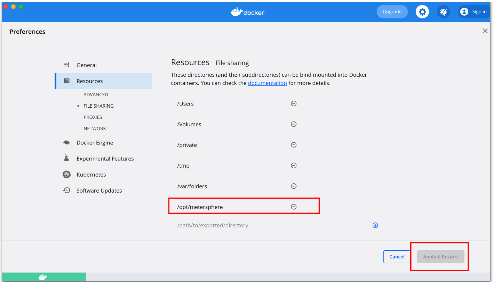{ width="900px" }

### 2.3 安装 MeterSphere
下载安装包，安装包下载链接: https://community.fit2cloud.com/#/products/metersphere/downloads <br>
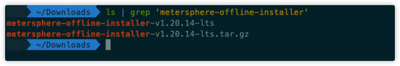{ width="900px" }

解压安装包，进入目录，执行安装命令 sh install.sh，安装过程中的提示，输入 y <br>
{ width="900px" }

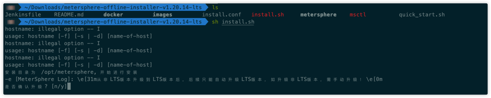{ width="900px" }

安装完成，查看服务状态 <br>
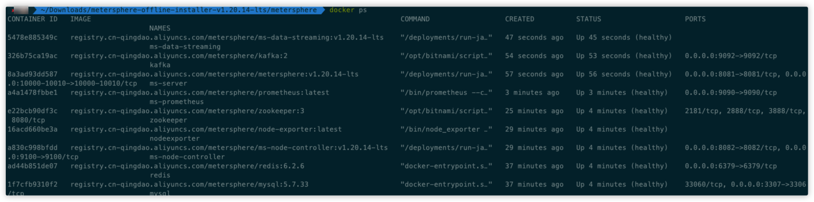{ width="900px" }

## 3 常见问题

### 3.1 安装过程中发现报错了，提示没有 docker-compose-* 文件
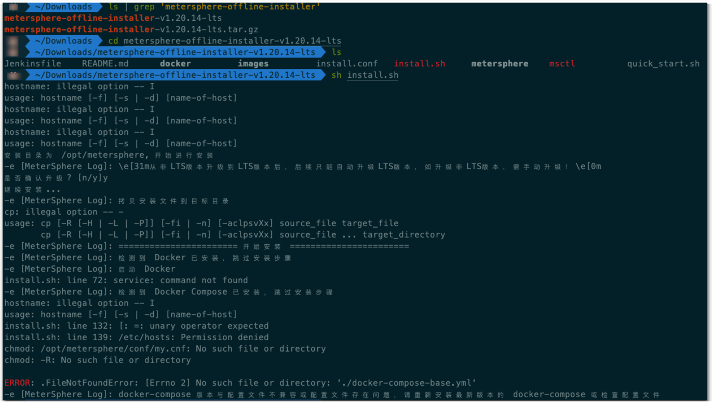{ width="900px" }

解决方案：

将安装包路径下 metersphere 文件夹下的全部文件复制到 /opt/metersphere/ 文件下 <br>
{ width="900px" }

查看是否复制成功 <br>
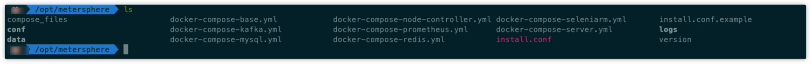{ width="900px" }

重新执行安装包下的安装命令<br>
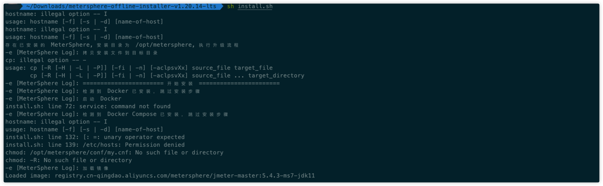{ width="900px" }

### 3.2 安装过程中的报错日志，创建容器失败，找不到文件或目录
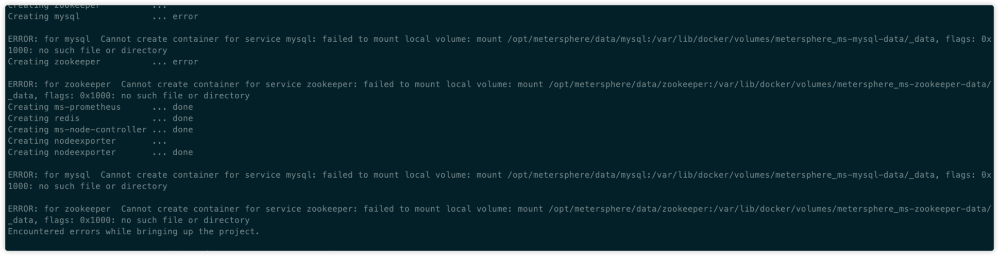{ width="900px" }

解决方案：

将 /opt/metersphere 目录下的 docker-compose-*.yml 里找【volumes】，将下面定义的路径替换到上面的位置，按照下面要求进行修改。(Mac 下的 docker 不要用单独的 volumes 定义，将下面路径写到上面，下面 volumes 部分可删) <br>
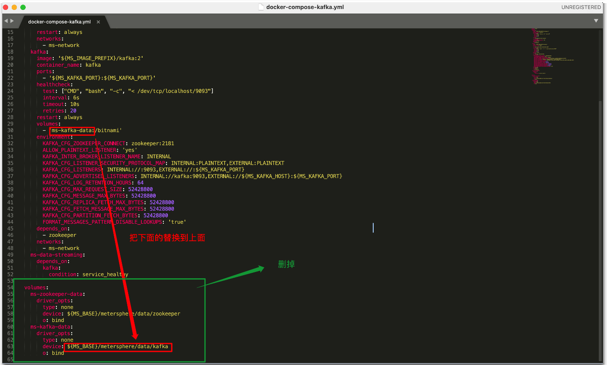{ width="900px" }

之后执行 msctl reload 命令即可 <br>

### 3.3 执行msctl reload ，后发现有部分容器没有起来
解决方案：

执行命令 docker logs -f zookeeper (图中使用的是容器ID)查看该容器日志，发现没有权限 <br>
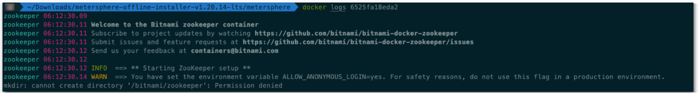{ width="900px" }

将docker-compose-kafka.yml 文件中的挂载目录为由原来的 /bitnami 改为 /data （注意有两个），然后执行 msctl reload <br>
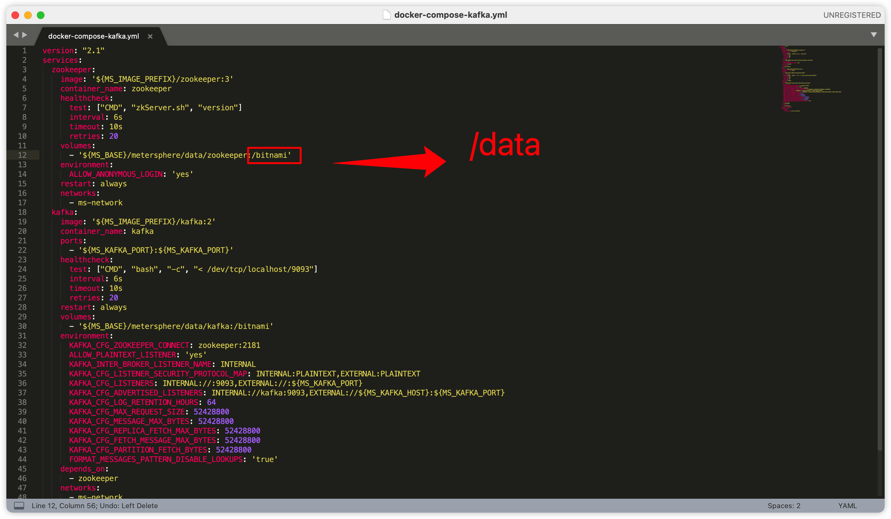{ width="900px" }

### 3.4、执行完成后发现 ms-promethus 服务是 Restarting 状态
解决方案：

输入docker logs ms-promethus，发现没有权限 <br>
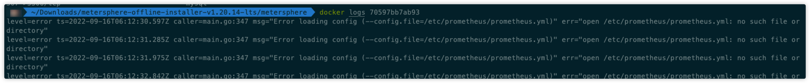{ width="900px" }

手动给 promethus 目录赋权 <br>
```
chmod +777 /opt/metersphere/conf/promethus
chmod +777 /opt/metersphere/data/promethus
```
之后执行 docker stop ms-promethus 和 docker rm ms-promethus，然后再执行msctl reload

### 3.5 msctl status 发现 ms-server 服务没有起来
解决方案：

输入 docker logs ms-server 发现没成功连接 redis 和 kafka <br>
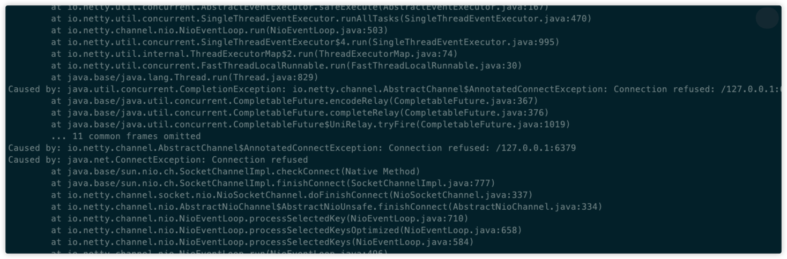{ width="900px" }
 
修改 /opt/metersphere/.env 文件（如图），之后执行 msctl reload <br>
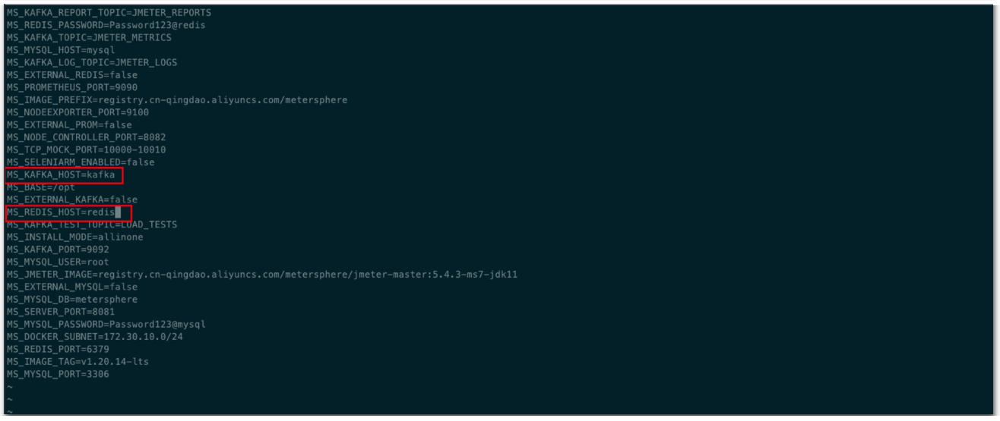{ width="900px" }

## 4 访问 MeterSphere
查看服务状态，全部正常 <br>
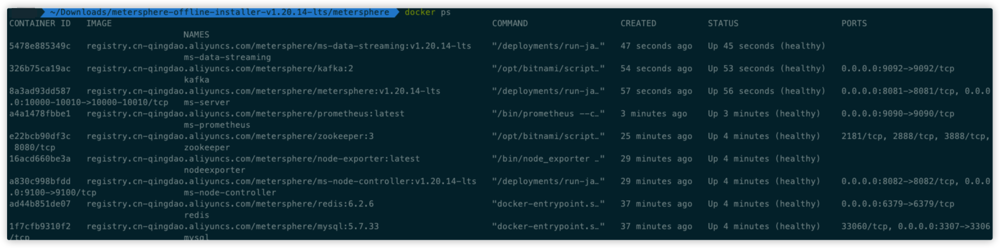{ width="900px" }

浏览器输入 http://localhost:8081/，发现可以正常访问 <br>
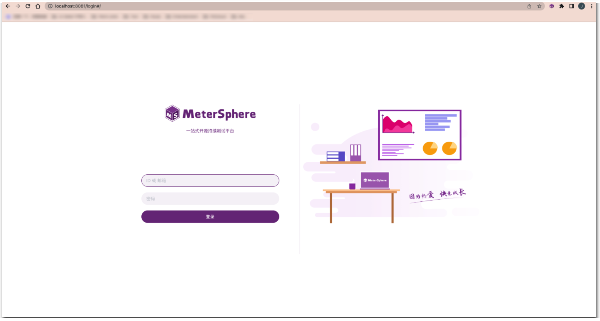{ width="900px" }