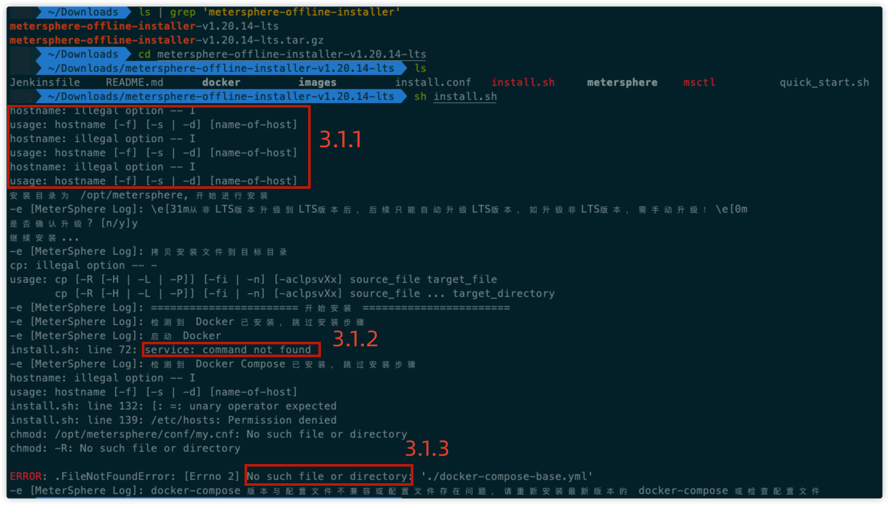
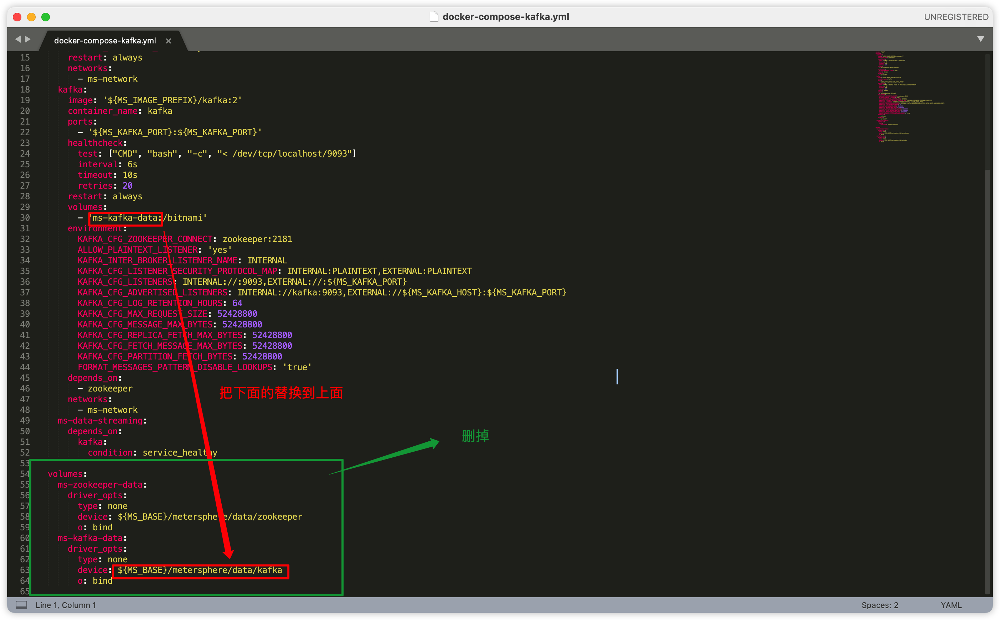
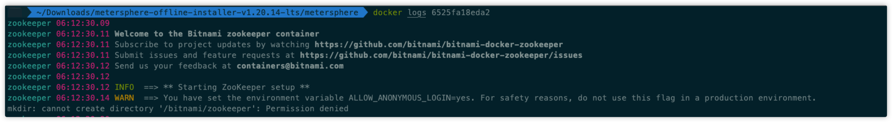
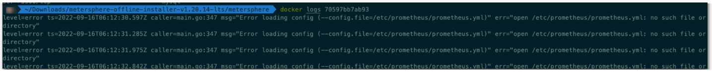

## 1 环境要求
!!! ms-abstract "部署服务器要求"
    * 操作系统: 可运行 Docker 的 Mac 操作系统
    * CPU/内存: 最低要求 4C8G，推荐 8C16G (2.3.0版本及其之后的版本，最低配置 8C16G)
    * 磁盘空间: 200G

## 2 安装部署
### 2.1 安装 Docker
!!! ms-abstract ""
    在应用商店下载 Docker 进行安装，安装后并启动 Docker

### 2.2 Docker 设置
!!! ms-abstract ""
    进行 Docker 设置，需要添加 /opt/metersphere 路径 <br>
{ width="900px" }

### 2.3 安装 MeterSphere
!!! ms-abstract ""
    下载安装包，安装包下载链接: https://community.fit2cloud.com/#/products/metersphere/downloads <br>
{ width="900px" }

!!! ms-abstract ""
    解压安装包 <br>
{ width="900px" }

!!! ms-abstract ""
    进入解压好的安装包目录 <br>
{ width="900px" }

!!! ms-abstract ""
    执行安装命令 sh install.sh，安装过程中的提示，输入 y  <br>
{ width="900px" }

!!! ms-abstract ""
    安装完成，查看服务状态 <br>
{ width="900px" }

## 3 常见问题
### 3.1 报错提示
{ width="900px" }

!!! ms-abstract ""
    错误1：由于 mac 系统命令问题，获取本地 ip 失败 <br>
    解决方案：该报错可以忽略，安装完成后修改 /opt/metersphere/.env 即可，可参考问题 3.5

    错误2：没有安装 service 命令<br>
    解决方案：在安装系统之前就要求启动 docker 了，该报错可以忽略

    错误3：提示 No such file or directory，该类错误，都是 copy 文件失败了，需要手动复制一下<br>
    解决方案：将安装包路径下 metersphere 文件夹下的全部文件复制到 /opt/metersphere/ 文件下
{ width="900px" }

!!! ms-abstract ""
    查看是否复制成功 <br>
{ width="900px" }

!!! ms-abstract ""
    重新执行安装包下的安装命令<br>
{ width="900px" }

### 3.2 创建容器失败，找不到文件或目录
{ width="900px" }

!!! ms-abstract ""
    解决方案：<br>
    将 /opt/metersphere 目录下的 docker-compose-*.yml 里找【volumes】，将下面定义的路径替换到上面的位置，按照下面要求进行修改。(Mac 下的 docker 不要用单独的 volumes 定义，将下面路径写到上面，下面 volumes 部分可删) <br>
{ width="900px" }

!!! ms-abstract ""
    之后执行 msctl reload 命令即可 <br>

### 3.3 部分容器没有起来
!!! ms-abstract ""
    解决方案：<br>
    执行命令 docker logs -f zookeeper (图中使用的是容器 ID)查看该容器日志，发现没有权限 <br>
{ width="900px" }

!!! ms-abstract ""
    将docker-compose-kafka.yml 文件中的挂载目录为由原来的 /bitnami 改为 /data （注意有两个），然后执行 msctl reload <br>
{ width="900px" }

### 3.4 ms-prometheus 服务是 Restarting 状态
!!! ms-abstract ""
    解决方案：<br>
    输入docker logs ms-prometheus，发现没有权限 <br>
{ width="900px" }

!!! ms-abstract ""
    手动给 prometheus 目录赋权 <br>
    ```
    chmod +777 /opt/metersphere/conf/prometheus
    chmod +777 /opt/metersphere/data/prometheus
    ```
    之后执行 docker stop ms-prometheus 和 docker rm ms-prometheus，然后再执行 msctl reload

### 3.5 ms-server 服务没有起来
!!! ms-abstract ""
    解决方案：<br>
    输入 docker logs ms-server 发现没成功连接 redis 和 kafka <br>
{ width="900px" }

!!! ms-abstract ""
    修改 /opt/metersphere/.env 文件（如图），之后执行 msctl reload <br>
{ width="900px" }

## 4 访问 MeterSphere
!!! ms-abstract ""
    docker ps 或者 msctl status 查看服务状态，全部都是 Up(healthy) 正常 <br>
{ width="900px" }

!!! ms-abstract ""
    浏览器输入 http://localhost:8081/，发现可以正常访问 <br>
{ width="900px" }