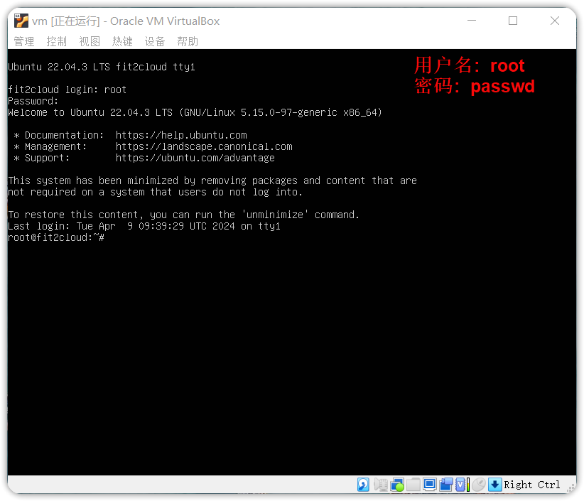
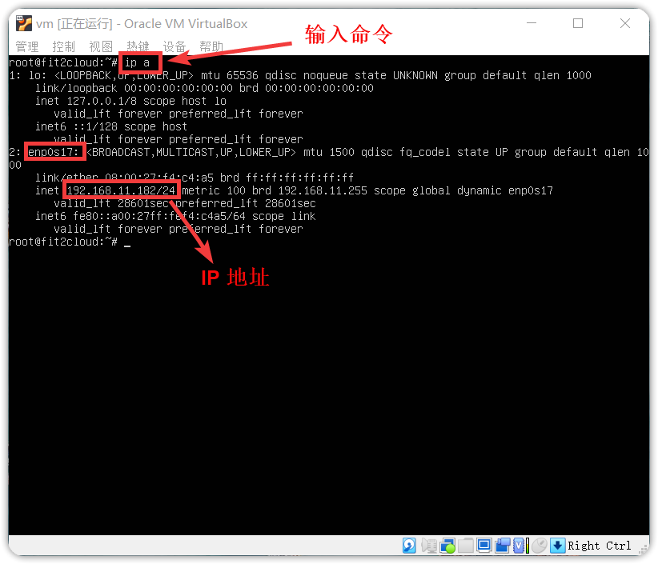
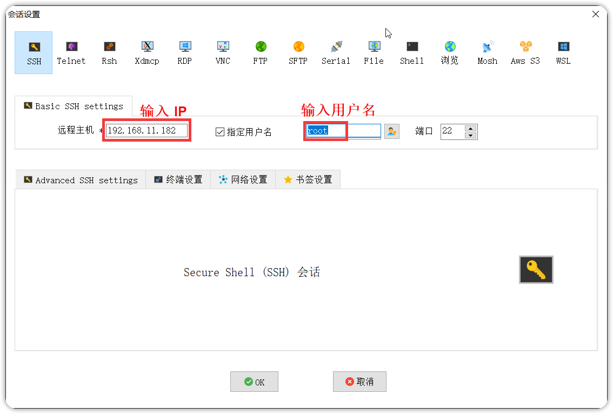
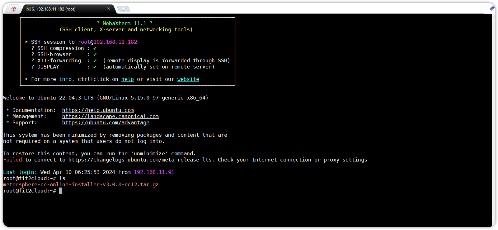
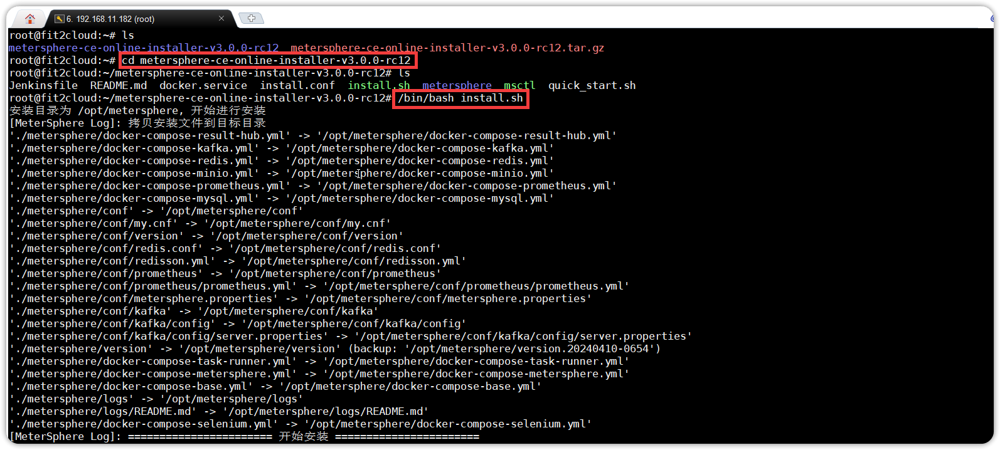

## 1 环境要求
!!! ms-abstract "部署服务器要求："

    * 操作系统: 可运行 VirtualBox 的 Windows 操作系统
    * CPU/内存: 4核8G
    * 磁盘空间: 200G

## 2 安装部署
### 2.1 安装虚拟机
!!! ms-abstract ""
	电脑上没有安装虚拟化软件，需要先安装虚拟化软件。市面上主流的桌面虚拟化软件有 VMware Workstation 和 VirtualBox。如果电脑上已经安装了其中一款软件，可以直接跳过这一部分。  
	示例选择了 VirtualBox，因为 VirtualBox 是免费的，若有需求也可以自行选择安装收费的 VMware Workstation。  
	VirtualBox 下载链接：https://download.virtualbox.org/virtualbox/7.0.14/VirtualBox-7.0.14-161095-Win.exe。
	下载 VirtualBox 后，双击安装包进行安装，安装完成后默认打开 VirtualBox。
{ width="900px" }

{ width="900px" }

!!! ms-abstract ""

	虚拟化软件 VirtualBox 已经安装完成，点击 “完成” 会自动打开 VirtualBox 虚拟机。

### 2.2 导入 Ubuntu 系统 OVA 包
!!! ms-abstract ""
	在虚拟机中安装 Ubuntu 系统，可以下载 MeterSphere 提供的 Ubuntu OVA 文件，直接导入到 VirtualBox 就可以使用，省去安装系统的过程。  
	通过网盘链接下载 Ubuntu OVA 文件: https://pan.baidu.com/s/1SDy2HZNlDQYCy6J7wPsmtw?pwd=423w  提取码：423w

!!! ms-abstract ""
	在 VirtualBox 界面上，点击 ”导入” ，选择下载好的 Ubuntu OVA 文件，点击 “下一步”。
{ width="900px" }

!!! ms-abstract ""
	选择一个可用空间在 50G 以上的磁盘位置，点击 “完成”。
{ width="900px" }

!!! ms-abstract ""
	等待 MeterSphere 虚拟机完成导入。
{ width="900px" }

!!! ms-abstract ""
	导入完成后，选择导入的虚拟机，点击“启动”按钮。
{ width="900px" }

!!! ms-abstract ""
	启动后，输入用户名和密码进入系统。注意：此处密码不显示，输入完成按回车。

	* 用户名：root
    * 密码：passwd

{ width="900px" }

!!! ms-abstract ""
	查看虚拟机的 IP，输入命令 ip a，每个环境的 IP 地址都不一样，本次演示环境的虚拟机 IP 地址为 192.168.11.182
{ width="900px" }

### 2.3 安装 MeterSphere
!!! ms-abstract ""
	使用远程连接工具 XShell 或者 MobaXterm 进行连接。以 MobaXterm 连接为例，输入 IP、用户名(root)、密码(passwd)登录服务器。
{ width="900px" }

{ width="900px" }

!!! ms-abstract ""
	下载 MeterSphere 安装包并上传到服务器，下载地址：https://community.fit2cloud.com/#/products/metersphere/downloads。
{ width="900px" }

!!! ms-abstract ""
	上传完成后，解压并执行安装命令。
	```
	tar -zxvf metersphere-ce-online-installer-v3.x.y.tar.gz
	cd metersphere-ce-online-installer-v3.x.y
	/bin/bash install.sh
	```
{ width="900px" }

{ width="900px" }

!!! ms-abstract ""
	安装完成后，执行【msctl status】命令查看服务都是 healthy 状态即可访问并登录。
{ width="900px" }


