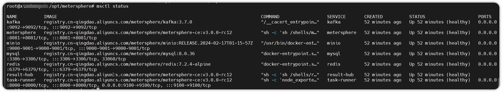

## 1 环境要求
!!! ms-abstract "部署服务器要求"
    * 操作系统: Ubuntu 22 / CentOS 7 64 位系统
    * CPU/内存: 2C4G
    * 磁盘空间: 200 G
    * 网络要求：可稳定访问互联网

## 2 一键安装
!!! ms-abstract ""
    在服务器上以 `root` 用户执行如下命令一键安装 MeterSphere。<br>
    ```
    docker run -d -p 8081:8081 --name=metersphere -v ~/.metersphere/data:/opt/metersphere/data metersphere/metersphere-ce-allinone
    ```

    安装成功后，通过浏览器访问如下页面登录 MeterSphere。<br>
    ```
    地址: http://目标服务器IP地址:8081
    用户名: admin
    密码: metersphere
    ```

    安装脚本默认使用 /opt/metersphere 目录作为安装目录，MeterSphere 的配置文件、数据及日志等均存放在该安装目录。

 
!!! ms-abstract "安装目录结构说明"
    ```
    /opt/metersphere/
    ├── compose_files                               #-- 根据不同的安装模式，保存需要使用到的 compose 文件信息
    ├── conf                                        #-- MeterSphere 各组件及数据库等中间件的配置文件
    ├── data                                        #-- MeterSphere 各组件及数据库等中间件的数据持久化目录 
    ├── logs                                        #-- MeterSphere 各组件的日志文件持久化目录
    └── version                                     #-- 安装包对应的 MeterSphere 版本信息
    ├── docker-compose-base.yml                     #-- MeterSphere 基础 Docker Compose 文件，定义了网络等基础信息 
    ├── docker-compose-metersphere.yml              #-- MeterSphere 的 各功能模块 主服务
    ├── docker-compose-result-hub.yml               #-- MeterSphere 报告统计模块的 Docker Compose 文件     
    ├── docker-compose-kafka.yml                    #-- MeterSphere 自带的 Kafka 所需的 Docker Compose 文件
    ├── docker-compose-mysql.yml                    #-- MeterSphere 自带的 MySQL 所需的 Docker Compose 文件
    ├── docker-compose-task-runner.yml              #-- MeterSphere Task-Runner 组件所需的 Docker Compose文件
    ├── docker-compose-redis.yml                    #-- MeterSphere Redis 组件所需的 Docker Compose文件
    ├── docker-compose-minio.yml                    #-- MeterSphere 自带的分布式对象存储服务
    ├── docker-compose-prometheus.yml               #-- MeterSphere Prometheus 组件所需的Docker Compose 文件
    ├── docker-compose-selenium.yml                 #-- MeterSphere UI 测试所需的Docker Compose 文件
    ├── install.conf -> /opt/metersphere/.env       #-- MeterSphere 的配置文件 /opt/metersphere/.env 的软链接
    ├── install.conf.example                        #-- MeterSphere 安装部署初始配置文件
    
    
    ```

## 3 手动安装

!!! ms-abstract ""
    MeterSphere 安装包下载链接: https://github.com/metersphere/metersphere/releases </br>
    安装前如需修改组件配置，可参考： [参数说明](./offline_installation.md#41)。如果需要使用外置数据库，可参考：[数据库说明](./offline_installation.md#42)。
    ```
    # 下载在线安装包
    wget https://github.com/metersphere/metersphere/releases/download/v3.x.y/metersphere-online-installer-v3.x.y.tar.gz
    
    # 解压在线安装包
    tar -zxvf metersphere-online-installer-v3.x.y.tar.gz
    
    # 进入解压目录
    cd metersphere-online-installer-v3.x.y
    
    # 修改安装参数，如果使用默认安装可跳过此步
    # vi install.conf
    
    # 执行install.sh安装脚本
    /bin/bash install.sh
    ```

    执行完安装脚本后，会自动加载镜像并运行容器，等提示安装完成后，可使用 watch -n 5 msctl status 查看各个组件运行状态。
{ width="900px" }

!!! ms-abstract ""
    待所有组件都是 healthy 状态，通过浏览器访问登录 MeterSphere 平台
    ```
     URL: http://服务器IP:8081
     用户名: admin
     初始密码: metersphere
    ```

## 4 配置反向代理

!!! ms-abstract ""
    如果使用了 Nginx、HAProxy 进行反向代理配置，需要增加对 websocket 的支持。以 Nginx 为例，参考配置如下:
    ```
    server {
        listen 80;
        server_name demo.metersphere.com;
        server_tokens off;
        return 301 https://$host$request_uri;
    }
    server {
        listen 443 ssl;
        # RSA certificate
        ssl_certificate /etc/nginx/ssl/metersphere.com/fullchain.cer; # managed by Certbot
        ssl_certificate_key /etc/nginx/ssl/metersphere.com/metersphere.com.key; # managed by Certbot
        server_name  demo.metersphere.com;
        proxy_connect_timeout       300;
        proxy_send_timeout          300;
        proxy_read_timeout          300;
        send_timeout                300;
        proxy_set_header Host $host;
        proxy_set_header X-Forwarded-For $remote_addr;
        proxy_set_header X-Forwarded-Host $server_name;
        proxy_set_header X-Real-IP $remote_addr;
        proxy_set_header X-Forwarded-Proto $scheme;
        proxy_redirect http:// $scheme://;

        location / {
            proxy_pass http://ip:8081;
            client_max_body_size 1000m;
            #access_log off;

            #配置 websocket 支持
            proxy_http_version 1.1;
            proxy_set_header Upgrade $http_upgrade;
            proxy_set_header Connection "upgrade";
        }
    }
    ```


##  5 在线升级

!!! ms-abstract "注意"
    升级前务必检查磁盘容量并对数据库进行备份，详细操作请参考 [MeterSphere 数据备份](./backup_data.md)。</br>
        升级过程避免数据库执行定时任务造成数据损坏数据，请关闭正在运行的定时任务：

     ```
     # 进入数据库
     docker exec -it mysql sh
     mysql -uroot -pPassword123@mysql

     # 关闭定时任务
     use metersphere;
     update schedule set enable=0;

     # 退出
     exit;
     ```

###  5.1 在线升级步骤

!!! ms-abstract ""

    ```
    #完成数据备份后，停止服务
    msctl stop

    # 升级至最新版本
    msctl upgrade

    # 升级至指定版本
    msctl upgrade v3.x.y
    
    # 查看 MeterSphere 状态
    msctl status
    ```

!!! ms-abstract ""
     升级完成后，批量启用定时任务。

     ```
     # 进入数据库
     docker exec -it mysql sh
     mysql -uroot -pPassword123@mysql

     # 开启定时任务
     use metersphere;
     update schedule set enable=1;

     # 退出
     exit;
     ```