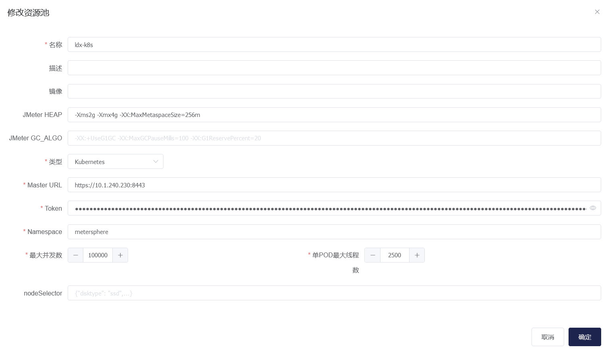

!!! info "基于以上环境部署成功后，进行如下压测工作"

### 1 修改 MeterSphere 的 docker-compose-server.yaml 文件

按照下图修改为连接 Kafka 地址

{:height="100%" width="70%"} <br>

### 2 如果采用 k8s 集群压测，需要提前准备好 k8s 集群，创建好 SA 和 token，创建如下：

```
1、创建 namespaces
kubectl create namespace metersphere

2、创建 SA
kubectl create serviceaccount ms -n metersphere

3、创建 namespace 授权 SA
kubectl create clusterrolebinding ms --clusterrole=admin --serviceaccount=metersphere:ms -n metersphere

4.查询 SA token
kubectl describe sa/ms -n metersphere
kubectl describe secrets -n metersphere ms-token-xxxx
```

k8s 对接界面配置如下，注意需要调整 JMeter 配置，经过测试，2500 左右的 VU，在无大量错误的情况下需要消耗 2C4G 左右资源:<br>
{:height="100%" width="70%"} <br>

### 3 最终压测效果如下，打了 2.5 万并发 VU
{:height="100%" width="70%"} <br>
{:height="100%" width="70%"} <br>

### 4 此方案已经在客户现场进行了部署测试，验证了 MS 在不同大规模场景下可通过水平扩展的方式，弹性支持压测池的调度。