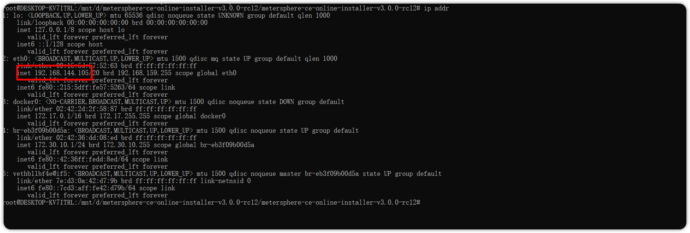

## 1 服务端部署 Task_Runner


!!! ms-abstract ""
    部署 Task-Runner，需要采用服务器独立部署。 部署服务器要求：


        * 操作系统: Ubuntu 22 / CentOS 7 64 位系统
        * CPU/内存: 4C8G 
        * 磁盘空间: 50 G


!!! ms-abstract ""

    ```
    # 下载在线安装包并上传到服务器
    找到和 MeterSphere 主服务相同版本下载安装包，链接:  https://github.com/metersphere/metersphere/releases/
    
    # 解压安装包
    tar -zxvf metersphere-ce-online-installer-v3.x.y.tar.gz

    # 进入离线部署包解压缩目录
    cd metersphere-ce-online-installer-v3.x.y

    # 修改部署模式为 task-runner
    vi install.conf
    
    # 运行安装脚本
    /bin/bash install.sh
    
    # 查看 MeterSphere 状态，task-runner 状态为healthy 安装完成。
    msctl status
    ```
{ width="900px" }
{ width="900px" }


!!! ms-abstract ""

     - **编辑资源池** <br>
     【系统设置-系统-资源池】点击新建资源池，在弹出的界面中为资源池名称、描述、站点URL、应用组织、用途、类型、添加资源池方式等信息。
{ width="900px" }

!!! ms-abstract "注意"
    社区版不可添加资源池节点，企业版可以添加，具体参考：添加资源池(xpack)。


!!! ms-abstract "操作说明"
 
     - 【站点URL】： MeterSphere 服务真实 ip 地址。 如：http://服务器IP:8081  ，站点 URL 地址和部署 task_runner 资源池服务器要求网络互通。</br>
    - 【最大并发数】：单机部署 task_runner 最大支持 2000 并发 。</br>
    - 【IP、端口】：Node 资源池部署服务器的真实 ip ，默认 8000 端口， Monitor 为监控端口 9100。
  
## 2 本地执行部署 Task_Runner

### 2.1 windows 部署


!!! ms-abstract ""
     Windows 部署 task_runner 可使用 WSL 安装。 虚拟机配置如下：</br>
       

        * 操作系统: Ubuntu 22 / CentOS 7 64 位系统
        * CPU/内存: 4C8G 
        * 磁盘空间: 50 G


!!! ms-abstract "安装 WSL"
        
        参考[在 Windows 10 上安装 WSL | Microsoft Docs](https://docs.microsoft.com/zh-cn/windows/wsl/install)进行 Windows 宿主机 WSL 的安装和配置。  

        使用管理员身份运行以下命令，然后重启操作系统。
        ```
        dism.exe /online /enable-feature /featurename:Microsoft-Windows-Subsystem-Linux /all /norestart
        dism.exe /online /enable-feature /featurename:VirtualMachinePlatform /all /norestart
        ```

        下载并安装 [适用于 x64 计算机的 WSL2 Linux 内核更新包](https://wslstorestorage.blob.core.windows.net/wslblob/wsl_update_x64.msi)

        以管理员身份执行以下命令，设置 WSL 默认版本：<br>
        ```
        wsl --set-default-version 2
        ```

!!! ms-abstract "安装 Ubuntu"

        在 Microsoft Store 里搜索"Ubuntu"并安装：
 { width="900px" }

!!! ms-abstract "检测 Ubuntu WSL 版本"
     以管理员身份执行 PowerShell：
        ```
        wsl.exe -l -v
        ```
 { width="900px" }

!!! ms-abstract "检查 Ubunt 是否安装完成"

        示例中安装的 Ubuntu Name 为 "Ubuntu"， 如像上图出现 Ubuntu 版本为 1， 则继续执行命令：
        ```
        wsl.exe --set-version Ubuntu 2
        ```

        **出现下图结果即为成功：**
{ width="900px" }


!!! ms-abstract "Docker 安装与配置"
        下载[Docker Desktop for Windows](https://desktop.docker.com/win/main/amd64/Docker%20Desktop%20Installer.exe)，双击 Docker Desktop Installer.exe 完成docker 的安装。

        Docker Desktop 安装完成后，进入 Settings 界面，选择 Resources 菜单下的 WSL INTEGRATION，按下图设置后，点击右下角的`Apply & Restart`。
{ width="900px" }


!!! ms-abstract "启动 Ubuntu"
        
        在应用商店里，选择 Ubuntu，点击"启动"按钮启动 Ubuntu，并执行 `sudo su` 命令切换到 root 用户。</br>
        
        在 Ubuntu 命令行中执行命令`docker version`，如能像下图一样正常显示 docker 版本信息，则能正常执行 MeterSphere 后续的安装操作，如出现异常，则需要根据提示信息解决。
{ width="900px" }

!!! ms-abstract ""
  
    虚拟机安装完成后，执行以下步骤安装：

    ```
    # 下载在线安装包到 Windows 电脑 D 盘
     找到和 MeterSphere 主服务相同版本下载安装包，链接:  https://github.com/metersphere/metersphere/releases/
    
    # 解压安装包并进入目录修改安装模式为 task-runner
    MS_INSTALL_MODE=task-runner

    
    # 切换到 Ubunt 终端运行安装脚本
    cd /mnt/d/metersphere-ce-online-installer-v3.X.y/metersphere-ce-online-installer-v3.x.y
    
    ./install.sh
    
    # 查看 MeterSphere 状态，task-runner 状态为healthy 安装完成。
    msctl status

    #查看 Ubuntu 映射 ip 地址
     ip addr 

    ```
{ width="900px" }
{ width="900px" }
{ width="900px" }
{ width="900px" }


!!! ms-abstract ""
    
    安装完成后，在【个人中心-本地执行】填写完整的访问 url：http://部署 task-runner 服务器 ip:8000 。例如：此处 ip 为192.168.144.105，因此本地运行地址为： http://192.168.144.105:8000。
!!! ms-abstract "注意"
    此处配置的本地调试地址，需要和 MeterSphere 主服务网络互通。
{ width="900px" }

### 2.2 mac 部署
!!! ms-abstract ""
    打开终端，按照以下步骤执行安装：