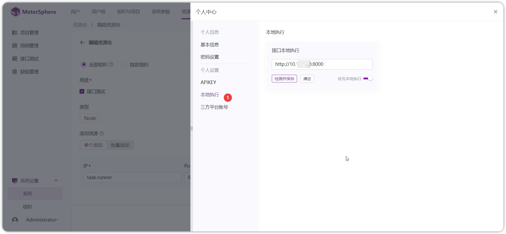

## 1 服务端部署 Task_Runner


!!! ms-abstract ""
    部署 Task-Runner，需要采用服务器独立部署。 部署服务器要求：

    * 操作系统: Ubuntu 16 / CentOS 7 64 位系统
    * CPU/内存: 4C8G 
    * 磁盘空间: 50 G


!!! ms-abstract ""

    ```
    # 下载在线安装包并上传到服务器
    找到和 MeterSphere 主服务相同版本下载安装包，链接:  https://github.com/metersphere/metersphere/releases/
    
    # 解压安装包
    tar -zxvf metersphere-ce-online-installer-v3.0.0-rc12.tar.gz

    # 进入离线部署包解压缩目录
    cd metersphere-ce-online-installer-v3.0.0-rc12

    # 修改部署模式为 task-runner
    vi install.conf

    MS_INSTALL_MODE=task-runner

    
    # 运行安装脚本
    /bin/bash install.sh
    
    # 查看 MeterSphere 状态，task-runner 状态为healthy 安装完成。
    msctl status
    ```
{ width="900px" }


!!! ms-abstract ""

     - **编辑资源池** <br>
     【系统设置-系统-资源池】点击新建资源池，在弹出的界面中为资源池名称、描述、站点URL、应用组织、用途、类型、添加资源池方式等信息。
{ width="900px" }

!!! ms-abstract "注意"
    社区版不可添加资源池节点，企业版可以添加，具体参考：添加资源池(xpack)。


!!! ms-abstract "操作说明"
 
     - 【站点URL】： MeterSphere 服务真实 ip 地址。 如：http://服务器IP:8081  ，站点 URL 地址和部署 task_runner 资源池服务器要求网络互通。</br>
    - 【最大并发数】：单机部署 task_runner 最大支持 2000 并发 。</br>
    - 【IP、端口】：Node 资源池部署服务器的真实 ip ，默认 8000 端口， Monitor 为监控端口 9100。
  
## 2 本地执行部署 Task_Runner

### 2.1 windows 部署


!!! ms-abstract ""
     Windows 部署 task_runner 可使用 WSL 上安装。</br>
    
     虚拟机配置如下：
    * 操作系统: Ubuntu 18 / CentOS 7 64 位系统
    * CPU/内存: 4C8G 
    * 磁盘空间: 50 G
    * 
    虚拟机参考：https://blog.csdn.net/weixin_39589699/article/details/134117248 。

!!! ms-abstract ""
  
    虚拟机安装完成后，执行以下步骤安装：

    ```
       # 下载在线安装包并上传到服务器
     找到和 MeterSphere 主服务相同版本下载安装包，链接:  https://github.com/metersphere/metersphere/releases/
    
    # 解压安装包
    tar -zxvf metersphere-ce-online-installer-v3.0.0-rc12.tar.gz

    # 进入离线部署包解压缩目录
    cd metersphere-ce-online-installer-v3.0.0-rc12

    # 修改部署模式为 task-runner
    vi install.conf

    MS_INSTALL_MODE=task-runner

    
    # 运行安装脚本
    /bin/bash install.sh
    
    # 查看 MeterSphere 状态，task-runner 状态为healthy 安装完成。
    msctl status
    ```
{ width="900px" }


!!! ms-abstract ""
    安装完成后，在【个人中心-本地执行】填写完整的访问 url：http://部署 task-runner 服务器 ip:8000 。即可在接口测试开始使用本地调试 。
    
!!! ms-abstract "注意"
    此处配置的本地调试地址，需要和 MeterSphere 主服务网络互通。
{ width="900px" }

### 2.2 mac 部署

打开终端，按照以下步骤执行安装：