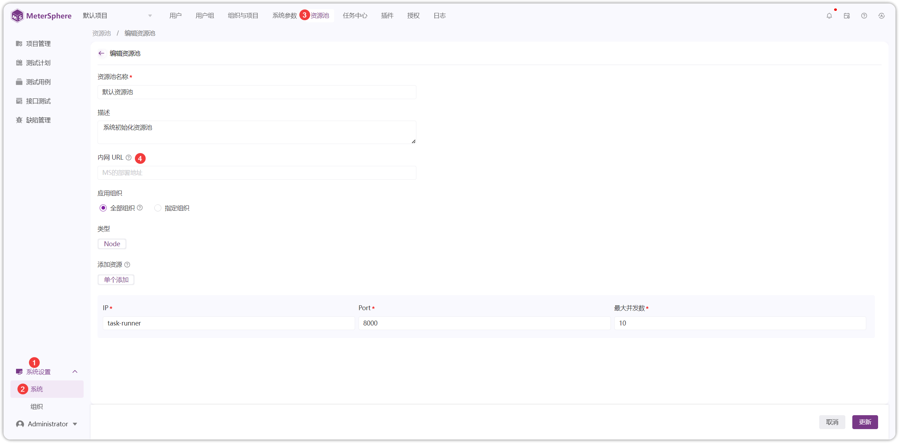
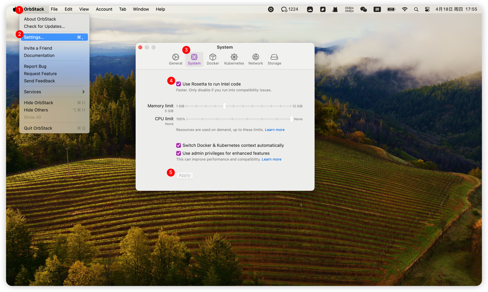

## 1 服务端部署 Task Runner

!!! ms-abstract ""
    部署 Task Runner，需要采用服务器独立部署。 部署服务器要求：

    -  **操作系统**：Ubuntu 22 / CentOS 7/ Mac OS 64 位系统
    -  **CPU/内存**：2C4G
    -  **磁盘空间**: 50 G

!!! ms-abstract ""

    ```
    # 下载在线安装包并上传到服务器
    找到和 MeterSphere 主服务相同版本下载安装包，链接:  https://github.com/metersphere/metersphere/releases/
    
    # 解压安装包
    tar -zxvf metersphere-ce-online-installer-v3.x.y.tar.gz

    # 进入离线部署包解压缩目录
    cd metersphere-ce-online-installer-v3.x.y

    # 修改部署模式为 task-runner
    vi install.conf
    
    # 运行安装脚本
    /bin/bash install.sh
    
    # 查看 MeterSphere 状态，task-runner 状态为healthy 安装完成。
    msctl status
    ```
{ width="900px" }

{ width="900px" }

!!! ms-abstract ""

     - **编辑资源池** <br>
     【系统设置-系统-资源池】点击编辑资源池，在弹出的界面中为资源池名称、描述、内网 URL、应用组织、用途、类型、添加资源池方式等信息。
{ width="900px" }

!!! ms-abstract "注意"
    社区版不可添加资源池节点，企业版可以添加，具体参考：添加资源池(xpack)。


!!! ms-abstract "操作说明"
 
    - 【内网URL】：资源池部署在内网时，可走内网地址，如 http://内网服务器IP:8081 。</br>
    - 【IP、端口】：资源池部署服务器的 IP ，默认端口 8000 ，Monitor 为监控端口，默认是 9100。
  
## 2 本地执行部署 Task Runner
### 2.1 Windows 系统部署
!!! ms-abstract ""
     Windows 部署 task-runner 可使用 WSL 安装。 虚拟机配置如下：</br>

    -  **操作系统**：Ubuntu 22 / CentOS 7 64 位系统
    -  **CPU/内存**：2C4G
    -  **磁盘空间**: 50 G

!!! ms-abstract "安装 WSL"
        
        参考[在 Windows 10 上安装 WSL | Microsoft Docs](https://docs.microsoft.com/zh-cn/windows/wsl/install)进行 Windows 宿主机 WSL 的安装和配置。  

        使用管理员身份运行以下命令，然后重启操作系统。
        ```
        dism.exe /online /enable-feature /featurename:Microsoft-Windows-Subsystem-Linux /all /norestart
        dism.exe /online /enable-feature /featurename:VirtualMachinePlatform /all /norestart
        ```

        下载并安装 [适用于 x64 计算机的 WSL2 Linux 内核更新包](https://wslstorestorage.blob.core.windows.net/wslblob/wsl_update_x64.msi)

        以管理员身份执行以下命令，设置 WSL 默认版本：<br>
        ```
        wsl --set-default-version 2
        ```

!!! ms-abstract "安装 Ubuntu"

        在 Microsoft Store 里搜索"Ubuntu"并安装：
 { width="900px" }

!!! ms-abstract "检测 Ubuntu WSL 版本"
     以管理员身份执行 PowerShell：
        ```
        wsl.exe -l -v
        ```
 { width="900px" }

!!! ms-abstract "检查 Ubuntu 是否安装完成"

        示例中安装的 Ubuntu Name 为 "Ubuntu"， 如像上图出现 Ubuntu 版本为 1， 则继续执行命令：
        ```
        wsl.exe --set-version Ubuntu 2
        ```

        出现以下内容即为成功。
        ```
        正在进行转换，这可能需要几分钟时间...
        有关与 WSL 2 的主要区别的信息，请访问 https://aka.ms.wsl2
        转换完成。
        ```

!!! ms-abstract "Docker 安装与配置"
        下载[Docker Desktop for Windows](https://desktop.docker.com/win/main/amd64/Docker%20Desktop%20Installer.exe)，双击 Docker Desktop Installer.exe 完成docker 的安装。

        Docker Desktop 安装完成后，进入 Settings 界面，选择 Resources 菜单下的 WSL INTEGRATION，按下图设置后，点击右下角的 `Apply & Restart`。
{ width="900px" }


!!! ms-abstract "启动 Ubuntu"
        
        在应用商店里，选择 Ubuntu，点击"启动"按钮启动 Ubuntu，并执行 `sudo su` 命令切换到 root 用户。</br>
        
        在 Ubuntu 命令行中执行命令`docker version`，如能像下图一样正常显示 docker 版本信息，则能正常执行 MeterSphere 后续的安装操作，如出现异常，则需要根据提示信息解决。
{ width="900px" }

!!! ms-abstract ""
  
    虚拟机安装完成后，执行以下步骤安装：

    ```
    # 下载在线安装包到 Windows 电脑 D 盘
     找到和 MeterSphere 主服务相同版本下载安装包，链接:  https://github.com/metersphere/metersphere/releases/
    
    # 解压安装包并进入目录修改安装模式为 task-runner
    MS_INSTALL_MODE=task-runner

    
    # 切换到 Ubuntu 终端运行安装脚本
    cd /mnt/d/metersphere-ce-online-installer-v3.X.y/metersphere-ce-online-installer-v3.x.y
    
    ./install.sh
    
    # 查看 MeterSphere 状态，task-runner 状态为 healthy 安装完成。
    msctl status
    ```
{ width="900px" }

{ width="900px" }

{ width="900px" }

!!! ms-abstract ""
    安装完成后，在【个人中心-本地执行】填写完整的访问 url：`http://localhost:8000` 。
{ width="900px" }

### 2.2 Mac 系统部署
!!! ms-abstract ""
    安装 OrbStack ，下载地址：https://orbstack.dev/download ,选择对应芯片架构的安装包下载、安装。

!!! ms-abstract "说明"
    如果是 Apple 芯片，需要开启 `Use Rosetta to run Intel code` ,开启后重启 OrbStack。<br>
    Intel 芯片无需开启 `Use Rosetta to run Intel code` 。
{ width="900px" }

!!! ms-abstract ""
    在 OrbStack 创建 Ubuntu 虚拟机，操作系统建议选择 `Ubuntu 22.05 LTS`，CPU 架构选择 `Intel` 。
{ width="900px" }

!!! ms-abstract ""
    Ubuntu 虚拟机创建完成后，双击进入虚拟机，切换 root 用户，然后下载 MeterSphere 安装包并解压安装 Task Runner ，具体步骤参考：[服务端部署 Task-Runner](#1)。
        
        
        ```
        # 切换 root 用户
        sudo -i

        # 安装 wget ，如果已经忽略此步
        sudo apt-get update
        sudo apt-get install wget
        wget --version
        # 下载在线安装包
        wget https://github.com/metersphere/metersphere/releases/download/v3.x.y/metersphere-online-installer-v3.x.y.tar.gz
        # 解压安装包
        tar -zxvf metersphere-ce-online-installer-v3.x.y.tar.gz
        
        # 进入离线部署包解压缩目录
        cd metersphere-ce-online-installer-v3.x.y
        
        # 修改部署模式为 task-runner
        vi install.conf
        
        # 运行安装脚本
        /bin/bash install.sh
        
        # 查看 MeterSphere 状态，task-runner 状态为healthy 安装完成。
        msctl status
        ```
{ width="900px" }

!!! ms-abstract ""
    安装完成后，在【个人中心-本地执行】填写完整的访问 url：`http://localhost:8000` 。
{ width="900px" }