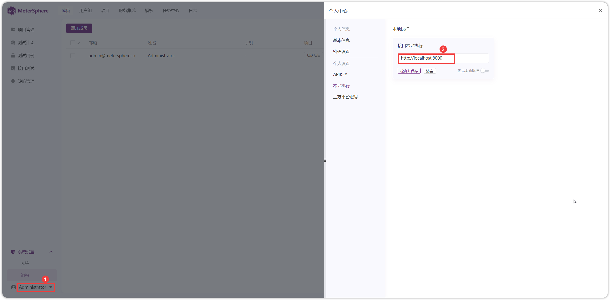

## 1 服务端部署 Task Runner

!!! ms-abstract "部署服务器要求"

    * 操作系统：Ubuntu 22 / CentOS 7 64 位系统
    * CPU/内存：2C4G
    * 磁盘空间：50 G

!!! ms-abstract ""
    ```
    # 下载在线安装包并上传到服务器
    找到和 MeterSphere 主服务相同版本下载安装包，链接:  https://github.com/metersphere/metersphere/releases/
    
    # 解压安装包
    tar -zxvf metersphere-ce-online-installer-v3.x.y.tar.gz

    # 进入离线部署包解压缩目录
    cd metersphere-ce-online-installer-v3.x.y

    # 修改部署模式为 task-runner
    vi install.conf
    
    # 运行安装脚本
    /bin/bash install.sh
    
    # 查看 MeterSphere 状态，task-runner 状态为 healthy 即安装完成。
    msctl status
    ```
{ width="900px" }

{ width="900px" }

!!! ms-abstract ""
     - **编辑资源池** <br>
     【系统设置-系统-资源池】点击编辑资源池，填写相应的 IP、Port 、最大并发数信息。
{ width="900px" }

!!! ms-abstract "操作说明"
    - 内网URL：资源池部署在内网时，可走内网地址，如 http://MS服务器的内网IP:8081 。</br>
    - IP、Port：资源池部署服务器的 IP ，默认端口 8000 。
    - 最大并发数：社区版单个节点最大并发数为 10，如需更大并发数，可申请 [企业版试用](https://jinshuju.net/f/CzzAOe)
  
## 2 本地部署 Task Runner
### 2.1 Windows 环境

!!! ms-abstract "安装 Docker"
    Docker 安装可参考 [官方文档](https://docs.docker.com/desktop/install/windows-install/)

!!! ms-abstract "部署 Task Runner"
    安装成功并启动 Docker 后，在 cmd 终端中用 Docker 方式启动 Task Runner，命令如下：
    ```
    docker run -d -p 8000:8000 --name=task-runner registry.fit2cloud.com/metersphere/task-runner:v3.x.y
    ```

{ width="900px" }

!!! ms-abstract ""
    安装完成后，在【个人中心-本地执行】填写完整的访问 url：`http://localhost:8000` 。
{ width="900px" }

### 2.2 Mac 环境

!!! ms-abstract "说明"
    Mac 推荐使用 OrbStack 作为 Docker 的客户端，OrbStack 更加轻量化、快捷。</br>
    安装 OrbStack ，下载地址：https://orbstack.dev/download ,选择对应芯片架构的安装包下载、安装。

!!! ms-abstract "部署 Task Runner"
    安装成功并启动 OrbStack 后，在 Mac 终端中用 Docker 方式启动 Task Runner，命令如下：
    ```
    docker run -d -p 8000:8000 --name=task-runner registry.fit2cloud.com/metersphere/task-runner:v3.x.y
    ```

{ width="900px" }
    

!!! ms-abstract ""
    安装完成后，在【个人中心-本地执行】填写完整的访问 url：`http://localhost:8000` 。
{ width="900px" }