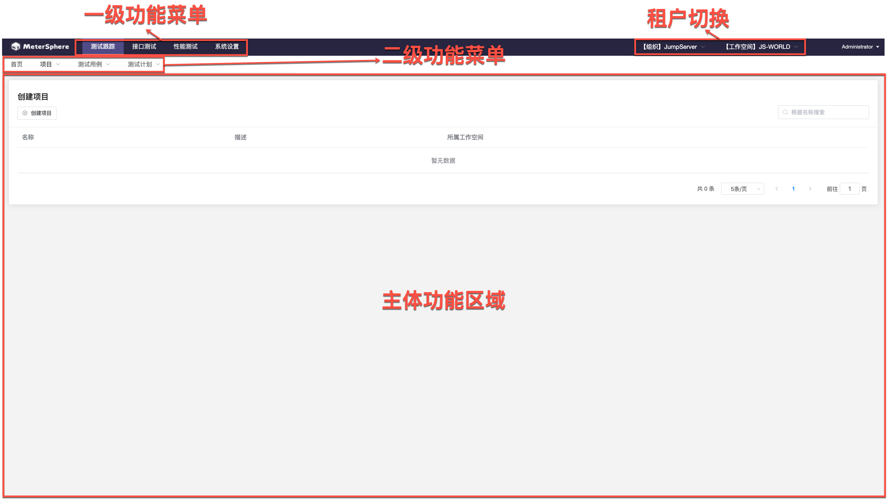
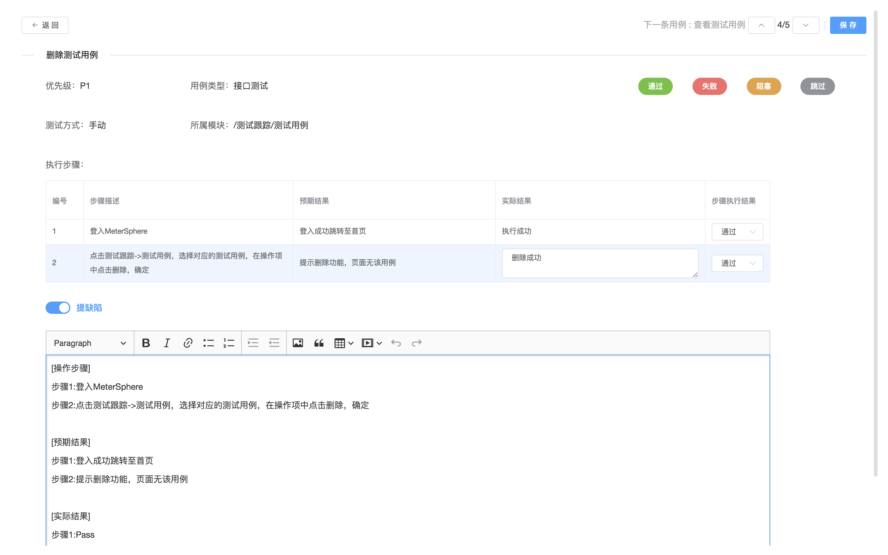
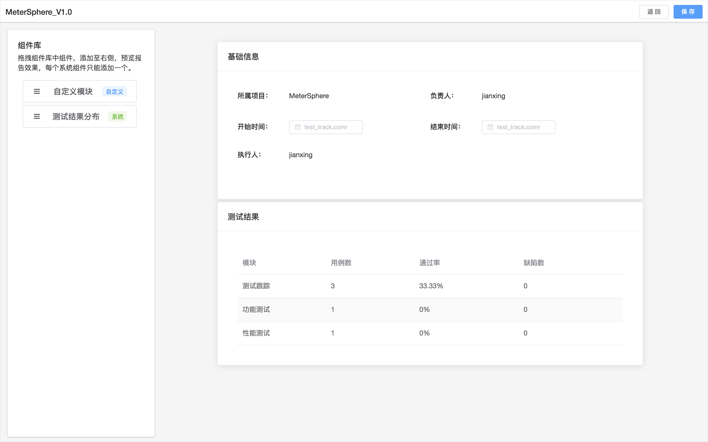

我们为用户准备了可以快速部署 MeterSphere 所有组件及所需的中间件的在线安装脚本, 你可以通过该脚本部署并体验 MeterSphere 所提供的功能

!!! warning "注意"
    快速安装脚本所部署的环境仅适用于测试体验目的, 生产环境请参考本文档[「安装部署」](user_manual/installation.md)章节内容进行部署

## 部署服务器要求

!!! info "部署服务器要求"
    * 操作系统: 任何支持 Docker 的 Linux x64
    * CPU/内存: 2核4G（最小）
    * 磁盘空间: 20G
    * 可访问互联网

## 安装步骤

### 执行安装脚本

以 root 用户 ssh 登录目标服务器, 执行如下命令

```sh
curl https://github.com/metersphere/metersphere/release/latest/quick_start.sh | sh
```

安装脚本默认使用 /opt/metersphere 目录作为安装目录，MeterSphere 的配置文件、数据及日志等均存放在该安装目录

## 登录并使用

### 登录

安装成功后，通过浏览器访问如下页面登录 MeterSphere

```
地址: http://目标服务器IP地址
用户名: admin
密码: metersphere
```

### 界面说明



<!-- TODO 简化描述, 添加截图 -->

### 维护项目信息

1. 点击页面最上方的「测试跟踪」菜单，在下方的项目下拉列表中选择「创建」项目
2. 输入项目基本信息，点击「确定」按钮，完成项目创建


### 跟踪测试计划

#### 测试用例管理

1. 在「测试跟踪」功能下的「测试用例」下拉列表中，选择「显示全部」，弹出项目中的所有测试用例

2. 点击左侧用例模块树的「新建模块」按钮，创建一个新的用例模块

3. 点击右侧列表中的「新建用例」按钮，在弹出的用例信息编辑页面中填写用例基本信息，点击「确定」完成用例创建


#### 测试计划管理

1. 在「测试跟踪」功能下的「测试计划」下拉列表中，选择「创建测试计划」，弹出测试计划编辑页面
2. 填写测试计划的基本信息，并选择测试计划的所属项目及测试阶段，点击「确定」按钮完成测试计划创建

3. 在测试计划列表中点击某一测试计划，进入测试计划详情页面

5. 点击右侧测试用例列表中的关联测试用例按钮，在弹出的测试用例列表中，选择项目中的测试用例添加至该测试计划

6. 添加成功后即可在测试用例列表查看到已添加的测试用例
7. 点击某个测试用例所在行的编辑按钮，进行测试用例结果更新

8. 当所有测试用例结果均更新后，即可点击用例列表中的查看测试报告按钮，查看此次测试计划的测试报告


### 执行接口测试

1. 在「接口测试」功能下的「测试」下拉列表中，选择「创建测试」，弹出接口测试编辑页面
2. 在接口测试编辑页面左上方下拉选择该测试所属的项目, 并填写该接口测试名称
3. 按照测试需求, 编辑测试场景及测试场景中的接口请求详情 
4. 信息确认无误后, 点击「保存并执行按钮」
5. 系统开始执行该接口测试, 并自动跳转到本次测试执行对应的测试报告, 在测试报告页面可查看本次测试的执行结果及每个接口的请求、响应内容

### 执行性能测试

1. 在「性能测试」功能下的「测试」下拉列表中，选择「创建测试」，弹出性能测试编辑页面
2. 在性能测试编辑页面左上方下拉选择该测试所属的项目, 并填写该性能测试名称
3. 在「场景配置」页面上传已有的 JMeter 测试脚本 
4. 在「压力配置」配置本次性能测试的压力参数, 选择 「local」资源池进行本次测试
5. 信息确认无误后, 点击「保存并执行按钮」
6. 系统开始执行该性能测试, 在「报告」下拉列表中选择「显示全部」可查看到本次性能测试的执行状态, 当报告状态显示为「已完成」时, 可点击「查看报告」按钮查看此次性能测试的报告详情

