## 1 调试
!!! ms-abstract ""
    如下图，在【调试】页面，点击【新建】或者【＋】新建接口请求。
{ width="900px" }

!!! ms-abstract ""
    接下来按下图序号顺序，选择 HTTP 协议、GET 方法，输入获取文章列表接口的 URL 地址 `https://demo.halo.run/apis/api.console.halo.run/v1alpha1/posts` ，选择 Query 参数，输入 `page 等于 1，size 等于 5`。
{ width="900px" }

!!! ms-abstract "" 
    输入接口认证信息，如下图 Halo 接口采用 Basic Auth 登录认证，选择 `Basic Auth`,`用户名：demo，密码：P@ssw0rd123..`，点击【服务端执行】，执行成功后保存。
{ width="900px" }  

!!! ms-abstract "注意" 
    本地执行需在本地安装 task_runner 和 在个人信息处配置 本地 task_runner 的地址。

## 2 创建接口
!!! ms-abstract "" 
    如下图，在【定义】页面，点击【新建】或者【＋】新建接口请求。
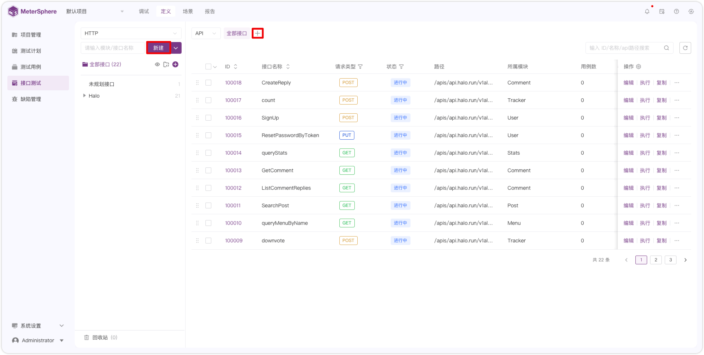{ width="900px" }

!!! ms-abstract "" 
    在新建接口页面，选择协议类型、接口方法、URL以及基本信息、请求头、请求体、QUERY、REST、认证等信息后点击保存。
{ width="900px" }

## 3 创建环境
!!! ms-abstract "" 
    如下图，点击【序号1】或者直接切换到【项目管理-环境管理】页面。
{ width="900px" }

!!! ms-abstract ""
    按下图序号顺序，点击【+】后，填写环境名称 `Halo`，切换 HTTP ，点击【添加 HTTP 】，选择 https ,输入域名地址 `demo.halo.run`和 `Basic Auth` 信息后点击确认。
{ width="900px" }

## 4 接口定义调试
!!! ms-abstract "" 
    切换到接口定义页面，在输入框中输入 `DraftPost` 搜索 `编写文章`接口，点击【执行】，执行成功后查看执行结果。
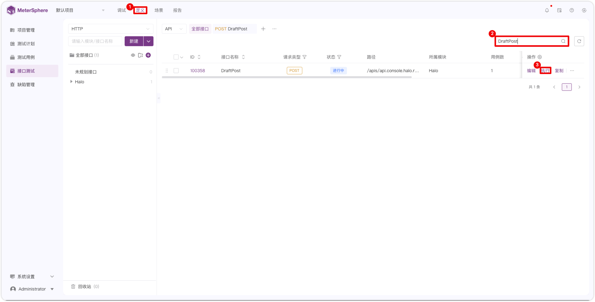{ width="900px" }	

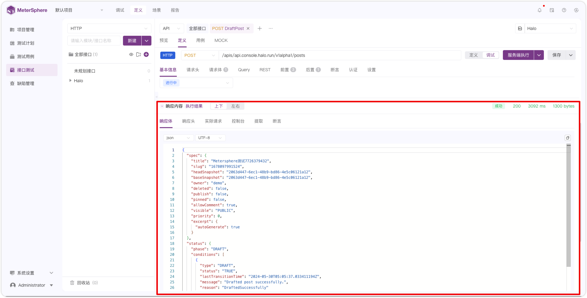{ width="900px" }

## 5 添加提取
!!! ms-abstract "" 
    如下图，点击后置，点击【+ 后置条件】，选择【提取参数】。
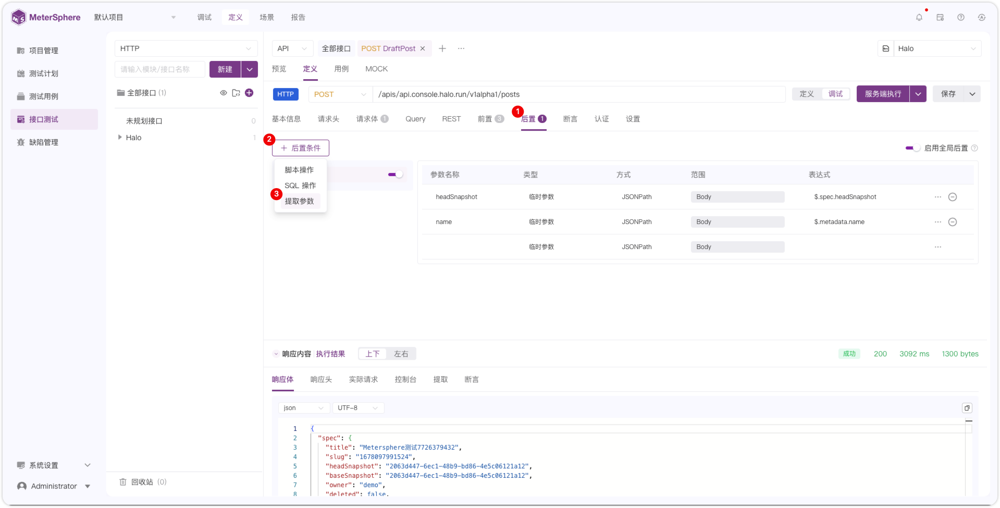{ width="900px" }	

!!! ms-abstract "" 
    输入参数名称 `headSnapshot`，类型选择 `临时参数`，方式选择 `JSONPATH`,范围默认 `Body`，表达式选择【快捷提取】。
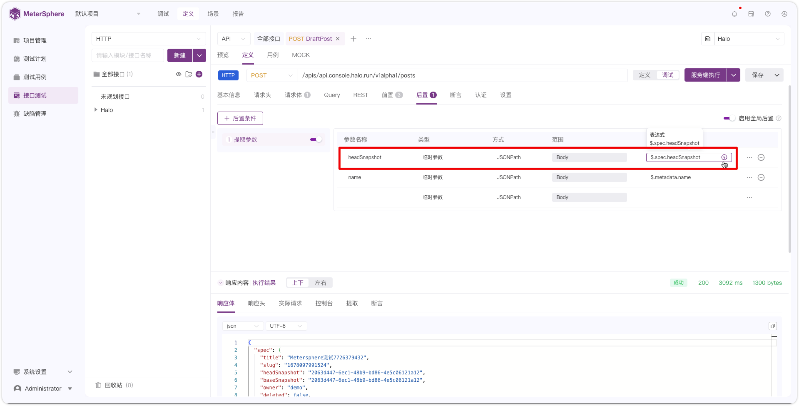{ width="900px" }	

!!! ms-abstract "" 
    在【快捷提取】界面，点击 `headSnapshot` 字段，然后点击确认。
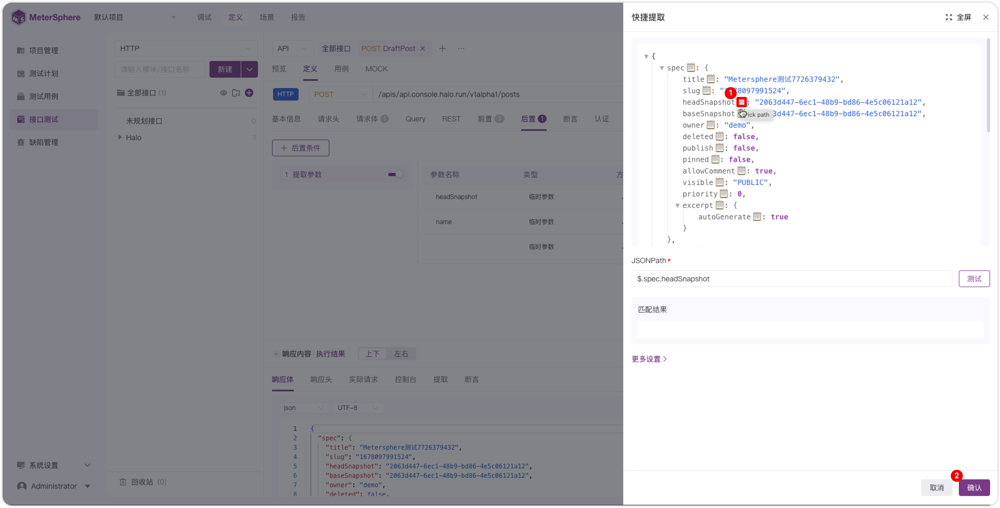{ width="900px" }	

!!! ms-abstract "" 
    点击【服务端执行】后，点击【提取】查看提取的结果。
{ width="900px" }	

## 6 添加断言
!!! ms-abstract "" 
    如下图，点击【+ 断言】，选择【状态码】，断言条件选择 `等于 200`。
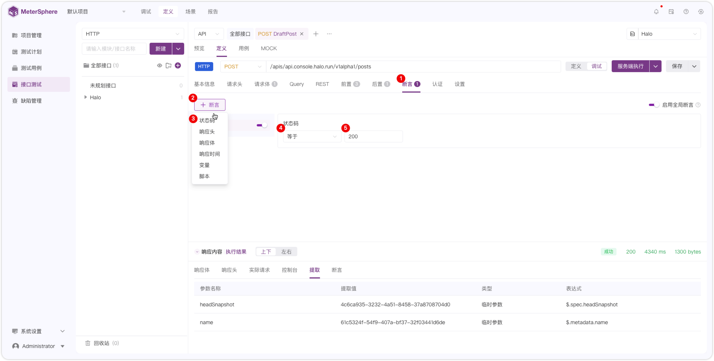{ width="900px" }	

!!! ms-abstract "" 
    点击【服务端执行】，执行成功后在执行结果处点击【断言】查看断言结果。
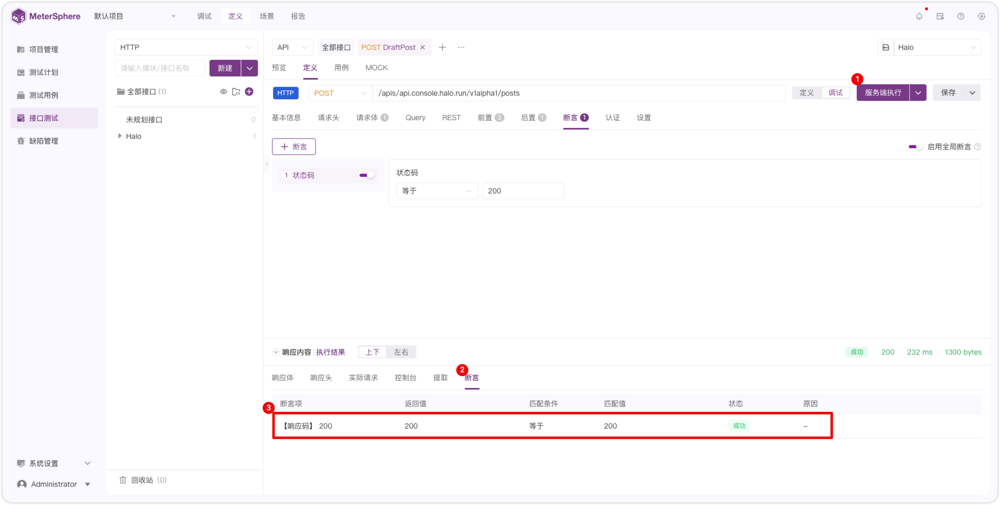{ width="900px" }	

## 7 保存为用例
!!! ms-abstract "" 
    如下图，接口调试成功后，点击【保存为新用例】快速创建用例。
{ width="900px" }		

## 8 创建场景
!!! ms-abstract ""
    如下图，点击【序号1】或者【序号2】创建场景。
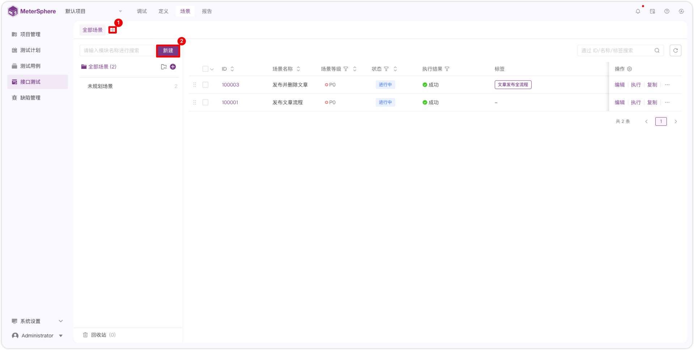{ width="900px" }

!!! ms-abstract ""
    点击【添加步骤】，选择【导入系统请求】。
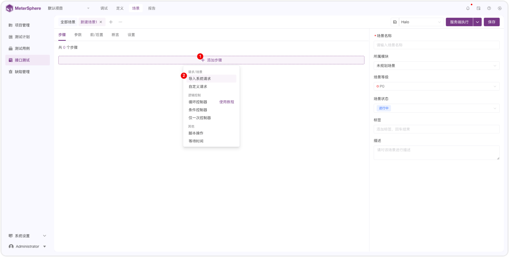{ width="900px" }

!!! ms-abstract ""
    选择【接口】，选择【DraftPost】、【PublishPost】、【fetchPostHeadContent】，点击【引用】，然后点击保存。
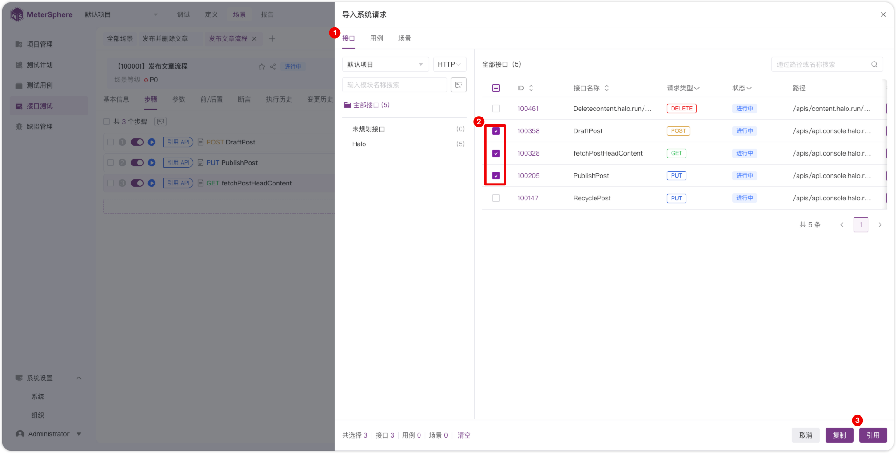{ width="900px" }

!!! ms-abstract ""
    选择【Halo】环境，点击【服务端执行】生成报告。
{ width="900px" }

## 9 查看报告
!!! ms-abstract "" 
    如下图，在【报告】页面查看场景 `发布文章流程` 的【场景报告】。
{ width="900px" }

!!! ms-abstract "" 
    点击 `发布文章流程` 的报告名称预览报告详情。
{ width="900px" }

!!! ms-abstract "" 
    如下图，点击【步骤名称】查看步骤实际请求的响应内容。
{ width="900px" }

