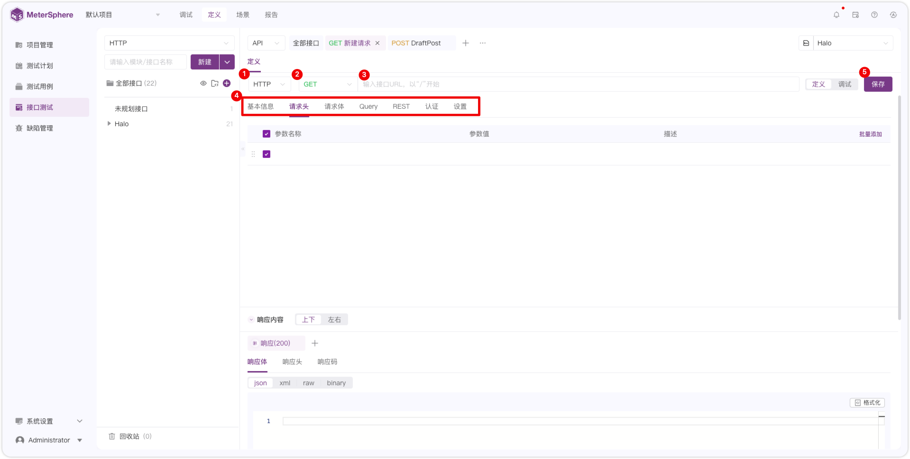
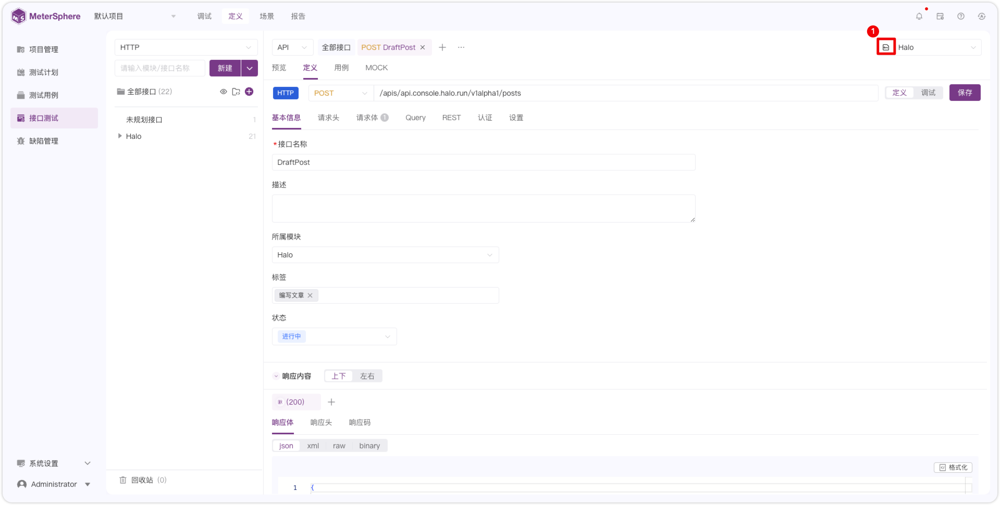
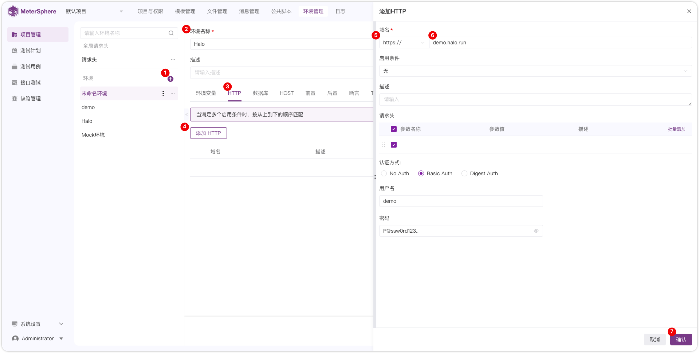
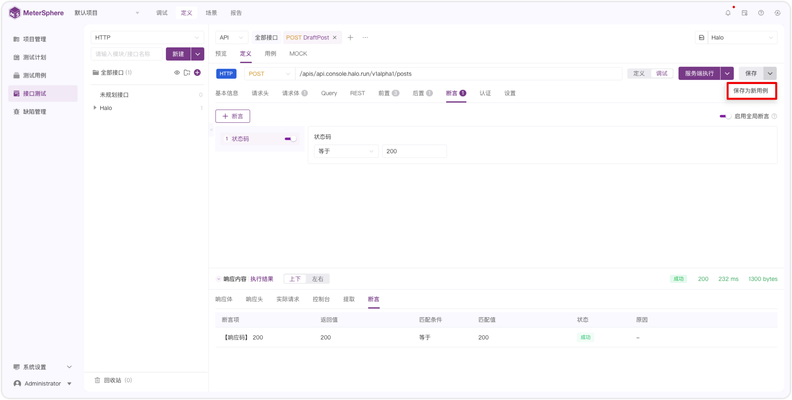

## 1 调试
!!! ms-abstract ""
    如下图，点击【新建请求】或者【＋】新建接口请求。
{ width="900px" }

!!! ms-abstract ""
    接下来按下图序号顺序，依次选择接口协议、接口方法，输入 请求 URL 和 请求参数，点击调试后保存或直接保存。
{ width="900px" }

!!! ms-abstract "说明" 
    - 序号1：接口协议类型，默认 http 协议。（接口协议插件拓展后支持多选，接口插件可以参考：xxxx）
    - 序号2：接口方法类型（支持 GET、POST、PUT、DELETE、PATCH、OPTIONS、HEAD、CONNECT）
    - 序号3：输入包含 http 或 https 的完整 URL。（如：`https://demo.halo.run/apis/api.console.halo.run/v1alpha1/posts`）
    - 序号4：输入请求头、请求体、前后置操作、认证方式等。
    - 序号5：选择服务端执行或者本地执行。
    - 序号6：保存。

!!! ms-abstract "" 
    如下图，输入接口的认证信息，可根据具体接口的登录认证类型，选择认证方式、请求头输入 cookie、前置脚本获取 token 等认证方式。如下图 Halo 接口采用 Basic Auth 登录认证。 
{ width="900px" }  

!!! ms-abstract "注意" 
    本地执行需在本地安装 task_runner 和 在个人信息处配置 本地 task_runner 的地址。

## 2 创建接口
!!! ms-abstract "" 
    如下图，点击【新建请求】或者【＋】新建接口请求。
{ width="900px" }

!!! ms-abstract "" 
    如下图，依次输入接口请求方法类型、URl地址，接口名称、所属模块、状态等基础信息，响应体、响应头、响应码等响应内容信息。
{ width="900px" }

!!! ms-abstract "" 
    如下图，点击【+】号新建响应内容，点击【...】复制、重命名、设置默认、删除响应信息。
{ width="900px" }

## 3 创建环境
!!! ms-abstract "" 
    如下图，点击【序号1】或者直接切换到【项目管理-环境管理】页面。
{ width="900px" }

!!! ms-abstract ""
    如下图，点击【+】填写环境名称，点击【添加 HTTP 】填写域名等信息后保存。
{ width="900px" }

## 4 接口定义调试
!!! ms-abstract "" 
    如下图，切换到【调试】页面，输入参数信息、前后置操作、内置函数或者认证信息，选择环境，选择【服务端执行】或者【本地执行】，执行成功后在执行结果处查看响应体、响应头、实际请求、控制台、提取、断言等信息。
{ width="900px" }	

!!! ms-abstract "" 
    如下图，调试成功后，点击【保存为新用例】直接保存成用例。
{ width="900px" }	

## 5 创建用例
!!! ms-abstract "" 
    如下图，切换到【用例】页面，点击【创建用例】。
{ width="900px" }		

!!! ms-abstract "" 
    如下图，依次输入用例名称，用例等级、状态、标签、请求参数信息，选择环境。点击执行，执行成功后，点击【创建】或【保存并继续创建】。
{ width="900px" }	

## 6 创建场景

## 7 查看报告
!!! ms-abstract "" 
    如下图，在【报告】页面查看【场景报告】和【用例报告】。
{ width="900px" }

!!! ms-abstract "" 
    如下图，点击【报告名称】预览报告详情。
{ width="900px" }

!!! ms-abstract "" 
    如下图，点击【步骤名称】查看步骤实际请求的响应内容。
{ width="900px" }

