MeterSphere 接口测试模块提供了接口定义、接口自动化等接口测试相关功能。
用户可以使用树状多级模块来分级分组管理项目下的接口列表，创建执行接口用例测试接口，组合编排多个接口用例进行场景自动化测试。

## 维护接口定义

进入 `接口测试->接口定义` 页面。
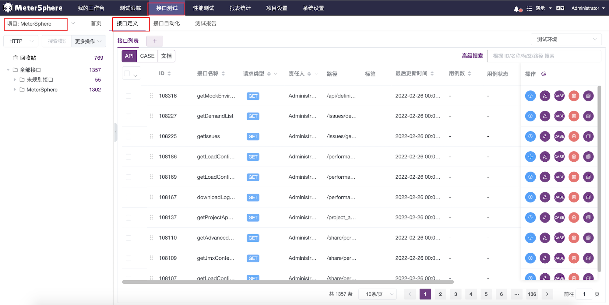

### 导入 Swagger 接口文档

点击左侧下拉菜单中的 `导入` 按钮；

选择 Swagger 数据格式，选择MeterSphere模块，选择使用URL导入，并填入 Swagger 对应的JSON地址 `http://xxx.fit2cloud.com/v3/api-docs`，导入 API 接口。

### 查看接口定义

导入 Swagger 文件之后，在接口列表中找到登录接口 `login_1` ，点击操作列中的 `编辑` 按钮，查看接口详情。

### 为项目添加测试环境

接口列表中仅记录了接口的相对 URL，当我们需要对某个接口进行测试时，需要先在该项目中添加针对该项目的测试环境信息。

进入 `系统设置->项目管理` 页面。点击 MeterSphere 项目操作列中的 `环境配置` 按钮，填写环境名称及环境域名，点击确定保存测试环境信息。

### 调试单个接口

在接口列表中找到 `login_1` 接口，点击操作列中的 `编辑` 按钮，进入接口详情页面。

点击页面右上角的 `测试` 按钮，进入接口测试页面。在接口测试页面选择接口执行环境，并填写接口所需的参数后，点击 `测试` 按钮发送该接口请求。

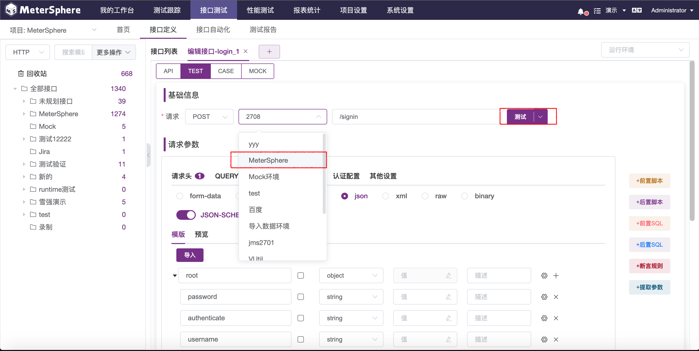

当接口请求完成后，可以在下方的响应内容中查看到本次接口请求的响应信息。

## 创建单接口用例

进入 `接口测试->接口定义` 页面。

### 新建单接口用例

在接口列表中找到 `login_1` 接口，点击操作列中的 `CASE` 按钮，打开该接口的【用例列表】页面。

输入接口用例的名称及请求接口所需的其他参数后，点击右下角的 `保存` 按钮保存该接口用例。

### 测试单接口用例

在单接口用例列表中选择执行环境，点击单接口用例列表中的 `执行` 按钮，执行结束后，展开用例详情查看响应内容。

## 创建场景用例

进入 `接口测试->接口自动化` 页面。

### 新建场景用例

在场景用例列表页面，点击左侧的模块树新建 `MeterSphere` 模块。
点击创建场景按钮新建一个 `获取用户列表` 的场景，该场景的目的是获取当前MeterSphere系统所有的用户列表信息，因为`获取用户列表`接口需要登录状态或者接口签名认证才可以正常请求，这里采用类似swagger调试的方式，先获取`登录态`，再执行`获取用户列表`接口，这里需要分别导入`登录`和`获取用户列表`两个接口，同时需要勾选上`共享cookie`，填写完场景基本信息后，点击 `保存` 按钮保存该场景。

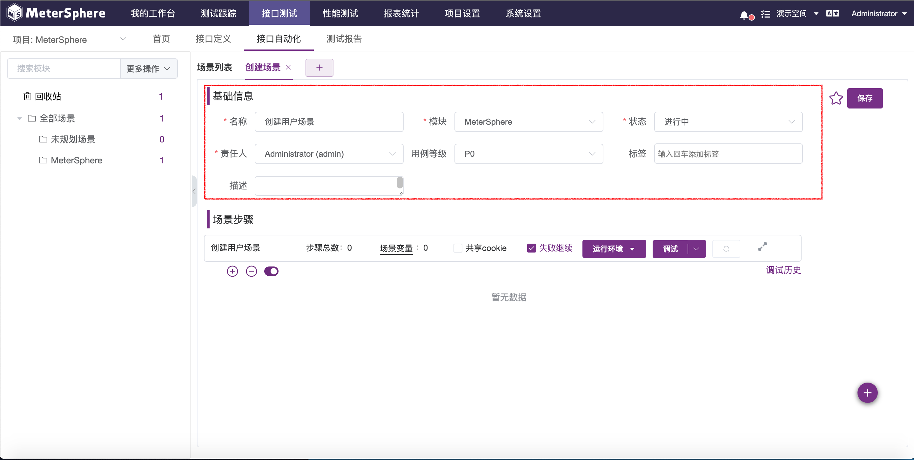

### 在场景用例中添加步骤

首先勾选`共享cookie`按钮，然后点击场景详情中右下角的添加场景步骤按钮，在场景中一次添加如下几个步骤。

1. 选择 `接口列表导入` 步骤，在弹出的接口列表中找到 `login_1` 接口进行添加。修改该接口请求中的 `login_1` 中的登录相关参数。
  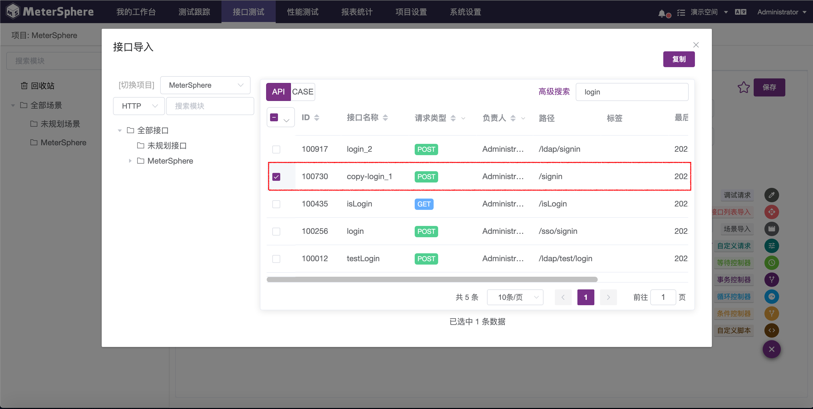
    
    a. 填写请求参数
      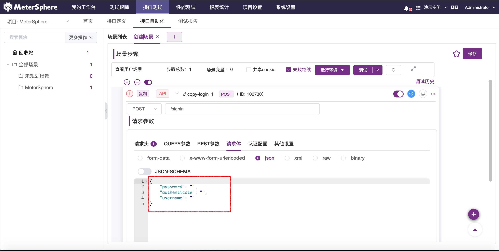
    
    !!! info "注意"
        当前步骤需先手动执行成功，才可以使用`推荐 JSONPath 提取`方式。

    b. 展开 `login_1` 接口的请求参数tab，切换到`后置操作`，在该tab下添加一个名称为 `获取CSRF-TOKEN`的提取步骤，采用`推荐 JSONPath 提取`方式，勾选名称为`csrfToken`的属性，JSONPath 表达式为 `$.data.csrfToken`。
      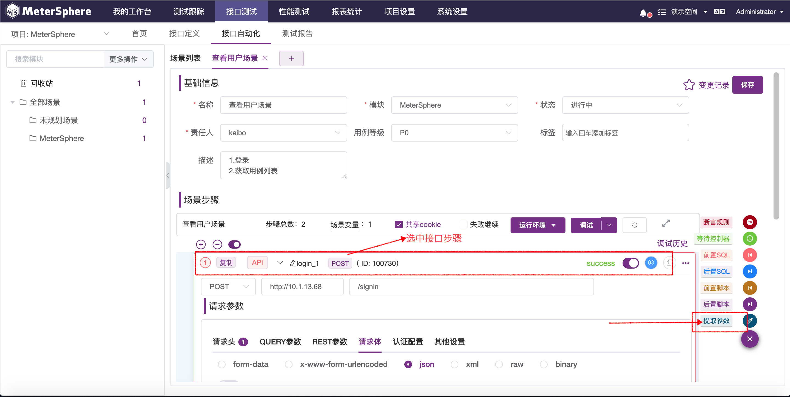

      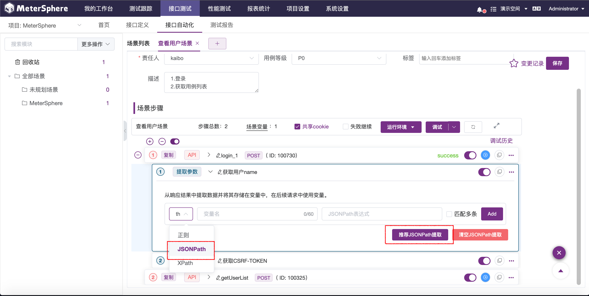

      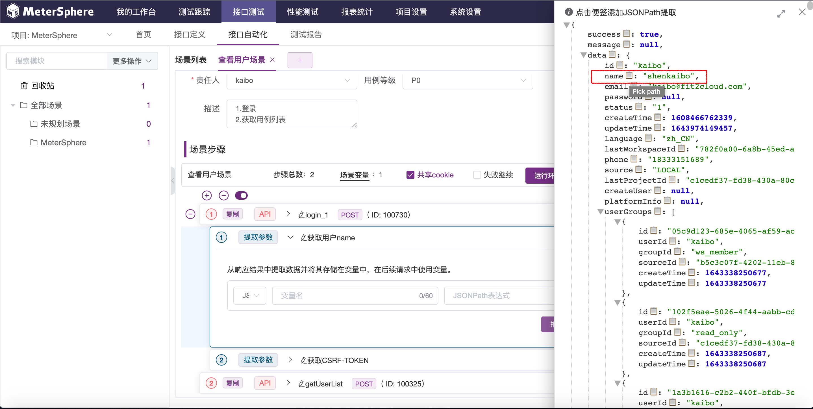

      
    
2. 再次添加一个 `接口列表导入` 步骤，选择 `getUserList` 接口。修改请求头里的CSRF-TOKEN参数，设置为`${csrfToken}`，修改该接口请求中的REST参数goPage为1，pageSize为10。
  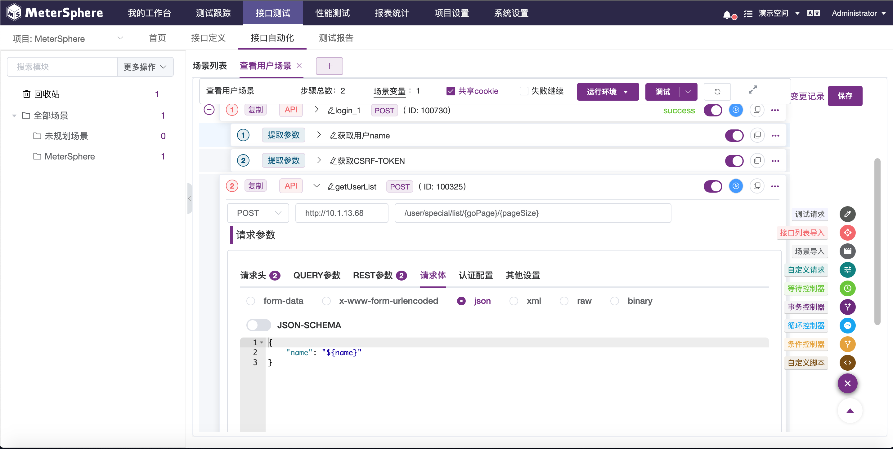

## 查看测试报告

### 执行场景用例

场景步骤添加完成后，点击场景步上方的的 `调试` 按钮，可在列表查看各个步骤执行状态，展开可查看接口执行的详细信息。

点击调试历史也可以直接查看详细的报告信息。

### 生成报告
点击场景步上方的 `调试` 按钮旁边的`V`，选择 `生成报告`，生成报告和查看场景报告的步骤详细信息。

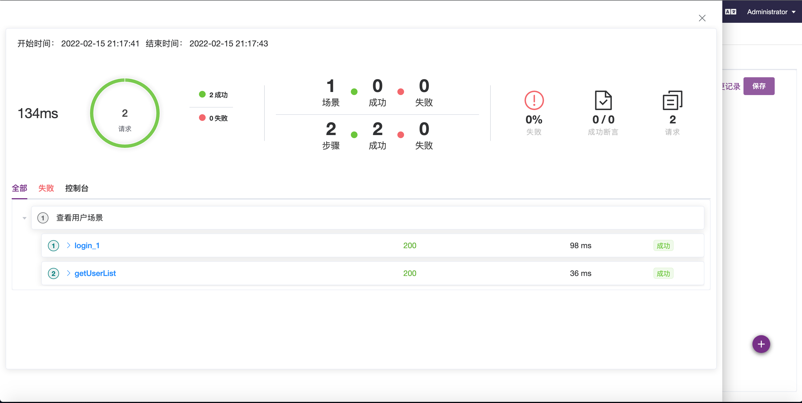

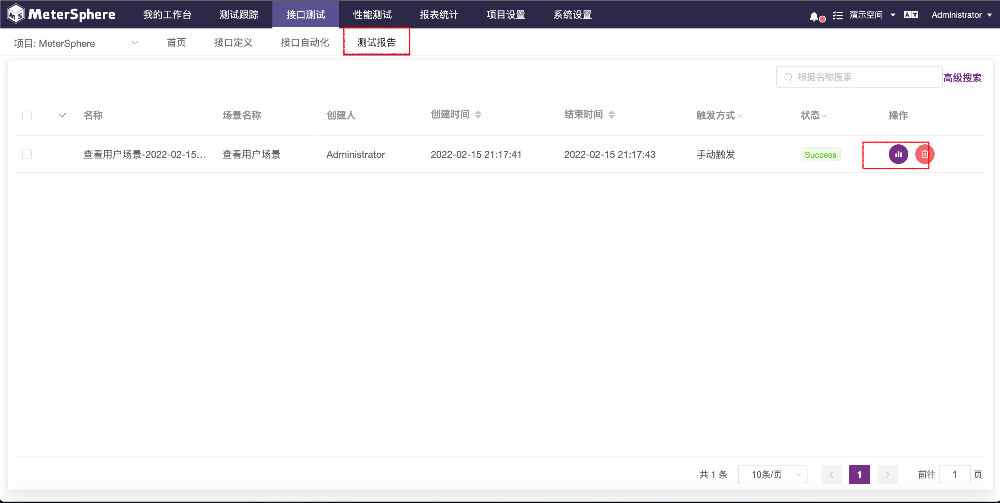

在报告列表中选择报告【详情】按钮打开【测试报告】页面，在页面中可以查看报告详情，分享和导出报告。
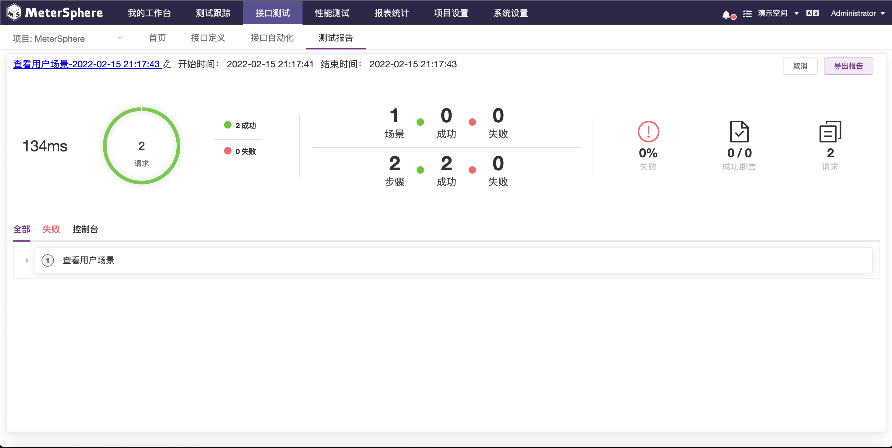
