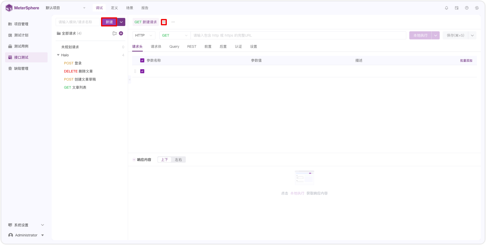
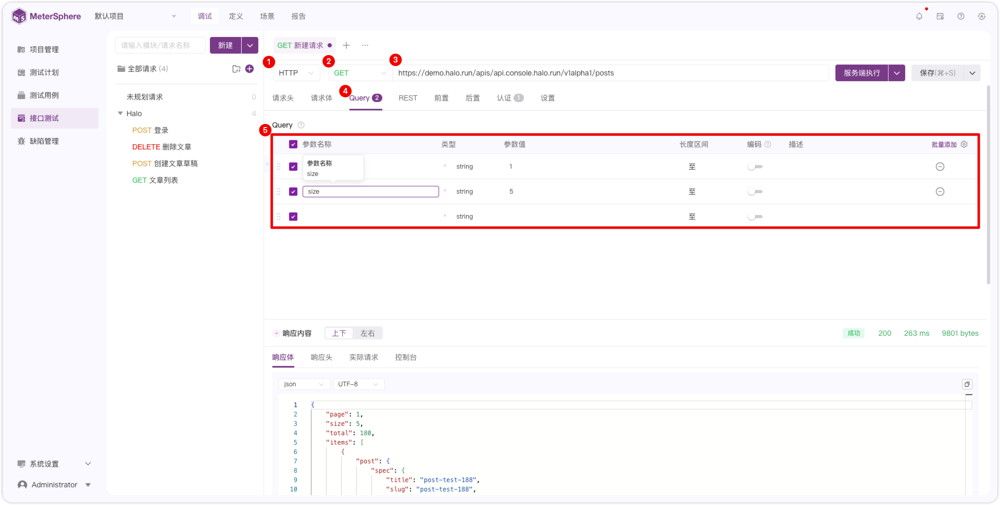
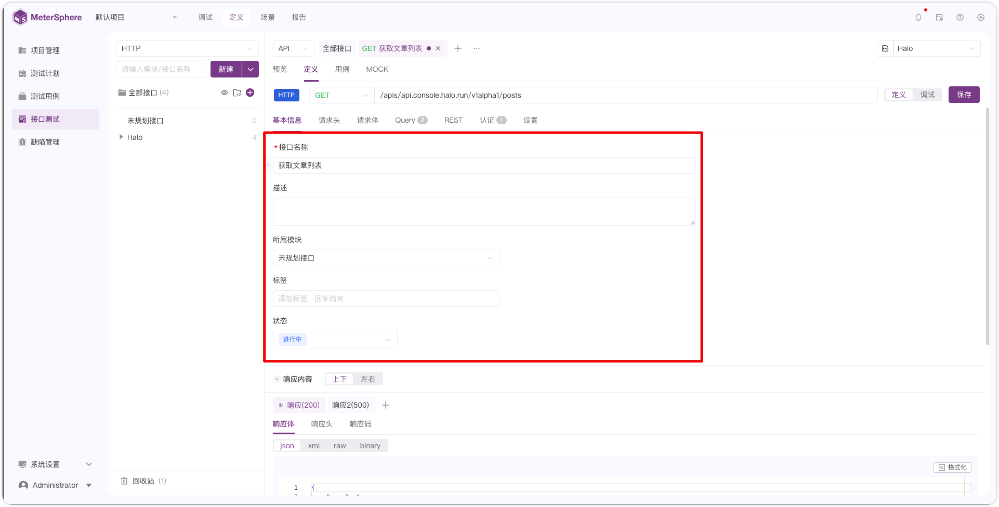
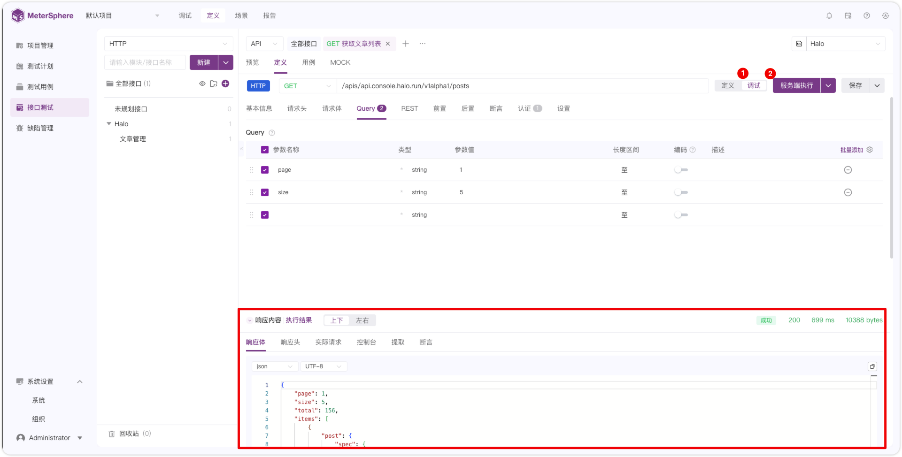
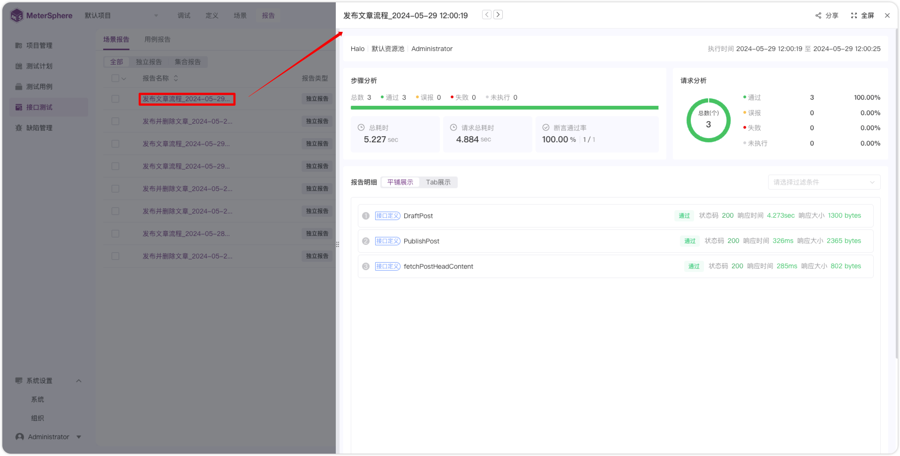
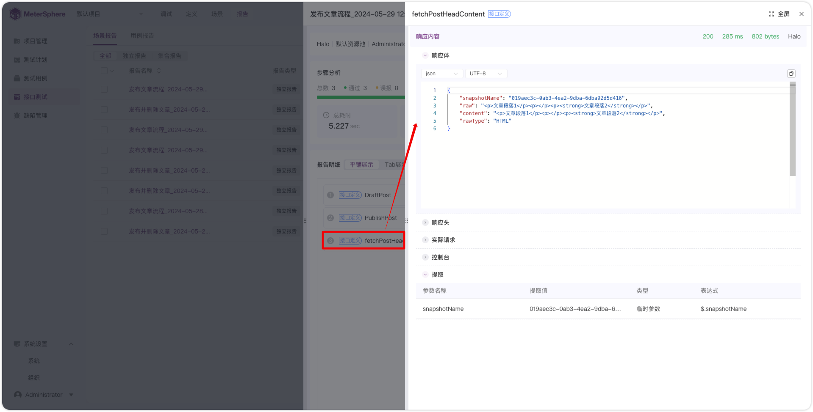

## 1 调试
!!! ms-abstract ""
    如下图，点击【新建请求】或者【＋】新建接口请求。
{ width="900px" }

!!! ms-abstract ""
    接下来按下图序号顺序，选择 HTTP 协议、GET 方法，输入 `https://demo.halo.run/apis/api.console.halo.run/v1alpha1/posts` URL 地址，选择 Query 参数，输入 `page 等于 1，size 等于 5`。
{ width="900px" }

!!! ms-abstract "" 
    接下来输入接口认证信息，如下图 Halo 接口采用 Basic Auth 登录认证，选择 `Basic Auth`,`用户名：demo，密码：P@ssw0rd123..`，点击【服务端执行】，执行成功后保存。
{ width="900px" }  

!!! ms-abstract "注意" 
    本地执行需在本地安装 task_runner 和 在个人信息处配置 本地 task_runner 的地址。

## 2 创建接口
!!! ms-abstract "" 
    如下图，点击【新建请求】或者【＋】新建接口请求。
{ width="900px" }

!!! ms-abstract "" 
    如下图，依次输入接口请求方法类型、URl地址，接口名称、所属模块、状态等基础信息，响应体、响应头、响应码等响应内容信息。
{ width="900px" }

!!! ms-abstract "" 
    如下图，点击【+】号新建响应内容，点击【...】复制、重命名、设置默认、删除响应信息。
{ width="900px" }

## 3 创建环境
!!! ms-abstract "" 
    如下图，点击【序号1】或者直接切换到【项目管理-环境管理】页面。
{ width="900px" }

!!! ms-abstract ""
    如下图，点击【+】填写环境名称，点击【添加 HTTP 】填写域名等信息后保存。
{ width="900px" }

## 4 接口定义调试
!!! ms-abstract "" 
    如下图，切换到【调试】页面，输入参数信息、前后置操作、内置函数或者认证信息，选择环境，选择【服务端执行】或者【本地执行】，执行成功后在执行结果处查看响应体、响应头、实际请求、控制台、提取、断言等信息。
{ width="900px" }	

!!! ms-abstract "" 
    如下图，调试成功后，点击【保存为新用例】直接保存成用例。
{ width="900px" }	

## 5 创建用例
!!! ms-abstract "" 
    如下图，切换到【用例】页面，点击【创建用例】。
{ width="900px" }		

!!! ms-abstract "" 
    如下图，依次输入用例名称，用例等级、状态、标签、请求参数信息，选择环境。点击执行，执行成功后，点击【创建】或【保存并继续创建】。
{ width="900px" }	

## 6 创建场景

## 7 查看报告
!!! ms-abstract "" 
    如下图，在【报告】页面查看【场景报告】和【用例报告】。
{ width="900px" }

!!! ms-abstract "" 
    如下图，点击【报告名称】预览报告详情。
{ width="900px" }

!!! ms-abstract "" 
    如下图，点击【步骤名称】查看步骤实际请求的响应内容。
{ width="900px" }

